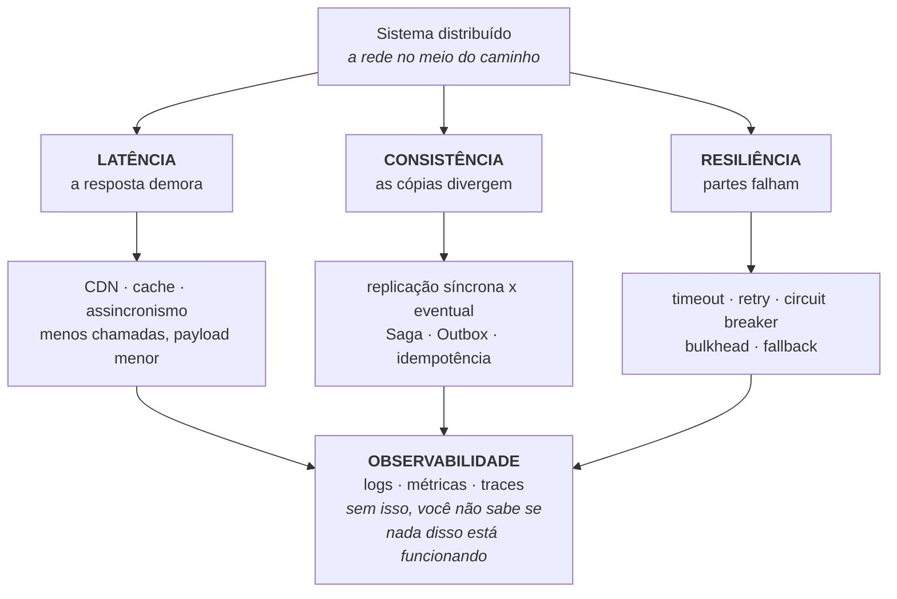

# ARQUITETURA DISTRIBUÍDA

> **Capítulos:** [I - Estilos arquiteturais](i-estilos-arquiteturais.md) · [II - Latência](ii-latencia-e-performance.md) · [III - Consistência](iii-consistencia-e-dados.md) · [IV - Resiliência](iv-resiliencia.md) · [V - Observabilidade](v-observabilidade.md)

## Anotações da aula

Os três eixos de preocupação:

- **Latência**
- **Consistência**
- **Resiliência**

**Estilos mais comuns:**

- Cliente - Servidor
- Peer-to-Peer
- Arquitetura de microsserviços

**O que resolve latência?** Redes de entrega de conteúdo (CDNs), caching para reduzir consultas a banco de dados.

**O que garante a consistência em bancos distribuídos?** A replicação eventual e síncrona.

**O que protege os sistemas contra falhas?** Circuit Breaker, Retry, Bulkhead.

**Monitoramento** nos sistemas distribuídos.

---

## 1. O que muda quando o sistema é distribuído

Sistema distribuído é um conjunto de computadores independentes que, para o usuário, **parece um sistema único**. A definição clássica de Leslie Lamport mostra o problema em uma frase:

> *"Um sistema distribuído é aquele em que a falha de um computador que você nem sabia que existia pode tornar o seu próprio computador inutilizável."*

A diferença fundamental para o monólito não é a quantidade de máquinas — é que **a chamada de função virou uma chamada de rede**:

| | Chamada local | Chamada remota |
|---|---|---|
| Latência | nanossegundos | milissegundos (10⁶× mais) |
| Falha parcial | não existe (ou roda, ou não) | **existe**: pode falhar no meio, ou ter sucesso sem você saber |
| Ordem das mensagens | garantida | não garantida |
| Estado compartilhado | memória | não existe — só cópias |
| Depuração | um stack trace | N logs em N máquinas |
| Transação | ACID | não existe de graça |

**Falha parcial** é o conceito central: quando o timeout estoura, você **não sabe** se a operação aconteceu. Não executou? Executou e a resposta se perdeu? Está executando agora? Cada uma pede uma reação diferente — e é daí que nasce metade dos padrões deste material.

**Por que distribuir, então:** escala horizontal, isolamento de falhas, deploy independente, autonomia de times, e requisitos de disponibilidade geográfica. **Distribua quando o ganho compensa o custo** — e o custo é tudo que está descrito abaixo.

---

## 2. As oito falácias da computação distribuída

Formuladas por Peter Deutsch e colegas (Sun Microsystems, anos 1990). São as **suposições erradas** que todo time faz ao começar — e cada uma delas é um incidente esperando para acontecer. **Cai em prova com frequência.**

| # | A falácia | A realidade | O que fazer |
|---|---|---|---|
| 1 | **A rede é confiável** | pacotes se perdem, conexões caem, serviços reiniciam | retry com backoff, idempotência, circuit breaker |
| 2 | **A latência é zero** | cada salto custa ms; entre regiões, centenas | CDN, cache, reduzir número de chamadas, assincronismo |
| 3 | **A banda é infinita** | payload grande satura a rede e o custo | paginação, compressão, protocolo binário (gRPC) |
| 4 | **A rede é segura** | tráfego interno também é interceptável | mTLS, zero trust, criptografia em trânsito |
| 5 | **A topologia não muda** | instâncias sobem e descem o tempo todo | service discovery, nada de IP fixo |
| 6 | **Existe um administrador** | são vários times, várias nuvens, várias políticas | contratos, versionamento, automação |
| 7 | **O custo de transporte é zero** | serialização custa CPU; tráfego entre zonas custa dinheiro | medir, agregar, cuidar do payload |
| 8 | **A rede é homogênea** | protocolos, versões e ambientes diferentes | padrões abertos, contratos explícitos |

→ [gRPC](../grpc-e-graphql/i-grpc.md) · [SPRING SECURITY](../spring-security/README.md)

---

## 3. Os desafios da arquitetura distribuída

O mapa completo do que fica mais difícil — e onde cada um é tratado neste material:

| Desafio | Por que dói | Onde está a estratégia |
|---|---|---|
| **Latência de rede** | toda chamada custa ms; chamadas encadeadas somam | [II - Latência](ii-latencia-e-performance.md) |
| **Falha parcial** | o timeout não diz se a operação aconteceu | [IV - Resiliência](iv-resiliencia.md) |
| **Falha em cascata** | um serviço lento trava as threads de quem o chama, e o efeito sobe | [IV - Resiliência](iv-resiliencia.md) |
| **Consistência dos dados** | não há uma verdade única: cada nó tem uma cópia | [III - Consistência](iii-consistencia-e-dados.md) · [TEOREMA CAP](../teorema-cap/README.md) |
| **Transação distribuída** | ACID não atravessa serviços; 2PC é caro e trava | [III - Consistência](iii-consistencia-e-dados.md) |
| **Ordem e tempo** | relógios das máquinas divergem; não existe "agora" global | [III - Consistência](iii-consistencia-e-dados.md) |
| **Observabilidade** | o stack trace acabou; o erro está em 4 serviços | [V - Observabilidade](v-observabilidade.md) |
| **Depuração e reprodução** | o bug depende de timing e de ordem de mensagens | [V - Observabilidade](v-observabilidade.md) |
| **Versionamento de contrato** | não dá para fazer deploy de todo mundo ao mesmo tempo | [I - Estilos](i-estilos-arquiteturais.md) · [Evolução da API](../spring-mvc-apis-restful/iv-evolucao-da-api.md) |
| **Descoberta e roteamento** | o endereço do serviço muda a cada deploy | [I - Estilos](i-estilos-arquiteturais.md) |
| **Segurança** | a superfície de ataque cresce; a confiança interna não é automática | [SPRING SECURITY](../spring-security/README.md) |
| **Teste** | testar a integração de N serviços é caro e frágil | [TESTES EM SOFTWARE](../testes-em-software/README.md) |
| **Complexidade operacional** | N deploys, N pipelines, N bancos, N dashboards | [DOCKER - Orquestração](../docker/capitulo-v-orquestracao-de-containeres.md) |
| **Custo organizacional** | a arquitetura espelha a comunicação do time (**Lei de Conway**) | [I - Estilos](i-estilos-arquiteturais.md) |

> **O desafio que resume todos:** num monólito, um bug é **um** stack trace; num sistema distribuído, é uma investigação. Toda a disciplina de observabilidade, idempotência e resiliência existe para devolver a você a capacidade de **responder o que aconteceu**.

### O trade-off central

| Ganha | Paga |
|---|---|
| escala horizontal por serviço | latência de rede em toda interação |
| isolamento de falha | falha parcial e cascata |
| deploy e time independentes | contrato, versionamento e coordenação |
| stack por domínio | complexidade operacional multiplicada |
| disponibilidade geográfica | consistência eventual |

**Regra prática:** *distribuir é uma resposta a um problema de escala ou de organização, não um objetivo.* Sistema pequeno distribuído tem todos os custos acima e nenhum dos benefícios — é o clássico "monólito distribuído", o pior dos dois mundos.

---

## 4. Como os três eixos da aula se conectam

Os três eixos se **tensionam**: cache reduz latência e **piora** consistência; replicação síncrona garante consistência e **aumenta** latência; retry melhora resiliência e pode **duplicar** operação (daí a idempotência). Não existe configuração que otimize os três — existe a escolha certa **por caso de uso**.

---

## Capítulos

- [I - ESTILOS ARQUITETURAIS](i-estilos-arquiteturais.md) — cliente-servidor, P2P, microsserviços, monólito modular, SOA, event-driven e serverless; comunicação síncrona × assíncrona, service discovery, API gateway e Lei de Conway
- [II - LATÊNCIA E PERFORMANCE](ii-latencia-e-performance.md) — os números da latência, CDN, cache em camadas e suas estratégias, invalidação, N+1 de rede e backpressure
- [III - CONSISTÊNCIA E DADOS](iii-consistencia-e-dados.md) — replicação síncrona × assíncrona, quórum, database per service, Saga, Outbox, CQRS, event sourcing, idempotência e relógios
- [IV - RESILIÊNCIA](iv-resiliencia.md) — timeout, retry com backoff e jitter, circuit breaker, bulkhead, fallback, rate limiting, degradação graciosa e chaos engineering
- [V - OBSERVABILIDADE](v-observabilidade.md) — os três pilares, tracing distribuído, correlation id, RED/USE, SLI/SLO/error budget e alertas

---

## Perguntas para autoavaliação

1. Por que "falha parcial" é o conceito central de sistemas distribuídos?
2. O que muda, na prática, quando uma chamada de função vira chamada de rede?
3. Cite as oito falácias e dê uma consequência prática de três delas.
4. Por que a rede interna também precisa ser tratada como insegura?
5. Explique como os três eixos (latência, consistência, resiliência) se tensionam entre si.
6. Por que cache melhora latência e piora consistência?
7. O que é um "monólito distribuído" e por que ele é o pior dos dois mundos?
8. Qual a relação entre a Lei de Conway e a decisão de distribuir?
9. Por que observabilidade deixa de ser opcional em arquitetura distribuída?
10. Quando **não** distribuir?

---

**Relacionados:** [TEOREMA CAP](../teorema-cap/README.md) · [CLEAN ARCHITECTURE](../clean-architecture/README.md) · [gRPC e GRAPHQL](../grpc-e-graphql/README.md) · [DOCKER](../docker/README.md) · [SPRING SECURITY](../spring-security/README.md)
