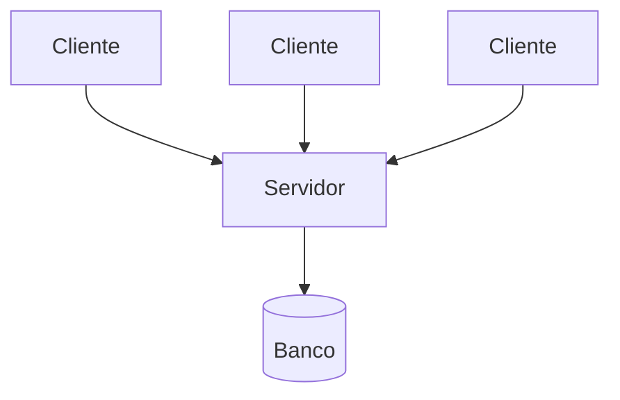
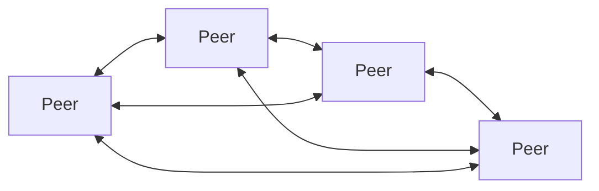
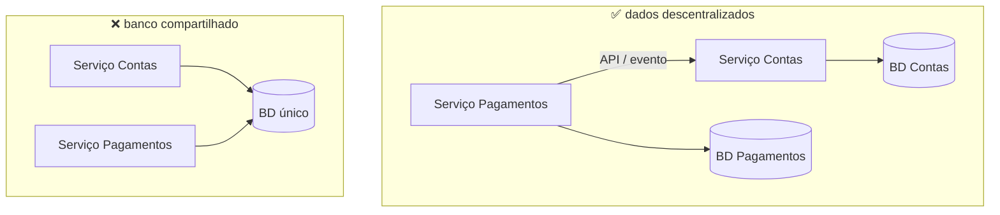
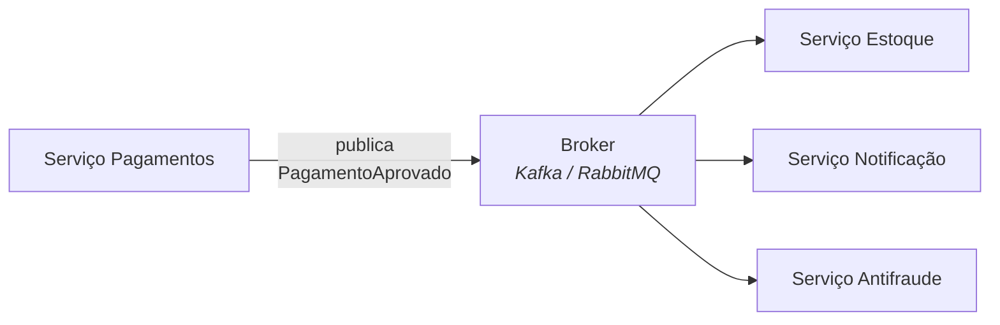

# I - ESTILOS ARQUITETURAIS

> [← Voltar para ARQUITETURA DISTRIBUÍDA](README.md) · Próximo: [II - LATÊNCIA E PERFORMANCE](ii-latencia-e-performance.md)

## 1. Cliente - Servidor

O estilo mais antigo e mais difundido: um **servidor** oferece um serviço e fica passivamente à espera; **clientes** tomam a iniciativa e pedem. Toda a Web funciona assim.

**Características:** papéis assimétricos e fixos, o cliente conhece o endereço do servidor, o servidor centraliza o estado e as regras.

**Camadas (tiers)** — não confundir com *layers*, que é divisão lógica; *tier* é divisão **física**:

| Arranjo | Composição | Observação |
|---|---|---|
| **2 camadas** | cliente gordo + banco | o cliente tem a regra de negócio; atualizar significa atualizar todas as máquinas |
| **3 camadas** | cliente + servidor de aplicação + banco | o padrão clássico da Web |
| **n camadas** | + gateway, cache, fila, serviços | o que se vê hoje em qualquer aplicação de porte |

| ✅ | ❌ |
|---|---|
| simples de entender e operar | o servidor é **ponto único de falha** |
| segurança e regras centralizadas | escala vertical primeiro, horizontal com esforço |
| cliente leve | o servidor é gargalo sob carga |

O servidor "único" é, na prática, um conjunto atrás de um **load balancer** — e é aí que entra a exigência de ser **stateless**: qualquer instância precisa poder atender qualquer requisição. → [REST - stateless](../spring-mvc-apis-restful/ii-fundamentos-rest.md)

---

## 2. Peer-to-Peer (P2P)

Não há papéis fixos: cada nó é **cliente e servidor ao mesmo tempo** (*peer* = par). Os recursos são compartilhados diretamente entre os participantes.

| Tipo | Como funciona | Exemplo |
|---|---|---|
| **Puro (descentralizado)** | nenhum nó central; a busca se propaga pela rede | Gnutella, blockchain |
| **Híbrido** | um servidor central só para **descoberta**; a transferência é direta | Napster, BitTorrent com tracker |
| **Estruturado (DHT)** | tabela hash distribuída define deterministicamente quem guarda o quê | Kademlia (BitTorrent moderno), IPFS |

| ✅ | ❌ |
|---|---|
| **sem ponto único de falha** | consistência e coordenação muito difíceis |
| escala com o número de participantes (cada novo nó traz recursos) | segurança: os pares não são confiáveis |
| custo de infraestrutura distribuído | desempenho imprevisível (nós entram e saem) |
| resistente a censura | busca e descoberta são caras |

**Onde aparece hoje:** BitTorrent e IPFS (distribuição de arquivos), **blockchain** (Bitcoin, Ethereum — o consenso distribuído é o problema central), WebRTC (chamadas de vídeo ponto a ponto), e protocolos de *gossip* dentro de clusters — o Cassandra, por exemplo, usa gossip entre os nós, sendo internamente P2P enquanto se apresenta como cliente-servidor para a aplicação.

---

## 3. Monólito — o ponto de partida honesto

Antes de microsserviços, o que existe (e muitas vezes deveria continuar existindo):

| Tipo | Descrição |
|---|---|
| **Monólito** | uma aplicação, um deploy, um banco. Não é xingamento — é simples, rápido e transacional |
| **Monólito modular** | um deploy, porém com **módulos bem separados** e fronteiras explícitas internamente |
| **Big ball of mud** | monólito sem fronteira nenhuma; o problema real que as pessoas chamam de "monólito" |

**"Monolith first"** (Martin Fowler): comece monolítico, descubra as fronteiras **de verdade** com o sistema funcionando, e só então extraia serviços. Começar distribuído sem conhecer o domínio produz fronteiras erradas — e mudar fronteira depois de distribuir é caríssimo.

O **monólito modular** é o meio-termo mais subestimado: você ganha as fronteiras (e a possibilidade futura de extrair) sem pagar latência de rede, consistência eventual e complexidade operacional. → [CLEAN ARCHITECTURE](../clean-architecture/README.md)

---

## 4. Arquitetura de microsserviços

Conjunto de **serviços pequenos, autônomos e independentemente implantáveis**, cada um responsável por uma capacidade de negócio, comunicando-se por rede.

**As características que definem** (Fowler & Lewis):

| Característica | Significado |
|---|---|
| **Componentização por serviço** | a unidade de substituição é o serviço, não a biblioteca |
| **Organizado por capacidade de negócio** | time de "Pagamentos", não time de "Banco de dados" |
| **Produtos, não projetos** | *"you build it, you run it"* — o time opera o que escreveu |
| **Smart endpoints, dumb pipes** | a inteligência está no serviço; a rede só transporta |
| **Governança descentralizada** | cada serviço pode ter stack própria |
| **Dados descentralizados** | **um banco por serviço** |
| **Automação de infraestrutura** | CI/CD e deploy automatizados não são opcionais |
| **Design for failure** | falha é esperada, não excepcional |
| **Design evolutivo** | serviços nascem, se fundem e morrem |

### Database per service — a regra mais importante e mais violada

Cada serviço é **dono exclusivo** dos seus dados. Nenhum outro serviço lê a tabela dele diretamente: pede pela API ou consome um evento.

Compartilhar banco parece econômico e destrói a autonomia: a alteração de uma coluna quebra dois serviços, o deploy vira coordenado, e você acabou de construir um **monólito distribuído** — com toda a complexidade da rede e nenhuma independência. É a falha de projeto mais comum na adoção de microsserviços.

O preço de fazer certo é perder o `JOIN` e a transação ACID entre serviços. → [III - CONSISTÊNCIA](iii-consistencia-e-dados.md)

### Como decidir a fronteira

A boa fronteira vem do **domínio**, não da camada técnica. O vocabulário é o de **DDD**:

- **Bounded context** — a fronteira dentro da qual um termo tem **um** significado. "Conta" no contexto de Cadastro não é a mesma coisa que "Conta" em Cobrança. Cada bounded context é candidato natural a serviço.
- **Agregado** — o conjunto de objetos que muda junto, sob uma raiz. É o limite natural da transação — e, portanto, um bom limite de serviço.
- **Alta coesão, baixo acoplamento** — o mesmo critério de [SOLID](../solid/README.md), agora entre serviços.

**Teste prático da fronteira:** se quase toda mudança de requisito obriga a alterar dois serviços **juntos**, a fronteira está errada — eles deveriam ser um só.

| ✅ Vantagens | ❌ Custos |
|---|---|
| deploy e escala independentes | latência e falha parcial em toda interação |
| isolamento de falha | consistência eventual |
| autonomia de time e de stack | complexidade operacional multiplicada |
| substituição incremental de legado | teste de integração caro |
| escala seletiva (só o serviço quente) | exige maturidade de CI/CD e observabilidade |

**Quando microsserviços valem a pena:** muitos times precisando de autonomia de deploy, partes do sistema com perfis de escala muito diferentes, domínios realmente independentes, necessidade de isolamento de falha. **Quando não valem:** time pequeno, domínio ainda mal compreendido, sistema pequeno, e sem plataforma (CI/CD, observabilidade, orquestração) já madura.

---

## 5. SOA × microsserviços

| | **SOA** (anos 2000) | **Microsserviços** |
|---|---|---|
| Integração | **ESB** (Enterprise Service Bus) com lógica de roteamento e transformação | *smart endpoints, dumb pipes* |
| Granularidade | serviços grandes, às vezes empresa inteira | pequenos, por capacidade |
| Dados | frequentemente banco compartilhado | **um por serviço** |
| Protocolo | SOAP/WSDL, XML | REST, gRPC, mensageria |
| Governança | centralizada | descentralizada |
| Deploy | coordenado | independente |

A crítica histórica ao SOA é o **ESB**: concentrar regra de negócio no barramento criou um ponto único de falha, de gargalo e de disputa entre times.

---

## 6. Arquitetura orientada a eventos (event-driven)

Em vez de "A chama B", **A publica um fato** e quem se interessar reage. É o padrão [Observer](../design-patterns-em-oo/iii-padroes-comportamentais.md) em escala de arquitetura.

**Três sabores de evento** (a distinção cai em prova):

| Tipo | O evento carrega | Consequência |
|---|---|---|
| **Event notification** | só o aviso + id (`PedidoCriado{id}`) | consumidor precisa chamar de volta para obter os dados (acopla, mas o dado é sempre atual) |
| **Event-carried state transfer** | os dados relevantes no próprio evento | consumidor fica autônomo e mantém uma réplica local (consistência eventual) |
| **Event sourcing** | o evento **é** a fonte da verdade; o estado é derivado | auditoria total e replay; complexidade alta → [III](iii-consistencia-e-dados.md) |

**Orquestração × coreografia** — as duas formas de conduzir um processo entre serviços:

| | **Orquestração** | **Coreografia** |
|---|---|---|
| Quem conduz | um **orquestrador** central chama os passos | cada serviço reage a eventos, sem maestro |
| Fluxo | explícito, visível num lugar só | emergente, espalhado |
| Acoplamento | o orquestrador conhece todos | serviços conhecem apenas eventos |
| Depurar | fácil | difícil (ninguém tem a visão completa) |
| Adicionar passo | mexe no orquestrador | só assinar o evento |

Não há vencedor: orquestração para processos de negócio críticos que precisam ser auditáveis; coreografia para reações desacopladas e laterais.

| ✅ | ❌ |
|---|---|
| desacoplamento forte entre produtor e consumidor | fluxo difícil de seguir e depurar |
| absorve picos de carga (a fila amortece) | consistência eventual |
| novo consumidor sem tocar no produtor | ordem e duplicidade viram problema seu |
| resiliência: o consumidor pode estar fora | exige **idempotência** em todo consumidor |

**Garantias de entrega:** *at-most-once* (pode perder), *at-least-once* (pode duplicar — o padrão na prática) e *exactly-once* (existe só sob condições estritas, dentro de um mesmo sistema). Como o mundo real é **at-least-once**, **todo consumidor precisa ser idempotente**. → [III - CONSISTÊNCIA](iii-consistencia-e-dados.md) · [MENSAGERIA - Padrões de entrega](../mensageria/iii-padroes-de-entrega.md)

---

## 7. Serverless / FaaS

O provedor gerencia servidor, escala e disponibilidade; você entrega **funções** que respondem a eventos (AWS Lambda, Azure Functions, Cloud Run).

| ✅ | ❌ |
|---|---|
| zero gestão de servidor | **cold start** (crítico para JVM) |
| escala automática até zero | limite de tempo de execução e de memória |
| paga pelo uso | *vendor lock-in* |
| ótimo para carga esporádica | depuração e teste local mais difíceis |
| | estado precisa ser sempre externo |

Em Java, o cold start é o ponto sensível — mitigado com GraalVM *native image* (Spring Native/Quarkus), que derruba o tempo de partida de segundos para milissegundos.

---

## 8. Comunicação: síncrona × assíncrona

A decisão que mais afeta acoplamento e resiliência:

| | **Síncrona** (REST, gRPC) | **Assíncrona** (fila, tópico) |
|---|---|---|
| Quem espera | o chamador **bloqueia** aguardando | ninguém: publica e segue |
| Acoplamento | temporal: os dois precisam estar **no ar agora** | nenhum: o consumidor pode estar fora |
| Falha do destino | propaga imediatamente | a mensagem fica na fila |
| Latência percebida | soma de toda a cadeia | resposta imediata, processamento depois |
| Pico de carga | derruba o destino | a fila amortece |
| Consistência | imediata | eventual |
| Complexidade | baixa | maior (ordem, duplicidade, DLQ) |

**Regra prática:** síncrono quando o chamador **precisa** da resposta para continuar (validar saldo antes de autorizar); assíncrono para tudo que pode acontecer depois (notificar, indexar, faturar, gerar relatório).

> **Chamadas síncronas encadeadas são a principal causa de falha em cascata.** Se A chama B que chama C, a indisponibilidade de C derruba os três — e a latência total é a **soma**. Cada elo da cadeia precisa de timeout e circuit breaker. → [IV - RESILIÊNCIA](iv-resiliencia.md)

---

## 9. A infraestrutura que a distribuição exige

| Componente | Problema que resolve |
|---|---|
| **Service discovery** | o endereço muda a cada deploy. Um *registry* (Consul, Eureka, DNS do Kubernetes) responde "onde está o serviço X?". Nada de IP fixo (falácia #5) |
| **Load balancer** | distribui entre instâncias. *Client-side* (o cliente escolhe a instância) × *server-side* (um proxy decide) |
| **API Gateway** | porta única de entrada: roteamento, autenticação, rate limit, agregação, TLS. Evita que o cliente conheça N endereços |
| **BFF** (*Backend for Frontend*) | um gateway por tipo de cliente (web, mobile, parceiro), cada um com o formato de resposta que aquela tela precisa → [GraphQL](../grpc-e-graphql/ii-graphql.md) |
| **Service mesh** | um *sidecar* (Istio/Envoy, Linkerd) ao lado de cada serviço cuidando de mTLS, retry, circuit breaker, tracing e roteamento — **fora** do código da aplicação |
| **Config centralizada** | configuração por ambiente sem rebuild (Spring Cloud Config, ConfigMap) |
| **Broker de mensagens** | desacoplamento temporal e absorção de picos → [MENSAGERIA](../mensageria/README.md) |

**Service mesh × biblioteca:** a mesma preocupação (retry, circuit breaker, mTLS) pode ficar no código (Resilience4j) ou na malha (sidecar). A malha é poliglota e não exige mudar a aplicação; a biblioteca é mais simples de operar e conhece o contexto de negócio. Times pequenos costumam ganhar com biblioteca; plataformas grandes e poliglotas ganham com malha.

---

## 10. Lei de Conway

> *"Organizações que projetam sistemas produzem projetos que são cópias da estrutura de comunicação dessas organizações."* — Melvin Conway, 1967

Três times → três camadas. Quatro times de produto → quatro serviços. **A arquitetura acompanha o organograma**, queira você ou não.

A **manobra inversa de Conway** é usar isso de propósito: organize os times como você quer que o sistema fique. Se quer serviços autônomos por domínio, monte **times autônomos por domínio** — multifuncionais, donos do deploy e da operação. Times divididos por camada técnica (front, back, DBA) produzirão inevitavelmente um sistema acoplado por camada, independentemente do desenho no quadro branco.

É por isso que "adotar microsserviços" é, antes de tudo, uma decisão **organizacional**. Sem autonomia de time, o resultado é um monólito distribuído com reuniões.

---

## Comparativo dos estilos

| | Cliente-Servidor | P2P | Monólito modular | Microsserviços | Event-driven | Serverless |
|---|---|---|---|---|---|---|
| Ponto único de falha | sim | **não** | sim | não | broker | provedor |
| Escala | vertical/horizontal no servidor | com os pares | do processo inteiro | **por serviço** | por consumidor | automática |
| Consistência | forte | difícil | **forte (ACID)** | eventual | eventual | depende |
| Complexidade operacional | baixa | alta | **baixa** | alta | alta | média |
| Acoplamento | médio | baixo | médio | baixo | **muito baixo** | baixo |
| Melhor para | a maioria das aplicações web | compartilhamento sem autoridade central | começar, e talvez ficar | muitos times, escalas distintas | reações desacopladas e picos | carga esporádica |

---

## Perguntas para autoavaliação

1. Diferencie *layer* de *tier*.
2. Quais os tipos de rede P2P e o que muda entre pura, híbrida e estruturada?
3. Cite duas vantagens e duas desvantagens do P2P em relação a cliente-servidor.
4. O que é "monolith first" e por que o argumento é forte?
5. Cite quatro características que definem microsserviços.
6. Por que compartilhar banco entre serviços produz um "monólito distribuído"?
7. O que é um bounded context e por que ele é bom candidato a fronteira de serviço?
8. Qual o teste prático para saber se a fronteira entre dois serviços está errada?
9. Compare SOA e microsserviços — qual a crítica histórica ao ESB?
10. Diferencie event notification, event-carried state transfer e event sourcing.
11. Orquestração × coreografia: vantagens de cada uma e quando usar.
12. Por que *at-least-once* torna a idempotência obrigatória?
13. Quando escolher comunicação síncrona e quando escolher assíncrona?
14. Por que chamadas síncronas encadeadas causam falha em cascata?
15. O que um service mesh faz, e qual a alternativa em biblioteca?
16. Enuncie a Lei de Conway e explique a manobra inversa.

---

> [← Voltar para ARQUITETURA DISTRIBUÍDA](README.md) · Próximo: [II - LATÊNCIA E PERFORMANCE](ii-latencia-e-performance.md)
