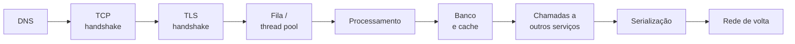
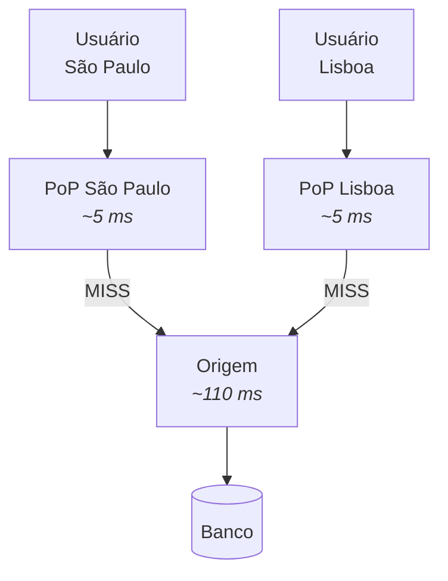
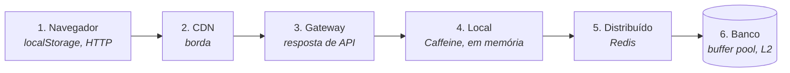

# II - LATÊNCIA E PERFORMANCE

> [← Voltar para ARQUITETURA DISTRIBUÍDA](README.md) · Anterior: [I - ESTILOS](i-estilos-arquiteturais.md) · Próximo: [III - CONSISTÊNCIA E DADOS](iii-consistencia-e-dados.md)

## 1. Latência não é otimização de código

A falácia nº 2 ("a latência é zero") é a mais cara porque esbarra em **física**: a luz percorre cerca de 300 km/ms no vácuo, e uns 200 km/ms em fibra. São Paulo → Virgínia são ~7.600 km; ida e volta, **no mínimo ~75 ms** — mais os saltos de roteamento, tipicamente ~110–130 ms reais. **Nenhuma refatoração muda isso.**

Ordens de grandeza que valem memorizar:

| Operação | Tempo aproximado | Comparação |
|---|---|---|
| Referência em cache L1 | ~1 ns | 1 segundo |
| Acesso à memória RAM | ~100 ns | 1,7 minuto |
| Leitura em SSD | ~150 µs | 1,7 dia |
| Round-trip no mesmo datacenter | ~0,5 ms | 5,8 dias |
| Query simples em banco (mesma rede) | ~1–5 ms | semanas |
| Round-trip entre regiões (SP ↔ EUA) | ~110 ms | **3,5 anos** |

A última coluna traduz tudo para escala humana e mostra o ponto: **chamar outro serviço é uma eternidade** comparado a chamar um método. É por isso que "quantas chamadas de rede sua requisição faz" importa muito mais do que a eficiência do seu laço.

**Três conceitos que se confundem:**

| Termo | O que é |
|---|---|
| **Latência** | tempo de **uma** operação da ponta à ponta |
| **Throughput** | quantas operações por segundo o sistema entrega |
| **Banda** | quantos bits cabem no canal por segundo |

Aumentar banda não reduz latência (um caminhão de HDs tem banda gigantesca e latência de horas). E throughput alto convive com latência ruim — é o caso de sistemas com fila grande.

---

## 2. De onde vem a latência de uma requisição



Cada etapa é um alvo diferente: DNS se resolve com cache e *keep-alive*; handshakes, com conexão persistente e HTTP/2; fila, com dimensionamento de pool; banco, com índice e cache; chamadas encadeadas, com agregação e paralelismo; serialização, com payload menor e formato binário.

### Média mente: use percentis

```
p50 = 40 ms    metade das requisições é mais rápida que isso
p95 = 180 ms   5% dos usuários esperam mais que isso
p99 = 1.200 ms 1% — e são justamente os clientes mais ativos
```

A **média** esconde o problema: uma média de 60 ms pode conter 1% de requisições de 3 segundos. Quem reclama, quem abandona a compra e quem abre chamado está no **p99**. Meça e alerte por percentil, nunca por média. → [V - OBSERVABILIDADE](v-observabilidade.md)

> ### ⚠️ Amplificação de cauda (*tail latency amplification*)
>
> Se uma requisição sua chama **10 serviços em paralelo** e cada um tem p99 = 1s, a chance de **pelo menos um** ser lento é ~1 − 0,99¹⁰ ≈ **9,6%**. Ou seja: o p99 de cada peça vira quase **p90 do conjunto**. Quanto maior o fan-out, mais a cauda domina.
>
> É o motivo pelo qual sistemas distribuídos investem tanto em cortar o p99: em escala, **a cauda vira o caso comum**. Mitigações: reduzir o fan-out, *hedged requests* (dispara a segunda cópia se a primeira demorar) e timeouts agressivos com fallback.

---

## 3. CDN — Rede de Entrega de Conteúdo

Servidores espalhados geograficamente (**PoPs**, *points of presence*) que guardam cópias do conteúdo **perto do usuário**. Em vez de buscar a 110 ms de distância, o usuário busca a 5 ms.



**O que a CDN resolve:** distância física, pico de tráfego (absorve na borda), carga na origem, e — de quebra — proteção contra DDoS e terminação TLS próxima do usuário.

**O que ela cacheia bem:** arquivos estáticos (JS, CSS, imagem, vídeo, fonte), respostas de API **públicas e pouco mutáveis** (catálogo, cotação, configuração), páginas renderizadas sem dado pessoal.
**O que ela não resolve:** dado por usuário (saldo, carrinho, perfil), escrita, e qualquer coisa com `Cache-Control: private`.

**Como o controle funciona:** é o mesmo cache HTTP do REST — `Cache-Control` com `max-age` (cliente) e `s-maxage` (cache compartilhado), `ETag`/`If-None-Match` para revalidar, `Vary` para variar por header, e **purge/invalidação** por caminho ou por tag quando o conteúdo muda antes do TTL. → [Evolução da API — Cache HTTP](../spring-mvc-apis-restful/iv-evolucao-da-api.md)

Técnicas adicionais: **versionar a URL do asset** (`app.a1b2c3.js`) permite TTL de um ano sem nunca invalidar; **origin shield** coloca um cache intermediário para que os PoPs não batam todos na origem; **stale-while-revalidate** serve o conteúdo velho enquanto atualiza em background.

---

## 4. Cache — as camadas

> *"Há apenas duas coisas difíceis em Ciência da Computação: invalidação de cache e dar nomes às coisas."* — Phil Karlton



Quanto mais perto do usuário, mais rápido e mais difícil de invalidar. Quanto mais perto do banco, mais consistente e menos economia.

| Camada | Latência típica | Compartilhado? | Cuidado |
|---|---|---|---|
| Local (Caffeine, Ehcache) | ns–µs | ❌ por instância | **divergência entre instâncias** |
| Distribuído (Redis, Memcached) | ~1 ms | ✅ | vira dependência crítica e ponto único |
| Banco (buffer pool, cache L2 do Hibernate) | µs–ms | conforme | invalidação complexa → [JPA](../spring-data-jpa/i-persistence-context-e-ciclo-de-vida.md) |

**Near cache** é a combinação: L1 local (rápido) + L2 distribuído (coerente), com invalidação por pub/sub.

### Padrões de escrita e leitura

| Padrão | Como funciona | Trade-off |
|---|---|---|
| **Cache-aside** (*lazy loading*) | a aplicação lê o cache; se **miss**, busca no banco e popula | ✅ o mais usado; primeiro acesso é lento e pode servir dado velho |
| **Read-through** | o cache busca sozinho no banco quando não tem | código mais limpo; exige suporte da biblioteca |
| **Write-through** | escreve no cache **e** no banco, sincronamente | cache sempre coerente; escrita mais lenta |
| **Write-behind** (*write-back*) | escreve no cache e persiste depois, em lote | escrita rapidíssima; **risco de perda** se cair antes de gravar |
| **Refresh-ahead** | renova o item popular antes de expirar | evita miss no item quente; gasta com o que talvez não seja lido |

```java
// cache-aside na mão — é exatamente o que @Cacheable faz por baixo
public Cotacao buscar(String moeda) {
    Cotacao c = cache.get(moeda);
    if (c != null) return c;                      // HIT
    c = repository.buscar(moeda);                 // MISS: vai à origem
    cache.put(moeda, c, Duration.ofMinutes(5));   // popula com TTL
    return c;
}
```

```java
@Cacheable(value = "cotacoes", key = "#moeda")          // leitura
public Cotacao buscar(String moeda) { }

@CachePut(value = "cotacoes", key = "#cotacao.moeda")   // atualiza o cache
public Cotacao atualizar(Cotacao cotacao) { }

@CacheEvict(value = "cotacoes", key = "#moeda")         // invalida
public void remover(String moeda) { }
```

> ⚠️ `@Cacheable` funciona por **proxy**: chamada interna (`this.buscar(...)`) **não passa pelo cache**, exatamente como `@Transactional`. → [DESIGN PATTERNS - Proxy](../design-patterns-em-oo/ii-padroes-estruturais.md)

### Estratégias de invalidação

| Estratégia | Quando usar | Risco |
|---|---|---|
| **TTL** (expira sozinho) | dado que tolera ficar velho por X tempo | janela de inconsistência = TTL |
| **Por evento** (invalida ao escrever) | dado que muda por ação conhecida | precisa alcançar **todas** as instâncias (pub/sub) |
| **Chave versionada** (`produto:42:v7`) | conteúdo imutável por versão | cresce até o TTL limpar |
| **Purge manual** | correção pontual | operacional, não escala |

Comece por **TTL curto** — é a estratégia mais simples e a mais robusta. Invalidação por evento é melhor, e é exatamente onde nascem bugs de coerência entre instâncias.

### Os quatro problemas clássicos de cache

| Problema | O que acontece | Solução |
|---|---|---|
| **Stampede / thundering herd** | a chave popular expira e **mil** requisições vão ao banco juntas | *lock* na repopulação (só uma recalcula), TTL com **jitter**, refresh-ahead |
| **Hot key** | uma chave concentra o tráfego e satura um nó do Redis | replicar a chave em N variações, cache local na frente |
| **Cache penetration** | consultas a chaves que **não existem** passam direto ao banco (inclusive ataque) | cachear o "não encontrado" com TTL curto, *bloom filter* |
| **Dado velho (staleness)** | o cache serve o que já mudou | TTL adequado ao requisito, invalidação por evento, aceitar explicitamente |

> **Cache é uma troca deliberada de consistência por latência.** Antes de cachear, responda: *"por quanto tempo é aceitável servir um dado desatualizado aqui?"*. Se a resposta for "nenhum", o problema não se resolve com cache. → [TEOREMA CAP](../teorema-cap/README.md)

---

## 5. Reduzir o número de chamadas

Quase sempre vale mais que otimizar cada chamada.

**N+1 de rede** — a versão distribuída do N+1 do JPA:

```java
// ❌ 1 + N chamadas de rede: com 50 pedidos e 3 ms cada, são 150 ms só de ida e volta
var pedidos = pedidoClient.listar(clienteId);
for (var p : pedidos) {
    p.setCliente(clienteClient.buscar(p.getClienteId()));   // 1 chamada POR pedido
}

// ✅ uma chamada em lote
var ids = pedidos.stream().map(Pedido::getClienteId).distinct().toList();
var clientes = clienteClient.buscarTodos(ids);              // 1 chamada
```

O mesmo princípio do **DataLoader** do GraphQL. → [GraphQL - N+1](../grpc-e-graphql/ii-graphql.md) · [JPA - N+1](../spring-data-jpa/ii-consultas-e-performance.md)

**Outras formas de cortar chamadas:**

- **Agregação no gateway/BFF** — o cliente faz **uma** requisição; o backend faz as N em paralelo, dentro do datacenter (onde custam 0,5 ms, não 110 ms).
- **Paralelizar o que é independente:**

```java
var saldo    = CompletableFuture.supplyAsync(() -> contaClient.saldo(id), executor);
var limite   = CompletableFuture.supplyAsync(() -> creditoClient.limite(id), executor);
var extrato  = CompletableFuture.supplyAsync(() -> extratoClient.ultimos(id), executor);
CompletableFuture.allOf(saldo, limite, extrato).join();   // tempo = o MAIS LENTO, não a soma
```
  (Três chamadas de 100 ms em série = 300 ms; em paralelo = ~100 ms. Mas lembre da **amplificação de cauda**: o p99 do conjunto piora.)
- **Assincronismo** — o que não precisa de resposta agora vira evento. → [I - ESTILOS](i-estilos-arquiteturais.md)
- **Colocation** — manter serviços que conversam muito na **mesma região/zona**. Tráfego entre zonas tem latência *e* custo em nuvem.

---

## 6. Reduzir o tamanho e o custo de cada chamada

| Técnica | Efeito |
|---|---|
| **Compressão** (gzip, brotli) | menos bytes na rede; custa CPU |
| **Protocolo binário** (Protobuf/gRPC) | payload menor e serialização mais barata que JSON → [gRPC](../grpc-e-graphql/i-grpc.md) |
| **Campos sob demanda** (GraphQL, *sparse fieldsets*) | elimina over-fetching |
| **Paginação** | nunca devolva coleção ilimitada; keyset em base grande |
| **Conexão persistente** (keep-alive, pool) | elimina handshake TCP/TLS a cada chamada |
| **HTTP/2** | multiplexing: várias chamadas numa conexão, sem head-of-line na camada HTTP |
| **Pool de conexões bem dimensionado** | pool pequeno = fila; pool enorme = sobrecarga no banco |

> **Pool de conexões é contraintuitivo:** aumentar o pool frequentemente **piora** a latência. Se o banco tem 8 núcleos, 200 conexões concorrentes só geram troca de contexto e contenção de lock. A fórmula de referência do HikariCP é `conexões ≈ (núcleos × 2) + fusos de disco` — números pequenos, como 10–20.

---

## 7. Backpressure — quando o produtor é mais rápido que o consumidor

Sem controle de fluxo, a fila interna cresce até estourar a memória, e a latência sobe indefinidamente (a requisição fica mais tempo na fila do que sendo processada). As respostas:

- **Limitar a fila** e **rejeitar** o excedente rapidamente (`429` com `Retry-After`) — falhar rápido é melhor que agonizar.
- **Rate limiting / throttling** na borda. → [IV - RESILIÊNCIA](iv-resiliencia.md)
- **Sinalizar demanda** (Reactive Streams: o consumidor pede `request(n)`) — é o que WebFlux e Kafka fazem de formas diferentes.
- **Load shedding**: sob pressão, descartar deliberadamente requisições de baixa prioridade para manter as críticas.

**Lei de Little** dá a intuição: `L = λ × W` (itens no sistema = taxa de chegada × tempo médio). Se a chegada supera a capacidade, `W` cresce sem limite — nenhum tamanho de fila resolve, só reduzir a entrada ou aumentar a capacidade.

---

## Checklist de latência

- [ ]  Mede-se **p95/p99**, não média
- [ ]  Número de chamadas de rede por requisição é conhecido (sem N+1 de rede)
- [ ]  Chamadas independentes são feitas em paralelo
- [ ]  Estático e conteúdo público servidos por **CDN**, com URL versionada
- [ ]  Cache com TTL definido **conscientemente** (e jitter, contra stampede)
- [ ]  Cache de "não encontrado" para evitar penetração
- [ ]  Payload paginado e comprimido; protocolo adequado ao caso
- [ ]  Conexões persistentes e pool dimensionado (pequeno!)
- [ ]  Timeout em **toda** chamada de rede
- [ ]  Serviços que conversam muito na mesma região
- [ ]  Fila com limite e rejeição rápida sob sobrecarga

---

## Perguntas para autoavaliação

1. Por que nenhuma otimização de código resolve a latência entre regiões?
2. Diferencie latência, throughput e banda.
3. Por que a média de tempo de resposta é uma métrica ruim?
4. O que é amplificação de cauda e por que ela piora com o fan-out?
5. O que uma CDN resolve e o que ela **não** resolve?
6. Como `Cache-Control`, `ETag` e URL versionada se combinam numa estratégia de CDN?
7. Compare cache-aside, write-through e write-behind.
8. Qual o risco do write-behind?
9. Por que cache local pode gerar divergência entre instâncias?
10. O que é cache stampede e quais são as três mitigações?
11. O que é cache penetration e como evitá-la?
12. Por que `@Cacheable` não funciona em chamada interna?
13. O que é o N+1 de rede e como resolvê-lo?
14. Por que aumentar o pool de conexões pode piorar a latência?
15. O que é backpressure e quais respostas existem para ele?

---

> [← Voltar para ARQUITETURA DISTRIBUÍDA](README.md) · Anterior: [I - ESTILOS](i-estilos-arquiteturais.md) · Próximo: [III - CONSISTÊNCIA E DADOS](iii-consistencia-e-dados.md)
