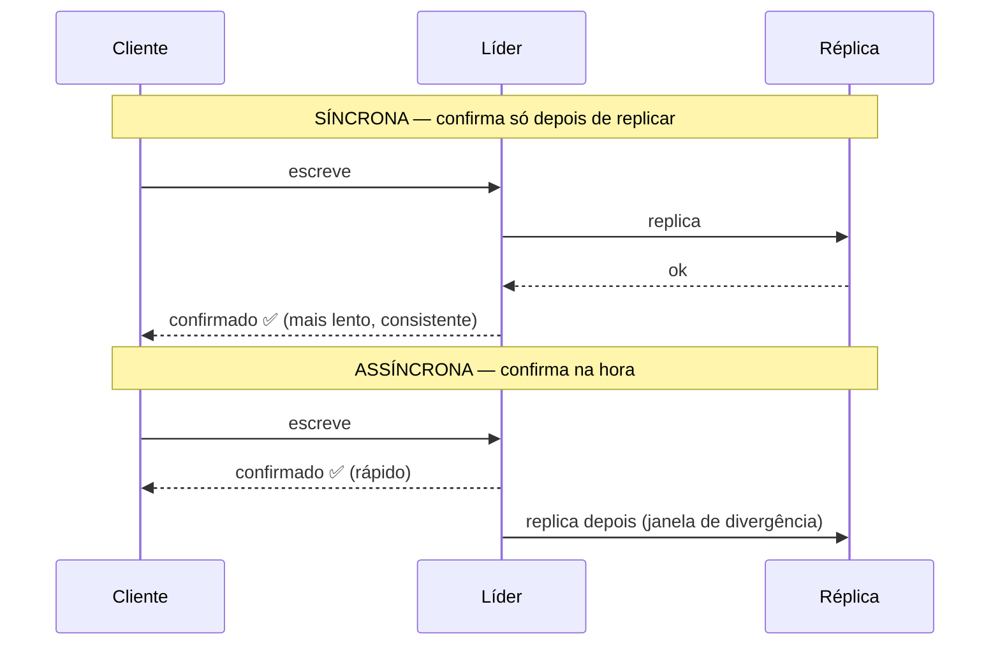
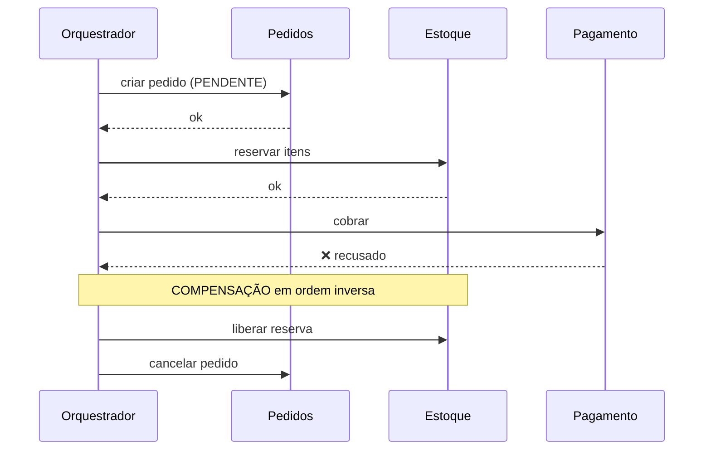
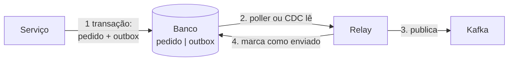
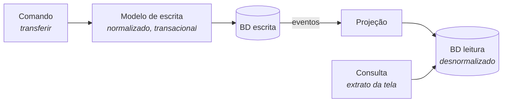

# III - CONSISTÊNCIA E DADOS

> [← Voltar para ARQUITETURA DISTRIBUÍDA](README.md) · Anterior: [II - LATÊNCIA](ii-latencia-e-performance.md) · Próximo: [IV - RESILIÊNCIA](iv-resiliencia.md)

## 1. O problema

Num sistema com um banco só, existe **uma** verdade. Assim que há réplicas ou serviços diferentes guardando partes do mesmo conceito, existem **N cópias** — e entre a escrita numa e a chegada nas outras há uma janela em que o sistema **se contradiz**.

Consistência distribuída é a disciplina de decidir **quanto** de contradição é aceitável, **onde**, e **como reconciliar**. Não existe "sempre consistente e sempre disponível": essa é a escolha que o [TEOREMA CAP](../teorema-cap/README.md) formaliza.

---

## 2. Replicação

Manter cópias dos mesmos dados em nós diferentes. Serve para **disponibilidade** (um nó cai, outro atende), **escala de leitura** (distribuir consultas), **latência geográfica** (réplica perto do usuário) e **durabilidade** (cópia de segurança viva).

### Topologias

| Topologia | Como funciona | Prós | Contras |
|---|---|---|---|
| **Single-leader** (primário-réplica) | toda escrita vai ao líder, que propaga | simples, sem conflito de escrita | o líder é gargalo e ponto de falha; *failover* é delicado |
| **Multi-leader** | vários nós aceitam escrita e sincronizam entre si | escrita local em cada região | **conflitos de escrita** a resolver |
| **Leaderless** (Dynamo-style) | o cliente escreve em vários nós; quórum decide | alta disponibilidade | leitura pode ver versões diferentes; exige reconciliação |

### Replicação síncrona × assíncrona — o ponto da aula



| | **Síncrona** | **Assíncrona** | **Semi-síncrona** |
|---|---|---|---|
| Confirma ao cliente | após a réplica confirmar | imediatamente | após **pelo menos uma** réplica |
| Latência da escrita | alta (soma o RTT da réplica) | baixa | intermediária |
| Perda em falha do líder | **nenhuma** | **possível** (o que não replicou se perde) | limitada |
| Réplica indisponível | **bloqueia a escrita** | não afeta | degrada para assíncrona |
| Consistência de leitura na réplica | forte | **eventual** | intermediária |
| Posição no CAP | tende a **CP** | tende a **AP** | configurável |

> Replicação **totalmente** síncrona com muitas réplicas é rara: basta uma réplica lenta para travar todas as escritas. O arranjo comum é **semi-síncrono** — uma réplica síncrona (garante durabilidade) e as demais assíncronas.

### Replication lag e as garantias de sessão

O atraso da réplica gera anomalias que o usuário percebe:

| Anomalia | O que o usuário vê | Garantia que resolve |
|---|---|---|
| Escreve e não vê | comenta, dá F5 e o comentário sumiu | **read-your-writes** (rotear a leitura do autor para o líder) |
| Volta no tempo | vê 10 comentários e depois 8 | **monotonic reads** (fixar o usuário numa réplica) |
| Fora de ordem | vê a resposta antes da pergunta | **consistent prefix reads** (preservar a ordem causal) |

### Quórum

Com **N** réplicas, **W** confirmações para escrever e **R** para ler: se **R + W > N**, há sobreposição garantida entre quem escreveu e quem lê — ou seja, consistência forte. Com N=3: `W=1,R=1` é rápido e fraco; `W=2,R=2` é consistente e mais lento. É o botão que Cassandra e DynamoDB expõem (`ONE`, `QUORUM`, `ALL`). → [TEOREMA CAP](../teorema-cap/README.md)

---

## 3. Dados em microsserviços

Com **um banco por serviço**, duas capacidades somem de uma vez: o `JOIN` entre domínios e a transação ACID entre serviços.

**Como consultar o que está espalhado:**

| Estratégia | Como | Quando |
|---|---|---|
| **API composition** | o gateway/BFF busca em cada serviço e junta em memória | poucas fontes, volume pequeno |
| **CQRS com read model** | um serviço mantém uma **view materializada** alimentada por eventos | consulta frequente, muitas fontes, filtro/ordenação complexos |
| **Data replication local** | o serviço guarda uma cópia somente-leitura do que precisa do outro | dado pequeno e pouco mutável (ex.: cadastro de moedas) |

**Nunca:** ler direto a tabela do outro serviço. Isso transforma o esquema interno dele em contrato público e congela a evolução dos dois. → [I - ESTILOS](i-estilos-arquiteturais.md)

---

## 4. Transações distribuídas

### Two-Phase Commit (2PC) — e por que quase ninguém usa

Um coordenador pergunta a todos "podem commitar?" (*prepare*) e, se todos disserem sim, manda commitar (*commit*).

| ✅ | ❌ |
|---|---|
| atomicidade real entre recursos | **bloqueante**: os participantes seguram locks até a decisão |
| | coordenador é ponto único de falha — se ele cai entre as fases, os participantes ficam **em dúvida** |
| | disponibilidade despenca (é CP puro) |
| | não escala: latência = o participante mais lento |

Sobrevive em nichos (XA entre bancos, mensageria transacional legada). Em microsserviços, a resposta é outra.

### Saga — a resposta prática

Uma sequência de **transações locais**, cada uma com uma **compensação** que desfaz logicamente o efeito. Não há rollback global: há **estorno**.



| | **Saga orquestrada** | **Saga coreografada** |
|---|---|---|
| Condução | um orquestrador comanda os passos | cada serviço reage ao evento do anterior |
| Visibilidade do fluxo | centralizada, fácil de auditar | espalhada |
| Acoplamento | o orquestrador conhece todos | baixo |
| Depurar | mais fácil | difícil |
| Indicada para | processos críticos e longos | fluxos simples e laterais |

**O que a Saga exige de você:**

1. **Compensação para cada passo** — e compensar nem sempre é trivial: e-mail enviado não se "desenvia" (manda-se outro).
2. **Estados intermediários visíveis ao usuário** — o pedido fica `PENDENTE` enquanto a saga roda. O sistema **não** é atômico, e a UX precisa refletir isso.
3. **Idempotência em todo passo** — retries vão acontecer.
4. **Isolamento não existe:** outra transação pode ler o estado intermediário (*dirty read* semântico). Mitigações: campo de status, registro semântico de bloqueio (reserva), ou aceitar.

**TCC (Try-Confirm/Cancel)** é a variação que resolve parte do isolamento: o `Try` **reserva** o recurso (sem efetivar), e depois vem `Confirm` ou `Cancel`. É o que um sistema de passagens faz ao segurar o assento por 10 minutos.

---

## 5. Outbox — o problema da escrita dupla

```java
@Transactional
public void criarPedido(Pedido p) {
    repository.save(p);                       // ✅ commita no banco
    kafka.send("pedido-criado", evento);      // ❌ e se falhar aqui? (ou se o banco der rollback depois?)
}
```

**Dual write:** dois sistemas, duas confirmações, nenhuma atomicidade. Ou o evento sai sem o dado ter sido gravado, ou o dado é gravado e o evento se perde — e ninguém percebe.

**A solução — Outbox:** grave o evento **numa tabela do mesmo banco, na mesma transação**. Um processo separado lê a tabela e publica.



Como a escrita do dado e a do evento estão na **mesma transação**, ou as duas acontecem ou nenhuma. A publicação vira **at-least-once** (pode duplicar se o relay cair depois de publicar e antes de marcar) — e por isso o consumidor precisa ser idempotente.

O relay pode ser um **poller** (consulta a tabela periodicamente) ou **CDC** (*Change Data Capture*, como o Debezium, lendo o log de transações do banco). CDC é mais eficiente e não polui o banco com consultas.

O espelho disso do lado do consumidor é o **Inbox**: registrar o id da mensagem processada numa tabela, para descartar duplicatas.

---

## 6. Idempotência — a exigência que atravessa tudo

> **Idempotente:** executar N vezes tem o mesmo efeito de executar 1 vez.

É obrigatória porque, num sistema distribuído, **você não pode evitar a repetição**: o timeout não diz se a operação aconteceu, o retry é necessário, e a entrega é at-least-once.

```java
// 1) chave de idempotência + constraint única no banco (o banco arbitra a corrida)
@Transactional
public Comprovante transferir(String chaveIdempotencia, TransferenciaCommand cmd) {
    var existente = idempotencia.buscar(chaveIdempotencia);
    if (existente != null) return existente.resposta();     // já processei: devolve o mesmo resultado

    var comprovante = executar(cmd);
    idempotencia.salvar(chaveIdempotencia, cmd.hash(), comprovante);   // UNIQUE(chave)
    return comprovante;
}
```

```java
// 2) consumidor de evento — deduplicação por id da mensagem (padrão Inbox)
@KafkaListener(topics = "pagamento-aprovado")
public void consumir(EventoPagamento e) {
    if (!processados.registrarSeNovo(e.id())) return;       // já vi esse evento
    aplicar(e);
}
```

```sql
-- 3) operação naturalmente idempotente: o estado final não depende de quantas vezes rodou
UPDATE pedido SET status = 'PAGO' WHERE id = ? AND status = 'PENDENTE';
-- ≠ UPDATE conta SET saldo = saldo - 100  (rodar 2x debita 200!)
```

**Regra:** prefira operações que **definem o estado** (`status = 'PAGO'`) às que **incrementam** (`saldo = saldo - 100`). Quando o incremento é inevitável, proteja com chave de idempotência. → [Evolução da API](../spring-mvc-apis-restful/iv-evolucao-da-api.md)

---

## 7. CQRS e Event Sourcing

**CQRS** (*Command Query Responsibility Segregation*) separa o modelo de **escrita** do de **leitura**:



**Por que:** leitura e escrita têm requisitos opostos — a escrita quer normalização e integridade; a leitura quer o dado já junto, no formato da tela. Permite escalar e modelar cada lado separadamente.
**Custo:** dois modelos para manter, **consistência eventual** entre eles (a tela pode não mostrar imediatamente o que acabou de ser gravado) e mais complexidade. Não use por padrão — use onde a assimetria entre leitura e escrita é real.

**Event Sourcing:** em vez de guardar o **estado atual**, guarda-se a **sequência de eventos** que levou até ele; o estado é derivado pelo *replay*.

| ✅ | ❌ |
|---|---|
| auditoria completa e nativa (o histórico **é** o dado) | consultar o estado atual exige projeção |
| *time travel*: reconstruir o estado em qualquer momento | versionamento de evento é complexo (eventos são para sempre) |
| casa naturalmente com CQRS e com integração por eventos | curva de aprendizado alta |
| debug por replay dos fatos | deletar dado (LGPD) vira problema real |

Em domínio financeiro, a ideia é natural: um extrato bancário **é** um event store, e o saldo é a projeção.

---

## 8. Tempo e ordem

**Não existe "agora" global.** Os relógios das máquinas divergem (*clock skew*): mesmo com NTP, dezenas de milissegundos de diferença são normais, e um ajuste pode fazer o relógio **andar para trás**.

Consequência direta: **nunca ordene eventos distribuídos por `timestamp` de máquina**. Dois eventos com 5 ms de diferença podem ser registrados fora de ordem — e a regra "o último vence" (LWW) decidiria errado, **perdendo escrita silenciosamente**.

| Mecanismo | O que dá |
|---|---|
| **Relógio físico (NTP)** | aproximação; útil para log, perigoso para ordenar |
| **Relógio lógico (Lamport)** | ordem parcial: se A causou B, A < B |
| **Relógio vetorial** | detecta **concorrência**: diz se dois eventos são causalmente relacionados ou concorrentes |
| **TrueTime** (Google Spanner) | intervalo de incerteza com relógio atômico e GPS; o banco **espera** a incerteza passar para garantir ordem global |

**Resolução de conflito** em escrita concorrente (multi-leader/leaderless):

- **LWW (last-write-wins)** — simples e **perde dados** em empate.
- **Manter as duas versões** (*siblings*) e resolver na aplicação ou pelo usuário.
- **CRDT** (*Conflict-free Replicated Data Type*) — estruturas que convergem por construção (contadores, conjuntos, texto colaborativo). É o que faz um editor colaborativo funcionar offline.

---

## Checklist de consistência

- [ ]  Para cada dado: definido **quanto** de atraso é aceitável
- [ ]  Escrita crítica (dinheiro, estoque) com consistência forte ou quórum
- [ ]  Réplica de leitura com `read-your-writes` onde o usuário escreve e lê
- [ ]  Cada serviço é dono exclusivo do seu banco
- [ ]  Processo entre serviços modelado como **Saga**, com compensação escrita e testada
- [ ]  Estados intermediários refletidos na UX
- [ ]  Publicação de evento via **Outbox**, nunca dual write
- [ ]  **Todo** consumidor e endpoint de escrita é idempotente
- [ ]  Sem ordenação por timestamp de máquina
- [ ]  Estratégia de conflito definida (e LWW só onde perder é aceitável)

---

## Perguntas para autoavaliação

1. Por que "N cópias" é o problema central da consistência distribuída?
2. Compare replicação síncrona e assíncrona em latência, durabilidade e disponibilidade.
3. Por que a replicação totalmente síncrona é rara, e o que é semi-síncrona?
4. Explique read-your-writes, monotonic reads e consistent prefix.
5. Com N=3, quais combinações de R e W garantem consistência forte?
6. Como consultar dados espalhados entre serviços sem `JOIN`?
7. Por que ler direto a tabela de outro serviço é um erro de arquitetura?
8. Por que o 2PC é evitado em microsserviços?
9. O que é uma Saga e o que substitui o rollback nela?
10. Orquestrada × coreografada: vantagens de cada uma.
11. Quais são as quatro exigências que a Saga impõe à aplicação?
12. O que é o problema do dual write e como o Outbox o resolve?
13. Por que o Outbox ainda entrega at-least-once?
14. Escreva um exemplo de operação idempotente e um de não idempotente.
15. O que é CQRS e qual o seu custo?
16. Cite duas vantagens e duas desvantagens de event sourcing.
17. Por que não se deve ordenar eventos por timestamp de máquina?
18. O que um relógio vetorial detecta que um lógico não detecta?
19. Qual o risco do LWW e qual a alternativa?

---

> [← Voltar para ARQUITETURA DISTRIBUÍDA](README.md) · Anterior: [II - LATÊNCIA](ii-latencia-e-performance.md) · Próximo: [IV - RESILIÊNCIA](iv-resiliencia.md)
