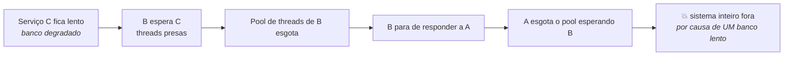
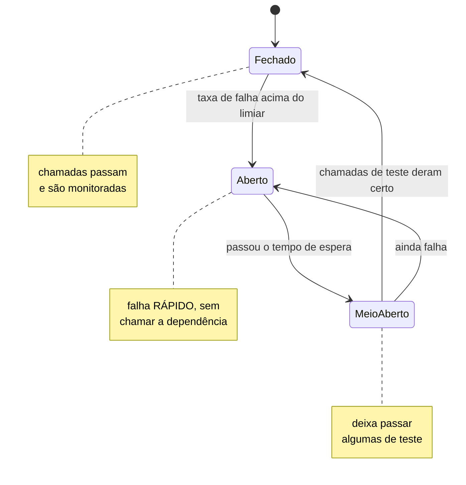
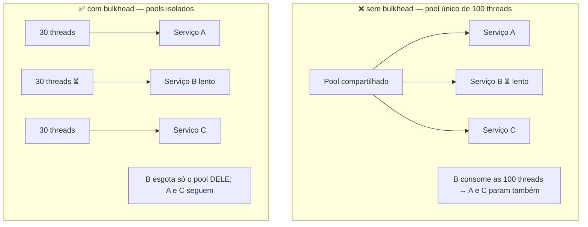

# IV - RESILIÊNCIA

> [← Voltar para ARQUITETURA DISTRIBUÍDA](README.md) · Anterior: [III - CONSISTÊNCIA](iii-consistencia-e-dados.md) · Próximo: [V - OBSERVABILIDADE](v-observabilidade.md)

## 1. Falha não é exceção, é rotina

Com 50 serviços a 99,9% de disponibilidade cada, a chance de **todos** estarem no ar ao mesmo tempo é 0,999⁵⁰ ≈ **95%** — ou seja, em 5% do tempo alguma coisa está quebrada. Em escala, **sempre** há algo falhando.

Por isso a métrica que importa muda:

| | **MTBF** (tempo médio entre falhas) | **MTTR** (tempo médio de recuperação) |
|---|---|---|
| Objetivo | evitar que falhe | **voltar rápido** quando falhar |
| Estratégia | qualidade, testes, redundância | detecção, isolamento, automação, rollback |
| Em sistema distribuído | impossível levar ao limite | **é onde está o ganho real** |

*Design for failure*: assuma que toda chamada de rede pode ser lenta, falhar ou **ter sucesso sem você saber**. Os padrões abaixo existem para que uma falha local **não vire uma falha global**.

### O mecanismo da falha em cascata



O detalhe crucial: **lentidão é pior que queda**. Um serviço fora do ar recusa a conexão imediatamente e o chamador segue adiante. Um serviço **lento** segura as threads de quem o chama, e a pressão sobe pela cadeia. Todo o arsenal a seguir existe para cortar essa propagação.

---

## 2. Timeout — o padrão mais básico e o mais esquecido

Sem timeout, uma chamada pode ficar pendurada indefinidamente, e a thread junto com ela. **Toda** chamada de rede precisa de limite.

```java
// RestClient / WebClient / gRPC / driver de banco — todos precisam dos dois
var factory = new SimpleClientHttpRequestFactory();
factory.setConnectTimeout(Duration.ofMillis(500));   // tempo para ESTABELECER a conexão
factory.setReadTimeout(Duration.ofMillis(2000));     // tempo para RECEBER a resposta
```

| Timeout | Limita |
|---|---|
| **Connect** | estabelecer a conexão TCP/TLS (curto: 200–1000 ms) |
| **Read / socket** | esperar a resposta depois de conectado |
| **Request / global** | a operação inteira, incluindo retries |
| **Pool / connection request** | esperar por uma conexão livre no pool |

**Como escolher o valor:** olhe o **p99** da dependência e acrescente folga — não use a média. Timeout curto demais derruba requisições que iriam bem; longo demais não protege ninguém.

> **Orçamento de timeout (*timeout budget*):** se o usuário espera no máximo 3 s e sua cadeia é A → B → C, os timeouts precisam **encolher** ao descer (A: 3 s, B: 1,5 s, C: 700 ms). Timeout interno maior que o externo é inútil: o cliente já desistiu, e o servidor segue trabalhando para o nada. O gRPC resolve isso nativamente propagando o **deadline**. → [gRPC](../grpc-e-graphql/i-grpc.md)

---

## 3. Retry — repetir, mas com juízo

Falhas transitórias (pacote perdido, instância reiniciando, *deadlock* de banco, *throttling*) se resolvem sozinhas. Repetir faz sentido — **desde que**:

1. **A operação seja idempotente** (ou tenha chave de idempotência). Repetir um débito não idempotente duplica dinheiro. → [III - CONSISTÊNCIA](iii-consistencia-e-dados.md)
2. **O erro seja transitório.** Repetir `400`, `403` ou `422` só gasta recurso: a resposta será a mesma. Repita `503`, `504`, timeout, `429` (respeitando `Retry-After`) e falha de conexão.
3. **Haja backoff exponencial com jitter.**

```java
@Retry(name = "parceiro", fallbackMethod = "consultarCache")
public Cotacao consultar(String moeda) { }
```

```yaml
resilience4j.retry:
  instances:
    parceiro:
      maxAttempts: 3                     # a original + 2 repetições
      waitDuration: 200ms
      exponentialBackoffMultiplier: 2    # 200ms → 400ms → 800ms
      randomizedWaitFactor: 0.5          # JITTER: espalha as tentativas
      retryExceptions:
        - java.io.IOException
        - java.util.concurrent.TimeoutException
      ignoreExceptions:
        - com.fiap.banking.SaldoInsuficienteException   # erro de negócio NÃO se repete
```

> ### ⚠️ Retry storm — quando o retry derruba o sistema
>
> Um serviço fica lento; mil clientes repetem **ao mesmo tempo**; a carga **triplica** exatamente quando ele já não aguenta. O retry vira um ataque de negação de serviço interno.
>
> **Backoff exponencial** espaça as tentativas; o **jitter** (aleatoriedade) evita que todos repitam no mesmo instante — sem ele, os clientes se sincronizam em ondas. E **retry em cadeia multiplica**: se A, B e C repetem 3× cada, uma requisição do usuário vira **27** no serviço final. Por isso: repita **numa camada só** (preferencialmente a mais próxima da falha) e combine sempre com **circuit breaker**.

---

## 4. Circuit Breaker — o disjuntor

A analogia é elétrica: quando a corrente passa do limite, o disjuntor **desarma** e interrompe o circuito, protegendo a casa. Aqui, quando uma dependência falha demais, o breaker para de chamá-la — falhando **imediatamente** em vez de esperar timeout a cada requisição.



Exemplo de gatilho: **abre** quando 50% das últimas 20 chamadas falham; espera **30 s**; deixa passar **3** chamadas de teste; se passarem, **fecha**.

| Estado | Comportamento |
|---|---|
| **Fechado** | tudo passa; o breaker apenas contabiliza sucessos e falhas |
| **Aberto** | nada passa: retorna erro ou **fallback** na hora, sem gastar thread nem timeout |
| **Meio-aberto** | deixa passar um número pequeno de chamadas de teste para sondar a recuperação |

**Os dois ganhos:** o chamador para de desperdiçar threads e tempo numa dependência quebrada (**protege quem chama**), e a dependência ganha um respiro para se recuperar em vez de receber carga total (**protege quem é chamado**).

```java
@CircuitBreaker(name = "parceiro", fallbackMethod = "cotacaoDoCache")
public Cotacao consultar(String moeda) {
    return parceiroClient.cotacao(moeda);
}

private Cotacao cotacaoDoCache(String moeda, Throwable t) {
    log.warn("circuito aberto para o parceiro, servindo cache", t);
    return cache.ultimaConhecida(moeda);          // degradação graciosa
}
```

```yaml
resilience4j.circuitbreaker:
  instances:
    parceiro:
      slidingWindowType: COUNT_BASED
      slidingWindowSize: 20                  # janela de avaliação
      minimumNumberOfCalls: 10               # não decide com amostra pequena
      failureRateThreshold: 50               # % de falhas que abre o circuito
      slowCallRateThreshold: 80              # chamadas LENTAS também contam como falha
      slowCallDurationThreshold: 2s
      waitDurationInOpenState: 30s
      permittedNumberOfCallsInHalfOpenState: 3
```

**Parâmetro subestimado:** `slowCallRateThreshold`. Contar só erro deixa passar o cenário pior — a dependência que responde, mas em 10 segundos. Tratar **lentidão como falha** é o que protege de verdade.

**Erros de configuração comuns:** limiar tão alto que nunca abre; janela pequena demais (abre por acaso); `waitDurationInOpenState` longo demais (demora a perceber a recuperação); e **um breaker único para várias dependências** — cada dependência precisa do seu.

---

## 5. Bulkhead — antepara

O nome vem da construção naval: o casco é dividido em **compartimentos estanques**, para que um furo não afunde o navio inteiro. Aqui, o recurso (threads, conexões) é dividido **por dependência**, de modo que uma dela não consuma tudo.



```java
@Bulkhead(name = "parceiro", type = Bulkhead.Type.SEMAPHORE)   // limita chamadas concorrentes
public Cotacao consultar(String moeda) { }
```

| Tipo | Como isola | Custo |
|---|---|---|
| **Semáforo** | limita o **número de chamadas concorrentes** na mesma thread | leve; não protege de thread presa |
| **Thread pool** | cada dependência tem seu **pool próprio** | isolamento real; mais memória e troca de contexto |

O bulkhead também existe em outros níveis: **pool de conexões** separado por finalidade, **instâncias dedicadas** por tipo de cliente, e a *cell-based architecture* (clientes particionados em células independentes, para que um incidente atinja só uma fração da base).

---

## 6. Fallback e degradação graciosa

O que fazer quando a chamada falha (por erro, timeout ou circuito aberto):

| Estratégia | Exemplo |
|---|---|
| **Valor em cache** (possivelmente velho) | última cotação conhecida |
| **Valor padrão** | frete padrão quando a transportadora não responde |
| **Resposta parcial** | mostra o extrato sem a seção de recomendações |
| **Fila para depois** | aceita o pedido e processa quando o parceiro voltar |
| **Mensagem honesta** | "não foi possível calcular agora, tente em instantes" |

**Degradação graciosa** é a ideia geral: em vez de derrubar tudo, **desligar funcionalidades não essenciais** para manter as essenciais vivas. Num e-commerce sob pressão: recomendação e avaliação saem do ar; catálogo, carrinho e checkout continuam.

Isso exige classificar as funcionalidades por criticidade **antes** do incidente — e é uma conversa de produto, não só de engenharia.

> **Cuidado:** fallback silencioso que devolve dado errado é pior que erro. Se o fallback é uma aproximação, o usuário (ou o sistema) precisa saber.

---

## 7. Rate limiting, throttling e load shedding

Proteger-se do excesso — inclusive do excesso legítimo.

| Mecanismo | Objetivo |
|---|---|
| **Rate limiting** | teto de requisições por cliente/janela (protege de abuso e de vizinho barulhento) |
| **Throttling** | desacelerar em vez de recusar (enfileirar, responder mais devagar) |
| **Load shedding** | sob sobrecarga, **descartar deliberadamente** requisições de baixa prioridade para salvar as críticas |
| **Concurrency limit** | limitar requisições simultâneas em vez de por segundo (mais estável) |

```java
@RateLimiter(name = "parceiro")     // Resilience4j: limita a taxa de saída
public Cotacao consultar(String moeda) { }
```

Responda **429** com `Retry-After` — e faça isso **rápido**, antes de gastar recurso. → [Evolução da API](../spring-mvc-apis-restful/iv-evolucao-da-api.md)

---

## 8. Combinando os padrões — a ordem importa

Os padrões se compõem, e a ordem em que se aninham muda o comportamento. No Resilience4j com Spring Boot, a ordem padrão dos aspectos é:

```
Retry ( CircuitBreaker ( RateLimiter ( TimeLimiter ( Bulkhead ( sua chamada ) ) ) ) )
```

Lendo de dentro para fora: o **Bulkhead** limita a concorrência; o **TimeLimiter** corta a chamada lenta; o **RateLimiter** controla a taxa; o **CircuitBreaker** contabiliza e abre se necessário; o **Retry**, por último, decide se tenta de novo.

**Por que o Retry fica por fora:** cada tentativa precisa ser contabilizada pelo breaker e ter seu próprio timeout. Se o retry ficasse **dentro** do breaker, uma falha com 3 tentativas contaria como **uma** — e o circuito demoraria muito mais para abrir.

```java
@Retry(name = "parceiro")
@CircuitBreaker(name = "parceiro", fallbackMethod = "cotacaoDoCache")
@Bulkhead(name = "parceiro")
@TimeLimiter(name = "parceiro")
public CompletableFuture<Cotacao> consultar(String moeda) { }
```

Aplicado em cadeia (A → B → C), cada elo precisa da sua proteção: **o padrão não é transitivo**.

---

## 9. Redundância, health checks e desligamento

- **Redundância e failover:** múltiplas instâncias, múltiplas zonas de disponibilidade (AZ), e — se o requisito exigir — múltiplas regiões. Sem redundância, nenhum dos padrões acima evita indisponibilidade.
- **Health checks:** *liveness* ("devo **reiniciar** este processo?") × *readiness* ("posso **mandar tráfego**?"). Confundir os dois causa reinício em loop durante a inicialização. Um readiness bem feito considera as dependências críticas — mas cuidado: marcar-se como "não pronto" porque uma dependência **não essencial** caiu tira você do balanceador sem necessidade. → [DOCKER - Orquestração](../docker/capitulo-v-orquestracao-de-containeres.md)
- **Graceful shutdown:** ao receber `SIGTERM`, parar de aceitar novas requisições, terminar as em andamento e só então sair (`server.shutdown=graceful` no Spring Boot). Sem isso, todo deploy derruba requisições em voo. → [DOCKER](../docker/capitulo-ii-gerenciamento-de-containers.md)
- **Dead Letter Queue (DLQ):** mensagem que falha repetidamente vai para uma fila separada, em vez de bloquear a fila principal (*poison message*) ou se perder. E **alguém precisa monitorar a DLQ** — DLQ sem alerta é um cemitério silencioso.

---

## 10. Chaos Engineering

> Injetar falhas **de propósito**, em ambiente controlado, para descobrir fraquezas **antes** que o incidente descubra por você.

A prática nasceu na Netflix com o **Chaos Monkey**, que derrubava instâncias em produção aleatoriamente — forçando os times a construir sistemas que sobrevivessem a isso.

**O método:**
1. Defina o **estado estável** (a métrica de negócio que diz "está tudo bem": pedidos por minuto, por exemplo).
2. Levante uma **hipótese** ("se o serviço de recomendação cair, o checkout continua funcionando").
3. **Injete** a falha: matar instância, adicionar latência, cortar rede, esgotar CPU/disco, derrubar uma AZ.
4. **Meça** o desvio do estado estável.
5. **Corrija** o que quebrou e automatize o experimento.

Comece **pequeno**: em homologação, com raio de explosão limitado, horário combinado e botão de parada. **Game day** é a versão com pessoas: simular um incidente e exercitar a resposta do time — porque o runbook que ninguém testou não funciona às 3h da manhã.

---

## Anti-padrões

| Anti-padrão | Por que dói |
|---|---|
| Chamada de rede **sem timeout** | uma thread presa para sempre; o pool esgota |
| **Retry sem backoff/jitter** | multiplica a carga exatamente na hora errada |
| **Retry em operação não idempotente** | duplica efeito (cobrança dupla) |
| **Retry em erro de negócio** (`422`) | gasta recurso para receber a mesma resposta |
| **Retry em várias camadas** | 3 × 3 × 3 = 27 chamadas por requisição do usuário |
| **Circuit breaker sem fallback** | o erro só chega mais rápido ao usuário |
| **Um breaker para todas as dependências** | uma dependência ruim bloqueia as boas |
| **Fallback que mente** | devolve dado errado como se fosse certo |
| **Pool único para tudo** | falta de bulkhead: um lento derruba todos |
| **Readiness dependendo de serviço não essencial** | você se tira do ar sozinho |
| **DLQ sem monitoramento** | mensagens morrem em silêncio |
| **Health check que só devolve 200** | não detecta nada; o orquestrador acha que está tudo bem |

---

## Checklist de resiliência

- [ ]  Timeout em **toda** chamada de rede (connect e read), com orçamento decrescente na cadeia
- [ ]  Retry só em erro transitório, com backoff exponencial + jitter, numa camada só
- [ ]  Operação repetível é idempotente
- [ ]  Circuit breaker por dependência, contando **lentidão** como falha
- [ ]  Fallback definido e honesto para cada dependência crítica
- [ ]  Bulkhead isolando recursos por dependência
- [ ]  Rate limiting na borda, com 429 + `Retry-After`
- [ ]  Funcionalidades classificadas por criticidade (o que desligar primeiro)
- [ ]  Liveness × readiness corretos; graceful shutdown ligado
- [ ]  Redundância em mais de uma AZ
- [ ]  DLQ com alerta
- [ ]  Experimento de caos ou game day já executado ao menos uma vez

---

## Perguntas para autoavaliação

1. Por que MTTR importa mais que MTBF em sistema distribuído?
2. Por que um serviço **lento** é mais perigoso que um serviço **fora do ar**?
3. Descreva o mecanismo da falha em cascata.
4. Quais tipos de timeout existem e como escolher o valor de cada um?
5. O que é orçamento de timeout, e por que o timeout interno deve ser menor?
6. Quais são as três condições para que um retry seja seguro?
7. O que é retry storm e como backoff e jitter o evitam?
8. Por que retry em várias camadas é perigoso?
9. Descreva os três estados do circuit breaker e as transições.
10. Quais são os dois ganhos do circuit breaker (para quem chama e para quem é chamado)?
11. Por que contar chamadas lentas como falha é importante?
12. Explique o bulkhead e a diferença entre semáforo e thread pool.
13. O que é degradação graciosa e o que ela exige do time antes do incidente?
14. Por que o Retry fica **fora** do CircuitBreaker na composição?
15. Diferencie liveness de readiness, e diga o risco de um readiness mal feito.
16. O que é uma DLQ e qual o erro comum ao usá-la?
17. Quais são os cinco passos de um experimento de chaos engineering?

---

> [← Voltar para ARQUITETURA DISTRIBUÍDA](README.md) · Anterior: [III - CONSISTÊNCIA](iii-consistencia-e-dados.md) · Próximo: [V - OBSERVABILIDADE](v-observabilidade.md)
