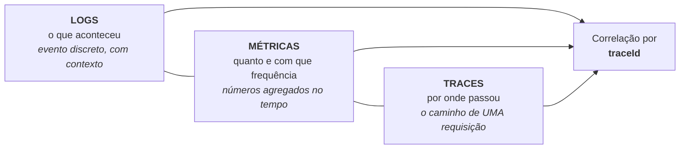
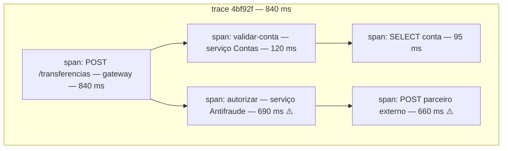

# V - OBSERVABILIDADE

> [← Voltar para ARQUITETURA DISTRIBUÍDA](README.md) · Anterior: [IV - RESILIÊNCIA](iv-resiliencia.md)

## 1. Por que o monitoramento muda

No monólito, um erro é **um** stack trace num arquivo de log. Numa arquitetura distribuída, a mesma requisição passou por seis serviços em máquinas diferentes, e o sintoma ("o checkout está lento") não diz onde está a causa. Sem instrumentação, **investigar vira adivinhação**.

| | **Monitoramento** | **Observabilidade** |
|---|---|---|
| Responde | perguntas que você **já sabia** fazer | perguntas **novas**, sem alterar o código |
| Baseado em | dashboards e alertas predefinidos | dados ricos e correlacionáveis |
| Cobre | *known unknowns* ("a CPU pode subir") | *unknown unknowns* ("por que só os clientes do plano X, no Android, após as 18h?") |

Observabilidade é uma **propriedade do sistema**: o quanto dá para inferir o estado interno a partir do que ele emite. Monitoramento é a atividade de acompanhar. Você precisa dos dois.

---

## 2. Os três pilares



| Pilar | Responde | Custo | Cardinalidade |
|---|---|---|---|
| **Métricas** | "está ruim?" — taxa de erro, latência, throughput | baixo | **precisa ser baixa** |
| **Traces** | "onde está ruim?" — qual serviço da cadeia | médio (com amostragem) | alta |
| **Logs** | "por que está ruim?" — o detalhe do caso | **alto** | altíssima |

O fluxo de investigação segue essa ordem: a **métrica** dispara o alerta, o **trace** mostra qual salto da cadeia está lento, e o **log** daquele span explica o motivo. Sem os três correlacionados, cada passo vira busca manual.

---

## 3. Logs

**Log estruturado** (JSON) em vez de texto livre — é o que permite consultar, filtrar e agregar:

```java
// ❌ texto livre: impossível filtrar por conta ou agregar por tipo
log.info("Transferência de " + valor + " da conta " + origem + " falhou");

// ✅ estruturado: cada campo é consultável
log.atWarn()
   .setMessage("transferencia_recusada")
   .addKeyValue("contaOrigem", origem)
   .addKeyValue("valor", valor)
   .addKeyValue("motivo", "SALDO_INSUFICIENTE")
   .log();
```

**Correlation ID / trace ID** é o que costura os logs de todos os serviços. Em Java, isso vive no **MDC** (*Mapped Diagnostic Context*), um `ThreadLocal` que o logger inclui automaticamente em cada linha:

```java
@Component
public class TraceIdFilter extends OncePerRequestFilter {
    @Override
    protected void doFilterInternal(HttpServletRequest req, HttpServletResponse res, FilterChain chain)
            throws ServletException, IOException {
        String traceId = Optional.ofNullable(req.getHeader("X-Request-Id"))
                                 .orElse(UUID.randomUUID().toString());
        MDC.put("traceId", traceId);
        res.setHeader("X-Request-Id", traceId);          // devolve para o cliente
        try { chain.doFilter(req, res); } finally { MDC.clear(); }   // SEMPRE limpar
    }
}
```

> O MDC é `ThreadLocal`: ele **não atravessa** `@Async`, executor, `CompletableFuture` nem consumer de fila. É o mesmo motivo pelo qual o `SecurityContext` e a transação também não atravessam. Em código assíncrono, propague explicitamente (o Micrometer Tracing faz isso com `ContextSnapshot`). → [SPRING SECURITY](../spring-security/README.md)

**Boas práticas e armadilhas:**

| Faça | Não faça |
|---|---|
| níveis com critério: `ERROR` = alguém precisa agir; `WARN` = anormal mas tratado; `INFO` = marco de negócio; `DEBUG` = diagnóstico | logar em laço de milhões de iterações (custo e ruído) |
| mensagem estável + campos variáveis (permite agrupar) | concatenar variável na mensagem |
| incluir `traceId`, `userId` (pseudonimizado), `serviço`, `versão` | **logar senha, token, CPF completo, cartão** — o log é o vazamento mais comum |
| amostrar log de alto volume | logar e relançar a mesma exceção em cada camada |
| definir **retenção** por criticidade | achar que log é de graça (é o pilar mais caro) |

→ [POO - Exceções](../poo/manipulacoes-e-excecoes.md)

---

## 4. Métricas

Números agregados ao longo do tempo. Baratas de coletar e guardar — por isso são a base dos alertas.

| Tipo | O que é | Exemplo |
|---|---|---|
| **Counter** | só cresce | total de requisições, total de erros |
| **Gauge** | sobe e desce | conexões ativas, tamanho da fila, memória |
| **Histogram** | distribui em faixas; permite calcular **percentis** | latência p95/p99 |
| **Summary** | percentis calculados no cliente | latência (não agregável entre instâncias) |

### RED e USE — o que medir

| **RED** (para **serviços**) | **USE** (para **recursos**) |
|---|---|
| **R**ate — requisições por segundo | **U**tilization — % de uso (CPU, disco) |
| **E**rrors — taxa de erro | **S**aturation — quanto está enfileirado/esperando |
| **D**uration — distribuição da latência | **E**rrors — erros do recurso |

Os **quatro sinais de ouro** do Google SRE são praticamente a união dos dois: latência, tráfego, erros e **saturação**. Saturação é o mais esquecido e o mais preditivo: fila crescendo, pool de conexões no limite e *lag* de consumidor Kafka avisam **antes** do incidente.

```java
// Micrometer — a API de métricas do Spring Boot (Actuator)
@Timed(value = "transferencia.duracao", percentiles = {0.5, 0.95, 0.99})
public Comprovante transferir(TransferenciaCommand cmd) { }

meterRegistry.counter("transferencia.recusada", "motivo", "SALDO_INSUFICIENTE").increment();
meterRegistry.gauge("fila.pendentes", fila.size());
```

> ### ⚠️ Explosão de cardinalidade — o erro clássico
>
> Cada combinação de **tags** cria uma série temporal separada. Usar `contaId` ou `traceId` como tag gera **milhões** de séries, derruba o banco de métricas e custa caro.
>
> **Tag boa:** poucos valores possíveis e estáveis (`endpoint`, `status`, `metodo`, `regiao`). **Tag ruim:** id, e-mail, URL com parâmetro, mensagem de erro. Identificador vai em **log e trace**, não em métrica.

---

## 5. Tracing distribuído

Segue **uma** requisição por todos os serviços que ela atravessa.

- **Trace** — a jornada inteira, identificada por um `traceId`.
- **Span** — uma unidade de trabalho dentro do trace (uma chamada HTTP, uma query, um consumo de mensagem), com `spanId`, `parentSpanId`, início, duração, atributos e eventos.
- **Propagação de contexto** — o `traceId` viaja entre serviços em **headers**. O padrão é o **W3C Trace Context** (`traceparent: 00-<trace-id>-<span-id>-01`), que substituiu formatos proprietários como o do Zipkin (B3).



Basta olhar para saber onde está o problema: os 840 ms são quase todos do parceiro externo chamado pelo antifraude. **Essa é a pergunta que log e métrica não respondem** — e é o motivo pelo qual tracing deixou de ser luxo.

**Amostragem:** guardar 100% dos traces é caro. Estratégias: *head-based* (decide no início, ex.: 1%) — simples, porém pode descartar justamente o trace do erro; *tail-based* (decide no fim, guardando os que falharam ou foram lentos) — muito melhor, mais caro de operar.

**OpenTelemetry (OTel)** é o padrão aberto que unificou o mercado: uma API/SDK e um *collector* únicos, exportando para Jaeger, Tempo, Zipkin, Datadog etc. — sem prender o código ao fornecedor. No Spring Boot 3, a instrumentação vem do **Micrometer Tracing** com *bridge* para OTel, e propaga o contexto automaticamente em `RestClient`, `WebClient`, `@KafkaListener` e JDBC.

```yaml
management:
  tracing.sampling.probability: 0.1        # 10% dos traces
  otlp.tracing.endpoint: http://collector:4318/v1/traces
  endpoints.web.exposure.include: health,metrics,prometheus
  endpoint.health.probes.enabled: true     # /health/liveness e /health/readiness
```

**Correlação entre os pilares:** com o `traceId` no log e **exemplars** na métrica (amostras que apontam para um trace), o caminho fica completo: gráfico de p99 → clique no ponto → trace daquela requisição → logs daquele span.

---

## 6. SLI, SLO, SLA e error budget

| Sigla | O que é | Exemplo |
|---|---|---|
| **SLI** (*indicator*) | a **medida** | % de requisições com sucesso abaixo de 300 ms |
| **SLO** (*objective*) | a **meta interna** | 99,9% no mês |
| **SLA** (*agreement*) | o **contrato** com o cliente, com multa | 99,5% ou desconto na fatura |

O SLO deve ser **mais rigoroso** que o SLA — a folga entre os dois é a sua margem de segurança.

**Error budget:** se o SLO é 99,9% ao mês, você pode falhar **0,1%** ≈ 43 minutos. Esse orçamento é uma ferramenta de decisão:

- Sobrou orçamento → dá para arriscar mais: deploys frequentes, experimentos, migrações.
- Orçamento estourado → congela feature e o time foca em confiabilidade.

É o que transforma a discussão "quero lançar rápido" × "quero estabilidade" em um **número combinado** entre produto e engenharia, em vez de uma disputa de opinião.

> **Por que não 100%:** cada nove adicional custa exponencialmente mais, e o usuário raramente percebe a diferença — a rede dele já é menos confiável que isso. Perseguir 100% consome o time em ganho imperceptível.

---

## 7. Alertas

O objetivo de um alerta é **acionar uma pessoa que precisa agir agora**. Todo o resto é dashboard.

| Princípio | Por quê |
|---|---|
| **Alerte por sintoma, não por causa** | "p99 do checkout acima de 2 s" importa; "CPU em 85%" pode ser normal |
| **Baseie no SLO** (*burn rate*) | alerta quando o consumo do error budget acelera — reduz falso positivo |
| **Todo alerta precisa de ação e runbook** | alerta sem o que fazer só desperta gente |
| **Combata a fadiga de alerta** | alerta que dispara toda semana e é ignorado é pior que alerta nenhum |
| **Separe urgente de importante** | página (acorda alguém) × ticket (resolve no horário comercial) |
| **Evite alerta duplicado em cascata** | um incidente deve gerar um alerta, não quarenta |

Complementos: **dashboard** por serviço (RED) e por recurso (USE); **post-mortem sem culpados** (*blameless*) focado no sistema e não na pessoa; e **runbook** testado — o procedimento que ninguém executou não funciona sob pressão. → [IV - RESILIÊNCIA](iv-resiliencia.md)

---

## 8. O que instrumentar num serviço Spring

```xml
<dependency>
  <groupId>org.springframework.boot</groupId>
  <artifactId>spring-boot-starter-actuator</artifactId>
</dependency>
```

| Camada | O que expor |
|---|---|
| **Health** | `/actuator/health/liveness` e `/readiness` para as probes do orquestrador |
| **Métricas** | `/actuator/prometheus` com RED por endpoint, JVM (heap, GC, threads), pool de conexões (Hikari), cache (hit/miss), fila/lag |
| **Traces** | propagação automática + spans de negócio nos pontos importantes |
| **Logs** | JSON com `traceId`, `spanId`, serviço e versão |
| **Info** | versão e commit da build (`/actuator/info`) — essencial para saber **o que** está rodando |

Métricas de **negócio** valem tanto quanto as técnicas: transferências por minuto, taxa de recusa por motivo, valor médio. Elas detectam incidentes que a CPU não vê — uma queda de 40% nos pedidos é um alerta muito melhor do que qualquer métrica de infraestrutura.

---

## Checklist de observabilidade

- [ ]  `traceId` em **todos** os logs, propagado entre serviços (W3C Trace Context)
- [ ]  Log estruturado (JSON), sem dado sensível, com retenção definida
- [ ]  RED por endpoint e USE por recurso, com **percentis** (não média)
- [ ]  Métricas de **negócio**, não só técnicas
- [ ]  Sem id/e-mail como tag de métrica (cardinalidade)
- [ ]  Tracing habilitado com amostragem adequada
- [ ]  SLO definido para as jornadas críticas, com error budget acompanhado
- [ ]  Alertas por sintoma, ligados ao SLO, cada um com runbook
- [ ]  Liveness e readiness corretos e expostos
- [ ]  Versão/commit visível em runtime
- [ ]  DLQ e *consumer lag* monitorados
- [ ]  Post-mortem sem culpados após incidente relevante

---

## Perguntas para autoavaliação

1. Qual a diferença entre monitoramento e observabilidade?
2. O que são *known unknowns* e *unknown unknowns* nesse contexto?
3. Quais são os três pilares e qual pergunta cada um responde?
4. Em que ordem se usam os três pilares numa investigação?
5. Por que log estruturado é superior a texto livre?
6. O que é o MDC e por que ele não atravessa código assíncrono?
7. Cite quatro coisas que nunca devem aparecer no log.
8. Diferencie counter, gauge e histogram.
9. O que é RED e o que é USE? Para que serve cada um?
10. Por que saturação é o sinal mais preditivo?
11. O que é explosão de cardinalidade e como evitá-la?
12. Defina trace, span e propagação de contexto.
13. Qual a vantagem da amostragem *tail-based* sobre *head-based*?
14. O que o OpenTelemetry resolve?
15. Diferencie SLI, SLO e SLA — e por que o SLO deve ser mais rigoroso?
16. O que é error budget e como ele muda a conversa entre produto e engenharia?
17. Por que perseguir 100% de disponibilidade é má ideia?
18. Por que alertar por sintoma é melhor que alertar por causa?
19. O que é fadiga de alerta e por que ela é perigosa?

---

> [← Voltar para ARQUITETURA DISTRIBUÍDA](README.md) · Anterior: [IV - RESILIÊNCIA](iv-resiliencia.md)
