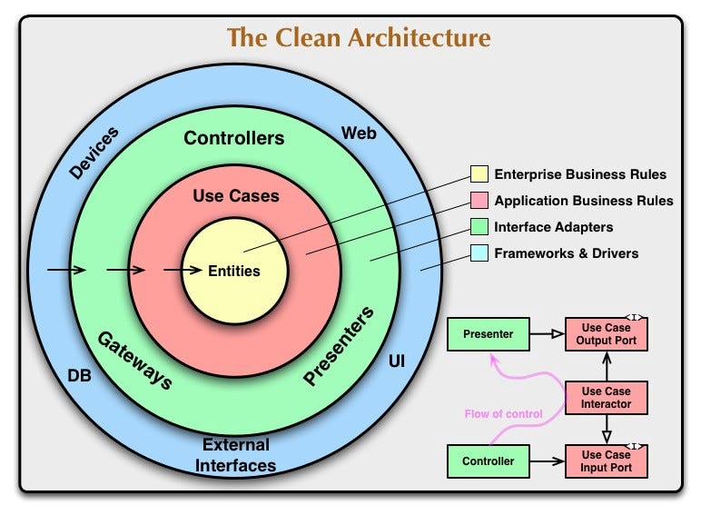
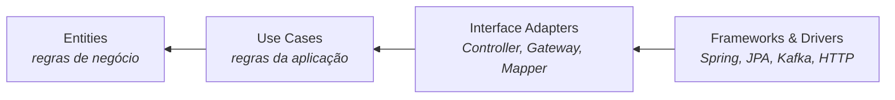
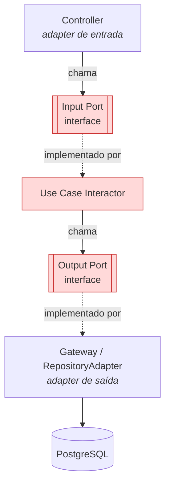
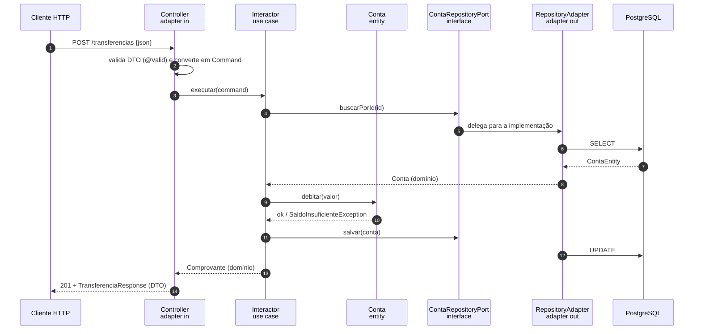

# CLEAN ARCHITECTURE

Abordagem de arquitetura de software proposta por Robert C. Martin (Uncle Bob), que consolida ideias mais antigas — Hexagonal (Ports & Adapters), Onion, DCI, BCE — em um único modelo de círculos concêntricos. **NÃO É UM FRAMEWORK.** É um conjunto de regras sobre **quem pode depender de quem**.

A tese em uma frase: **o que é regra de negócio não pode depender do que é detalhe técnico.** Banco de dados, framework web, mensageria e UI são detalhes — plugáveis, substituíveis e, principalmente, *tardios*. O domínio existe antes e independe deles.

---

## 1. As quatro camadas



Do centro para fora, cada anel é mais concreto e mais volátil que o anterior:

| Camada | Cor no diagrama | O que mora aqui | Volatilidade |
|---|---|---|---|
| **Entities** (Enterprise Business Rules) | amarelo | Regras que valeriam **mesmo sem software**: o que é uma Conta, quando um saldo é inválido, como se calcula juros. Objetos de domínio ricos, value objects, exceções de domínio | quase nula |
| **Use Cases** (Application Business Rules) | vermelho | Regras **desta aplicação**: orquestração do caso de uso "realizar transferência" — buscar conta, debitar, creditar, registrar, notificar. Define os *ports* | baixa |
| **Interface Adapters** | verde | Tradução entre o formato do mundo externo e o formato do domínio: Controllers, Presenters, Gateways/Repository adapters, Mappers, DTOs de entrada e saída | média |
| **Frameworks & Drivers** | azul | Spring, Hibernate, driver do Postgres, cliente Kafka, servidor HTTP, a própria UI. Código que você **não escreve**, só configura | alta |

**Regra prática para saber onde uma classe mora:** pergunte "se eu trocar o banco por outro, ou o REST por gRPC, essa classe muda?". Se muda, ela é adaptador ou framework. Se não muda, é use case ou entidade.

---

## 2. A Regra da Dependência

É o coração do assunto. Se você só levar uma coisa desta matéria, leve essa:

> **As dependências de código apontam sempre para dentro. Nada de um círculo interno pode saber qualquer coisa sobre um círculo externo.**



As setas significam **"depende de" / "conhece"**. Consequências diretas:

- A classe `Conta` **não pode** ter `@Entity`, `@Column` ou `@JsonProperty`. Essas anotações são de JPA e Jackson — detalhes do anel externo.
- O use case **não pode** receber `HttpServletRequest`, `Pageable` do Spring ou uma entidade JPA. Ele fala apenas a língua do domínio.
- Nenhum nome de tabela, coluna, header HTTP ou tópico Kafka aparece no centro.
- O sentido inverso é livre: o Controller pode (e deve) conhecer o use case.

**Como o teste denuncia a violação:** se para testar uma regra de negócio você precisa subir o Spring (`@SpringBootTest`) ou um banco, a regra vazou para fora. Regra de negócio se testa com JUnit puro, em milissegundos.

---

## 3. Fluxo de controle × fluxo de dependência

Essa é a parte que mais confunde — e é o motivo do quadrinho no canto direito do diagrama.

O **fluxo de controle** (quem chama quem, em tempo de execução) vai de fora para dentro e volta:
`Controller → UseCase → Gateway → Banco`.

O **fluxo de dependência** (quem conhece quem, em tempo de compilação) aponta **sempre para dentro**. No trecho `UseCase → Gateway`, o controle vai para fora — o que violaria a regra. A solução é **inverter a dependência**: o use case não chama o gateway, ele chama uma **interface que ele mesmo declara** (o *Output Port*), e o gateway é quem implementa essa interface.



As duas caixas vermelhas de interface (`Input Port` e `Output Port`) **pertencem à camada de use case**, não aos adaptadores. Por isso o gateway, que está fora, aponta para dentro ao implementá-la: a seta de herança vai de fora para dentro, e a regra continua respeitada mesmo com o controle indo para fora.

Isso é literalmente o **"D" do SOLID — Dependency Inversion**: módulo de alto nível (use case) e módulo de baixo nível (repositório) passam ambos a depender da abstração; o detalhe passa a depender da política, e não o contrário. Clean Architecture é, na prática, o DIP aplicado nas fronteiras da aplicação. → [SOLID](../solid/README.md)

---

## 4. Os ports na prática (Java + Spring)

### Entity — regra de negócio pura

```java
// domain/model/Conta.java   ← camada Entities
public class Conta {

    private final ContaId id;
    private BigDecimal saldo;

    public void debitar(BigDecimal valor) {
        if (valor.compareTo(BigDecimal.ZERO) <= 0) {
            throw new ValorInvalidoException(valor);
        }
        if (saldo.compareTo(valor) < 0) {
            throw new SaldoInsuficienteException(id, saldo, valor);   // exceção de domínio
        }
        this.saldo = this.saldo.subtract(valor);
    }

    public void creditar(BigDecimal valor) { /* ... */ }
}
```

Sem `@Entity`, sem `@Table`, sem Spring. Domínio rico: a regra "não pode ficar negativo" vive **dentro** do objeto que ela protege, não espalhada em `if`s no service (isso é o oposto do *anemic domain model*).

### Ports — as fronteiras, declaradas pelo centro

```java
// application/port/in/RealizarTransferenciaUseCase.java   ← INPUT PORT
public interface RealizarTransferenciaUseCase {
    ComprovanteTransferencia executar(TransferenciaCommand comando);
}

// application/port/out/ContaRepositoryPort.java           ← OUTPUT PORT
public interface ContaRepositoryPort {
    Optional<Conta> buscarPorId(ContaId id);
    void salvar(Conta conta);
}

// application/port/out/NotificacaoPort.java               ← OUTPUT PORT
public interface NotificacaoPort {
    void notificarTransferencia(ComprovanteTransferencia comprovante);
}
```

Repare: a assinatura fala `Conta` e `ContaId` — tipos do domínio. Nada de `ContaEntity`, `Page<T>` ou `ResponseEntity`.

### Interactor — o caso de uso

```java
// application/usecase/RealizarTransferenciaService.java
public class RealizarTransferenciaService implements RealizarTransferenciaUseCase {

    private final ContaRepositoryPort contas;      // depende da ABSTRAÇÃO
    private final NotificacaoPort notificacao;

    public RealizarTransferenciaService(ContaRepositoryPort contas, NotificacaoPort notificacao) {
        this.contas = contas;
        this.notificacao = notificacao;
    }

    @Override
    public ComprovanteTransferencia executar(TransferenciaCommand comando) {
        Conta origem  = contas.buscarPorId(comando.origem()).orElseThrow(ContaNaoEncontradaException::new);
        Conta destino = contas.buscarPorId(comando.destino()).orElseThrow(ContaNaoEncontradaException::new);

        origem.debitar(comando.valor());     // a REGRA está na entidade
        destino.creditar(comando.valor());

        contas.salvar(origem);
        contas.salvar(destino);

        var comprovante = ComprovanteTransferencia.de(origem, destino, comando.valor());
        notificacao.notificarTransferencia(comprovante);
        return comprovante;
    }
}
```

### Adapters — as pontas

```java
// adapter/in/web/TransferenciaController.java   ← Interface Adapters
@RestController
@RequestMapping("/transferencias")
class TransferenciaController {

    private final RealizarTransferenciaUseCase useCase;   // conhece o port, não o service

    @PostMapping
    ResponseEntity<TransferenciaResponse> transferir(@RequestBody @Valid TransferenciaRequest request) {
        var comprovante = useCase.executar(request.toCommand());        // DTO → Command
        return ResponseEntity.status(HttpStatus.CREATED)
                             .body(TransferenciaResponse.de(comprovante));  // domínio → DTO
    }
}
```

```java
// adapter/out/persistence/ContaRepositoryAdapter.java
@Component
class ContaRepositoryAdapter implements ContaRepositoryPort {   // implementa o port de dentro

    private final ContaJpaRepository jpa;      // Spring Data — detalhe
    private final ContaMapper mapper;

    @Override
    public Optional<Conta> buscarPorId(ContaId id) {
        return jpa.findById(id.valor()).map(mapper::paraDominio);   // ContaEntity → Conta
    }

    @Override
    public void salvar(Conta conta) {
        jpa.save(mapper.paraEntity(conta));
    }
}
```

```java
// config/BeanConfiguration.java   ← a "cola", no anel mais externo
@Configuration
class BeanConfiguration {

    @Bean
    RealizarTransferenciaUseCase realizarTransferencia(ContaRepositoryPort contas, NotificacaoPort notificacao) {
        return new RealizarTransferenciaService(contas, notificacao);
    }
}
```

> **Trade-off honesto:** muito time anota o interactor com `@Service` e economiza essa classe de configuração. Funciona, e é o que se vê na maioria dos projetos — mas aí o Spring entrou no centro. Puristas mantêm o core sem nenhuma anotação de framework e fazem o wiring na configuração, como acima. Saiba defender as duas posições: a pergunta "seu domínio depende do Spring?" é clássica em prova e em entrevista.

---

## 5. Fluxo completo de uma requisição



Note os **dois pontos de tradução**: o Controller traduz DTO ↔ domínio, e o Adapter traduz entidade JPA ↔ domínio. É exatamente esse trabalho "extra" que mantém o centro limpo.

---

## 6. Estrutura de pastas em Java/Spring

Uma organização comum (por camada, dentro de cada módulo de negócio):

```
src/main/java/com/fiap/banking/
├── domain/                        # ENTITIES — sem framework
│   ├── model/        Conta.java, ContaId.java, Dinheiro.java
│   └── exception/    SaldoInsuficienteException.java
│
├── application/                   # USE CASES
│   ├── port/
│   │   ├── in/       RealizarTransferenciaUseCase.java
│   │   └── out/      ContaRepositoryPort.java, NotificacaoPort.java
│   └── usecase/      RealizarTransferenciaService.java
│
├── adapter/                       # INTERFACE ADAPTERS
│   ├── in/web/       TransferenciaController.java, TransferenciaRequest.java
│   └── out/
│       ├── persistence/  ContaJpaRepository.java, ContaEntity.java, ContaMapper.java
│       └── messaging/    NotificacaoKafkaAdapter.java
│
└── config/                        # FRAMEWORKS & DRIVERS
    └── BeanConfiguration.java
```

Alternativa muito usada: **screaming architecture** — organizar primeiro por feature (`transferencia/`, `pix/`, `cadastro/`) e só dentro dela por camada. O nome das pastas passa a gritar o que o sistema *faz*, não qual framework ele usa. Em monólito modular isso escala melhor.

**Como o Maven/Gradle ajuda:** se cada camada é um módulo, o compilador vira o fiscal da regra de dependência — o módulo `domain` simplesmente não declara `spring-boot-starter-web` no `pom.xml`, e a violação vira erro de compilação em vez de acordo de cavalheiros. Alternativa mais leve: um teste de ArchUnit.

---

## 7. Quem mora onde: entidade, DTO e model

Confusão frequente — são **três** objetos com nomes parecidos:

| Objeto | Camada | Papel | Anotações |
|---|---|---|---|
| `Conta` | Entities | Regra de negócio, comportamento | nenhuma |
| `ContaEntity` | Adapter out (persistência) | Mapeamento objeto-relacional | `@Entity`, `@Column` |
| `TransferenciaRequest` / `Response` | Adapter in (web) | Contrato da API | `@NotNull`, `@JsonProperty` |
| `TransferenciaCommand` | Use case (port in) | Entrada do caso de uso, já validada | nenhuma |

Sim, dá trabalho e gera mappers. O ganho é que **mudar a coluna do banco não muda o contrato da API**, e mudar o JSON não altera a regra de negócio. Em CRUD simples esse custo não se paga — veja a seção 9.

---

## 8. Clean × Hexagonal × Onion

As três resolvem o mesmo problema e têm o mesmo núcleo (DIP nas fronteiras). Diferem no vocabulário e no nível de prescrição:

| | **Hexagonal (Ports & Adapters)** | **Onion** | **Clean** |
|---|---|---|---|
| Autor / ano | Alistair Cockburn, 2005 | Jeffrey Palermo, 2008 | Robert C. Martin, 2012 |
| Metáfora | Hexágono com portas nas laterais | Camadas de cebola | Círculos concêntricos |
| Divide o núcleo? | Não — só "aplicação" e "fora" | Sim: Domain Model → Domain Services → Application Services | Sim: Entities e Use Cases |
| Vocabulário | Port, Adapter, driving/driven | Camadas, Domain Services | Entity, Use Case, Interactor, Boundary, Gateway, Presenter |
| Ênfase | Simetria: UI e banco são igualmente "fora" | O domínio no centro, sem dependência externa | A Regra da Dependência explicitada |

**O que dizer em prova:** são variações da mesma ideia — isolar o domínio e inverter as dependências de infraestrutura. Clean é a mais prescritiva (nomeia papéis e separa Entities de Use Cases); Hexagonal é a mais simples e a mais adotada no dia a dia; Onion está no meio. Não existe conflito entre elas: um projeto "hexagonal" com pastas `port/in` e `port/out` já está seguindo a Regra da Dependência.

---

## 9. O que se ganha e o que se paga

**Ganha:**
- **Testabilidade** — o use case testa com mocks dos ports, sem subir Spring nem banco. → [TESTES EM SOFTWARE](../testes-em-software/README.md)
- **Independência de framework** — migrar de Spring MVC para WebFlux, ou de JPA para JDBC, mexe só no anel externo.
- **Independência de banco e de UI** — trocar Postgres por Mongo é escrever outro adapter.
- **Decisões adiáveis** — dá para começar com repositório em memória e escolher o banco depois.

**Paga:**
- Muito mais classes e mappers para o mesmo comportamento.
- Curva de aprendizado do time; código "indireto" para quem não conhece.
- **Em CRUD puro, não compensa.** Se o caso de uso é `salvar` e `listar` sem regra alguma, a arquitetura só adiciona cerimônia.

Critério: quanto mais **regra de negócio** e mais **vida útil** o sistema tem, mais a Clean se paga. Microsserviço pequeno de leitura, script, MVP descartável → não use.

---

## 10. O que Clean Architecture **NÃO** é

- **Não é framework nem biblioteca.** Não se instala; se decide.
- **Não é estrutura de pastas.** Ter uma pasta `domain/` e importar `ContaEntity` do JPA dentro dela é Clean Architecture nenhuma. A pasta é consequência, não causa.
- **Não obriga 4 camadas.** Uncle Bob diz explicitamente que os círculos são um exemplo; o que é obrigatório é a Regra da Dependência.
- **Não é o mesmo que MVC.** MVC é padrão de apresentação e vive **inteiro** dentro do anel de Interface Adapters.
- **Não é DDD**, embora combinem muito bem: DDD trata de modelagem do domínio (agregados, linguagem ubíqua), Clean trata de dependências.
- **Não elimina o banco.** Só impede que ele dite o formato do domínio.
- **Não é sinônimo de microsserviço.** É arquitetura interna; um monólito pode ser Clean e um microsserviço pode ser uma bola de lama.

### Sinais de que "está Clean" só no nome

- `@Entity` na classe de domínio (o banco definindo o modelo de negócio).
- Use case recebendo `HttpServletRequest`, `Pageable` ou devolvendo `ResponseEntity`.
- `import org.springframework...` dentro de `domain/`.
- Repositório do Spring Data injetado direto no use case, sem port.
- Domínio anêmico: entidades só com getter/setter e toda a regra dentro do "service".
- Teste unitário de regra de negócio que precisa de `@SpringBootTest`.

---

## Perguntas para autoavaliação

1. Por que a Regra da Dependência não é violada quando o use case chama o banco em tempo de execução?
2. Qual princípio do SOLID é o mecanismo que torna a Clean Architecture possível, e como ele aparece no código?
3. Qual a diferença entre Entities e Use Cases, se ambos são "regra de negócio"?
4. Por que `Conta` não pode ter `@Entity`, e qual é o custo prático de manter essa separação?
5. Input Port e Output Port pertencem a qual camada? Quem os declara e quem os implementa?
6. Cite duas diferenças entre Clean Architecture e Hexagonal — e uma coisa que elas têm em comum.
7. Anotar o interactor com `@Service` viola a Clean Architecture? Argumente dos dois lados.
8. Em que situação você **não** usaria Clean Architecture, e por quê?
9. Como um teste automatizado consegue provar que a Regra da Dependência está sendo respeitada?
10. Onde entram DTO, Command e entidade JPA no fluxo de uma requisição POST?

---

**Relacionados:** [SOLID](../solid/README.md) · [DESIGN PATTERNS EM OO](../design-patterns-em-oo/README.md) · [POO](../poo/README.md) · [Spring MVC - APIs RESTful](../spring-mvc-apis-restful/README.md)
