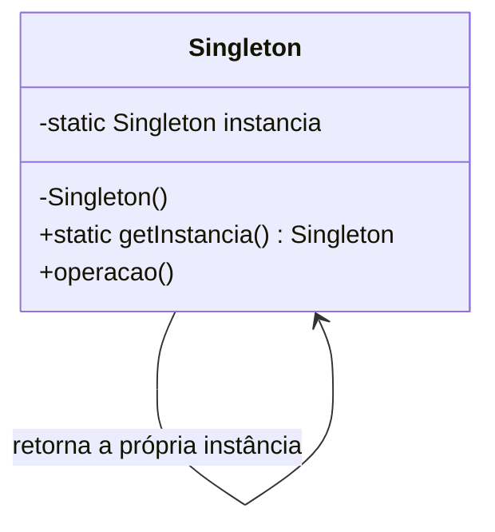
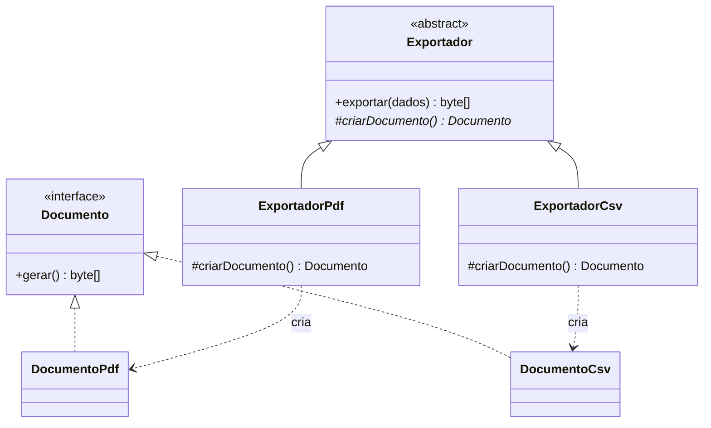
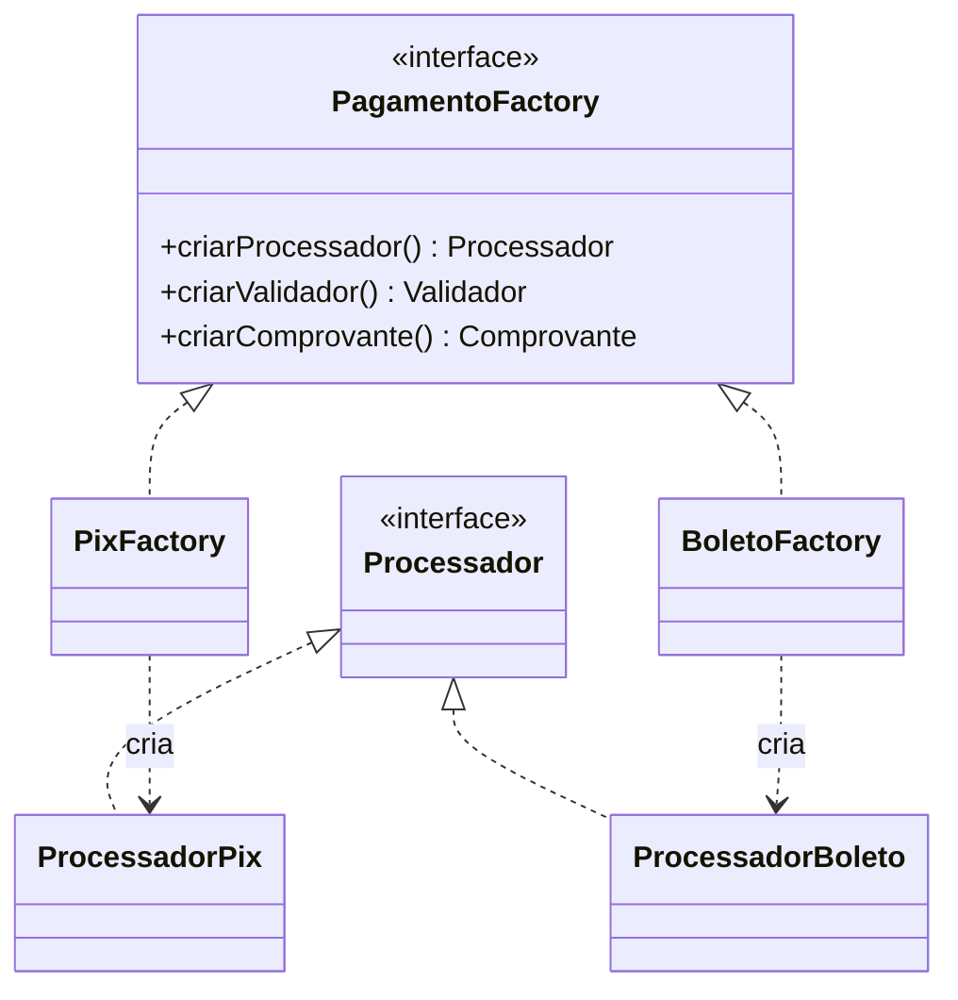

# I - PADRÕES CRIACIONAIS

> [← Voltar para DESIGN PATTERNS](README.md) · Próximo: [II - Estruturais](ii-padroes-estruturais.md)

Os cinco padrões criacionais atacam o mesmo inimigo: o **`new` de uma classe concreta espalhado pelo código**. Cada `new ContaCorrente()` dentro de uma regra de negócio é uma dependência rígida — para trocar a implementação, você precisa caçar e editar todos os pontos. Os criacionais movem essa decisão para um lugar só.

| Padrão | Resolve |
|---|---|
| **Singleton** | garantir uma única instância |
| **Factory Method** | deixar a subclasse decidir a classe concreta |
| **Abstract Factory** | criar famílias de produtos que combinam entre si |
| **Builder** | montar objeto complexo passo a passo |
| **Prototype** | criar copiando um objeto existente |

---

## 1. Singleton

**Problema:** garantir que uma classe tenha **uma única instância** e um ponto de acesso global a ela. Típico para recurso caro e compartilhado: pool de conexões, cache, registro de configuração.



### Implementação — as três formas que importam

```java
// 1) ENUM — a forma recomendada (Effective Java, item 3)
public enum ConfiguracaoBanco {
    INSTANCIA;

    private final Map<String, String> propriedades = carregar();

    public String get(String chave) { return propriedades.get(chave); }
}
// uso: ConfiguracaoBanco.INSTANCIA.get("url");
// a JVM garante instância única: thread-safe, serialização segura e imune a reflection
```

```java
// 2) HOLDER IDIOM — lazy, thread-safe, sem synchronized
public class CacheDeTaxas {

    private CacheDeTaxas() { }

    private static class Holder {                       // só carrega no primeiro acesso
        private static final CacheDeTaxas INSTANCIA = new CacheDeTaxas();
    }

    public static CacheDeTaxas getInstancia() { return Holder.INSTANCIA; }
}
// a JVM garante que o carregamento de classe é thread-safe: zero custo de lock
```

```java
// 3) DOUBLE-CHECKED LOCKING — o clássico de prova; volatile é OBRIGATÓRIO
public class Conexao {

    private static volatile Conexao instancia;          // sem volatile o padrão QUEBRA

    private Conexao() { }

    public static Conexao getInstancia() {
        if (instancia == null) {                        // 1ª checagem: sem lock (rápido)
            synchronized (Conexao.class) {
                if (instancia == null) {                // 2ª checagem: com lock
                    instancia = new Conexao();
                }
            }
        }
        return instancia;
    }
}
```

> **Por que `volatile` é obrigatório?** Sem ele, a JVM pode **reordenar** as instruções de `new`: publicar a referência antes de terminar de construir o objeto. Outra thread veria `instancia != null` e usaria um objeto **parcialmente construído**. `volatile` proíbe a reordenação e garante visibilidade entre threads. É a pergunta clássica sobre Singleton em entrevista.

### Consequências

| ✅ | ❌ |
|---|---|
| Instância única garantida | **Estado global** — acoplamento invisível, qualquer um altera de qualquer lugar |
| Inicialização preguiçosa | Difícil de testar: não dá para substituir por dublê sem gambiarra |
| Economiza recurso caro | Viola SRP (a classe cuida da regra **e** do próprio ciclo de vida) |
| | Problemático com múltiplos class loaders e em cluster (uma instância **por JVM**, não por sistema) |

**Muita gente o considera antipadrão** — e a alternativa é justamente injeção de dependência: o container cria uma instância e a entrega a quem precisa, sem que o consumidor conheça o mecanismo.

> **O "singleton" do Spring não é o do GoF.** O escopo padrão de bean é *uma instância por `ApplicationContext`*, gerenciada pelo container e **injetada**. Não há `getInstancia()` estático, não há estado global, e o teste substitui a bean livremente. Mesmo nome, garantias diferentes: essa distinção cai em prova.

---

## 2. Factory Method

**Problema:** uma classe precisa criar objetos, mas não sabe (nem deve saber) qual classe concreta instanciar. A decisão fica nas subclasses.



```java
public abstract class Exportador {

    // TEMPLATE: o algoritmo é fixo aqui...
    public byte[] exportar(List<Transacao> dados) {
        Documento doc = criarDocumento();          // ...mas a criação é delegada
        doc.cabecalho("Extrato");
        dados.forEach(doc::linha);
        return doc.gerar();
    }

    protected abstract Documento criarDocumento();   // ← o factory method
}

public class ExportadorPdf extends Exportador {
    @Override protected Documento criarDocumento() { return new DocumentoPdf(); }
}

public class ExportadorCsv extends Exportador {
    @Override protected Documento criarDocumento() { return new DocumentoCsv(); }
}
```

**Detalhe conceitual:** o Factory Method do GoF usa **herança** — quem decide é a subclasse. O que o mercado chama de "factory" no dia a dia (um método `static criar(tipo)` com um `switch`) é a **Simple Factory**, que *não* é um padrão do GoF, embora seja útil e muito comum:

```java
// Simple Factory (não é GoF) — centraliza o new, mas viola OCP: cada tipo novo edita o switch
public class ExportadorFactory {
    public static Exportador criar(Formato formato) {
        return switch (formato) {
            case PDF -> new ExportadorPdf();
            case CSV -> new ExportadorCsv();
        };
    }
}
```

**Quando não usar:** se há uma implementação só e nenhuma variação à vista, `new` direto é melhor. Factory Method exige uma hierarquia paralela (criadores × produtos) — é bastante classe para pouco ganho quando não há variação real.

---

## 3. Abstract Factory

**Problema:** criar **famílias de objetos relacionados** garantindo que eles sejam compatíveis entre si, sem que o cliente conheça as classes concretas.

O exemplo do domínio: cada meio de pagamento tem seu processador, seu validador e seu gerador de comprovante — e **não pode** misturar o processador do PIX com o comprovante de boleto.



```java
public interface PagamentoFactory {
    Processador criarProcessador();
    Validador   criarValidador();
    Comprovante criarComprovante();
}

public class PixFactory implements PagamentoFactory {
    public Processador criarProcessador() { return new ProcessadorPix(); }
    public Validador   criarValidador()   { return new ValidadorChavePix(); }
    public Comprovante criarComprovante() { return new ComprovantePix(); }
}

// o cliente só conhece as abstrações — a família inteira é coerente por construção
public class ServicoPagamento {

    private final PagamentoFactory factory;

    public void pagar(Cobranca cobranca) {
        factory.criarValidador().validar(cobranca);
        var recibo = factory.criarProcessador().processar(cobranca);
        factory.criarComprovante().emitir(recibo);
    }
}
```

| Factory Method | Abstract Factory |
|---|---|
| **um** método sobrescrito | **um objeto** com vários métodos de criação |
| cria **um** produto | cria uma **família** consistente |
| varia por herança | varia por composição (troca-se a factory) |

**Custo:** adicionar um **produto novo** à família (um `Notificador`, por exemplo) obriga a alterar a interface e **todas** as factories concretas — violação de OCP nessa direção. Abstract Factory é aberto para novas *famílias*, fechado para novos *produtos*.

---

## 4. Builder

**Problema:** construir um objeto complexo passo a passo, especialmente quando há muitos parâmetros — vários deles opcionais. Resolve o **telescoping constructor** (aquela sequência de construtores sobrecarregados) e o problema do JavaBean (setters deixam o objeto mutável e temporariamente inválido).

```java
// ❌ telescoping constructor: ilegível e fácil de trocar a ordem
new Transferencia("1", "2", valor, null, null, true, false, null);

// ✅ Builder: cada valor é nomeado, opcionais são omitidos, resultado imutável
Transferencia t = Transferencia.builder()
        .origem("1")
        .destino("2")
        .valor(new BigDecimal("200.00"))
        .descricao("aluguel")
        .agendadaPara(LocalDate.of(2026, 2, 5))
        .build();
```

```java
public class Transferencia {

    private final String origem, destino, descricao;
    private final BigDecimal valor;
    private final LocalDate agendadaPara;

    private Transferencia(Builder b) {          // construtor privado: só o builder monta
        this.origem = b.origem;
        this.destino = b.destino;
        this.valor = b.valor;
        this.descricao = b.descricao;
        this.agendadaPara = b.agendadaPara;
    }

    public static Builder builder() { return new Builder(); }

    public static class Builder {
        private String origem, destino, descricao;
        private BigDecimal valor;
        private LocalDate agendadaPara;

        public Builder origem(String origem) { this.origem = origem; return this; }   // fluent
        public Builder destino(String destino) { this.destino = destino; return this; }
        public Builder valor(BigDecimal valor) { this.valor = valor; return this; }
        public Builder descricao(String d) { this.descricao = d; return this; }
        public Builder agendadaPara(LocalDate data) { this.agendadaPara = data; return this; }

        public Transferencia build() {
            Objects.requireNonNull(origem, "origem é obrigatória");    // valida ANTES de construir
            Objects.requireNonNull(valor, "valor é obrigatório");
            if (valor.signum() <= 0) throw new ValorInvalidoException(valor);
            return new Transferencia(this);          // objeto nasce válido e imutável
        }
    }
}
```

**Ganho central que muita gente não percebe:** o objeto **nunca existe em estado inválido**. Com setters, ele passa por estados incompletos; com builder, ou o `build()` devolve um objeto íntegro ou lança.

**Variante do GoF (a original)** é um pouco diferente da fluent API popularizada por Joshua Bloch: no livro, existe um `Director` que orquestra a sequência de construção e um `Builder` abstrato com implementações — útil quando a *mesma* sequência produz representações diferentes (montar o mesmo relatório em PDF e em HTML).

**Onde aparece:** `StringBuilder`, `UriComponentsBuilder`, `Stream.builder()`, `HttpRequest.newBuilder()`, o DSL do `SecurityFilterChain`, e o `@Builder` do Lombok.

**Quando não usar:** poucos campos e todos obrigatórios → construtor ou `record` resolvem melhor. Builder para 3 campos é cerimônia.

---

## 5. Prototype

**Problema:** criar um objeto novo **copiando** um existente, em vez de construir do zero — quando a construção é cara (consulta a banco, cálculo pesado) ou quando o cliente não deve conhecer a classe concreta.

```java
public interface Prototipo<T> {
    T copiar();
}

public class ApoliceTemplate implements Prototipo<ApoliceTemplate> {

    private String produto;
    private List<Clausula> clausulas;          // objeto mutável: cuidado com a cópia

    @Override
    public ApoliceTemplate copiar() {
        ApoliceTemplate copia = new ApoliceTemplate();
        copia.produto = this.produto;                              // imutável: pode compartilhar
        copia.clausulas = this.clausulas.stream()
                                        .map(Clausula::copiar)     // DEEP COPY
                                        .toList();
        return copia;
    }
}
```

> **Shallow copy × deep copy** — a pergunta que sempre aparece. Cópia **rasa** copia as referências: o original e a cópia passam a apontar para os **mesmos** objetos internos, e alterar um afeta o outro. Cópia **profunda** duplica também os objetos aninhados. O `Object.clone()` do Java faz cópia rasa por padrão, e é justamente por isso que `Cloneable` é considerada uma API mal projetada (Bloch dedica um item inteiro do *Effective Java* a evitá-la). Prefira um **construtor de cópia** ou um método `copiar()` explícito.

**Onde aparece:** `Object.clone()`, `ArrayList::clone`, `@Scope("prototype")` do Spring (que, apesar do nome, significa "nova instância a cada injeção" — não é o padrão do GoF).

**Quando usar de verdade:** editores gráficos (duplicar forma), objetos de configuração pesados, e cenários de teste (clonar um cenário base e alterar um campo).

---

## Bônus: Object Pool

Não é GoF, mas aparece em prova junto com os criacionais. Reutiliza instâncias caras em vez de criar e destruir: **pool de conexões** (HikariCP), pool de threads (`ThreadPoolExecutor`). Ganho de performance ao custo de gerenciar ciclo de vida — e do risco clássico de **vazamento**: quem pega do pool precisa devolver, sempre, mesmo em caso de exceção.

---

## Resumo do capítulo

| Padrão | Intenção em uma linha | Sinal de que é ele |
|---|---|---|
| Singleton | uma instância só | "ponto de acesso global" |
| Factory Method | subclasse escolhe o produto | "delegar a criação para a subclasse" |
| Abstract Factory | família consistente de produtos | "não pode misturar produtos de famílias diferentes" |
| Builder | construção passo a passo | "muitos parâmetros, vários opcionais" |
| Prototype | criar copiando | "clonar em vez de instanciar" |

---

## Perguntas para autoavaliação

1. Por que `volatile` é obrigatório no double-checked locking?
2. Qual a forma mais segura de implementar Singleton em Java, e por quê?
3. Em que o "singleton" do Spring difere do Singleton do GoF?
4. Factory Method usa herança ou composição? E Abstract Factory?
5. O que é a Simple Factory e por que ela não está no catálogo GoF?
6. Qual princípio SOLID a Simple Factory viola quando um tipo novo é adicionado?
7. Que dois problemas o Builder resolve, e por que ele produz objetos mais seguros?
8. Diferencie shallow copy de deep copy e explique o risco da primeira.
9. Por que `Cloneable` é considerada uma API mal projetada?
10. Quando **não** vale a pena aplicar um padrão criacional?

---

> [← Voltar para DESIGN PATTERNS](README.md) · Próximo: [II - Estruturais](ii-padroes-estruturais.md)
