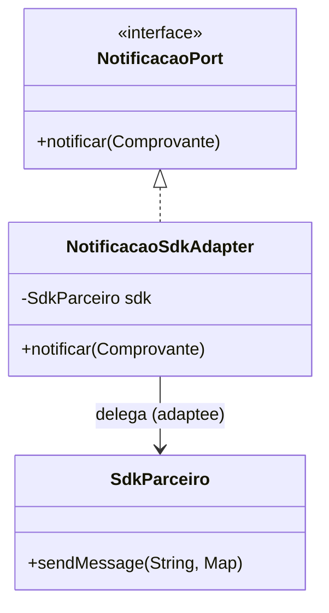
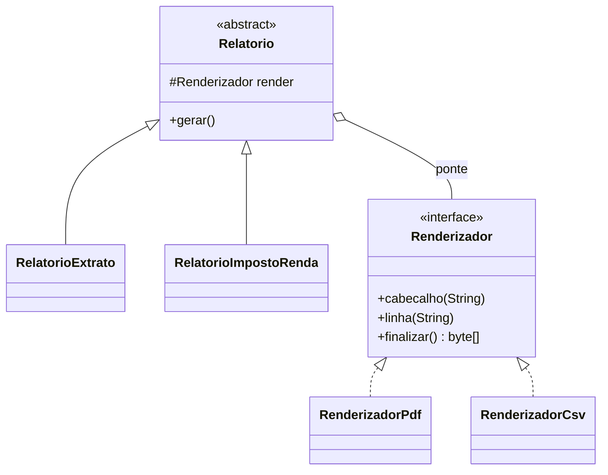
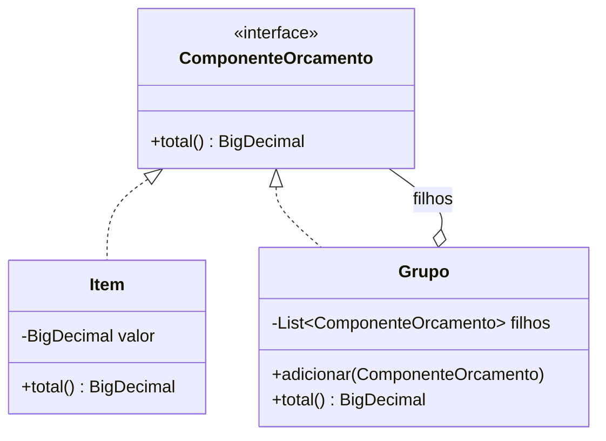
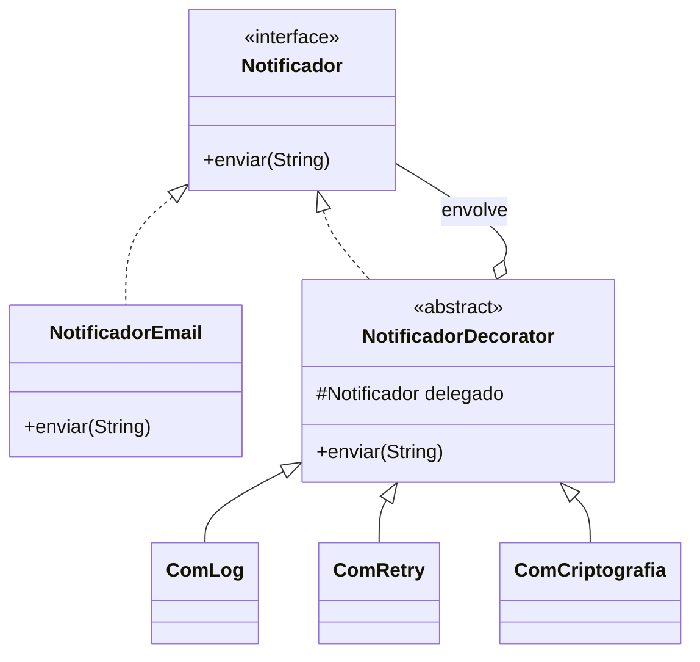
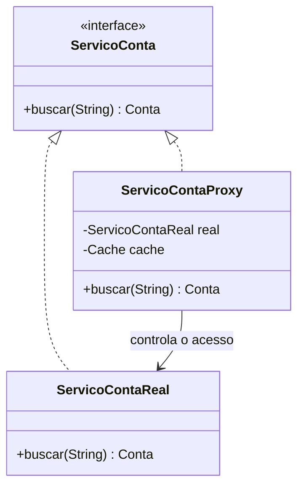

# II - PADRÕES ESTRUTURAIS

> [← Voltar para DESIGN PATTERNS](README.md) · Anterior: [I - Criacionais](i-padroes-criacionais.md) · Próximo: [III - Comportamentais](iii-padroes-comportamentais.md)

Os sete padrões estruturais tratam de **como compor objetos em estruturas maiores** sem criar acoplamento rígido. Quatro deles (Adapter, Decorator, Proxy, Facade) são variações da mesma mecânica — um objeto envolvendo outro — e se distinguem pela **intenção**. Saber separá-los é metade da prova.

| Padrão | Intenção |
|---|---|
| **Adapter** | converter uma interface em outra |
| **Bridge** | separar abstração de implementação |
| **Composite** | tratar folha e árvore uniformemente |
| **Decorator** | acrescentar responsabilidade dinamicamente |
| **Facade** | simplificar o acesso a um subsistema |
| **Flyweight** | compartilhar estado para economizar memória |
| **Proxy** | controlar o acesso a um objeto |

---

## 1. Adapter (Wrapper)

**Problema:** duas interfaces incompatíveis precisam trabalhar juntas. Clássico ao integrar biblioteca de terceiro, sistema legado ou SDK de parceiro, cuja assinatura você não controla.



```java
// o que o SEU domínio espera
public interface NotificacaoPort {
    void notificar(ComprovanteTransferencia comprovante);
}

// o que o SDK do parceiro oferece — assinatura que você não controla
public class SdkParceiro {
    public void sendMessage(String recipient, Map<String, Object> payload) { }
}

// o adaptador traduz um no outro
public class NotificacaoSdkAdapter implements NotificacaoPort {

    private final SdkParceiro sdk;

    @Override
    public void notificar(ComprovanteTransferencia c) {
        sdk.sendMessage(c.emailDestinatario(), Map.of(
                "template", "TRANSFERENCIA_OK",
                "valor", c.valor().toString(),
                "data", c.data().format(ISO_DATE)));
    }
}
```

**Duas variantes:** *object adapter* (por composição, como acima — o normal em Java) e *class adapter* (por herança múltipla, inviável em Java para classes).

**Este é o padrão que dá nome à camada de adapters da [Clean Architecture](../clean-architecture/README.md)**: o `ContaRepositoryAdapter` traduz o port do domínio para a API do Spring Data. É também a resposta para "não mocke o SDK do parceiro" — você mocka o **port**, e o adaptador é validado por teste de integração. → [TESTES EM SOFTWARE](../testes-em-software/ii-test-doubles-e-mockito.md)

**Onde aparece:** `Arrays.asList()` (array → `List`), `InputStreamReader` (byte → char), `HandlerAdapter` do Spring MVC.

---

## 2. Bridge

**Problema:** duas dimensões variam de forma independente e a herança faria o número de classes explodir. Com 3 tipos de relatório × 3 formatos de saída, herança pediria **9** classes; a ponte pede **3 + 3**.



```java
public abstract class Relatorio {

    protected final Renderizador render;          // a PONTE para a outra hierarquia

    protected Relatorio(Renderizador render) { this.render = render; }

    public abstract byte[] gerar(Conta conta);
}

public class RelatorioExtrato extends Relatorio {

    @Override
    public byte[] gerar(Conta conta) {
        render.cabecalho("Extrato da conta " + conta.id());
        conta.transacoes().forEach(t -> render.linha(t.descricao() + " " + t.valor()));
        return render.finalizar();
    }
}

// combina livremente em runtime:
new RelatorioExtrato(new RenderizadorPdf()).gerar(conta);
new RelatorioImpostoRenda(new RenderizadorCsv()).gerar(conta);
```

**Bridge × Strategy:** a estrutura é quase idêntica (composição com uma interface). A diferença é de **escala e intenção**: Strategy troca **um algoritmo**; Bridge separa **duas hierarquias inteiras** que evoluem em paralelo. Bridge é decisão de arquitetura, tomada no início; Strategy é decisão pontual.

**Sinal de que você precisa de Bridge:** nomes de classe com duas dimensões coladas — `RelatorioExtratoPdf`, `RelatorioExtratoCsv`, `RelatorioIRPdf`...

---

## 3. Composite

**Problema:** representar hierarquias parte-todo (árvores) e permitir que o cliente trate **objetos individuais e composições da mesma forma**.



```java
public interface ComponenteOrcamento {
    BigDecimal total();
}

// FOLHA
public record Item(String descricao, BigDecimal valor) implements ComponenteOrcamento {
    @Override public BigDecimal total() { return valor; }
}

// COMPOSTO — tem a mesma interface da folha
public class Grupo implements ComponenteOrcamento {

    private final List<ComponenteOrcamento> filhos = new ArrayList<>();

    public Grupo adicionar(ComponenteOrcamento c) { filhos.add(c); return this; }

    @Override
    public BigDecimal total() {                                  // recursão transparente
        return filhos.stream().map(ComponenteOrcamento::total)
                     .reduce(BigDecimal.ZERO, BigDecimal::add);
    }
}

// o cliente não distingue folha de galho:
ComponenteOrcamento orcamento = new Grupo()
        .adicionar(new Item("taxa de emissão", new BigDecimal("12.90")))
        .adicionar(new Grupo()
                .adicionar(new Item("IOF", new BigDecimal("3.50")))
                .adicionar(new Item("spread", new BigDecimal("8.00"))));

orcamento.total();     // 24.40 — a recursão é invisível
```

**Tensão de projeto do Composite:** métodos como `adicionar`/`remover` fazem sentido no composto, não na folha. Colocá-los na interface comum dá **transparência** (cliente uniforme) ao custo de **segurança** (folha precisa lançar `UnsupportedOperationException`); colocá-los só no composto inverte o trade-off. O GoF prefere transparência; boa parte do mercado prefere segurança.

**Onde aparece:** árvore de componentes de UI, estrutura de arquivos e diretórios, `CompositeCacheManager` do Spring, `Predicate.and()` compondo validações.

---

## 4. Decorator

**Problema:** acrescentar responsabilidades a um objeto **dinamicamente**, sem herança e de forma **empilhável**.



```java
public abstract class NotificadorDecorator implements Notificador {

    protected final Notificador delegado;                 // envolve OUTRO Notificador

    protected NotificadorDecorator(Notificador delegado) { this.delegado = delegado; }
}

public class ComLog extends NotificadorDecorator {
    @Override public void enviar(String msg) {
        log.info("enviando: {}", msg);
        delegado.enviar(msg);                             // antes/depois: o comportamento é somado
        log.info("enviado");
    }
}

public class ComRetry extends NotificadorDecorator {
    @Override public void enviar(String msg) {
        for (int tentativa = 1; tentativa <= 3; tentativa++) {
            try { delegado.enviar(msg); return; }
            catch (FalhaTemporariaException e) { if (tentativa == 3) throw e; }
        }
    }
}

// empilha na ordem que quiser — cada camada é independente
Notificador n = new ComLog(new ComRetry(new ComCriptografia(new NotificadorEmail())));
n.enviar("Transferência concluída");
```

**Por que não herança?** Com herança você precisaria de `NotificadorEmailComLogComRetry`, `NotificadorEmailComRetry`, `NotificadorSmsComLog`... — explosão combinatória fixada em tempo de compilação. O Decorator permite qualquer combinação, **em runtime**, com N classes em vez de 2^N.

**Onde aparece:** o exemplo canônico é `new BufferedReader(new InputStreamReader(new FileInputStream(f)))` — cada camada adiciona uma capacidade. Também `Collections.unmodifiableList()` e `HttpServletRequestWrapper`.

**Custo:** muitos objetos pequenos, pilha de chamadas profunda e depuração mais difícil (a pilha de exceção fica cheia de camadas). Ordem importa: log dentro do retry loga 3 vezes; log fora loga uma.

---

## 5. Facade

**Problema:** um subsistema é complexo, com muitas classes e uma ordem de chamadas obrigatória. A fachada oferece **uma interface simples** para o caso de uso comum.

```java
// o subsistema, verboso e cheio de etapas
public class ContratacaoFacade {

    private final AnaliseCredito analise;
    private final MotorAntifraude antifraude;
    private final GeradorContrato contratos;
    private final AssinaturaDigital assinatura;
    private final Notificador notificador;

    // uma chamada esconde a orquestração inteira
    public Contrato contratar(PropostaEmprestimo proposta) {
        var score = analise.avaliar(proposta.cliente());
        antifraude.validar(proposta, score);
        var contrato = contratos.gerar(proposta, score.taxaAprovada());
        assinatura.solicitar(contrato);
        notificador.enviar(proposta.cliente().email(), contrato.resumo());
        return contrato;
    }
}
```

**Facade × Adapter:** o Adapter **converte** uma interface existente em outra que o cliente espera (a interface alvo já existe e é dada). A Facade **inventa** uma interface nova, mais simples, para um conjunto de classes — ninguém pediu aquela assinatura, ela foi criada para conveniência.

**Ponto importante:** a fachada **não impede** o acesso direto ao subsistema. Quem precisa de controle fino continua podendo usar as classes internas — ela oferece o caminho fácil, não uma prisão.

**Onde aparece:** `JdbcTemplate` (esconde `Connection`, `PreparedStatement`, `ResultSet`, tratamento de exceção e fechamento de recurso), `RestTemplate`, `JmsTemplate`. Na Clean Architecture, o **use case** funciona como fachada da orquestração de domínio.

**Risco:** a fachada virar uma *God Class* de 2.000 linhas que acumula toda a regra do sistema. Ela deve **delegar**, não implementar.

---

## 6. Flyweight

**Problema:** um número enorme de objetos semelhantes consome memória demais. Solução: separar o **estado intrínseco** (compartilhável, imutável) do **estado extrínseco** (que varia e fica com o cliente).

```java
// intrínseco: dados que se repetem em milhões de lançamentos
public record TipoTransacao(String codigo, String descricao, BigDecimal aliquotaIof) { }

public class TipoTransacaoFactory {

    private static final Map<String, TipoTransacao> CACHE = new ConcurrentHashMap<>();

    public static TipoTransacao de(String codigo) {
        return CACHE.computeIfAbsent(codigo, TipoTransacaoFactory::carregar);   // reaproveita
    }
}

// extrínseco: o que muda por lançamento fica FORA do flyweight
public record Lancamento(TipoTransacao tipo, BigDecimal valor, LocalDateTime data) { }
```

**Onde aparece no JDK:** `Integer.valueOf()` mantém cache de `-128..127` — é por isso que `Integer a = 127, b = 127; a == b` é `true`, mas com `128` é `false`. O *string pool* segue a mesma ideia. Essa pegadinha aparece em prova de Java com frequência.

**Quando usar:** raramente em aplicação de negócio; é padrão de biblioteca, editor gráfico, jogo, parser. Em CRUD, quase sempre é otimização prematura. Requisito obrigatório: o estado compartilhado tem que ser **imutável**.

---

## 7. Proxy

**Problema:** controlar o acesso a um objeto — porque criá-lo é caro, porque ele está remoto, porque exige permissão, ou porque você quer registrar/cachear o que passa.



**Os quatro tipos clássicos:**

| Tipo | Para quê | Exemplo |
|---|---|---|
| **Virtual** | adiar criação/carga cara | proxy de coleção `LAZY` do Hibernate |
| **Remoto** | representar objeto em outra JVM/máquina | RMI, stub gRPC |
| **De proteção** | checar permissão antes de delegar | `@PreAuthorize` do Spring Security |
| **Inteligente (smart reference)** | acrescentar cache, contagem, log, transação | `@Cacheable`, `@Transactional` |

```java
public class ServicoContaProxy implements ServicoConta {

    private final ServicoConta real;
    private final Map<String, Conta> cache = new ConcurrentHashMap<>();

    @Override
    public Conta buscar(String id) {
        return cache.computeIfAbsent(id, real::buscar);      // controla o acesso ao real
    }
}
```

### O Proxy é o padrão que explica o Spring


Quando você anota um método com `@Transactional`, `@Cacheable`, `@Async`, `@Retryable` ou `@PreAuthorize`, o container **não injeta a sua classe**: injeta um **proxy** que a envolve (via JDK dynamic proxy quando há interface, ou CGLIB por subclasse quando não há).

> ### ⚠️ A pegadinha da chamada interna
>
> ```java
> @Service
> public class TransferenciaService {
>
>     public void processarLote(List<Comando> comandos) {
>         comandos.forEach(this::transferir);      // ❌ this = objeto REAL, não o proxy
>     }
>
>     @Transactional
>     public void transferir(Comando c) { }        // a anotação NÃO tem efeito aqui
> }
> ```
>
> A chamada via `this` **não passa pelo proxy** — logo, não abre transação. O mesmo vale para `@Cacheable`, `@Async` e `@PreAuthorize`. Soluções: mover o método para outra bean (o correto), injetar a si mesmo (`@Lazy`), ou usar `AopContext.currentProxy()` (gambiarra). Como CGLIB gera uma **subclasse**, método `final`, `private` ou `static` também não é interceptado.
>
> → [SPRING DATA JPA](../spring-data-jpa/README.md) · [SPRING SECURITY](../spring-security/README.md)

**Proxy × Decorator:** a estrutura é a mesma; a intenção não. Decorator **acrescenta** comportamento e é feito para empilhar, com o cliente montando a pilha. Proxy **controla** o acesso, geralmente é único e costuma ser transparente para o cliente (que nem sabe que existe).

---

## Resumo do capítulo

| Padrão | Intenção em uma linha | Sinal de que é ele |
|---|---|---|
| Adapter | converter interface | "as assinaturas não batem" |
| Bridge | duas hierarquias independentes | "explosão de classes com nomes compostos" |
| Composite | árvore tratada uniformemente | "parte-todo, recursão" |
| Decorator | somar comportamento empilhável | "quero log + retry + cache, em qualquer ordem" |
| Facade | simplificar subsistema | "muitas classes para uma tarefa comum" |
| Flyweight | compartilhar estado imutável | "objetos demais, memória de menos" |
| Proxy | controlar acesso | "lazy, permissão, remoto, cache" |

---

## Perguntas para autoavaliação

1. Adapter e Facade envolvem outro objeto. Qual converte e qual simplifica?
2. Como o Decorator evita a explosão combinatória que a herança causaria?
3. Decorator e Proxy têm a mesma estrutura. Como você os distingue numa questão?
4. Qual é o trade-off entre transparência e segurança no Composite?
5. Quando Bridge é preferível a Strategy?
6. Por que `Integer.valueOf(127) == Integer.valueOf(127)` é `true` e com 128 é `false`?
7. Quais são os quatro tipos clássicos de Proxy? Dê um exemplo de cada no Spring.
8. Explique por que `this.metodoTransacional()` não abre transação.
9. Por que um método `final` não é interceptado por proxy CGLIB?
10. Qual padrão estrutural dá nome à camada de adaptadores da Clean Architecture?

---

> [← Voltar para DESIGN PATTERNS](README.md) · Anterior: [I - Criacionais](i-padroes-criacionais.md) · Próximo: [III - Comportamentais](iii-padroes-comportamentais.md)
