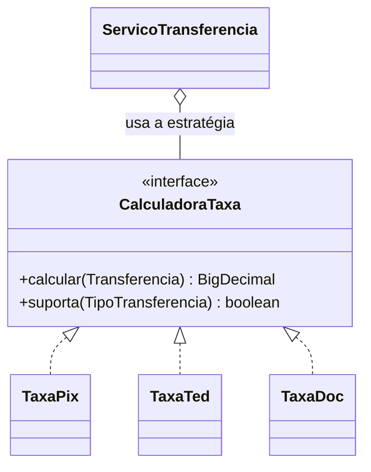
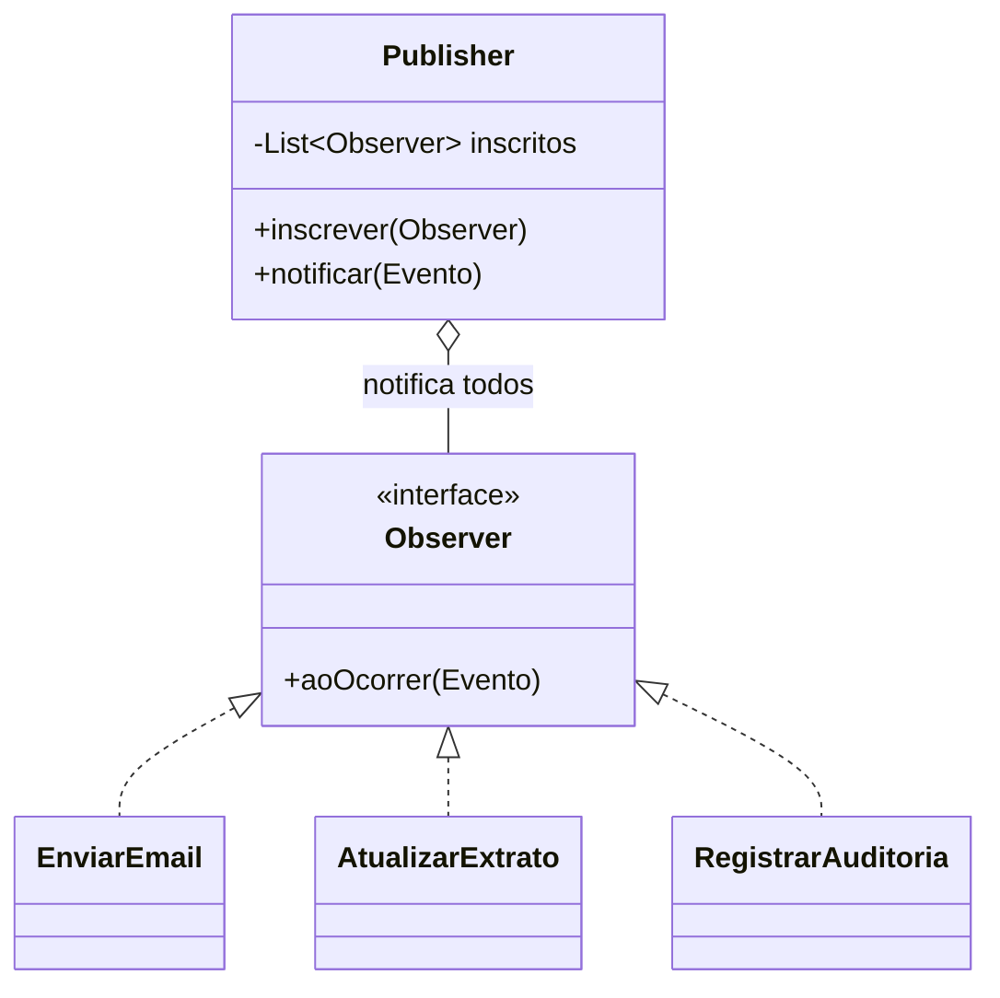
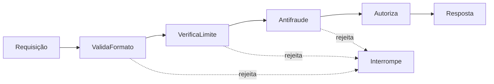

# III - PADRÕES COMPORTAMENTAIS

> [← Voltar para DESIGN PATTERNS](README.md) · Anterior: [II - Estruturais](ii-padroes-estruturais.md)

Os onze padrões comportamentais tratam de **atribuição de responsabilidade e comunicação** entre objetos. São os que mais aparecem no dia a dia com Spring — e os quatro primeiros deste capítulo (Strategy, Observer, Command, Template Method) respondem por boa parte do código de qualquer aplicação bem projetada.

---

## 1. Strategy

**Problema:** existe uma família de algoritmos que fazem a mesma coisa de formas diferentes, e a escolha precisa acontecer em **runtime**. O sintoma clássico é um `switch`/`if-else` que cresce a cada requisito novo.

```java
// ❌ o cheiro: toda taxa nova obriga a editar esta classe (viola OCP)
public BigDecimal calcularTaxa(Transferencia t) {
    if (t.tipo() == PIX)          return BigDecimal.ZERO;
    else if (t.tipo() == TED)     return new BigDecimal("12.90");
    else if (t.tipo() == DOC)     return new BigDecimal("8.50");
    else if (t.tipo() == INTERNA) return BigDecimal.ZERO;
    throw new IllegalArgumentException();
}
```



```java
public interface CalculadoraTaxa {
    boolean suporta(TipoTransferencia tipo);
    BigDecimal calcular(Transferencia transferencia);
}

@Component
public class TaxaTed implements CalculadoraTaxa {
    public boolean suporta(TipoTransferencia t) { return t == TED; }
    public BigDecimal calcular(Transferencia t) { return new BigDecimal("12.90"); }
}

@Service
public class ServicoTransferencia {

    private final List<CalculadoraTaxa> calculadoras;   // o Spring injeta TODAS as implementações

    public BigDecimal taxaDe(Transferencia t) {
        return calculadoras.stream()
                .filter(c -> c.suporta(t.tipo()))
                .findFirst()
                .orElseThrow(() -> new TipoNaoSuportadoException(t.tipo()))
                .calcular(t);
    }
}
```

Agora um tipo novo é **uma classe nova** — nenhum arquivo existente é tocado. Isso é o **OCP** funcionando na prática, e a injeção de `List<Interface>` é o idioma padrão do Spring para Strategy (variante com `Map<String, CalculadoraTaxa>` dá acesso por nome de bean).

**Em Java moderno**, quando a estratégia é uma função pura, ela costuma virar um lambda — `Comparator`, `Function`, `Predicate` são Strategies:

```java
Map<TipoTransferencia, Function<Transferencia, BigDecimal>> taxas = Map.of(
        PIX, t -> BigDecimal.ZERO,
        TED, t -> new BigDecimal("12.90"));
```

**Quando não usar:** duas opções que nunca mudam — um `if` é mais honesto que três arquivos.

---

## 2. State

**Problema:** o objeto precisa mudar de comportamento conforme seu **estado interno**, e o código vira um emaranhado de `if (status == X)` espalhados por vários métodos.

```java
public interface EstadoConta {
    void sacar(Conta conta, BigDecimal valor);
    void depositar(Conta conta, BigDecimal valor);
    EstadoConta bloquear();
}

public class ContaAtiva implements EstadoConta {
    public void sacar(Conta conta, BigDecimal valor) { conta.debitarSaldo(valor); }
    public void depositar(Conta conta, BigDecimal valor) { conta.creditarSaldo(valor); }
    public EstadoConta bloquear() { return new ContaBloqueada(); }        // transição
}

public class ContaBloqueada implements EstadoConta {
    public void sacar(Conta c, BigDecimal v) { throw new ContaBloqueadaException(c.id()); }
    public void depositar(Conta c, BigDecimal v) { c.creditarSaldo(v); }  // depósito continua valendo
    public EstadoConta bloquear() { return this; }
}

public class Conta {
    private EstadoConta estado = new ContaAtiva();

    public void sacar(BigDecimal valor) { estado.sacar(this, valor); }    // delega ao estado
    public void bloquear() { this.estado = estado.bloquear(); }           // o estado decide o próximo
}
```

**Strategy × State — a distinção mais cobrada em prova:**

| | Strategy | State |
|---|---|---|
| Quem escolhe | o **cliente**, de fora | o **próprio objeto**, de dentro |
| As implementações se conhecem? | não, são independentes | **sim** — um estado define qual é o próximo |
| Troca durante a vida do objeto | geralmente não | **sim, é o ponto** |
| Intenção | variar algoritmo | variar comportamento conforme o ciclo de vida |

Estrutura de classes idêntica; **a intenção é o que separa**. Se a questão fala em transição (`PENDENTE → APROVADO → LIQUIDADO`), é State.

---

## 3. Template Method

**Problema:** vários processos compartilham o mesmo **esqueleto**, variando só em alguns passos.

```java
public abstract class ProcessadorPagamento {

    // TEMPLATE METHOD — final para ninguém quebrar o algoritmo
    public final Recibo processar(Cobranca cobranca) {
        validar(cobranca);                              // passo comum
        var autorizacao = autorizar(cobranca);          // varia por subclasse (abstrato)
        registrar(cobranca, autorizacao);               // passo comum
        if (deveNotificar()) notificar(cobranca);       // HOOK: opcional, com default
        return new Recibo(autorizacao);
    }

    protected abstract Autorizacao autorizar(Cobranca cobranca);   // obrigatório

    protected boolean deveNotificar() { return true; }             // hook sobrescrevível

    private void validar(Cobranca c) { }                           // fixo, privado
}

public class ProcessadorPix extends ProcessadorPagamento {
    @Override protected Autorizacao autorizar(Cobranca c) { return bacen.autorizarPix(c); }
}
```

Três tipos de método na estrutura: o **template** (`final`, define a ordem), os **passos abstratos** (a subclasse é obrigada a implementar) e os **hooks** (têm default, a subclasse sobrescreve se quiser).

**Template Method × Strategy:** herança × composição. Template varia **passos** em tempo de compilação, e a subclasse depende da superclasse; Strategy varia o **algoritmo inteiro** em runtime, e as partes são independentes. O GoF prefere Strategy justamente pelo princípio "composição sobre herança" — mas Template Method é mais simples quando a variação é pequena e fechada.

**Onde aparece:** `JdbcTemplate` (esqueleto de "abrir conexão, executar, mapear, fechar" com o mapeamento variando), `AbstractList`, `OncePerRequestFilter.doFilterInternal()`, e todo método `doXxx()` do Spring.

---

## 4. Observer

**Problema:** quando um objeto muda de estado, todos os interessados precisam saber — **sem** que ele conheça quem são.



```java
// no Spring, o padrão é nativo — sem interface Observer explícita
public record TransferenciaRealizada(ContaId origem, ContaId destino, BigDecimal valor) { }

@Service
public class RealizarTransferenciaService {

    private final ApplicationEventPublisher eventos;

    public void executar(TransferenciaCommand comando) {
        // ... regra de negócio ...
        eventos.publishEvent(new TransferenciaRealizada(origem.id(), destino.id(), valor));
    }                                    // não sabe QUEM ouve, e nem quantos são
}

@Component
public class NotificaClienteListener {

    @EventListener
    @Async                                                   // fora da thread principal
    public void aoTransferir(TransferenciaRealizada evento) { }
}

@Component
public class AtualizaExtratoListener {

    @TransactionalEventListener(phase = TransactionPhase.AFTER_COMMIT)   // só se a transação commitou
    public void aoTransferir(TransferenciaRealizada evento) { }
}
```

**Ganho:** desacoplamento total. Um novo interessado é uma classe nova — o publicador não muda (OCP de novo).

**Riscos que valem menção em prova:**
- **Ordem não garantida** entre listeners (use `@Order` se depender disso — mas depender é cheiro).
- **Listener síncrono roda na mesma thread e na mesma transação**: se ele lançar exceção, derruba a operação principal. `@TransactionalEventListener(AFTER_COMMIT)` é a forma de evitar efeito colateral em algo que ainda pode dar rollback.
- **Lapsed listener** — observador que não se desinscreve vira vazamento de memória.
- Fluxo espalhado é mais difícil de depurar: não há chamada explícita para seguir.

**Onde aparece:** `PropertyChangeListener`, `Flow.Subscriber` (base do reativo), `ApplicationListener`/`@EventListener`, e conceitualmente todo pub/sub (Kafka, RabbitMQ).

---

## 5. Command

**Problema:** encapsular uma requisição como **objeto**, permitindo enfileirar, agendar, registrar em log, desfazer e parametrizar o cliente.

```java
public interface Comando {
    void executar();
    void desfazer();
}

public class TransferirComando implements Comando {

    private final ContaRepositoryPort contas;
    private final ContaId origem, destino;
    private final BigDecimal valor;

    @Override public void executar() { transferir(origem, destino, valor); }

    @Override public void desfazer() { transferir(destino, origem, valor); }   // estorno
}

// o INVOCADOR não sabe o que o comando faz
public class FilaDeComandos {

    private final Deque<Comando> executados = new ArrayDeque<>();

    public void submeter(Comando comando) {
        comando.executar();
        executados.push(comando);          // histórico habilita o undo
    }

    public void desfazerUltimo() {
        if (!executados.isEmpty()) executados.pop().desfazer();
    }
}
```

Os quatro papéis do padrão: **Comando** (a interface), **Comando concreto** (a ação + os dados), **Receptor** (quem sabe fazer de verdade) e **Invocador** (quem dispara sem saber o quê).

**Onde aparece:** `Runnable` e `Callable` (o `ExecutorService` é um invocador clássico), `@Scheduled`, botões de UI, e o **command** de CQRS. O `TransferenciaCommand` que aparece nas notas de [Clean Architecture](../clean-architecture/README.md) é primo desse padrão — encapsula a intenção como objeto, ainda que sem `executar()`.

**Ganhos que só o Command dá:** undo/redo, fila persistente (serializar a intenção e executar depois), auditoria (o log é a lista de comandos) e retry.

---

## 6. Chain of Responsibility

**Problema:** passar uma requisição por uma **cadeia** de tratadores, cada um decidindo se trata ou repassa — sem que o emissor saiba quem vai atender.



```java
public abstract class ValidadorTransferencia {

    private ValidadorTransferencia proximo;

    public ValidadorTransferencia encadear(ValidadorTransferencia proximo) {
        this.proximo = proximo;
        return proximo;
    }

    public void validar(Transferencia t) {
        checar(t);                                   // faz a sua parte...
        if (proximo != null) proximo.validar(t);     // ...e repassa
    }

    protected abstract void checar(Transferencia t);
}

public class VerificaLimiteDiario extends ValidadorTransferencia {
    @Override protected void checar(Transferencia t) {
        if (t.valor().compareTo(limiteDiario(t.origem())) > 0)
            throw new LimiteExcedidoException(t.valor());
    }
}

// monta a cadeia
var cadeia = new ValidaFormato();
cadeia.encadear(new VerificaSaldo())
      .encadear(new VerificaLimiteDiario())
      .encadear(new Antifraude());
cadeia.validar(transferencia);
```

**Onde aparece:** `FilterChain` da API Servlet, `SecurityFilterChain` do Spring Security (a cadeia de filtros é *o* exemplo canônico), `HandlerInterceptor`, middlewares em geral, e `Logger` de log4j repassando ao logger pai. → [SPRING SECURITY](../spring-security/README.md) · [Spring MVC](../spring-mvc-apis-restful/iii-spring-mvc-na-pratica.md)

**Duas variantes:** cadeia em que **um** trata e interrompe (a original do GoF) e cadeia em que **todos** processam (pipeline — o caso dos filtros). **Risco:** requisição que percorre a cadeia inteira e ninguém trata; sempre defina o comportamento padrão do fim da cadeia.

---

## 7. Iterator

**Problema:** percorrer os elementos de uma coleção **sem expor sua estrutura interna**, e permitir mais de uma forma de percurso.

```java
// implementado, na prática, só implementando Iterable
public class Extrato implements Iterable<Lancamento> {

    private final List<Lancamento> lancamentos;

    @Override
    public Iterator<Lancamento> iterator() {
        return lancamentos.iterator();           // o cliente não sabe que por dentro é uma List
    }
}

for (Lancamento l : extrato) { }                 // for-each É o Iterator
```

O padrão está tão absorvido pela linguagem que virou sintaxe: `for-each`, `Iterable`, `Stream`. Ponto de prova: **`ConcurrentModificationException`** acontece porque o iterador é *fail-fast* — modificar a coleção durante o percurso invalida o iterador. Para remover durante a iteração, use `iterator.remove()` ou `removeIf()`.

---

## 8. Mediator

**Problema:** muitos objetos se comunicando diretamente formam uma teia (N² conexões). O mediador centraliza a comunicação: cada objeto fala **só com ele**.

```java
public class MesaDeOperacoes {                 // mediador

    private final LivroOfertas livro;
    private final MotorRisco risco;
    private final Liquidacao liquidacao;

    public void aoReceberOrdem(Ordem ordem) {  // coordena — os colegas não se conhecem
        risco.avaliar(ordem);
        var execucao = livro.casar(ordem);
        liquidacao.agendar(execucao);
    }
}
```

**Mediator × Observer:** Mediator é um objeto que **conhece todos** e coordena ativamente (acoplamento centralizado); Observer é notificação um-para-muitos em que o emissor **não conhece ninguém**. Mediator centraliza a lógica de interação; Observer só distribui o aviso.

**Risco:** o mediador virar uma God Class que acumula toda a regra do sistema.

---

## 9. Memento

**Problema:** capturar e restaurar o estado interno de um objeto **sem violar o encapsulamento**.

```java
public class Rascunho {                                   // Originador

    private String conteudo;

    public Snapshot salvar() { return new Snapshot(conteudo); }   // cria o memento
    public void restaurar(Snapshot s) { this.conteudo = s.conteudo(); }

    public record Snapshot(String conteudo) { }           // MEMENTO: estado opaco para fora
}

// Zelador (caretaker): guarda os mementos, mas NÃO os inspeciona
Deque<Rascunho.Snapshot> historico = new ArrayDeque<>();
historico.push(rascunho.salvar());
rascunho.restaurar(historico.pop());
```

Três papéis: **Originador** (o objeto), **Memento** (o snapshot opaco) e **Zelador** (guarda o histórico sem olhar dentro). O ponto do padrão é que só o originador entende o conteúdo do memento — por isso o encapsulamento sobrevive.

**Onde aparece:** undo de editor, checkpoints de jogo, snapshot de estado antes de operação arriscada, e conceitualmente o *rollback* transacional.

---

## 10. Visitor

**Problema:** adicionar operações novas a uma estrutura de objetos **sem alterar as classes** dessa estrutura.

```java
public interface VisitanteLancamento {
    void visitar(Pix pix);
    void visitar(Boleto boleto);
    void visitar(Cartao cartao);
}

public interface Lancamento {
    void aceitar(VisitanteLancamento visitante);        // double dispatch
}

public record Pix(BigDecimal valor) implements Lancamento {
    @Override public void aceitar(VisitanteLancamento v) { v.visitar(this); }
}

// operação NOVA = classe nova; nenhum Lancamento é alterado
public class CalculoIof implements VisitanteLancamento {
    private BigDecimal total = BigDecimal.ZERO;
    public void visitar(Pix p) { }                                       // isento
    public void visitar(Boleto b) { total = total.add(b.valor().multiply(TAXA)); }
    public void visitar(Cartao c) { total = total.add(c.valor().multiply(TAXA_CARTAO)); }
}
```

**Double dispatch:** o método executado depende de **dois** tipos — o do elemento e o do visitante. Java só faz dispatch dinâmico em um tipo, e é por isso que o padrão precisa do `aceitar()`.

**O trade-off (clássico em prova):** Visitor é aberto para **operações novas** e fechado para **tipos novos** — adicionar um `Lancamento` novo obriga a alterar a interface do visitante e todas as implementações. É o oposto do polimorfismo comum, que é aberto para tipos e fechado para operações.

Em Java 21, **sealed interfaces + pattern matching em `switch`** cobrem boa parte dos casos de Visitor com muito menos cerimônia — o compilador garante a exaustividade:

```java
public sealed interface Lancamento permits Pix, Boleto, Cartao { }

BigDecimal iof = switch (lancamento) {
    case Pix p       -> BigDecimal.ZERO;
    case Boleto b    -> b.valor().multiply(TAXA);
    case Cartao c    -> c.valor().multiply(TAXA_CARTAO);
};      // sem default: se um tipo novo entrar no sealed, o compilador acusa
```

---

## 11. Interpreter

**Problema:** dada uma linguagem, definir uma representação para sua gramática e um interpretador que avalia sentenças. É o padrão **menos usado** do catálogo — quem precisa de linguagem hoje usa ANTLR ou uma engine pronta.

```java
public interface Expressao {
    boolean interpretar(Contexto ctx);
}

public record Maior(String campo, BigDecimal valor) implements Expressao {
    public boolean interpretar(Contexto ctx) { return ctx.valorDe(campo).compareTo(valor) > 0; }
}

public record E(Expressao esquerda, Expressao direita) implements Expressao {   // composição
    public boolean interpretar(Contexto ctx) {
        return esquerda.interpretar(ctx) && direita.interpretar(ctx);
    }
}

// "valor > 1000 E pais != BR"  →  árvore de expressões
var regra = new E(new Maior("valor", new BigDecimal("1000")), new Diferente("pais", "BR"));
```

**Onde aparece:** `java.util.regex.Pattern`, EL do Spring (SpEL), `Specification` do Spring Data (`and`/`or` compondo predicados), motores de regra de negócio.

---

## Resumo do capítulo

| Padrão | Intenção em uma linha | Sinal de que é ele |
|---|---|---|
| Strategy | algoritmos intercambiáveis | "switch que cresce a cada requisito" |
| State | comportamento muda com o estado | "transição de status" |
| Template Method | esqueleto fixo, passos variáveis | "mesma sequência, detalhes diferentes" |
| Observer | notificação um-para-muitos | "quando X acontecer, avise os interessados" |
| Command | requisição como objeto | "undo, fila, agendamento, log" |
| Chain of Responsibility | cadeia de tratadores | "passa adiante até alguém tratar" |
| Iterator | percurso sem expor a estrutura | "for-each" |
| Mediator | comunicação centralizada | "todos se conhecem demais" |
| Memento | snapshot sem violar encapsulamento | "salvar e restaurar estado" |
| Visitor | nova operação sem tocar nas classes | "double dispatch" |
| Interpreter | avaliar uma gramática | "expressão como árvore" |

---

## Perguntas para autoavaliação

1. Strategy e State são estruturalmente idênticos. Cite duas diferenças de intenção.
2. Como o Spring implementa Strategy com `List<Interface>`, e qual princípio SOLID isso realiza?
3. Template Method × Strategy: herança ou composição? Qual o GoF prefere e por quê?
4. O que são hooks no Template Method?
5. Por que um listener síncrono pode derrubar a operação principal, e como `@TransactionalEventListener` resolve?
6. Quais são os quatro papéis do padrão Command, e o que ele habilita que uma chamada direta não habilita?
7. Qual é o exemplo canônico de Chain of Responsibility no Spring?
8. Por que `ConcurrentModificationException` acontece, e qual a relação com Iterator?
9. Mediator × Observer: qual centraliza a lógica e qual só distribui o aviso?
10. Por que o Visitor precisa de double dispatch, e como sealed interfaces + pattern matching o substituem?

---

> [← Voltar para DESIGN PATTERNS](README.md) · Anterior: [II - Estruturais](ii-padroes-estruturais.md)
