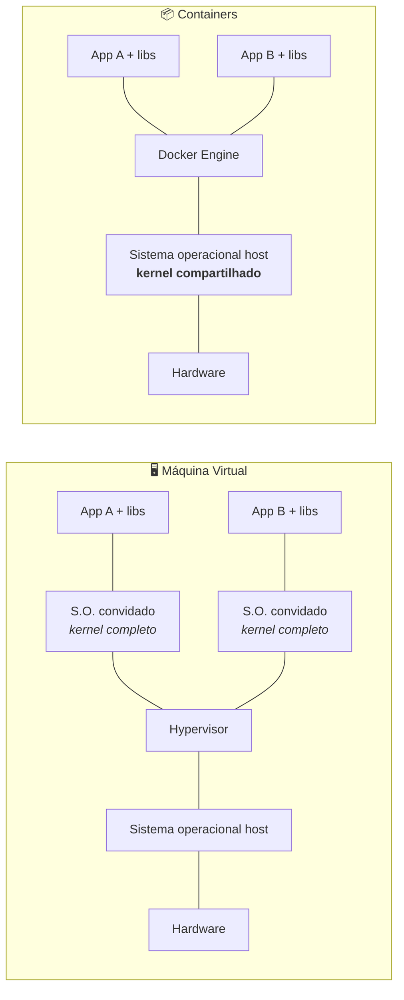
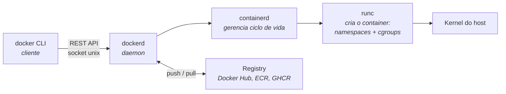
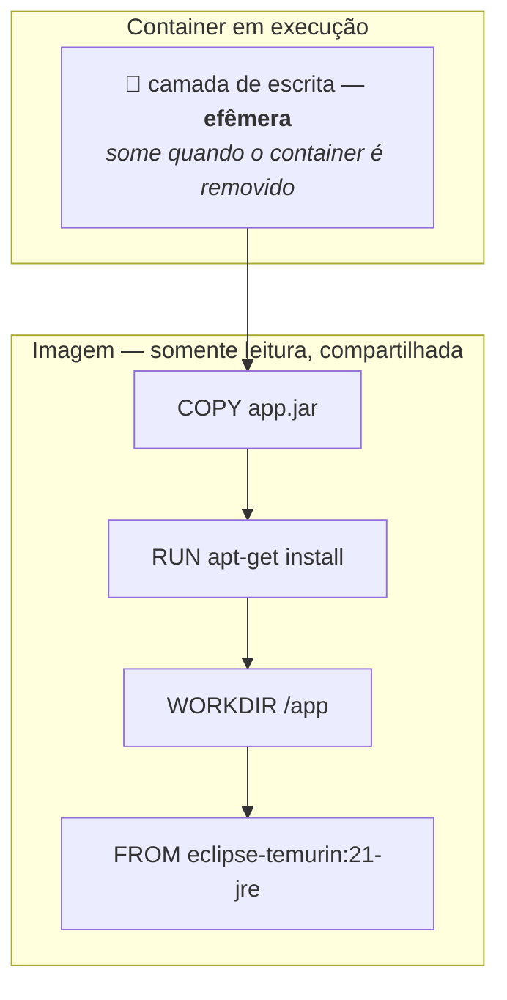
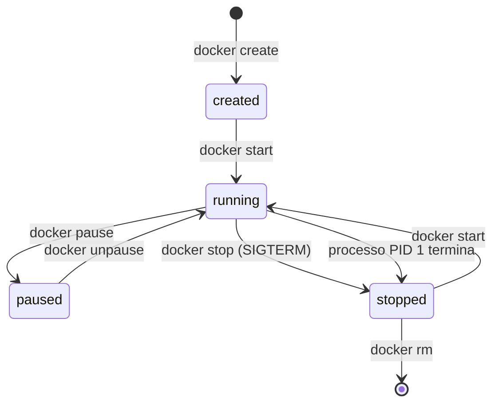

# CAPITULO I - INTRODUÇÃO AO DOCKER

> [← Voltar para DOCKER](README.md) · Próximo: [CAPITULO II - GERENCIAMENTO DE CONTAINERS](capitulo-ii-gerenciamento-de-containers.md)

Docker - motor responsável pelo gerenciamento dos containeres em produção. Criamos varios containeres dentro da nossa máquina assim as aplicações se tornam independentes.

Imagem - Um **arquivo** (snapshot) que contém o sistema operacional mínimo + sua aplicação Java + dependências

| **Conceito** | **Imagem** | **Container** |
| --- | --- | --- |
| **O que é?** | Um **arquivo** (snapshot) que contém o sistema operacional mínimo + sua aplicação Java + dependências. | Um **processo** vivo no seu computador que nasceu a partir daquela imagem. |
| **Estado** | **Imutável.** Você não altera uma imagem; se precisar mudar algo, você gera uma imagem nova. | **Mutável.** Você pode criar arquivos dentro dele enquanto ele estiver rodando (embora eles sumam se você deletar o container). |
| **Relação** | É a "planta" ou o modelo. | É a "casa" construída baseada na planta. |

- **Kernel** - comunicacao entre o hardware e software
- **Cgroup** - limita o uso de cpu, memoria e rede
- **Namespaces** - responsavel por isolar os processos
- **WSL** - windows subsystem for linux

> O problema que o Docker resolve é o **"na minha máquina funciona"**: a imagem carrega a aplicação *e todo o ambiente dela* (bibliotecas, versão da JVM, variáveis, sistema de arquivos). O que roda no seu notebook é **bit a bit** o que roda em produção.

---

## 1. Máquina virtual × Container

A comparação que **sempre cai em prova**:



| | **Máquina Virtual** | **Container** |
|---|---|---|
| Virtualiza | o **hardware** | o **sistema operacional** |
| Kernel | um por VM (S.O. convidado completo) | **compartilhado** com o host |
| Tamanho | GBs | MBs |
| Boot | minutos | **milissegundos** |
| Densidade por host | dezenas | centenas/milhares |
| Isolamento | **forte** (fronteira de hardware) | mais fraco (processos isolados no mesmo kernel) |
| Rodar S.O. diferente | ✅ (Windows sobre Linux) | ❌ só o mesmo kernel |
| Overhead | alto | quase nulo |

**A frase que resume:** container **não é uma VM leve** — é um **processo isolado**. Ele não tem kernel próprio, não faz boot de sistema operacional; o `docker run` inicia um processo comum no kernel do host, com uma visão restrita do mundo.

**Consequências práticas dessa diferença:**
- Container Linux não roda em kernel Windows nativamente — no Windows/macOS o Docker Desktop sobe **uma VM Linux** por baixo (é o papel do WSL 2).
- Isolamento mais fraco significa que **container não é fronteira de segurança forte**: kernel compartilhado quer dizer que uma falha de kernel afeta todos. Para multi-tenancy hostil usa-se VM, gVisor ou Kata Containers.

---

## 2. As três tecnologias do kernel Linux

Container não é mágica nem um "recurso do Docker" — é a combinação de três funcionalidades do kernel:

| Tecnologia | O que faz | Sem ela |
|---|---|---|
| **Namespaces** | **isolamento**: cada container vê só os seus processos, sua rede, seus arquivos, seus usuários | o processo enxergaria toda a máquina |
| **cgroups** (control groups) | **limite de recursos**: quanto de CPU, memória, I/O e rede o container pode usar | um container consumiria a máquina inteira |
| **Union filesystem** (overlay2) | **camadas**: monta várias camadas somente-leitura + uma de escrita como um sistema de arquivos único | cada container copiaria a imagem inteira |

Os principais namespaces: `pid` (processos — por isso a aplicação é o PID 1 dentro do container), `net` (interfaces e portas próprias), `mnt` (pontos de montagem), `uts` (hostname), `ipc` (memória compartilhada) e `user` (mapeamento de UID).

**Isso explica algo importante:** `docker stop` envia `SIGTERM` **ao PID 1**. Se sua aplicação Java não for o PID 1 (por exemplo, se você usa `CMD` em formato shell), ela **não recebe o sinal** e é morta com `SIGKILL` após o timeout — sem *graceful shutdown*, sem terminar as requisições em andamento. → [CAPITULO II](capitulo-ii-gerenciamento-de-containers.md)

---

## 3. Arquitetura do Docker



| Componente | Papel |
|---|---|
| **Docker CLI** | o comando que você digita; fala com o daemon por uma API REST |
| **dockerd** (daemon) | recebe as chamadas, gerencia imagens, redes, volumes e builds |
| **containerd** | runtime de alto nível: ciclo de vida do container, pull de imagem |
| **runc** | runtime de baixo nível: cria de fato o processo com namespaces e cgroups |
| **Registry** | repositório de imagens (Docker Hub, ECR, Harbor, GHCR) |

**Padrões OCI** (*Open Container Initiative*) definem o formato de imagem e o runtime — é por isso que Podman, containerd e Kubernetes rodam a **mesma** imagem que você buildou com Docker. A imagem não é um formato proprietário.

Detalhe de segurança que cai em prova: o daemon roda como **root**. Quem tem acesso ao socket `/var/run/docker.sock` é, na prática, root na máquina (basta montar `/` num container). É o principal argumento a favor do **Podman**, que é *rootless* e *daemonless*.

---

## 4. Imagem em camadas e copy-on-write

Cada instrução do Dockerfile cria uma **camada** somente-leitura. A imagem é a pilha dessas camadas; o container acrescenta no topo uma fina **camada de escrita**.



**Copy-on-write (CoW):** o container lê direto das camadas da imagem. Só quando ele **modifica** um arquivo é que uma cópia sobe para a camada de escrita. Efeitos:

- **Economia brutal de disco:** 50 containers da mesma imagem compartilham as mesmas camadas — só as camadas de escrita são individuais.
- **Escrita é mais lenta** que em volume, porque a primeira alteração copia o arquivo inteiro para cima. Por isso banco de dados **nunca** deve escrever na camada do container. → [CAPITULO IV - VOLUMES](capitulo-iv-volumes.md)
- **Dado no container é efêmero:** removeu o container, sumiu a camada de escrita.

### Por que a ordem das instruções importa

O build usa **cache por camada**: se a instrução e o contexto não mudaram, o Docker reaproveita a camada pronta. Mas a invalidação é **em cascata** — mudou uma camada, **todas as seguintes** são refeitas.

```dockerfile
# ❌ ERRADO — o código muda a cada commit e invalida o download das dependências
COPY . .
RUN mvn dependency:go-offline     # baixa TUDO de novo em cada build

# ✅ CERTO — o que muda pouco vem primeiro
COPY pom.xml .
RUN mvn dependency:go-offline     # camada em cache enquanto o pom não mudar
COPY src ./src                    # só esta camada é refeita a cada commit
RUN mvn package -DskipTests
```

**Regra de ouro:** ordene as instruções da **menos volátil para a mais volátil**. Em projeto Java, isso costuma cortar o tempo de build de minutos para segundos.

---

## 5. Registry, tags e digest

```bash
docker pull eclipse-temurin:21-jre-alpine
#            └── repositório ──┘ └─ tag ─┘

docker tag minha-app:latest ghcr.io/gaalfp/minha-app:1.4.2
docker push ghcr.io/gaalfp/minha-app:1.4.2
```

- **Tag é um ponteiro móvel**, não uma identidade. `postgres:16` de hoje pode ser um binário diferente do de amanhã.
- **Digest** (`postgres@sha256:ab12...`) é o hash imutável do conteúdo — é ele que garante reprodutibilidade real.
- **`latest` não significa "mais recente"** — é apenas a tag usada quando você não especifica nenhuma. Em produção, **sempre fixe a versão** (idealmente por digest).

---

## 6. Ciclo de vida do container



`docker run` = `docker create` + `docker start`. E o ponto mais importante: **o container vive enquanto o processo PID 1 viver.** Se a aplicação termina, o container para — não existe container "vazio ligado". É por isso que a imagem precisa de um processo em primeiro plano (*foreground*): rodar a aplicação em background faz o container subir e morrer imediatamente.

---

## Perguntas para autoavaliação

1. Qual a diferença fundamental entre uma VM e um container em termos do que é virtualizado?
2. Por que um container Linux não roda nativamente no kernel do Windows?
3. Quais são as três tecnologias do kernel que tornam containers possíveis, e o papel de cada uma?
4. Por que a aplicação ser (ou não) o PID 1 afeta o *graceful shutdown*?
5. Descreva a arquitetura Docker CLI → dockerd → containerd → runc.
6. Por que dar acesso ao `docker.sock` equivale a dar root na máquina?
7. Explique copy-on-write e por que banco de dados não deve escrever na camada do container.
8. Por que `COPY pom.xml` antes de `COPY src` acelera o build?
9. Qual a diferença entre tag e digest, e por que `latest` é perigoso em produção?
10. O que faz um container parar sozinho logo depois de subir?

---

> [← Voltar para DOCKER](README.md) · Próximo: [CAPITULO II - GERENCIAMENTO DE CONTAINERS](capitulo-ii-gerenciamento-de-containers.md)
