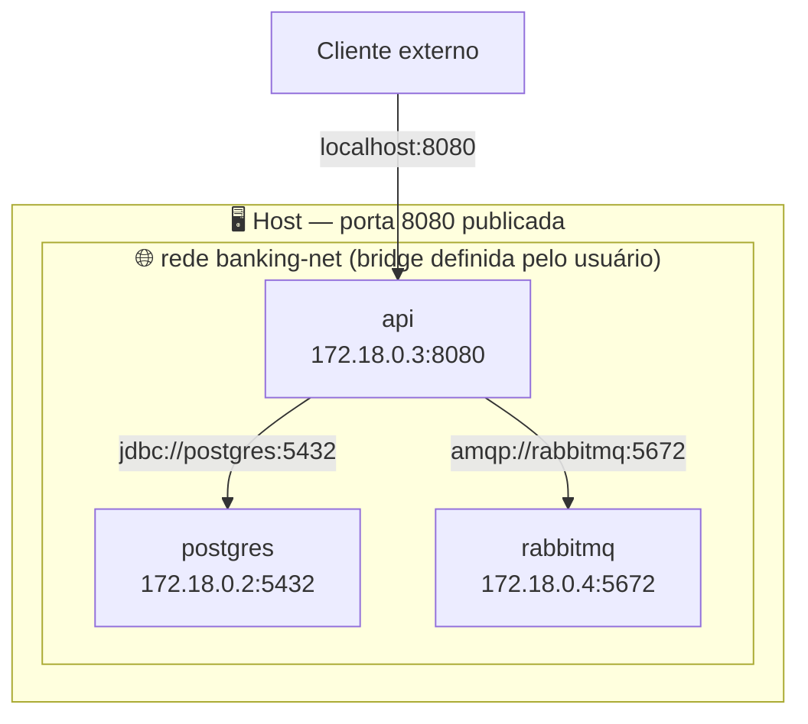

# CAPITULO III - REDES

> [← Voltar para DOCKER](README.md) · Anterior: [CAPITULO II](capitulo-ii-gerenciamento-de-containers.md) · Próximo: [CAPITULO IV - VOLUMES](capitulo-iv-volumes.md)

O driver **bridge** (padrão) cria uma rede virtual isolada e liga o container à máquina por uma ponte — o container ganha IP próprio e precisa publicar porta (`-p`) para ser alcançado de fora;

O **host** faz o container **compartilhar a pilha de rede da própria máquina**: sem isolamento e sem NAT, o que o container abre na 8080 já está na 8080 do host. Ele **tem** acesso à internet normalmente — só funciona em Linux;

O **none** (esse é o nome correto do driver) deixa o container sem nenhuma interface de rede além do loopback — sem contato com o mundo externo, não expõe nada na internet;

docker network → fazer operações de rede com o docker

docker network inspect idDaRede   → inspecionar a rede

docker network create --driver nomedodriveqvcquer nomeqvcquer → criar a rede

docker network connect nomedasuarede iddocontainer → conectar a rede no container

---

## 1. Os drivers de rede

| Driver | O que faz | Quando usar |
|---|---|---|
| **bridge** | rede virtual isolada no host, com NAT | padrão para container em uma máquina só |
| **host** | compartilha a pilha de rede do host, sem isolamento nem NAT | quando cada microssegundo de latência conta, ou para capturar tráfego (só Linux) |
| **none** | sem rede, só loopback | job de processamento que não deve falar com ninguém |
| **overlay** | rede que atravessa **vários hosts** | Swarm/Kubernetes: containers em máquinas diferentes se enxergando |
| **macvlan** | o container ganha **MAC e IP próprios na rede física** | integrar com sistema legado que exige IP real na LAN |

---

## 2. Bridge padrão × bridge criada por você

Diferença que muita gente não conhece e que **muda o comportamento do DNS**:

| | `bridge` (a padrão) | rede criada com `docker network create` |
|---|---|---|
| Resolução por **nome do container** | ❌ **não funciona** | ✅ **funciona** |
| Isolamento entre stacks | todos os containers na mesma rede | uma rede por stack |
| Ligar/desligar container em execução | ❌ | ✅ `network connect/disconnect` |

```bash
docker network create banking-net

docker run -d --name postgres --network banking-net postgres:16
docker run -d --name api      --network banking-net minha-app:1.0
```

Dentro do container `api`, a URL do banco é **`jdbc:postgresql://postgres:5432/banking`** — o nome do container/serviço **é** o hostname. O Docker roda um servidor DNS embutido em `127.0.0.11` que resolve esses nomes para o IP interno.

> **Esse é o "como eles conversam"**: não é mágica nem configuração manual de IP. Em rede definida pelo usuário (ou no Compose, que sempre cria uma), o **DNS interno** resolve nome de container e nome de serviço. E é por isso que `localhost` dentro do container **não** é a sua máquina — é o próprio container.



---

## 3. Publicar porta: `EXPOSE` × `-p`

```bash
docker run -p 8080:8080 minha-app         # host:container — acessível de fora
docker run -p 127.0.0.1:5432:5432 postgres  # publica SÓ no loopback do host
docker run -P minha-app                    # publica todas as portas do EXPOSE em portas aleatórias
```

- **`EXPOSE` no Dockerfile é documentação** — não abre porta nenhuma sozinho.
- **`-p` é o que realmente publica**, criando a regra de NAT no host.
- Containers **na mesma rede** conversam **sem publicar porta**. Publicar a porta do banco (`-p 5432:5432`) em produção é expor o banco à rede da máquina sem necessidade — o `api` já o alcança pela rede interna.

**`host.docker.internal`** resolve o IP do host de dentro do container (Docker Desktop; no Linux, precisa de `--add-host=host.docker.internal:host-gateway`). É como acessar um serviço que roda direto na sua máquina, fora do Docker.

---

## 4. Boas práticas

- **Uma rede por stack de aplicação** — isola e habilita o DNS por nome.
- **Publique só o que precisa ser público**: normalmente apenas a API/gateway. Banco, cache e broker ficam só na rede interna.
- Em Compose, dá para separar `frontend` e `backend` em redes distintas, colocando o banco só na segunda — assim o container do front **não consegue nem tentar** falar com o banco.
- **Não fixe IP** de container; use nomes. O IP muda a cada recriação.
- `docker network prune` remove redes órfãs.

---

## Perguntas para autoavaliação

1. O driver `host` tem acesso à internet? E o `none`?
2. Por que o DNS por nome de container **não** funciona na rede `bridge` padrão?
3. Como a API descobre o IP do Postgres em uma rede definida pelo usuário?
4. Qual a diferença entre `EXPOSE` e `-p`?
5. Dois containers na mesma rede precisam de porta publicada para conversar?
6. O que `localhost` significa dentro de um container?
7. Quando usar `overlay` e quando usar `macvlan`?
8. Como impedir que o container do front alcance o banco?

---

> [← Voltar para DOCKER](README.md) · Anterior: [CAPITULO II](capitulo-ii-gerenciamento-de-containers.md) · Próximo: [CAPITULO IV - VOLUMES](capitulo-iv-volumes.md)
