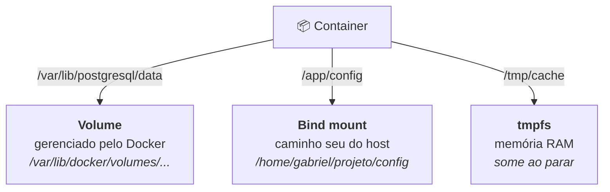

# CAPITULO IV - VOLUMES

> [← Voltar para DOCKER](README.md) · Anterior: [CAPITULO III](capitulo-iii-redes.md) · Próximo: [CAPITULO V - ORQUESTRAÇÃO](capitulo-v-orquestracao-de-containeres.md)

São os discos que o container usa. Para que os dados sobrevivam mesmo que o container seja destruído ou reiniciado.

| **Benefício** | **Descrição** |
| --- | --- |
| **Portabilidade** | Você pode mover esse volume para outro computador e o banco de dados sobe igualzinho. |
| **Segurança** | Se o processo travar e corromper o container, seus arquivos estão salvos fora dele. |
| **Performance** | O Docker gerencia os volumes de forma que a leitura e escrita de dados seja muito mais rápida que dentro da camada do container. |

docker volume create nomeDoVolume → para criar um volume

docker volume rm nomeDoVolume → remover o volume

docker volume inspect → inspecionar o volume

docker volume prune → vai limpar todos os discos que não estão sendo utilizados

> **Por que a performance é melhor:** a camada de escrita do container usa **copy-on-write** — a primeira alteração de um arquivo copia o arquivo inteiro para a camada superior. O volume é montado **direto no sistema de arquivos do host**, sem essa indireção. Para banco de dados, que reescreve blocos o tempo todo, a diferença é enorme. → [CAPITULO I](capitulo-i-introducao-ao-docker.md)

---

## 1. As três formas de persistir

A nota fala de volume, mas existem **três** tipos de montagem — e a distinção cai em prova:



| | **Volume** | **Bind mount** | **tmpfs** |
|---|---|---|---|
| Onde fica | área gerenciada pelo Docker (`/var/lib/docker/volumes`) | qualquer caminho do host | **memória RAM** |
| Gerenciado por | Docker (`docker volume ...`) | você | Docker |
| Portável | ✅ | ❌ depende do caminho existir | — |
| Performance | alta (nativa) | alta no Linux, **ruim** no Docker Desktop (Mac/Windows) | máxima |
| Sobrevive ao container | ✅ | ✅ | ❌ some |
| Uso típico | **dados de banco**, uploads | **código em desenvolvimento** (hot reload), arquivo de config | **segredo em runtime**, cache temporário |
| Risco | — | acopla ao host; container pode alterar arquivo seu | dado se perde ao parar |

```bash
# volume nomeado (produção)
docker run -v dados-postgres:/var/lib/postgresql/data postgres:16

# bind mount (desenvolvimento) — sintaxe -v
docker run -v /home/gabriel/app/src:/app/src minha-app

# sintaxe --mount: mais verbosa, mais explícita (a recomendada hoje)
docker run --mount type=bind,source=/home/gabriel/app/src,target=/app/src,readonly minha-app
docker run --mount type=tmpfs,target=/tmp/secrets,tmpfs-size=64m minha-app
```

**Diferença traiçoeira entre `-v` e `--mount`:** se o caminho de origem de um bind mount **não existir**, o `-v` **cria um diretório vazio** silenciosamente (e sua aplicação sobe sem os arquivos, com erro confuso); o `--mount` **falha na hora**, com mensagem clara. Por isso o `--mount` é preferido.

**Volume nomeado × anônimo:** `-v /var/lib/postgresql/data` (sem nome) cria um volume **anônimo**, com nome de hash, que ninguém encontra depois e vira lixo ocupando disco. Sempre nomeie.

---

## 2. A armadilha das permissões

```dockerfile
USER 10001:10001         # container roda como não-root (boa prática)
```

O volume é montado com o dono do host. Se o diretório pertence ao UID 0 e o processo roda como 10001, a aplicação toma **`Permission denied`** ao escrever. É o erro mais comum ao adotar containers não-root.

Saídas: ajustar o dono no host (`chown -R 10001:10001 ./dados`), usar `--user "$(id -u):$(id -g)"`, ou deixar o `entrypoint` corrigir a permissão na inicialização. Em Kubernetes, isso é o `fsGroup` do `securityContext`.

---

## 3. Backup e restauração

Volume não some com o container, mas **some com `docker volume prune`** — e não existe "lixeira".

```bash
# backup: um container temporário monta o volume e o diretório atual, e gera o tar
docker run --rm \
  -v dados-postgres:/dados \
  -v "$(pwd)":/backup \
  alpine tar czf /backup/backup-$(date +%F).tar.gz -C /dados .

# restauração
docker run --rm -v dados-postgres:/dados -v "$(pwd)":/backup \
  alpine sh -c "cd /dados && tar xzf /backup/backup-2026-09-08.tar.gz"
```

Para banco de dados, o backup **lógico** (`pg_dump`, `mysqldump`) costuma ser preferível ao tar do diretório: o dump é consistente e portável entre versões, enquanto copiar arquivos de um banco em execução pode gerar um snapshot corrompido.

---

## 4. Volumes no Compose

```yaml
services:
  postgres:
    image: postgres:16-alpine
    volumes:
      - dados-postgres:/var/lib/postgresql/data           # volume nomeado
      - ./init.sql:/docker-entrypoint-initdb.d/init.sql:ro  # bind mount somente leitura

volumes:
  dados-postgres:            # declaração no nível raiz
```

O sufixo **`:ro`** monta somente leitura — use sempre que o container não precisar escrever (arquivo de configuração, script de inicialização). É defesa em profundidade barata.

---

## 5. Boas práticas

- **Todo dado que precisa sobreviver vai para volume nomeado.** Nada de banco escrevendo na camada do container.
- **Bind mount é para desenvolvimento** (hot reload, config local). Em produção, evite: acopla o container ao layout do host.
- **`:ro` sempre que possível.**
- **Segredo em `tmpfs`**, nunca em camada de imagem — nem em volume persistente sem necessidade.
- **`docker volume prune` é destrutivo e definitivo.** Confira `docker volume ls` antes.
- Volume **não é replicado** entre hosts: em cluster, isso é papel do storage driver (NFS, EBS, CSI no Kubernetes).

---

## Perguntas para autoavaliação

1. Por que escrever num volume é mais rápido do que na camada do container?
2. Diferencie volume, bind mount e tmpfs, com um caso de uso para cada.
3. Qual a diferença de comportamento entre `-v` e `--mount` quando o caminho de origem não existe?
4. O que é um volume anônimo e por que evitá-lo?
5. Por que um container rodando como não-root pode falhar ao escrever num volume?
6. Como fazer backup de um volume sem parar de usar o Docker?
7. Por que `pg_dump` costuma ser melhor que um tar do diretório de dados?
8. O que o sufixo `:ro` faz e quando usá-lo?

---

> [← Voltar para DOCKER](README.md) · Anterior: [CAPITULO III](capitulo-iii-redes.md) · Próximo: [CAPITULO V - ORQUESTRAÇÃO](capitulo-v-orquestracao-de-containeres.md)
