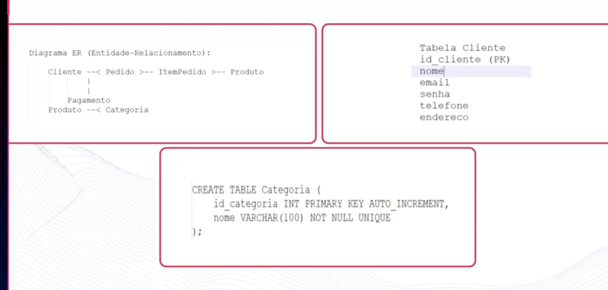
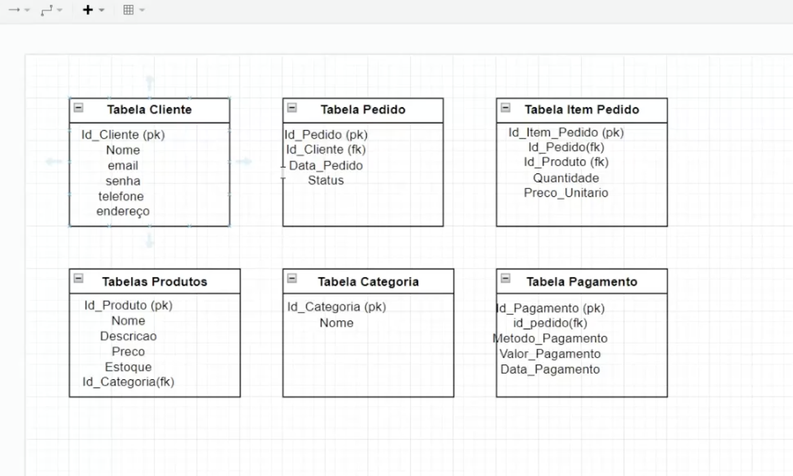

# FUNDAMENTOS DE MODELAGEM DE DADOS

> **Capítulos:** [MODELAGEM RELACIONAL](modelagem-relacional.md) · [VIEWS](views.md) · [ÍNDICE](indice.md) · [PROCEDURES](procedures.md) · [MODELAGEM NÃO RELACIONAL](modelagem-nao-relacional.md) · [BANCO DE DADOS EM GRAFOS](banco-de-dados-em-grafos.md) · [ACID](acid.md)

### **BASIC CONCEPTS:**

Dados são elementos brutos que representam um aspecto da realidade. Matéria prima da informação.

- Metadados representam e caracterizam outros dados documentados.

Banco de dados: coleção de informações correlacionadas.

SGBD: Sistemas de gerenciamento de banco de dados. Permitindo controlar acesso, manipulacoes e questoes fundamentais de um banco de dados. Sao sistemas gerenciadores

Bancos Relacionais: Chaves primárias e estrangeiras, tabelas, integridade referencial, uso de linguagem SQL, propriedades ACID (Atomicidade, Consistencia, Isolamento, Durabilidade), segurança e controles de acesso.

Modelagem de dados: criar uma representacao visual dos sistemas de gerenciamento e coleta de informações de uma organização.

- **Nivel conceitual:** o mais abstrato e independente de tecnologia. Descreve **entidades, atributos e relacionamentos** na linguagem do negócio, sem falar em tabela, tipo de dado ou SGBD. É o modelo que você mostra para o usuário — normalmente um diagrama entidade-relacionamento (DER).
- Nivel logico: A modelagem torna-se mais detalhada definindo tabelas, colunas, tipios de dados, chaves e restricoes
- Nivel fisico: implementacao do nivel logico, discutimos questoes como indexes, colocamos em pratica os campos





| Nível | Responde | Contém | Depende do SGBD? |
|---|---|---|---|
| **Conceitual** | *o que* o negócio precisa guardar | entidades, atributos, relacionamentos, cardinalidade | ❌ |
| **Lógico** | *como* isso vira estrutura | tabelas, colunas, tipos, PK/FK, normalização | parcialmente |
| **Físico** | *como* isso roda | índices, partições, tablespaces, tipos exatos, storage | ✅ totalmente |

---

## Normalização

Normalização de dados: é o processo de organizar os dados em um banco, com o objetivo de torná-lo mais eficiente, sem redundância e com integridade.

- Divisão em tabelas: tabelas menores, com dados pertinentes a um único conceito.
- Atributos atômicos: não podem ser divididos ou modificados, pois estão em sua forma mínima.
- Chave primária: é exclusiva e não pode se repetir.
- Independência de ordens: a ordem de linhas e colunas deve ser independente dos dados.
- Redução de redundância: evita a repetição de dados, economizando espaço e evitando inconsistências.
- Manutenção simplificada: manutenções e atualizações ficam mais simples.
- Escalabilidade: novas tabelas não afetam necessariamente as outras.

### As anomalias que a normalização elimina

Antes das formas normais, entenda **o problema**. Tabela não normalizada:

| pedido_id | cliente | telefone_cliente | produtos | vendedor | regiao_vendedor |
|---|---|---|---|---|---|
| 1 | Ana | 11 9999-1111 | Notebook, Mouse | Bruno | Sudeste |
| 2 | Ana | 11 9999-1111 | Teclado | Bruno | Sudeste |

| Anomalia | O que acontece aqui |
|---|---|
| **de inserção** | não consigo cadastrar um cliente novo sem que ele faça um pedido |
| **de atualização** | Ana mudou de telefone → preciso alterar **todas** as linhas; se esquecer uma, o banco fica inconsistente |
| **de exclusão** | apagando o pedido 2, perco a informação de que Ana existe |

---

## As formas normais

### 1FN — Primeira Forma Normal

> Todos os atributos são **atômicos** (um valor por célula), não há grupos repetitivos e cada linha é única.

```sql
-- ❌ VIOLA 1FN: "produtos" guarda vários valores numa célula
pedido_id | cliente | produtos
1         | Ana     | 'Notebook, Mouse'

-- ✅ 1FN: cada valor em sua própria linha, numa tabela de itens
PEDIDO(pedido_id, cliente)
ITEM_PEDIDO(pedido_id, produto)
   1, 'Notebook'
   1, 'Mouse'
```

Também viola a 1FN a solução preguiçosa de criar colunas `produto_1`, `produto_2`, `produto_3` — isso é um **grupo repetitivo**, e o quarto produto quebra o modelo.

### 2FN — Segunda Forma Normal

> Está na 1FN **e** todo atributo não-chave depende da **chave primária inteira** — não de parte dela. Só faz sentido discutir quando a **PK é composta**.

```sql
-- ❌ VIOLA 2FN: PK = (pedido_id, produto_id)
ITEM_PEDIDO(pedido_id, produto_id, quantidade, nome_produto, preco_produto)
--                                              └── dependem SÓ de produto_id ──┘
--                                                  (dependência PARCIAL)

-- ✅ 2FN
ITEM_PEDIDO(pedido_id, produto_id, quantidade)
PRODUTO(produto_id, nome_produto, preco_produto)
```

O sintoma: o nome do produto se repetia em toda linha de todo pedido — e renomear o produto exigiria atualizar milhares de linhas.

### 3FN — Terceira Forma Normal

> Está na 2FN **e** não há **dependência transitiva**: nenhum atributo não-chave depende de outro atributo não-chave.

```sql
-- ❌ VIOLA 3FN
PEDIDO(pedido_id, data, vendedor_id, nome_vendedor, regiao_vendedor)
--                                    └── dependem de vendedor_id, não de pedido_id ──┘
--     pedido_id → vendedor_id → regiao_vendedor   (transitiva)

-- ✅ 3FN
PEDIDO(pedido_id, data, vendedor_id)
VENDEDOR(vendedor_id, nome_vendedor, regiao_vendedor)
```

**A frase-resumo que se usa em prova:** *"cada atributo depende da chave, da chave inteira e de nada além da chave"* (Bill Kent) — respectivamente 1FN/2FN/3FN. Na prática, **3FN é o alvo padrão** de qualquer modelo OLTP.

### BCNF — Forma Normal de Boyce-Codd

> Versão mais rigorosa da 3FN: para **toda** dependência funcional `X → Y`, `X` precisa ser uma **superchave**.

A 3FN ainda permite um caso patológico: quando existe um atributo não-chave determinando parte de uma chave candidata.

```sql
-- Regra: cada turma tem UM professor; um professor leciona UMA disciplina
TURMA(aluno_id, disciplina, professor_id)
-- chaves candidatas: (aluno_id, disciplina) e (aluno_id, professor_id)
-- dependência problemática: professor_id → disciplina   (professor_id NÃO é superchave)
-- está em 3FN (disciplina é atributo primo), mas VIOLA a BCNF

-- ✅ BCNF: separa a dependência
PROFESSOR(professor_id, disciplina)
MATRICULA(aluno_id, professor_id)
```

**4FN** (elimina dependências multivaloradas independentes) e **5FN** (dependências de junção) existem, mas raramente aparecem fora da teoria.

| Forma | Elimina |
|---|---|
| **1FN** | atributos não atômicos e grupos repetitivos |
| **2FN** | dependência **parcial** da chave composta |
| **3FN** | dependência **transitiva** entre atributos não-chave |
| **BCNF** | determinante que não é superchave |
| 4FN | dependência multivalorada |
| 5FN | dependência de junção |

---

## Quando desnormalizar de propósito

Normalizar otimiza **escrita e integridade**; desnormalizar otimiza **leitura**. O trade-off:

| | Normalizado (3FN) | Desnormalizado |
|---|---|---|
| Redundância | mínima | controlada e intencional |
| Integridade | garantida pelo banco | responsabilidade da aplicação |
| Escrita | rápida (um lugar só) | mais cara (atualiza N lugares) |
| Leitura | exige **JOINs** | dado já está junto |
| Risco | consulta pesada | **dado inconsistente** |

**Casos em que desnormalizar se justifica:**

- **Data warehouse / BI** — o modelo estrela (*star schema*) é deliberadamente desnormalizado: tabela fato + dimensões. OLAP lê muito e escreve pouco.
- **Campo calculado caro** — guardar `total_pedido` em vez de somar os itens a cada consulta.
- **Contador de agregação** — `quantidade_curtidas` na própria linha, em vez de `COUNT(*)` em milhões de registros.
- **Snapshot histórico** — o endereço de entrega **precisa** ser copiado no pedido: se o cliente mudar de endereço, o pedido antigo não pode mudar junto. (Aqui não é nem desnormalização: é um dado diferente que por acaso tem o mesmo valor no momento da compra.)
- **NoSQL** — a agregação é o modelo padrão. → [MODELAGEM NÃO RELACIONAL](modelagem-nao-relacional.md)

**Regra:** normalize primeiro, desnormalize **com medição** e sempre com um mecanismo que mantenha a cópia coerente (trigger, evento, job, materialized view).

---

Modelagem orientada a objetos: Orientada a desenvolvimento de software, representa entidades do mundo real em objetos. os 4 pilares são os mesmos da programação. → [POO](../poo/conceitos-de-poo.md)

> **O descompasso objeto-relacional (*impedance mismatch*):** o modelo de objetos tem herança, referências e navegação por grafo; o relacional tem tabelas, chaves e conjuntos. É essa diferença que o ORM tenta esconder — e é por isso que ele vaza (lazy loading, N+1, estratégias de herança). → [SPRING DATA JPA](../spring-data-jpa/README.md)

---

## Capítulos

- [MODELAGEM RELACIONAL](modelagem-relacional.md) — entidades, cardinalidade, chaves, integridade referencial e JOINs
- [VIEWS](views.md) — tabelas virtuais, tipos e materialized views
- [ÍNDICE](indice.md) — B-Tree, seletividade, índice composto e plano de execução
- [PROCEDURES](procedures.md) — procedure × function × trigger e os dialetos
- [MODELAGEM NÃO RELACIONAL](modelagem-nao-relacional.md) — NoSQL, embedding × referencing e modelagem orientada a query
- [BANCO DE DADOS EM GRAFOS](banco-de-dados-em-grafos.md) — nós, arestas e Cypher
- [ACID](acid.md) — transações, níveis de isolamento e BASE

---

## Perguntas para autoavaliação

1. Quais são os três níveis de modelagem e o que distingue o conceitual do lógico?
2. Cite as três anomalias que a normalização elimina, com um exemplo de cada.
3. O que exige a 1FN, e por que `produto_1, produto_2, produto_3` a viola?
4. Quando faz sentido discutir 2FN? O que é dependência parcial?
5. O que é dependência transitiva? Dê um exemplo de violação da 3FN.
6. Qual a diferença entre 3FN e BCNF?
7. Complete: "cada atributo depende da chave, ______ e ______".
8. Em que situações desnormalizar é a decisão correta?
9. Por que o endereço de entrega deve ser copiado no pedido?
10. O que é o descompasso objeto-relacional?

---

**Relacionados:** [SPRING DATA JPA](../spring-data-jpa/README.md) · [TEOREMA CAP](../teorema-cap/README.md) · [DICAS DE BANCO DE DADOS](../uteis/dicas-de-banco-de-dados.md)
