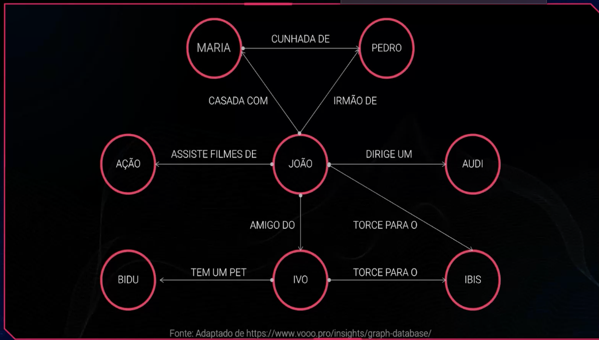

# BANCO DE DADOS EM GRAFOS

Coleção organizada de dados que foca nas **relações** entre diferentes entidades. Utilizando a teoria dos grafos, ele **representa** conexões entre os dados de forma visual e direta. Armazenam informações de uma rede de nós e arestas.



Arestas podem **representar** relações de um para um ou de um para muitos.

Tanto os nós quanto as arestas podem ter propriedades — elas tornam os grafos mais expressivos.

---

## Conceitos Fundamentais

### Nós (Vértices)

Representam as **entidades** do modelo (ex: pessoas, produtos, lugares). Cada nó pode ter um conjunto de propriedades, como `name: "Alice"` ou `age: 30`.

### Arestas (Relacionamentos)

Representam as **conexões** entre nós. São **direcionadas** (possuem origem e destino) e possuem um **tipo** que descreve a natureza da relação (ex: `CONHECE`, `COMPROU`, `MORA_EM`).

### Propriedades

Atributos chave-valor associados tanto a nós quanto a arestas. Permitem armazenar informações adicionais diretamente no relacionamento (ex: `desde: 2020`).

---

## Quando Usar Banco de Dados em Grafos?

- Quando os **relacionamentos entre dados** são tão importantes quanto os próprios dados.
- Consultas que exigem **travessia de múltiplos níveis** de conexão (ex: amigos de amigos).
- Dados altamente conectados e dinâmicos.

---

## Casos de Uso Comuns

- **Redes sociais** → modelagem de amizades, seguidores e interações.
- **Sistemas de recomendação** → "quem comprou X também comprou Y".
- **Detecção de fraudes** → análise de padrões suspeitos em transações.
- **Grafos de conhecimento** → bases de conhecimento semântico (ex: Google Knowledge Graph).
- **Logística e rotas** → otimização de caminhos em mapas e redes de transporte.

---

## Linguagem de Consulta: Cypher

O **Cypher** é a linguagem de consulta mais popular para grafos, utilizada pelo **Neo4j**.

```
// Criar dois nós e um relacionamento
CREATE (a:Pessoa {name: 'Alice'})-[:CONHECE]->(b:Pessoa {name: 'Bob'})

// Buscar todos os amigos de Alice
MATCH (a:Pessoa {name: 'Alice'})-[:CONHECE]->(amigo)
RETURN amigo.name
```

---

## Principais SGBDs de Grafos

- **Neo4j** → o mais popular; utiliza Cypher como linguagem de consulta.
- **Amazon Neptune** → solução gerenciada na nuvem AWS.
- **ArangoDB** → multimodelo (grafos + documentos + chave-valor).
- **JanusGraph** → open source, escalável horizontalmente.

---

## Vantagens

- Alta performance em consultas com **múltiplos níveis de relacionamento**.
- Modelo de dados **intuitivo** e próximo do mundo real.
- Flexível — fácil de adicionar novos tipos de nós e arestas sem alterar o esquema.

## Desvantagens

- Não é ideal para dados **tabulares simples** (prefira SQL nesses casos).
- Menor adoção no mercado comparado a bancos relacionais.
- Ferramentas e profissionais especializados ainda são menos comuns.
