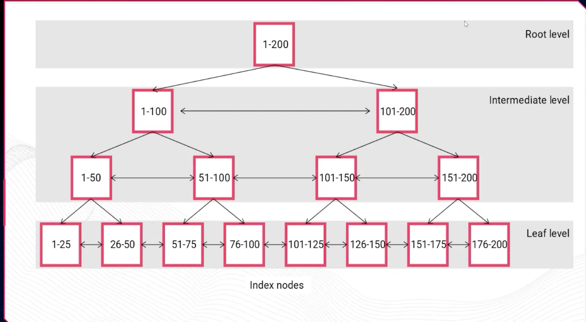

# ÍNDICE

## Índices

São estruturas extras usadas por tabelas para acelerar a velocidade de recuperação de dados. Ao executar um select com um campo de índice, o tempo de consulta é mais rápido. É como um livro mesmo, quando você quer ver uma página específica, você olha o índice. Assim evitamos TABLE SCAN que é varrer toda uma tabela, o que diminui a performance.

Algumas características de uso dos índices são: velocidade da consulta, armazenamento, manutenção, unicidade.

A maioria dos índices são B-TREE: 



**Root Level (Nó Raiz)**

- É o ponto de entrada de qualquer busca
- Contém o nó **1-200**, representando o intervalo total dos dados
- Há apenas **um** nó raiz

**Intermediate Level (Nível Intermediário)**

- Divide o intervalo em partes menores: **1-100** e **101-200**
- As setas horizontais (↔) indicam que os nós são **ligados entre si** (facilitam buscas sequenciais)
- Abaixo, divide ainda mais: **1-50**, **51-100**, **101-150**, **151-200**

**Leaf Level (Nível Folha)**

- É onde os dados reais (ou ponteiros para eles) ficam armazenados
- Intervalos de 25 em 25: 1-25, 26-50, 51-75... até 176-200
- Todos os nós folha são **ligados em sequência** (ótimo para buscas por intervalo)

## Tipos de índices

Simples: vão indexar apenas uma coluna de uma tabela

Compostos: vão indexar múltiplas colunas de uma tabela

Únicos: Garante que todos os valores indexados em uma coluna serão distintos

Clusterizados: armazenam os dados da tabela de acordo com o índice. Uma tabela tem só um índice clusterizado.

Não clusterizados: Armazenam um ponteiro para a tabela presente de acordo com o índice

De textos: Otimizam as consultas por campos que têm muito texto 

## Exemplos

básico:

```sql
CREATE INDEX idx_nome ON clientes(nome)
```

composto:

```sql
CREATE INDEX idx_identificacaocliente ON clientes (nome, telefone, email)
```
