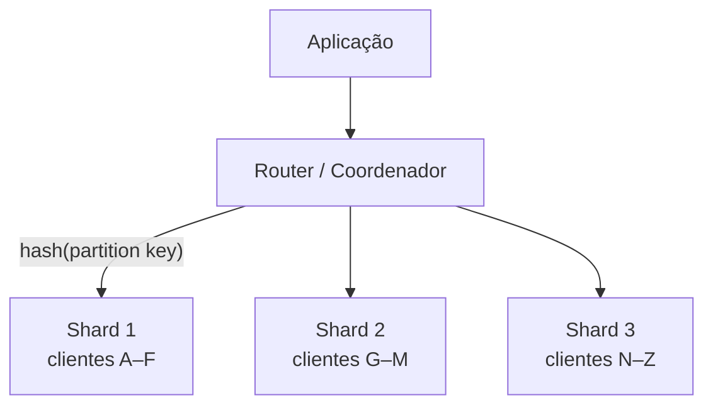

# MODELAGEM NÃO RELACIONAL

> [← Voltar para FUNDAMENTOS DE MODELAGEM DE DADOS](README.md)

**NoSQL** (que significa *Not Only SQL* ou "Não Apenas SQL") é um termo usado para descrever sistemas de bancos de dados **não relacionais**.

Diferente dos bancos de dados tradicionais (como MySQL, Oracle ou PostgreSQL), que organizam as informações em tabelas rígidas com linhas e colunas interligadas, o NoSQL foi criado para armazenar dados de formas variadas, oferecendo muito mais flexibilidade, velocidade e escalabilidade para aplicações modernas.

- maior flexibilidade
- escalabilidade horizontal
- desnormalização e agregação de dados
- schemaless
- alto desempenho

### Principais Tipos de Bancos NoSQL

Como os dados não ficam presos a tabelas, os bancos NoSQL utilizam diferentes modelos de armazenamento dependendo da necessidade:

- **Documentos:** Armazenam dados em formatos semelhantes a JSON (ex: *MongoDB*, *CouchDB*). Ótimos para catálogos de produtos e perfis de usuários.
- **Chave-Valor:** O modelo mais simples, onde cada dado tem uma chave única e um valor associado (ex: *Redis*, *Amazon DynamoDB*). Muito usados para cache de sessões e carrinhos de compras.
- **Colunas Amplas:** Armazenam dados em tabelas, mas agrupados por colunas em vez de linhas, permitindo leituras muito rápidas (ex: *Apache Cassandra*, *HBase*). Ideais para análise de grandes volumes de dados (Big Data).
- **Grafos:** Focados nas relações e conexões entre os dados, como redes de pontos interligados (ex: *Neo4j*). Perfeitos para redes sociais, sistemas de recomendação e detecção de fraudes. → [BANCO DE DADOS EM GRAFOS](banco-de-dados-em-grafos.md)

Modelos de documentos

Json, XML, Bson, dados não estruturados ou semiestruturados.

> **"Schemaless" é meia verdade.** O banco não impõe esquema, mas os dados **têm** estrutura — ela só deixou de ser validada pelo SGBD e passou a ser responsabilidade da **aplicação**. O termo mais honesto é *schema-on-read*: em vez de validar na escrita (*schema-on-write*), você lida com as variações na leitura. O código precisa aguentar documentos de cinco versões diferentes convivendo na mesma coleção.

---

## 1. A inversão fundamental: modelagem orientada a query

É **a** diferença conceitual, e o erro mais comum de quem vem do relacional:

| | Relacional | NoSQL |
|---|---|---|
| Ponto de partida | as **entidades** e seus relacionamentos | as **consultas** que a aplicação vai fazer |
| Objetivo | eliminar redundância (normalizar) | responder a consulta em **um único acesso** |
| Junção | `JOIN` na hora da leitura | dados já **juntos** (agregados) ou junção na aplicação |
| Redundância | defeito | **ferramenta** |
| Mudar a consulta depois | custa pouco (é só outro SQL) | pode custar **remodelar e migrar os dados** |

No relacional você modela primeiro e descobre as consultas depois. No NoSQL é o contrário: **liste os padrões de acesso primeiro**, e desenhe as coleções/tabelas para servi-los. É comum **duplicar o mesmo dado em duas coleções** para atender duas telas diferentes — e isso é o projeto correto, não uma gambiarra.

---

## 2. Embedding × Referencing

A decisão central em banco de documentos:

```javascript
// EMBEDDING — o endereço vive dentro do cliente
{
  "_id": "cli-1",
  "nome": "Ana",
  "enderecos": [
    { "tipo": "RESIDENCIAL", "rua": "Av. Paulista, 1000", "cep": "01310-100" }
  ],
  "ultimosPedidos": [                       // subconjunto útil para a tela de perfil
    { "pedidoId": "ped-9", "total": 250.00, "data": "2026-09-01" }
  ]
}

// REFERENCING — guarda só o id, como uma FK
{ "_id": "ped-9", "clienteId": "cli-1", "total": 250.00 }
```

| Critério | **Embedding** (aninhar) | **Referencing** (referenciar) |
|---|---|---|
| Leitura | **um** acesso traz tudo | exige segunda consulta / `$lookup` |
| Escrita | atualizar o dado repetido em N documentos | atualiza num lugar só |
| Cardinalidade | one-to-few | one-to-many, one-to-squillions |
| Dado compartilhado | ruim (duplica) | bom |
| Crescimento ilimitado | ❌ risco de estourar o limite do documento (16 MB no MongoDB) | ✅ |
| Consistência | atômica dentro do documento | precisa de coordenação |

**Regras práticas** (as *rules of thumb* do MongoDB):

1. **Prefira embedding** — a menos que haja um motivo claro para separar.
2. **Acessa sozinho?** Se o subdocumento é consultado por si só, ele quer ser uma coleção própria.
3. **Cresce sem limite?** (comentários, eventos, log) → referencie. Array ilimitado dentro de documento é anti-padrão.
4. **Muda com frequência e é compartilhado?** → referencie, para não atualizar em mil lugares.
5. **Embedding híbrido:** aninhe uma **cópia parcial** do que a tela precisa (`{ "produtoId": 1, "nome": "Notebook", "preco": 4500 }`) e referencie o resto. É o padrão *extended reference*.

**Snapshot × cópia:** no item do pedido, o nome e o preço do produto **não são redundância** — são o valor **no momento da compra**. Mesmo em banco relacional isso se copia.

**Atomicidade:** no MongoDB, a operação sobre **um documento** é atômica. É o principal argumento a favor de embedding: tudo que precisa mudar junto, no mesmo documento, não precisa de transação. (Transações multi-documento existem desde a versão 4.0, mas custam caro e vão contra o modelo.)

---

## 3. Sharding e partition key

Escalabilidade horizontal é a promessa do NoSQL — e ela depende inteiramente de **como os dados são distribuídos**.



- **Partition key (shard key)** — o campo que decide **em qual nó** o dado mora. É a decisão de projeto mais importante e, em vários bancos, **irreversível**.
- **Sharding por hash** — distribui uniformemente, mas consulta por intervalo tem que perguntar a todos os nós (*scatter-gather*).
- **Sharding por intervalo (range)** — bom para consulta por faixa, mas gera **hot spot** se a chave for sequencial (todo mundo escrevendo no último shard).
- **Chave composta** (Cassandra): *partition key* define o nó; *clustering key* define a **ordem dentro** da partição — é o que permite "as últimas 20 transações desta conta" com uma leitura sequencial.

**Anti-padrões clássicos:** chave de baixa cardinalidade (`status`, `pais`) concentra tudo em poucos shards; chave sequencial (timestamp, id incremental) cria hot spot de escrita; e **partição grande demais** (todos os eventos de um cliente enorme num shard só).

**Replicação** é outra dimensão: cada shard costuma ter réplicas, e o nível de consistência da leitura/escrita (`ONE`, `QUORUM`, `ALL`) é o que sintoniza o trade-off do CAP. → [TEOREMA CAP](../teorema-cap/README.md)

---

## 4. Consistência: BASE em vez de ACID

NoSQL distribuído normalmente troca ACID por **BASE** — *Basically Available, Soft state, Eventual consistency*. A aplicação passa a conviver com:

- **leitura desatualizada** logo após uma escrita (a menos que você peça leitura com quórum);
- **ausência de JOIN e de FK** — integridade referencial é responsabilidade sua;
- **ausência de transação entre documentos/partições** — daí os padrões **Saga**, **Outbox** e **idempotência**.

→ [ACID e BASE](acid.md) · [Spring MVC - Evolução da API](../spring-mvc-apis-restful/iv-evolucao-da-api.md)

---

## 5. Quando usar cada um

| Use **relacional** quando | Use **NoSQL** quando |
|---|---|
| os dados são muito relacionados e as consultas variam bastante | os padrões de acesso são conhecidos e estáveis |
| transação ACID entre entidades é requisito (dinheiro, estoque) | disponibilidade e latência importam mais que consistência imediata |
| integridade referencial precisa ser garantida pelo banco | o volume exige escala horizontal real |
| o modelo é estável e bem definido | o esquema varia por documento ou evolui muito |
| o time e o ferramental são de SQL | o dado é naturalmente agregado (documento) ou é grafo/série temporal |

**Persistência poliglota** é a resposta madura: Postgres para o núcleo transacional, Redis para cache e sessão, Elasticsearch para busca, Cassandra para série temporal, Neo4j para o grafo de relacionamentos. Cada banco onde ele é bom — ao custo de mais operação e mais complexidade.

E vale a ressalva: **o Postgres moderno cobre muito do que se buscava em NoSQL** — `JSONB` com índice GIN, arrays, full-text search e replicação. Para volume médio, "Postgres com JSONB" costuma ser a escolha mais sensata do que adotar um segundo banco.

---

## Perguntas para autoavaliação

1. Por que "schemaless" é uma meia verdade? O que é schema-on-read?
2. Qual a inversão fundamental entre modelagem relacional e NoSQL?
3. Por que duplicar dados entre coleções pode ser o projeto correto em NoSQL?
4. Quando aninhar (embed) e quando referenciar? Cite três critérios.
5. Por que array de crescimento ilimitado dentro de um documento é anti-padrão?
6. Por que a atomicidade por documento favorece o embedding?
7. O que é partition key e por que ela é a decisão mais crítica?
8. Diferencie sharding por hash e por intervalo, com o risco de cada um.
9. O que é hot spot e que tipo de chave o provoca?
10. O que a aplicação precisa assumir ao adotar BASE em vez de ACID?
11. Em que casos o relacional continua sendo a escolha certa?

---

> [← Voltar para FUNDAMENTOS DE MODELAGEM DE DADOS](README.md) · **Relacionados:** [TEOREMA CAP](../teorema-cap/README.md) · [ACID](acid.md) · [BANCO DE DADOS EM GRAFOS](banco-de-dados-em-grafos.md)
