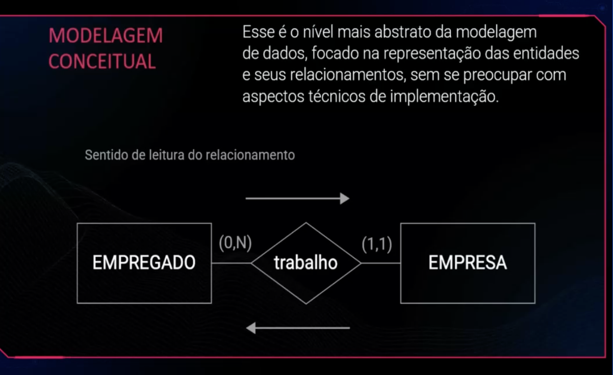
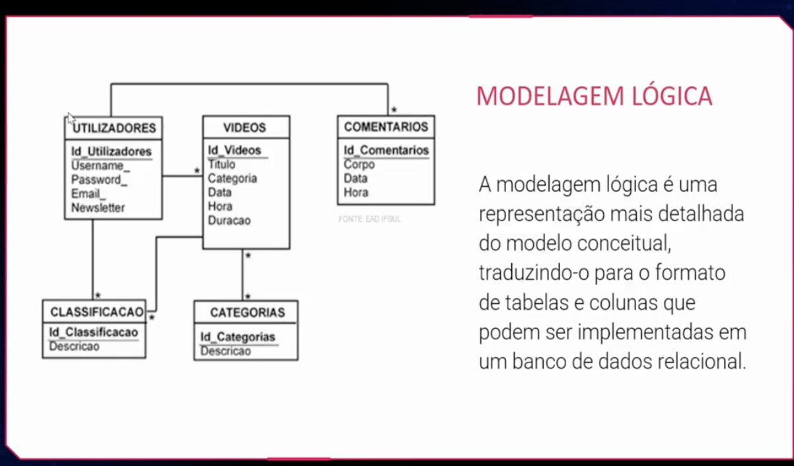
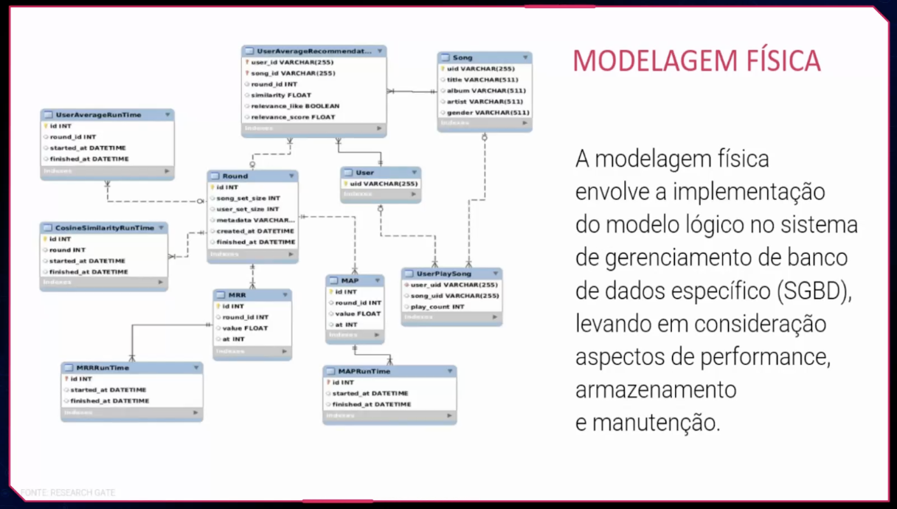
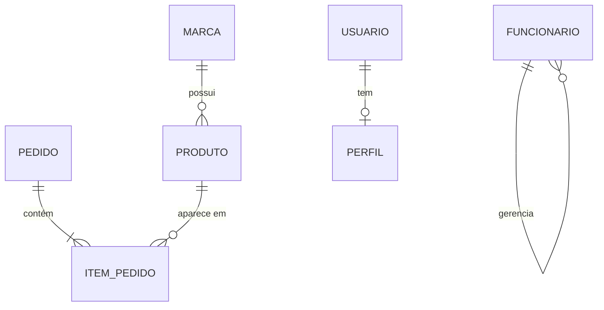
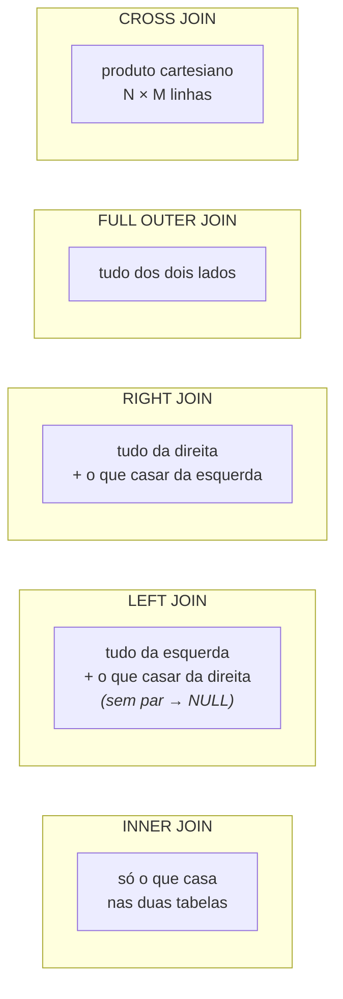

# MODELAGEM RELACIONAL

> [← Voltar para FUNDAMENTOS DE MODELAGEM DE DADOS](README.md)

Representação dos dados através das relações, organização em tabelas, chave primária (identificador único), integridade referencial, eliminação de redundância.

- Domínio: um conjunto de valores que possuem propriedades em comum
- Atributo: uma propriedade da entidade, como nome, cor, tamanho
- Entidade: Um elemento do sistema que possui propriedades que o distinguem
- Tupla: **uma linha** da tabela — o conjunto de *valores* dos atributos que descreve uma instância da entidade. (O conjunto de atributos sem valores é o *esquema* da relação, não a tupla.)

> Vocabulário formal × prático, que às vezes cai na prova: **relação** = tabela, **tupla** = linha, **atributo** = coluna, **grau** = número de colunas, **cardinalidade (da relação)** = número de linhas. O modelo relacional foi proposto por **Edgar F. Codd** (IBM, 1970) e é baseado em teoria de conjuntos.

Tipos de modelagem de dados:

- CONCEITUAL:



- LÓGICA:



- FÍSICA:



Existem formas normais para a aplicação da modelagem:


---

## Tipos de chave

| Chave | O que é |
|---|---|
| **Primária (PK)** | identifica unicamente a linha. Única, não nula, imutável |
| **Candidata** | qualquer atributo (ou conjunto) que **poderia** ser PK. A escolhida vira primária; as demais viram chaves alternativas (`UNIQUE`) |
| **Alternativa** | candidata que não foi escolhida (ex.: CPF, quando o id é um surrogate) |
| **Composta** | PK formada por **duas ou mais** colunas (típica de tabela associativa) |
| **Estrangeira (FK)** | referencia a PK de outra tabela; é o que materializa o relacionamento |
| **Natural** | tem significado no negócio: CPF, ISBN, placa |
| **Surrogate (artificial)** | sem significado: `SERIAL`, `IDENTITY`, `UUID` |

**Natural × surrogate — discussão clássica:**

| | Natural | Surrogate |
|---|---|---|
| Legibilidade | ✅ a chave já diz algo | ❌ `id = 8471` não diz nada |
| Estabilidade | ❌ CPF pode ser digitado errado e precisar correção; regras de negócio mudam | ✅ nunca muda |
| Tamanho / performance como FK | pode ser grande (string) | pequeno e uniforme |
| Exposição | ❌ vazar CPF na URL é problema de privacidade | ✅ (mas id sequencial permite enumeração — use UUID em API pública) |

A prática dominante é **surrogate como PK** + `UNIQUE` na chave natural, que continua garantindo a regra de negócio.

---

## RELACIONAMENTOS:

Formas em que as tabelas se relacionam entre si.

**Um para um (1:1):** para cada registro de uma tabela existe **no máximo um** registro relacionado na outra. Ex: `USUARIO` e `PERFIL_DETALHADO`, ou `FUNCIONARIO` e `CRACHA`.

Um para muitos: para um registro de uma tabela podem existir vários registros relacionados em outra tabela. Ex: uma tabela de marca - produto, uma marca pode ter N produtos.

Muitos para muitos: Ocorre quando um ou mais registros estao associados a um ou mais registros de outra tabela. Ex: tabela aluna - professor, N alunos podem ter N professores relacionados.

### Como cada cardinalidade vira tabela

**1:1 — a FK fica no lado opcional, com `UNIQUE`:**

```sql
CREATE TABLE usuario (
    usuario_id BIGSERIAL PRIMARY KEY,
    email      VARCHAR(255) NOT NULL UNIQUE
);

CREATE TABLE perfil (
    perfil_id  BIGSERIAL PRIMARY KEY,
    usuario_id BIGINT NOT NULL UNIQUE REFERENCES usuario(usuario_id),  -- UNIQUE = o que faz ser 1:1
    bio        TEXT
);
```

Sem o `UNIQUE`, isso seria 1:N. **É o `UNIQUE` na FK que transforma 1:N em 1:1** — pergunta frequente em prova.

*Quando usar 1:1 em vez de juntar tudo numa tabela?* Quando os dados têm ciclo de vida ou sensibilidade diferentes (dados de KYC separados do cadastro básico), quando um lado é opcional e esparso, ou para separar colunas muito grandes (BLOB) que raramente são lidas.

**1:N — a FK fica sempre no lado "muitos":**

```sql
CREATE TABLE marca (
    marca_id BIGSERIAL PRIMARY KEY,
    nome     VARCHAR(120) NOT NULL
);

CREATE TABLE produto (
    produto_id BIGSERIAL PRIMARY KEY,
    marca_id   BIGINT NOT NULL REFERENCES marca(marca_id),   -- FK no lado N
    nome       VARCHAR(120) NOT NULL
);
```

Colocar a FK no lado "um" exigiria repetir a linha da marca para cada produto — é o erro clássico.

**N:N — nasce uma tabela associativa (de junção):**

```sql
CREATE TABLE aluno_professor (
    aluno_id     BIGINT REFERENCES aluno(aluno_id),
    professor_id BIGINT REFERENCES professor(professor_id),
    data_inicio  DATE NOT NULL,                       -- atributo DO relacionamento
    PRIMARY KEY (aluno_id, professor_id)              -- PK composta
);
```

O SGBD relacional **não implementa N:N diretamente** — sempre vira duas relações 1:N com uma tabela no meio. E repare: o relacionamento pode ter **atributos próprios** (`data_inicio`, `nota`, `quantidade`) — é aí que a tabela associativa deixa de ser "técnica" e vira uma entidade de negócio (`MATRICULA`, `ITEM_PEDIDO`).

**Auto-relacionamento:** a FK aponta para a própria tabela — `funcionario.gerente_id → funcionario.funcionario_id`, hierarquia de categorias, estrutura de árvore.

### Cardinalidade e participação (notação Crow's Foot)

A notação pé-de-galinha é a mais usada em DER. Cada ponta da linha carrega **duas** informações:

| Símbolo | Significado |
|---|---|
| `||` (traço duplo) | exatamente **um** |
| `|○` (traço + círculo) | **zero ou um** (opcional) |
| `<` (pé de galinha) | **muitos** |
| `○<` | **zero ou muitos** (opcional) |
| `|<` | **um ou muitos** (obrigatório) |

O **círculo (○) representa participação opcional** e o **traço (|), obrigatória**. Isso vira `NULL`/`NOT NULL` na FK:

- `PEDIDO |○——|< ITEM`: um pedido tem **um ou mais** itens; um item pertence a **exatamente um** pedido.
- Participação **obrigatória** do lado do pedido → `item.pedido_id NOT NULL`.
- Participação **opcional** → FK aceita `NULL` (ex.: um pedido pode não ter vendedor associado).



---

## Integridade referencial

A FK garante que **não existe filho órfão**: você não consegue inserir um produto com `marca_id` inexistente, nem apagar uma marca que tem produtos — a menos que diga ao banco o que fazer.

```sql
ALTER TABLE produto
  ADD CONSTRAINT fk_produto_marca FOREIGN KEY (marca_id) REFERENCES marca(marca_id)
  ON DELETE RESTRICT
  ON UPDATE CASCADE;
```

| Ação | O que faz ao apagar/alterar o pai |
|---|---|
| **`RESTRICT`** | **impede** a operação se houver filhos (verifica imediatamente) |
| **`NO ACTION`** | igual ao RESTRICT, mas a checagem pode ser adiada para o fim da transação (*deferrable*) — é o padrão do SQL |
| **`CASCADE`** | propaga: apagar a marca apaga **todos** os produtos dela |
| **`SET NULL`** | zera a FK nos filhos (exige coluna anulável) |
| **`SET DEFAULT`** | põe o valor default na FK dos filhos |

> **`ON DELETE CASCADE` é perigoso** e cai em prova como pegadinha: um `DELETE` numa linha pode disparar uma cascata silenciosa que apaga milhares de registros em tabelas que você nem lembrava que existiam. Use em relacionamento de **composição real** (item de pedido morre com o pedido); prefira `RESTRICT` no resto, ou **soft delete** (`deleted_at`) quando a informação precisa ser preservada por auditoria.

**Outras restrições de integridade:**

| Restrição | Garante |
|---|---|
| `PRIMARY KEY` | unicidade + não nulo (integridade de **entidade**) |
| `FOREIGN KEY` | integridade **referencial** |
| `UNIQUE` | não repete (aceita um `NULL` na maioria dos SGBDs) |
| `NOT NULL` | valor obrigatório |
| `CHECK` | regra de **domínio**: `CHECK (saldo >= 0)`, `CHECK (status IN ('ATIVA','BLOQUEADA'))` |
| `DEFAULT` | valor padrão |

Deixar essas regras **no banco** é defesa em profundidade: a aplicação pode ter bug, mas o dado inválido não entra. → [ACID](acid.md)

---

## Álgebra relacional

A base teórica do SQL. As operações fundamentais:

| Operação | Símbolo | SQL | O que faz |
|---|---|---|---|
| **Seleção** | σ (sigma) | `WHERE` | filtra **linhas** |
| **Projeção** | π (pi) | `SELECT col1, col2` | escolhe **colunas** |
| **Produto cartesiano** | × | `CROSS JOIN` | combina todas as linhas com todas |
| **Junção** | ⋈ | `JOIN ... ON` | produto cartesiano + seleção |
| **União** | ∪ | `UNION` | linhas de A ou de B (elimina duplicatas) |
| **Interseção** | ∩ | `INTERSECT` | linhas presentes em A **e** B |
| **Diferença** | − | `EXCEPT` / `MINUS` | linhas de A que não estão em B |
| **Renomeação** | ρ (rho) | `AS` | dá outro nome à relação/atributo |

`π nome, preco (σ preco > 100 (PRODUTO))` é o mesmo que `SELECT nome, preco FROM produto WHERE preco > 100`.

Ponto conceitual: **SQL é declarativo** — você descreve *o que* quer, e o otimizador decide *como* buscar (qual índice, qual ordem de junção, qual algoritmo). A álgebra relacional é a linguagem em que ele raciocina. → [ÍNDICE](indice.md)

---

## Tipos de JOIN



```sql
-- INNER: só marcas que TÊM produto
SELECT m.nome, p.nome FROM marca m INNER JOIN produto p ON p.marca_id = m.marca_id;

-- LEFT: TODAS as marcas, mesmo as sem produto (colunas de produto vêm NULL)
SELECT m.nome, p.nome FROM marca m LEFT JOIN produto p ON p.marca_id = m.marca_id;

-- ANTI-JOIN: marcas SEM nenhum produto — o truque do LEFT JOIN + IS NULL
SELECT m.nome FROM marca m
LEFT JOIN produto p ON p.marca_id = m.marca_id
WHERE p.produto_id IS NULL;

-- SELF JOIN: funcionário e seu gerente, na mesma tabela
SELECT f.nome AS funcionario, g.nome AS gerente
FROM funcionario f LEFT JOIN funcionario g ON f.gerente_id = g.funcionario_id;

-- CROSS JOIN: todas as combinações (útil para gerar grades/calendários)
SELECT t.nome, m.mes FROM time t CROSS JOIN meses m;
```

> ### ⚠️ A pegadinha do `LEFT JOIN` com filtro no `WHERE`
>
> ```sql
> -- Isso NÃO é mais um LEFT JOIN: o WHERE descarta as linhas com NULL,
> -- e o resultado vira um INNER JOIN silencioso
> SELECT m.nome, p.nome FROM marca m
> LEFT JOIN produto p ON p.marca_id = m.marca_id
> WHERE p.preco > 100;
>
> -- ✅ o filtro da tabela opcional vai no ON
> SELECT m.nome, p.nome FROM marca m
> LEFT JOIN produto p ON p.marca_id = m.marca_id AND p.preco > 100;
> ```
>
> **`ON` filtra antes da junção; `WHERE` filtra depois.** Para `INNER JOIN` dá no mesmo; para `OUTER JOIN`, muda tudo.

Outros detalhes que caem: `CROSS JOIN` acidental (esquecer o `ON`) gera N×M linhas e derruba a consulta; `NATURAL JOIN` junta por colunas de mesmo nome automaticamente e é **perigoso** (uma coluna nova com nome coincidente muda o resultado sem aviso) — evite.

---

## Perguntas para autoavaliação

1. Traduza: relação, tupla, atributo, grau e cardinalidade.
2. O que transforma um relacionamento 1:N em 1:1 no modelo físico?
3. Em que lado fica a FK num relacionamento 1:N? Por quê?
4. Como um N:N é implementado, e o que indica que a tabela associativa é uma entidade de negócio?
5. Diferencie chave candidata, alternativa, natural e surrogate.
6. Na notação Crow's Foot, o que o círculo representa, e como isso vira DDL?
7. Compare `RESTRICT`, `CASCADE` e `SET NULL`, e diga quando cada um é apropriado.
8. Por que `ON DELETE CASCADE` é considerado perigoso?
9. Escreva em álgebra relacional: nome e preço dos produtos acima de 100.
10. Qual a diferença entre filtrar no `ON` e no `WHERE` num `LEFT JOIN`?
11. Como listar as marcas que não têm nenhum produto?

---

> [← Voltar para FUNDAMENTOS DE MODELAGEM DE DADOS](README.md) · **Relacionados:** [ÍNDICE](indice.md) · [ACID](acid.md) · [SPRING DATA JPA](../spring-data-jpa/README.md)
