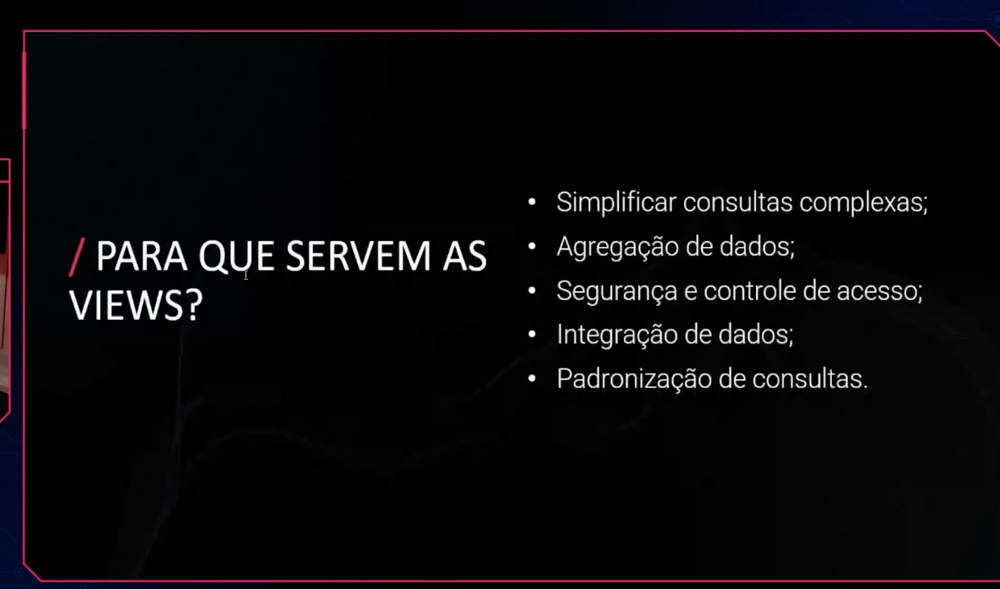

# VIEWS

Uma **view** (ou visão) é uma tabela virtual baseada no resultado de uma consulta SQL. Ela não armazena dados fisicamente — apenas salva a definição da query e exibe os dados dinamicamente quando consultada.

Pense nela como um "atalho nomeado" para uma consulta complexa: você define a lógica uma vez e pode consultá-la como se fosse uma tabela comum.



**Principais características:**

- Simplificação de consultas complexas
- Segurança (ocultando colunas ou linhas sensíveis)
- Reutilização de lógica
- Abstração da estrutura real das tabelas
- Não armazena dados (exceto Materialized Views)
- Sempre reflete os dados atuais das tabelas base
- Pode ser consultada com SELECT normalmente

**Para que servem:** Simplificar consultas, restringir acesso a dados, criar camadas de abstração sobre o modelo físico.

**Tipos de Views**

- **Simples:** Baseadas em uma única tabela, sem funções de agregação — geralmente permitem INSERT, UPDATE e DELETE
- **Complexas:** Envolvem JOINs, subqueries ou agregações — geralmente somente leitura
- **Inline Views:** Subquery usada diretamente no FROM de outra query (não tem nome persistente)
- **Materialized Views:** Armazenam fisicamente o resultado da query no disco; precisam ser atualizadas manualmente ou automaticamente (disponível em alguns SGBDs como PostgreSQL e Oracle)

**Exemplo — Criando uma view:**

```sql
CREATE VIEW VW_ClientesAtivos AS
SELECT ClienteId, Nome, Email
FROM Clientes
WHERE Status = 'Ativo';
```

**Consultando a view:**

```sql
SELECT * FROM VW_ClientesAtivos;
```

**Exemplo com JOIN:**

```sql
CREATE VIEW VW_PedidosDetalhados AS
SELECT p.PedidoId, c.Nome AS Cliente, p.DataPedido, p.Total
FROM Pedidos p
INNER JOIN Clientes c ON p.ClienteId = c.ClienteId;
```

**Atualizando uma view:**

```sql
CREATE OR REPLACE VIEW VW_ClientesAtivos AS
SELECT ClienteId, Nome, Email, Telefone
FROM Clientes
WHERE Status = 'Ativo';
```

**Excluindo uma view:**

```sql
DROP VIEW VW_ClientesAtivos;
```

**Views vs Tabelas**

| Característica | Tabela | View |
| --- | --- | --- |
| Armazena dados | ✅ Sim | ❌ Não (exceto Materialized) |
| Atualização automática | Manual | ✅ Sempre atual |
| Permite INSERT/UPDATE | ✅ Sim | Depende do tipo |
| Ocupa espaço em disco | ✅ Sim | ❌ Não (exceto Materialized) |

VIEWS VS PROCEDURES

A view é uma tabela virtual, já a procedure executa alguma ação

|  | View | Procedure |
| --- | --- | --- |
| É como se fosse... | Uma **planilha filtrada** | Uma **macro / script** |
| Você usa pra... | **Ver** dados | **Fazer** algo |
| Retorna... | Linhas e colunas | Pode retornar nada, ou resultados variados |
| Aceita parâmetros? | Não | Sim |
| Pode alterar dados? | Depende do tipo — views **simples** são atualizáveis; **complexas** (JOIN, agregação, `DISTINCT`) são somente leitura | Sim (`INSERT`, `UPDATE`, `DELETE`) |

---

## Perguntas para autoavaliação

1. O que é uma view e o que ela realmente armazena?
2. Uma view ocupa espaço em disco? Em que caso a resposta muda?
3. Diferencie view simples, complexa, inline e materialized.
4. Quais views aceitam `INSERT`/`UPDATE`/`DELETE` e por quê?
5. O que uma materialized view resolve, e qual o preço que ela cobra?
6. Cite dois usos de view ligados a **segurança** de dados.
7. View × procedure: qual aceita parâmetros e qual "executa uma ação"?
8. Uma view melhora a performance da consulta que ela encapsula? Justifique.

---

> [← Voltar para FUNDAMENTOS DE MODELAGEM DE DADOS](README.md) · **Relacionados:** [PROCEDURES](procedures.md) · [ÍNDICE](indice.md) · [MODELAGEM RELACIONAL](modelagem-relacional.md)
