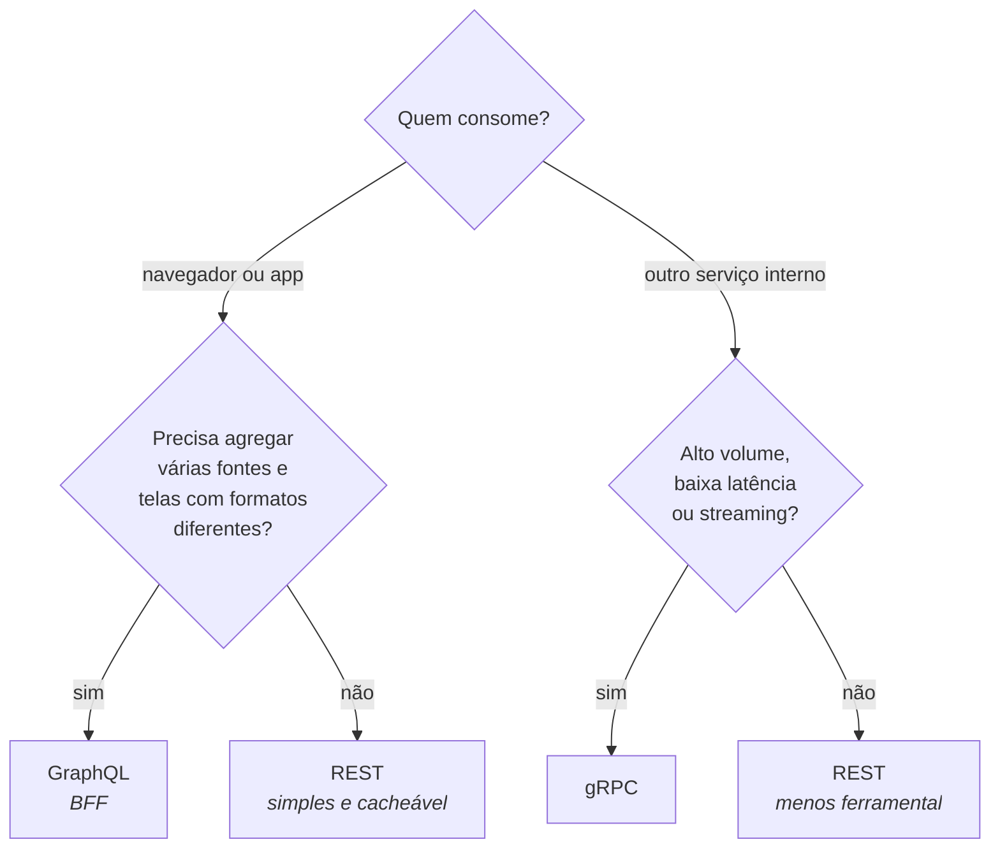

# gRPC e GRAPHQL

> **Capítulos:** [I - gRPC](i-grpc.md) · [II - GraphQL](ii-graphql.md)

REST resolve bem o caso geral, mas cobra dois preços: **payload de texto** (JSON é verboso e caro de serializar) e **endpoint fixo** (o servidor decide o formato da resposta, e o cliente aceita o que vier). gRPC e GraphQL atacam esses dois preços por caminhos opostos.

- **gRPC** otimiza a **comunicação**: contrato binário, tipado e gerado a partir de um `.proto`, sobre HTTP/2. Nasceu para conversa **entre serviços**.
- **GraphQL** otimiza o **consumo**: um schema único onde o **cliente** declara exatamente os campos que quer, numa requisição só. Nasceu para alimentar **frontends**.

Nenhum dos dois substitui REST em todos os cenários — os três convivem numa mesma arquitetura: GraphQL no BFF que atende o app, gRPC entre os microsserviços, REST na API pública.

---

## Comparativo — a tabela que cai em prova

| | **REST** | **gRPC** | **GraphQL** |
|---|---|---|---|
| Estilo | recursos + verbos HTTP | chamada de procedimento (RPC) | consulta declarativa |
| Transporte | HTTP/1.1 ou HTTP/2 | **HTTP/2 obrigatório** | HTTP (normalmente 1 endpoint `POST /graphql`) |
| Formato | JSON (texto) | **Protobuf (binário)** | JSON (texto) |
| Contrato | OpenAPI — **opcional** | `.proto` — **obrigatório** | Schema/SDL — **obrigatório** |
| Tipagem | fraca (validada em runtime) | **forte, verificada em compilação** | forte, verificada no schema |
| Quem define a resposta | servidor | servidor | **cliente** |
| Over/under-fetching | comum | controlado pelo `.proto` | resolvido por construção |
| Streaming | limitado (SSE, WebSocket) | **nativo e bidirecional** | subscriptions (WebSocket) |
| Cache HTTP | ✅ nativo (`ETag`, `Cache-Control`) | ❌ | ❌ difícil (tudo é `POST` num endpoint só) |
| Legível por humano | ✅ | ❌ binário | ✅ |
| Suporte em navegador | ✅ | ❌ (precisa de gRPC-Web + proxy) | ✅ |
| Códigos de erro | status HTTP | 17 status codes próprios | **sempre 200** + array `errors` |
| Melhor para | API pública, CRUD, integração ampla | microsserviços, baixa latência, alto volume | BFF, apps com muitas telas e agregação |
| Pior para | agregação de muitas fontes | cliente em navegador | operação simples de CRUD |

### Critério de escolha

Perguntas que resolvem a maioria das discussões: **o consumidor é navegador?** (gRPC sai). **O cliente precisa de formatos de resposta diferentes por tela?** (GraphQL entra). **O cache HTTP é importante?** (REST ganha). **A latência entre serviços é crítica?** (gRPC ganha).

---

**Capítulos:** [I - gRPC](i-grpc.md) · [II - GraphQL](ii-graphql.md)

**Relacionados:** [Spring MVC - APIs RESTful](../spring-mvc-apis-restful/ii-fundamentos-rest.md) · [TEOREMA CAP](../teorema-cap/README.md) · [CLEAN ARCHITECTURE](../clean-architecture/README.md)
