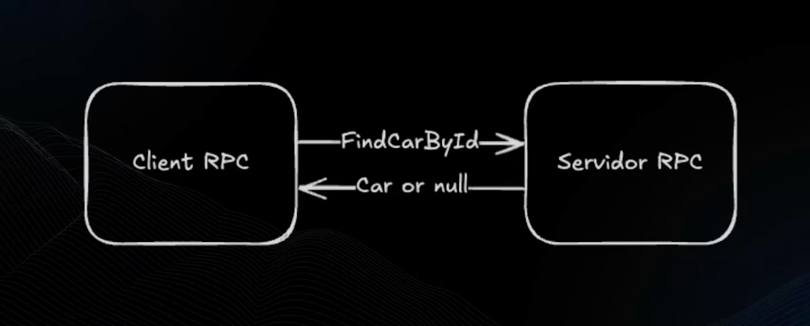
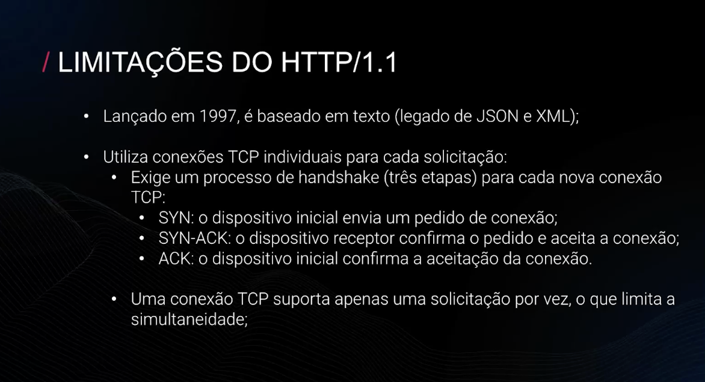
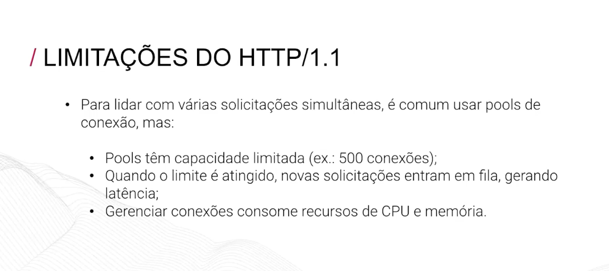
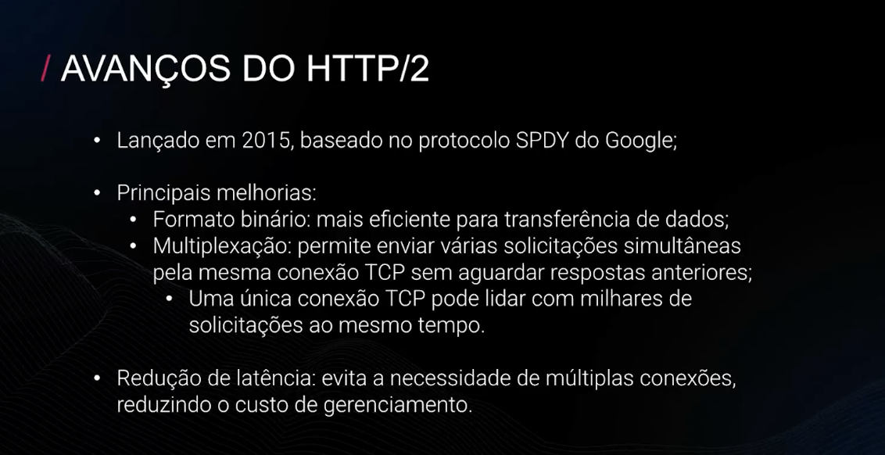
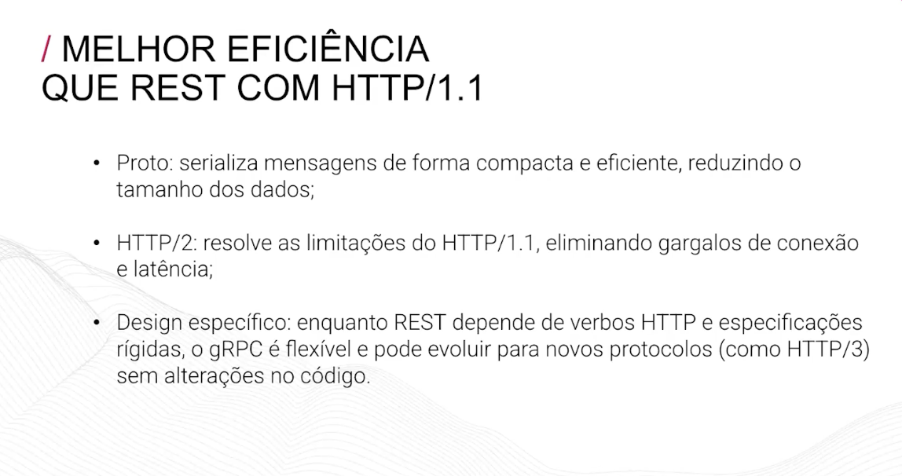
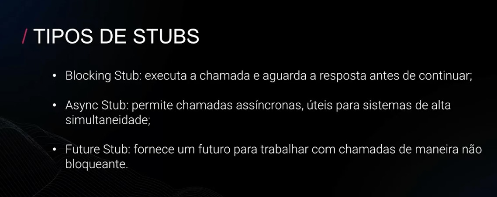
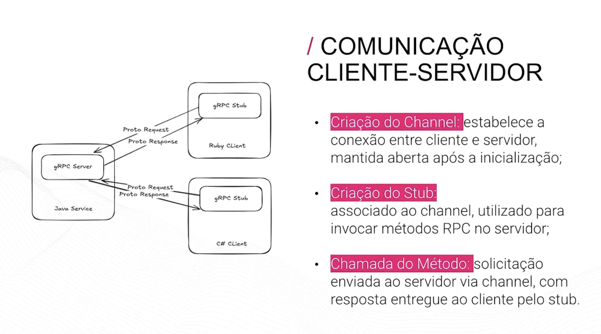
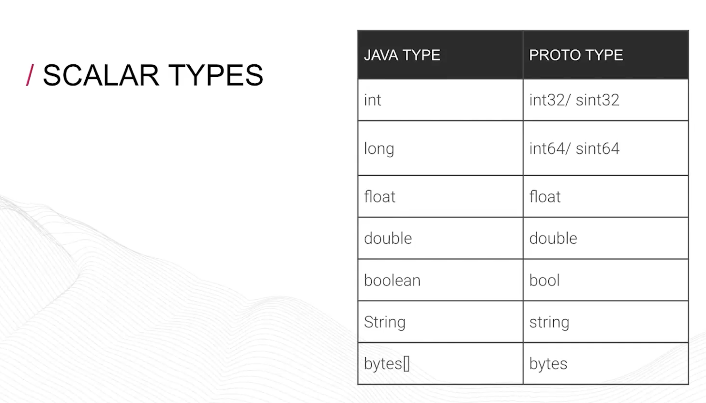

# gRPC e GRAPHQL

# O que é RPC?

Protocolo que permite a comunicacao entre sistemas que estão em máquinas diferentes. Em outras palavras o RPC permite que o sistema “chame” um procedimento ou função em outro sistema como se estivesse local. 

Vantagens

- Se preocupar mais com logica e não, sem se preocupar com a complexidade de rede
- Diminui a complexidade de debug ja que simula um ambiente local
- Facilmente escalavel, principalmente em ambientes cloud
- Eficiencia na comunicacao entre diferentes sistemas

Trade offs

- Latência de rede, comunicacao pode ter atrasos, por mais que o RPC simule um ambiente local, os servidores ainda estão fisicamente separados
- Identificar e resolver problemas se torna mais complicado em sistemas distribuidos, pois os erros podem surgir em qualquer ponto da rede
- Falhas de rede

# GOOGLE X GRPC

o gRPC foi criado inicialmente pela google, que utilizava uma infraestrutura RPC chamada stubby para conectar seus microsserviços entre datacenters por mais de uma década. 

Em março de 2015, a Google decidiu desenvolver uma nova versão do stubby e disponibiliza-la como um projeto de código aberto, surgindo assim o gRPC.

## Funcionamento

É uma evolucao do RPC, permitindo que o cliente chame métodos no servidor como se fossem locais, mesmo em máquinas diferentes. Ele utiliza o protocol buffers (protobufs) para definir serviços e mensagens e usa o protocolo HTTP/2 

# Channel

conexao entre o cliente e o servidor, é configurado como um endereco do servidor como localhost, e o gRPC gerencia o ciclo de vida desse canal. 

# Stub

Representação local de um serviço remoto, ele vai encapsular toda logica necessaria para serializar as solicitacoes, enviar os dados pelo channel e deserializar as repostas

- Os stubs são seguros para threads, permitindo que várias usem o mesmo stub simultaneamente

Caracteristicas de um protobuf:

- Agnóstico a linguagen de programacao
- Binário, não formato de texto
- Tamanho reduzido em relaçao a um json
- Melhor desemprenho de rede, consome menos largura de banda e leva menos tempo para serializar e deserializar
- Type Safety

- **Stub**: casca gerada que roda no client, faz a chamada parecer local mas por trás serializa/manda/desserializa
- **Skeleton**: o equivalente do lado do server, que desserializa e delega pro seu código real
- Isso mora no **adapter de output** na arquitetura hexagonal, atrás de uma porta (`ContaGateway`), então o domain fica agnóstico de protocolo
- O modelo **unário** é o certo quando você precisa de uma resposta síncrona antes de continuar (como validar saldo antes de processar pagamento)
- A vantagem real do `.proto` sobre JSON não é só "mais rápido" — é que ele move a detecção de quebra de contrato de **runtime em produção** pra **compile-time no CI**

- O proto não é uma classe
- O proto não lança nulos

Padroes de comunicacao no gRPC

- Unary: Cliente envia uma unica solicitacao e recebe uma unica resposta
- Cliente Streaming: o cliente envia varias solicitacoes para o servidor e o servidor devolve apenas uma unica resposta
- Server Streaming: o cliente envia uma solicitacao para o servidor e o servidor devolve varias respostas. Ex: netflix, o filme vai sendo enviado em pedacinhos para o cliente, durante a reproduçao dele.
- Bi-diretional Stream: cliente e servidor trocam multiplas mensagens simultaneamente
