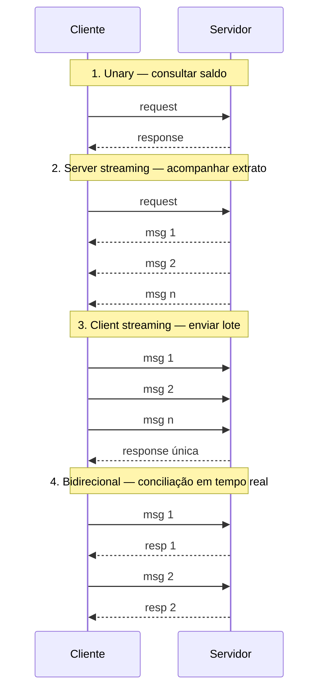

# I - gRPC

> [← Voltar para gRPC e GRAPHQL](README.md) · Próximo: [II - GraphQL](ii-graphql.md)

## 1. O que é RPC?

Protocolo que permite a comunicacao entre sistemas que estão em máquinas diferentes. Em outras palavras o RPC permite que o sistema "chame" um procedimento ou função em outro sistema como se estivesse local.


**Vantagens**

- Se preocupar mais com logica e não com a complexidade de rede
- Diminui a complexidade de debug ja que simula um ambiente local
- Facilmente escalavel, principalmente em ambientes cloud
- Eficiencia na comunicacao entre diferentes sistemas

**Trade offs**

- Latência de rede: a comunicacao pode ter atrasos; por mais que o RPC simule um ambiente local, os servidores ainda estão fisicamente separados
- Identificar e resolver problemas se torna mais complicado em sistemas distribuidos, pois os erros podem surgir em qualquer ponto da rede
- Falhas de rede

> **A falácia da transparência:** o RPC faz a chamada remota *parecer* local, e esse é o maior ganho e o maior risco do modelo. Chamada local não tem latência, não tem partição de rede e não falha pela metade — remota tem tudo isso. Tratar a chamada como se fosse local (sem timeout, sem retry, sem circuit breaker) é a primeira das *oito falácias da computação distribuída*. → [TEOREMA CAP](../teorema-cap/README.md)

---

## 2. Google × gRPC

o gRPC foi criado inicialmente pela google, que utilizava uma infraestrutura RPC chamada **stubby** para conectar seus microsserviços entre datacenters por mais de uma década.

Em março de 2015, a Google decidiu desenvolver uma nova versão do stubby e disponibiliza-la como um projeto de código aberto, surgindo assim o gRPC.

### Funcionamento

É uma evolucao do RPC, permitindo que o cliente chame métodos no servidor como se fossem locais, mesmo em máquinas diferentes. Ele utiliza o **protocol buffers (protobuf)** para definir serviços e mensagens e usa o protocolo **HTTP/2**.


---

## 3. Protocol Buffers

Caracteristicas de um protobuf:

- Agnóstico a linguagem de programacao
- **Binário**, não formato de texto
- Tamanho reduzido em relaçao a um json
- Melhor desempenho de rede: consome menos largura de banda e leva menos tempo para serializar e deserializar
- **Type Safety**

### Um `.proto` completo e comentado

```protobuf
syntax = "proto3";                              // sempre declarar; proto2 é legado

package banking.conta.v1;                       // evita colisão de nomes entre serviços

option java_package = "com.fiap.banking.grpc";  // pacote das classes Java geradas
option java_multiple_files = true;              // uma classe por arquivo (mais legível)

import "google/protobuf/timestamp.proto";       // tipos padrão prontos

// ---------- MENSAGENS ----------
message Conta {
  string id = 1;                                // "1" é o FIELD NUMBER, não o valor
  string titular = 2;
  int64 saldo_em_centavos = 3;                  // dinheiro em inteiro: nunca float/double
  StatusConta status = 4;
  google.protobuf.Timestamp criada_em = 5;
  repeated string chaves_pix = 6;               // repeated = lista
  map<string, string> metadados = 7;            // map<K,V>
}

enum StatusConta {
  STATUS_CONTA_NAO_ESPECIFICADO = 0;            // o primeiro valor DEVE ser 0 e é o default
  STATUS_CONTA_ATIVA = 1;
  STATUS_CONTA_BLOQUEADA = 2;
}

message BuscarContaRequest  { string id = 1; }
message BuscarContaResponse { Conta conta = 1; }

message TransferirRequest {
  string origem = 1;
  string destino = 2;
  int64 valor_em_centavos = 3;
  string idempotency_key = 4;                   // retry seguro
}
message TransferirResponse {
  string comprovante_id = 1;
  google.protobuf.Timestamp processada_em = 2;
}

message ExtratoRequest { string conta_id = 1; }
message Lancamento     { string descricao = 1; int64 valor_em_centavos = 2; }

// ---------- SERVIÇO ----------
service ContaService {
  rpc BuscarConta (BuscarContaRequest) returns (BuscarContaResponse);            // unary
  rpc Transferir  (TransferirRequest)  returns (TransferirResponse);             // unary
  rpc AcompanharExtrato (ExtratoRequest) returns (stream Lancamento);            // server streaming
  rpc EnviarLote (stream TransferirRequest) returns (TransferirResponse);        // client streaming
  rpc Conciliar  (stream TransferirRequest) returns (stream TransferirResponse); // bidirecional
}
```

### Field numbers — o mecanismo de compatibilidade

Na serialização binária **o nome do campo não é transmitido** — só o número. É isso que torna o protobuf pequeno, e é isso que define as regras de evolução:

| Regra | Por quê |
|---|---|
| **Nunca reutilize um número** de campo removido | um cliente antigo interpretaria o dado novo como o campo antigo — corrupção silenciosa |
| Marque o que saiu com **`reserved`** | `reserved 4, 7; reserved "cpf";` impede que alguém reaproveite por engano |
| **Nunca mude o tipo** de um campo existente | a decodificação binária muda |
| Renomear campo **é seguro** | o nome não trafega (mas quebra o código gerado, então é mudança de compilação) |
| Adicionar campo novo **é seguro** | cliente antigo simplesmente ignora o que não conhece |
| Números **1–15** ocupam 1 byte no cabeçalho; 16–2047 ocupam 2 | reserve 1–15 para os campos mais frequentes |

**Esse é o ponto mais importante do protobuf em prova:** a compatibilidade para frente e para trás vem dos field numbers, não dos nomes.

### Tipos escalares e a pegadinha do proto3

| Protobuf | Java | Default (proto3) |
|---|---|---|
| `double`, `float` | `double`, `float` | `0` |
| `int32`, `int64` | `int`, `long` | `0` |
| `uint32`, `sint32`, `fixed32` | variações | `0` |
| `bool` | `boolean` | `false` |
| `string` | `String` | `""` |
| `bytes` | `ByteString` | vazio |
| `repeated T` | `List<T>` | lista vazia |
| `message` | classe gerada | **`null` / não setado** |

> ### ⚠️ proto3 não distingue "ausente" de "valor zero"
>
> Campos escalares em proto3 **não têm presença**: se o cliente não enviar `saldo_em_centavos`, o servidor lê `0` — exatamente como se ele tivesse enviado zero. Não existe `hasSaldo()` para escalar simples.
>
> Isso quebra qualquer semântica de `PATCH` ("não mexa neste campo") e qualquer regra do tipo "zero é diferente de não informado". Duas saídas:
> - **`optional`** no campo (presença explícita voltou no protobuf 3.15) → gera `hasSaldoEmCentavos()`;
> - **wrapper types** (`google.protobuf.Int64Value`, `StringValue`), que são mensagens e, portanto, têm presença.
>
> Pegadinha clássica de prova e de bug em produção.

### Geração de código

O compilador `protoc` (via plugin Maven/Gradle) lê o `.proto` e gera as classes de mensagem e os stubs em qualquer linguagem suportada. Cliente em Java e servidor em Go compartilham o mesmo contrato — e a quebra de contrato aparece **em tempo de compilação, no CI**, não em runtime na produção.

---

## 4. Channel

conexao entre o cliente e o servidor, é configurado como um endereco do servidor como localhost, e o gRPC gerencia o ciclo de vida desse canal.

## 5. Stub

Representação local de um serviço remoto, ele vai encapsular toda logica necessaria para serializar as solicitacoes, enviar os dados pelo channel e deserializar as repostas.

- Os stubs são seguros para threads, permitindo que várias usem o mesmo stub simultaneamente


- **Stub**: casca gerada que roda no client, faz a chamada parecer local mas por trás serializa/manda/desserializa
- **Skeleton**: o equivalente do lado do server, que desserializa e delega pro seu código real
- Isso mora no **adapter de output** na arquitetura hexagonal, atrás de uma porta (`ContaGateway`), então o domain fica agnóstico de protocolo
- O modelo **unário** é o certo quando você precisa de uma resposta síncrona antes de continuar (como validar saldo antes de processar pagamento)
- A vantagem real do `.proto` sobre JSON não é só "mais rápido" — é que ele move a detecção de quebra de contrato de **runtime em produção** pra **compile-time no CI**


- O proto não é uma classe
- O proto não lança nulos

**Três tipos de stub gerados em Java:**

| Stub | Assinatura | Uso |
|---|---|---|
| **Blocking** | `ContaServiceBlockingStub` | chamada síncrona; a thread espera. O mais comum em aplicação de negócio |
| **Async (stub)** | `ContaServiceStub` | callbacks via `StreamObserver`; obrigatório para streaming |
| **Future** | `ContaServiceFutureStub` | devolve `ListenableFuture` |

Channel é caro de criar e **deve ser reutilizado** (é ele que mantém a conexão HTTP/2 e o pool). Stub é barato e thread-safe.

---

## 6. Por que HTTP/2 importa

O gRPC **exige** HTTP/2, e é ele que viabiliza o streaming:

| Recurso do HTTP/2 | Efeito no gRPC |
|---|---|
| **Multiplexing** | várias chamadas simultâneas **numa única conexão TCP**, sem esperar uma terminar. No HTTP/1.1 era uma resposta por vez por conexão |
| **Sem head-of-line blocking** (na camada HTTP) | uma resposta lenta não trava as outras da mesma conexão |
| **Streams bidirecionais** | servidor e cliente enviam mensagens a qualquer momento — é o que permite os 4 padrões de comunicação |
| **Frames binários** | parsing mais barato e previsível que texto |
| **HPACK** (compressão de header) | headers repetidos quase não custam banda |
| **Conexão persistente** | elimina o custo de handshake por chamada |

Detalhe honesto: o head-of-line blocking desaparece na camada HTTP, mas **continua existindo no TCP** — perda de pacote ainda trava todos os streams daquela conexão. É o problema que o HTTP/3 (QUIC, sobre UDP) resolve.

---

## 7. Padrões de comunicação

- **Unary:** Cliente envia uma unica solicitacao e recebe uma unica resposta
- **Client Streaming:** o cliente envia varias solicitacoes para o servidor e o servidor devolve apenas uma unica resposta
- **Server Streaming:** o cliente envia uma solicitacao para o servidor e o servidor devolve varias respostas. Ex: netflix, o filme vai sendo enviado em pedacinhos para o cliente, durante a reproduçao dele
- **Bidirectional Streaming:** cliente e servidor trocam multiplas mensagens simultaneamente



Casos típicos: **unary** (99% das chamadas de negócio), **server streaming** (feed de cotações, extrato longo, download), **client streaming** (upload em pedaços, telemetria, lote), **bidirecional** (chat, conciliação, sincronização contínua).

---

## 8. Status codes do gRPC

O gRPC **não usa status HTTP** — tem 17 códigos próprios, transmitidos no trailer da resposta:

| Código | Nome | Equivalente HTTP aproximado |
|---:|---|---|
| 0 | `OK` | 200 |
| 1 | `CANCELLED` | 499 |
| 2 | `UNKNOWN` | 500 |
| 3 | `INVALID_ARGUMENT` | 400 |
| 4 | `DEADLINE_EXCEEDED` | 504 |
| 5 | `NOT_FOUND` | 404 |
| 6 | `ALREADY_EXISTS` | 409 |
| 7 | `PERMISSION_DENIED` | 403 |
| 8 | `RESOURCE_EXHAUSTED` | 429 |
| 9 | `FAILED_PRECONDITION` | 400 / 422 |
| 10 | `ABORTED` | 409 |
| 11 | `OUT_OF_RANGE` | 400 |
| 12 | `UNIMPLEMENTED` | 501 |
| 13 | `INTERNAL` | 500 |
| 14 | `UNAVAILABLE` | 503 |
| 15 | `DATA_LOSS` | 500 |
| 16 | `UNAUTHENTICATED` | 401 |

Distinções que caem: **`UNAVAILABLE` é seguro para retry** (serviço fora do ar), `FAILED_PRECONDITION` **não** é (o estado do sistema precisa mudar antes), `ABORTED` costuma ser retryable com backoff (conflito de concorrência). E, como em REST, `UNAUTHENTICATED` (16) é "não sei quem você é" e `PERMISSION_DENIED` (7) é "sei e você não pode".

---

## 9. Deadlines, cancelamento e interceptors

```java
// DEADLINE: sempre defina. Sem isso, uma chamada travada segura a thread indefinidamente
var resposta = stub.withDeadlineAfter(300, TimeUnit.MILLISECONDS)
                   .buscarConta(request);
```

**Deadline** é propagado pela cadeia de chamadas: se A chama B com 300ms e B chama C, C herda o tempo restante — o sistema inteiro para de trabalhar em algo que já não será usado. É um recurso que REST não tem de forma nativa.

**Interceptors** são o equivalente aos filtros do HTTP — o padrão [Chain of Responsibility](../design-patterns-em-oo/iii-padroes-comportamentais.md) aplicado ao gRPC:

```java
public class AutenticacaoInterceptor implements ServerInterceptor {

    @Override
    public <Req, Res> ServerCall.Listener<Req> interceptCall(
            ServerCall<Req, Res> call, Metadata headers, ServerCallHandler<Req, Res> next) {

        String token = headers.get(Metadata.Key.of("authorization", ASCII_STRING_MARSHALLER));
        if (!valido(token)) {
            call.close(Status.UNAUTHENTICATED.withDescription("token inválido"), new Metadata());
            return new ServerCall.Listener<>() { };
        }
        return next.startCall(call, headers);
    }
}
```

Usos: autenticação, log, métricas, propagação de trace (`traceId`), validação. `Metadata` é o equivalente aos headers HTTP.

---

## 10. gRPC em Java/Spring

```java
@GrpcService                                   // grpc-spring-boot-starter
public class ContaGrpcService extends ContaServiceGrpc.ContaServiceImplBase {

    private final BuscarContaUseCase useCase;   // o domínio não conhece gRPC

    @Override
    public void buscarConta(BuscarContaRequest request, StreamObserver<BuscarContaResponse> obs) {
        try {
            Conta conta = useCase.executar(new ContaId(request.getId()));

            obs.onNext(BuscarContaResponse.newBuilder()                 // Builder gerado
                    .setConta(ContaMapper.paraProto(conta))             // domínio → proto
                    .build());
            obs.onCompleted();                                          // encerra o stream

        } catch (ContaNaoEncontradaException e) {
            obs.onError(Status.NOT_FOUND.withDescription(e.getMessage()).asRuntimeException());
        }
    }

    @Override
    public void acompanharExtrato(ExtratoRequest request, StreamObserver<Lancamento> obs) {
        useCase.streamDe(new ContaId(request.getContaId()))
               .forEach(l -> obs.onNext(LancamentoMapper.paraProto(l)));  // N mensagens
        obs.onCompleted();
    }
}
```

`onNext` (envia), `onCompleted` (finaliza), `onError` (encerra com status) formam o contrato do `StreamObserver` — e **um stream só pode terminar de uma forma**: ou `onCompleted` ou `onError`.

Note a simetria com REST: a classe `@GrpcService` é um **adaptador de entrada**, exatamente como o `@RestController`. A regra de negócio não muda de protocolo. → [CLEAN ARCHITECTURE](../clean-architecture/README.md)

**Teste:** o `grpc-java` traz `GrpcCleanupRule` e servidor in-process (`InProcessServerBuilder`), que permitem testar sem abrir porta — o equivalente ao MockMvc.

---

## 11. Limitações e alternativas de borda

- **Navegador não fala gRPC nativamente** (não há acesso aos frames HTTP/2 pelo JS). Saídas: **gRPC-Web** com proxy (Envoy) traduzindo, ou **grpc-gateway**/*transcoding* expondo o mesmo `.proto` como REST/JSON.
- **Payload binário não é legível**: debugar exige `grpcurl`/`grpcui`; não dá para inspecionar com `curl` e olho nu.
- **Sem cache HTTP** — quem precisa de cache de borda continua em REST.
- **Balanceamento é diferente:** como a conexão HTTP/2 é persistente e multiplexada, um load balancer L4 manda tudo para o mesmo backend. Precisa de LB L7 com suporte a gRPC (Envoy, service mesh) ou balanceamento client-side.
- **Ferramental e curva de aprendizado** maiores: geração de código no build, versionamento do `.proto`, registry de schema.

**Quando não usar:** API pública consumida por terceiros desconhecidos, integração simples de baixo volume, ou qualquer cenário em que a legibilidade e o cache do REST valham mais que a latência.

---

## Perguntas para autoavaliação

1. Por que o gRPC exige HTTP/2? Cite dois recursos do protocolo que ele aproveita.
2. O que são field numbers e por que **nunca** se pode reutilizar um?
3. Renomear um campo no `.proto` quebra o cliente antigo? E mudar o tipo?
4. Por que proto3 não distingue "campo ausente" de "zero", e como contornar?
5. Quais são os quatro padrões de comunicação? Dê um caso de uso para cada.
6. Qual a diferença entre Channel e Stub, e qual dos dois deve ser reutilizado?
7. `UNAVAILABLE` e `FAILED_PRECONDITION`: qual é seguro para retry e por quê?
8. O que é deadline e por que a propagação dele é importante em cadeia de microsserviços?
9. Por que um navegador não consegue chamar gRPC diretamente?
10. Qual a vantagem real do `.proto` sobre JSON, além do desempenho?

---

> [← Voltar para gRPC e GRAPHQL](README.md) · Próximo: [II - GraphQL](ii-graphql.md)
