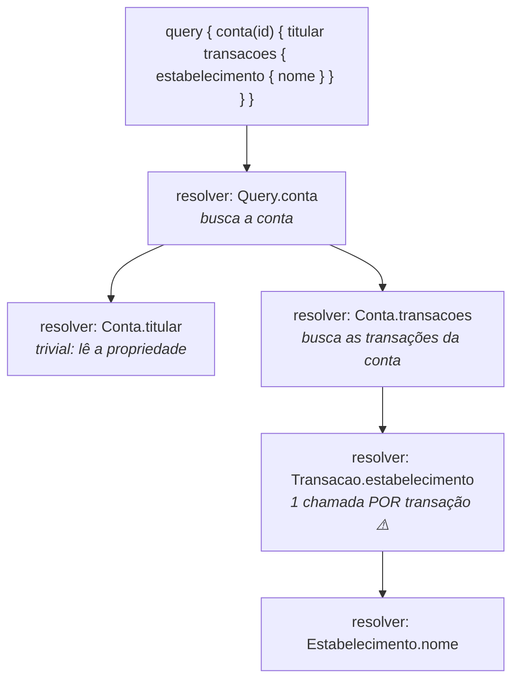
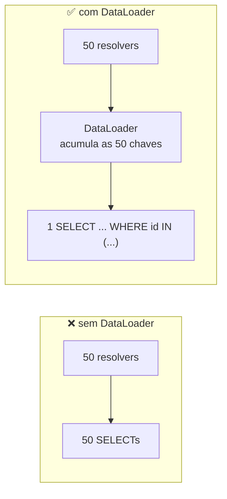

# II - GRAPHQL

> [← Voltar para gRPC e GRAPHQL](README.md) · Anterior: [I - gRPC](i-grpc.md)

## 1. O problema que ele resolve

GraphQL foi criado no Facebook em 2012 (aberto em 2015) para um problema concreto: o app mobile fazia dezenas de chamadas REST para montar uma tela, em rede móvel instável, e ainda recebia muito mais dado do que usava.

**Over-fetching** — o endpoint devolve mais do que a tela precisa:

```http
GET /contas/123
{ "id":"123", "titular":"Ana", "documento":"...", "endereco":{...}, "saldo":300.00,
  "limiteCredito":5000.00, "gerente":{...}, "criadaEm":"...", "score":720, ... }
```
A tela só queria `titular` e `saldo`. Todo o resto foi serializado, trafegado e descartado.

**Under-fetching (N+1 de rede)** — uma chamada não basta, e o cliente vira orquestrador:

```http
GET /contas/123                      → precisa das transações
GET /contas/123/transacoes           → cada transação tem um estabelecimento
GET /estabelecimentos/1
GET /estabelecimentos/2 ...          → 1 + 1 + N requisições para montar UMA tela
```

Em REST, a saída costuma ser criar endpoints sob medida por tela (`/contas/123/resumo-home`, `/contas/123/resumo-extrato`) — o que multiplica endpoints e acopla o backend ao layout do app.

**A proposta do GraphQL:** um único endpoint, um **schema tipado**, e o **cliente declara exatamente o que quer**:

```graphql
query {
  conta(id: "123") {
    titular
    saldo
    transacoes(ultimas: 5) {
      valor
      estabelecimento { nome }      # o "join" acontece no servidor, numa ida só
    }
  }
}
```

```json
{ "data": { "conta": { "titular": "Ana", "saldo": 300.00,
  "transacoes": [ { "valor": -35.90, "estabelecimento": { "nome": "Padaria" } } ] } } }
```

A resposta tem **exatamente o formato da consulta** — nem um campo a mais.

> **GraphQL não é banco de dados nem substituto de SQL.** É uma camada de contrato entre cliente e servidor: uma *linguagem de consulta* mais um *runtime de execução*. Quem busca os dados continua sendo o seu código (que pode consultar Postgres, chamar um gRPC e um serviço REST na mesma query).

---

## 2. O Schema e a SDL

O schema é o contrato — **obrigatório**, tipado e a única fonte de verdade. Escrito em **SDL (Schema Definition Language)**:

```graphql
# ---------- TIPOS DE OBJETO ----------
type Conta {
  id: ID!                          # "!" = NÃO nulo (obrigatório)
  titular: String!
  saldo: Float!
  status: StatusConta!
  chavesPix: [String!]!            # lista não nula de strings não nulas
  transacoes(ultimas: Int = 10): [Transacao!]!    # campo com argumento e default
  gerente: Funcionario             # anulável: pode não ter gerente
}

type Transacao {
  id: ID!
  valor: Float!
  data: String!
  estabelecimento: Estabelecimento
}

# ---------- ENUM ----------
enum StatusConta { ATIVA BLOQUEADA ENCERRADA }

# ---------- INTERFACE — campos comuns, tipos concretos diferentes ----------
interface Movimentacao {
  id: ID!
  valor: Float!
}
type Pix implements Movimentacao    { id: ID! valor: Float! chave: String! }
type Boleto implements Movimentacao { id: ID! valor: Float! codigoBarras: String! }

# ---------- UNION — tipos sem campos em comum ----------
union ResultadoBusca = Conta | Transacao | Estabelecimento

# ---------- INPUT — o tipo de ENTRADA (não pode ser um type) ----------
input TransferenciaInput {
  origem: ID!
  destino: ID!
  valor: Float!
  descricao: String
}

# ---------- OS TRÊS ROOT TYPES ----------
type Query {
  conta(id: ID!): Conta
  contas(status: StatusConta, primeiros: Int = 20): [Conta!]!
  buscar(termo: String!): [ResultadoBusca!]!
}

type Mutation {
  transferir(input: TransferenciaInput!): TransferenciaPayload!
  bloquearConta(id: ID!): Conta!
}

type Subscription {
  saldoAlterado(contaId: ID!): Conta!
}
```

### Notação de nulidade — a pegadinha mais comum

| Escrita | Significa |
|---|---|
| `[Transacao]` | a lista pode ser nula, e os itens podem ser nulos |
| `[Transacao!]` | a lista pode ser nula, mas nenhum item é nulo |
| `[Transacao]!` | a lista nunca é nula, mas pode conter itens nulos |
| `[Transacao!]!` | lista nunca nula, itens nunca nulos ← **o que você quase sempre quer** |

**Consequência prática séria:** se um campo `!` resolver para `null`, o erro **sobe (bubbles up)** até o primeiro campo anulável — podendo anular o objeto inteiro ou a query toda. Marcar tudo como `!` deixa a API frágil a falhas parciais; muitos times marcam como não-nulo só o que é realmente garantido.

**Scalars padrão:** `Int`, `Float`, `String`, `Boolean`, `ID`. Não existe data nem decimal — daí os **custom scalars** (`Date`, `BigDecimal`, `Email`), que você registra no runtime. Em domínio financeiro, usar `Float` para dinheiro é erro: defina um scalar próprio.

---

## 3. Query — o lado do cliente

```graphql
query ResumoDaHome($contaId: ID!, $qtd: Int = 5) {   # OPERAÇÃO NOMEADA + VARIÁVEIS
  conta(id: $contaId) {
    titular
    disponivel: saldo                                 # ALIAS: renomeia no retorno
    ...dadosBasicos                                   # uso de FRAGMENT
    transacoes(ultimas: $qtd) {
      valor
      estabelecimento { nome }
    }
  }
  ultimoBoleto: buscar(termo: "boleto") {             # duas consultas numa requisição
    ... on Boleto { codigoBarras }                    # INLINE FRAGMENT em union/interface
  }
}

fragment dadosBasicos on Conta {                      # reaproveitável entre queries
  id
  status
}
```

```json
// variables — sempre parametrize; NUNCA concatene valor na string da query
{ "contaId": "123", "qtd": 5 }
```

Recursos que aparecem em prova:

- **Variáveis** (`$nome: Tipo!`) — permitem reaproveitar a query e são a base das *persisted queries*.
- **Alias** — necessário quando você chama o mesmo campo duas vezes com argumentos diferentes.
- **Fragments** — evitam repetição; **inline fragments** (`... on Tipo`) são obrigatórios para acessar campos específicos de interface/union.
- **Diretivas** `@include(if: $flag)` e `@skip(if: $flag)` — incluem ou removem campos condicionalmente.
- **Introspecção** — a própria API se descreve (`__schema`, `__type`). É o que alimenta o GraphiQL e o autocomplete das IDEs. **Desligue em produção.**

---

## 4. Mutation e Subscription

```graphql
mutation Transferir($input: TransferenciaInput!) {
  transferir(input: $input) {
    comprovanteId
    saldoAtualizado
    erros { campo mensagem }        # erros de negócio como DADO, não como exceção
  }
}
```

Convenções consolidadas de mutation: **um argumento `input`** (facilita evolução), **um tipo `Payload` de retorno** (permite devolver o objeto alterado + metadados + erros de negócio) e **verbo no nome** (`transferir`, `bloquearConta`).

**Diferença semântica entre Query e Mutation:** campos de uma `query` são resolvidos **em paralelo**; campos de nível raiz de uma `mutation` são resolvidos **em série, na ordem escrita** — para que efeitos colaterais não corram entre si. Isso é definido pela especificação, e cai em prova.

```graphql
subscription {
  saldoAlterado(contaId: "123") { saldo }
}
```

**Subscription** mantém uma conexão aberta (WebSocket, protocolo `graphql-transport-ws`, ou SSE) e o servidor empurra eventos. É o equivalente ao server streaming do gRPC — e traz os mesmos custos: conexão com estado, escala horizontal exigindo um broker (Redis/Kafka) para distribuir os eventos entre instâncias.

---

## 5. Resolvers e o resolver chain

Cada **campo** do schema tem um resolver — uma função que sabe produzir aquele valor. O runtime monta a resposta percorrendo a árvore da query, chamando um resolver por campo.



Cada resolver recebe quatro coisas: o **objeto pai** (o resultado do nível acima), os **argumentos** do campo, o **contexto** (usuário autenticado, loaders, request) e informações da query. Campos que só leem uma propriedade do pai têm resolver *trivial* — o runtime resolve sozinho.

> ### ⚠️ O problema N+1 do GraphQL
>
> Olhe o diagrama: `Conta.transacoes` devolve 50 transações, e o runtime chama `Transacao.estabelecimento` **uma vez para cada uma** → 1 consulta das transações + 50 consultas de estabelecimento. Como o cliente é quem monta a query, **você não controla a profundidade** — e o N+1 pode nascer de uma tela nova sem nenhuma mudança no backend.
>
> É o mesmo N+1 do JPA, mas com um agravante: aqui o formato da consulta é decidido pelo cliente. → [SPRING DATA JPA](../spring-data-jpa/README.md)

### DataLoader — batching e cache por requisição

A solução padrão é o **DataLoader**: em vez de resolver cada campo na hora, ele **acumula** as chaves pedidas durante um *tick* da execução, faz **uma** busca em lote e distribui os resultados.



Dois ganhos: **batching** (N viram 1) e **cache por requisição** (a mesma chave pedida duas vezes na mesma query é buscada uma vez só). O cache é *por requisição* de propósito — não corre risco de servir dado de outro usuário.

---

## 6. Spring for GraphQL

```xml
<dependency>
  <groupId>org.springframework.boot</groupId>
  <artifactId>spring-boot-starter-graphql</artifactId>
</dependency>
```

Schema em `src/main/resources/graphql/*.graphqls`. Endpoint padrão: `POST /graphql`; interface de teste em `/graphiql` (habilite com `spring.graphql.graphiql.enabled=true`).

```java
@Controller
public class ContaGraphQlController {

    private final BuscarContaUseCase buscarConta;
    private final TransferirUseCase transferir;

    // ---------- Query ----------
    @QueryMapping
    public Conta conta(@Argument String id) {                       // Query.conta
        return buscarConta.executar(new ContaId(id));
    }

    @QueryMapping
    public List<Conta> contas(@Argument StatusConta status, @Argument int primeiros) { }

    // ---------- campo derivado de um tipo ----------
    @SchemaMapping(typeName = "Conta", field = "transacoes")        // Conta.transacoes
    public List<Transacao> transacoes(Conta conta, @Argument int ultimas) {
        return extrato.ultimas(conta.id(), ultimas);
    }

    // ---------- batching: resolve o N+1 ----------
    @BatchMapping(typeName = "Transacao", field = "estabelecimento")
    public Map<Transacao, Estabelecimento> estabelecimentos(List<Transacao> transacoes) {
        var ids = transacoes.stream().map(Transacao::estabelecimentoId).toList();
        var porId = estabelecimentoRepo.buscarTodosPorId(ids)        // UM select para todos
                       .stream().collect(toMap(Estabelecimento::id, identity()));
        return transacoes.stream()
                .collect(toMap(identity(), t -> porId.get(t.estabelecimentoId())));
    }

    // ---------- Mutation ----------
    @MutationMapping
    public TransferenciaPayload transferir(@Argument @Valid TransferenciaInput input,
                                           @AuthenticationPrincipal Usuario usuario) {
        return TransferenciaPayload.de(transferir.executar(input.toCommand(), usuario));
    }

    // ---------- Subscription ----------
    @SubscriptionMapping
    public Flux<Conta> saldoAlterado(@Argument String contaId) {
        return eventos.doSaldo(new ContaId(contaId));               // stream reativo
    }
}
```

| Anotação | Resolve |
|---|---|
| `@QueryMapping` | um campo de `Query` |
| `@MutationMapping` | um campo de `Mutation` |
| `@SubscriptionMapping` | um campo de `Subscription` (retorna `Flux`) |
| `@SchemaMapping(typeName, field)` | um campo de qualquer tipo (o pai vem como parâmetro) |
| `@BatchMapping` | o mesmo, **em lote** — é o DataLoader com açúcar sintático |
| `@Argument` | um argumento do campo |
| `@ContextValue` | valor do contexto da requisição |

**Teste:** `@GraphQlTest` (slice, análogo ao `@WebMvcTest`) + `GraphQlTester`:

```java
graphQlTester.document("{ conta(id: \"123\") { titular saldo } }")
             .execute()
             .path("conta.titular").entity(String.class).isEqualTo("Ana");
```

→ [TESTES EM SOFTWARE](../testes-em-software/iii-testes-no-spring.md)

---

## 7. Erros — por que vem 200

```json
{
  "data": { "conta": { "titular": "Ana", "gerente": null } },
  "errors": [
    { "message": "Serviço de RH indisponível",
      "path": ["conta", "gerente"],
      "locations": [{ "line": 4, "column": 5 }],
      "extensions": { "classification": "INTERNAL_ERROR", "codigo": "RH_OFF" } }
  ]
}
```

A resposta **HTTP** é 200 porque, do ponto de vista do transporte, a requisição foi entregue e processada. GraphQL admite **resultado parcial**: parte da árvore resolveu, parte falhou — e isso não cabe num único status HTTP. O erro vem no array `errors`, com `path` apontando o campo exato que falhou.

Consequências: o cliente **precisa** inspecionar `errors` (não basta checar o status), e o monitoramento baseado em taxa de 5xx não enxerga falha de GraphQL — é preciso instrumentar o `errors` explicitamente.

No Spring, o mapeamento de exceção → erro GraphQL é feito por um resolver de exceção:

```java
@Component
class TratadorDeErros extends DataFetcherExceptionResolverAdapter {

    @Override
    protected GraphQLError resolveToSingleError(Throwable ex, DataFetchingEnvironment env) {
        if (ex instanceof SaldoInsuficienteException e) {
            return GraphqlErrorBuilder.newError(env)
                    .errorType(ErrorType.BAD_REQUEST)
                    .message(e.getMessage())
                    .extensions(Map.of("codigo", "SALDO_INSUFICIENTE"))
                    .build();
        }
        return null;   // cai no tratamento padrão
    }
}
```

**Erro de negócio como dado:** boa parte dos times prefere não lançar exceção para regra de negócio e sim devolvê-la **tipada no payload** (`erros { campo mensagem }` do exemplo da seção 4). Fica no schema, o cliente é obrigado a tratar, e o array `errors` fica reservado para falhas técnicas.

---

## 8. Paginação e evolução do schema

### Cursor connections (padrão Relay)

```graphql
type Query { transacoes(first: Int, after: String): TransacaoConnection! }

type TransacaoConnection {
  edges: [TransacaoEdge!]!
  pageInfo: PageInfo!
  totalCount: Int
}
type TransacaoEdge { node: Transacao!  cursor: String! }
type PageInfo { hasNextPage: Boolean!  hasPreviousPage: Boolean!  startCursor: String  endCursor: String }
```

É o **keyset pagination** formalizado num padrão de schema — mesma vantagem sobre `OFFSET` discutida em REST. → [Spring MVC - Evolução da API](../spring-mvc-apis-restful/iv-evolucao-da-api.md)

### Versionamento: não existe

GraphQL não tem `/v2`. O schema evolui **continuamente**: adicionar campo ou tipo nunca quebra ninguém (o cliente só recebe o que pediu). Para remover, marca-se a depreciação e observa-se o uso real:

```graphql
type Conta {
  saldo: Float! @deprecated(reason: "Use saldoDisponivel, que considera bloqueios judiciais")
  saldoDisponivel: Dinheiro!
}
```

Como o servidor sabe exatamente quais campos cada cliente consulta, dá para medir o uso de um campo depreciado e desligá-lo com segurança — algo que REST não oferece nativamente.

---

## 9. Limitações e riscos

| Problema | Por quê | Mitigação |
|---|---|---|
| **Cache HTTP não funciona** | tudo é `POST` no mesmo endpoint; a resposta varia por query | cache normalizado no cliente (Apollo, Relay); **APQ/persisted queries** com `GET` para viabilizar CDN |
| **N+1** | o cliente define a profundidade | DataLoader / `@BatchMapping` |
| **Query maliciosa (depth attack)** | `amigos { amigos { amigos { ... } } }` recursivo derruba o servidor | **limite de profundidade** e **análise de complexidade** com custo por campo |
| **Rate limiting difícil** | uma requisição pode custar 1 ou 10.000 unidades de trabalho | limitar por **custo estimado**, não por número de requisições |
| **Introspecção exposta** | entrega o mapa completo da API para um atacante | desligar em produção; usar allowlist de queries |
| **Autorização mais granular** | a regra é **por campo**, não por endpoint | checagem no resolver ou diretiva `@auth`; nunca só na raiz |
| **Upload de arquivo** | não faz parte da spec | endpoint REST separado ou spec de multipart |
| **Observabilidade** | um endpoint só: métrica por rota perde o sentido | instrumentar por **operação nomeada** e por resolver |
| **Complexidade** | schema, resolvers, loaders, tooling | não vale para CRUD simples |

**Federation (Apollo Federation) / schema stitching:** para várias equipes exporem um único grafo, cada serviço publica um subgrafo e um gateway compõe o **supergrafo**. Resolve o problema organizacional de um schema monolítico, ao custo de mais infraestrutura.

---

## 10. Quando usar (e quando não)

**Use quando:** o mesmo backend atende clientes com necessidades de dados bem diferentes (web, iOS, Android, parceiro); a tela agrega muitas fontes; a rede do cliente é cara/instável; o time de frontend precisa iterar sem depender de endpoint novo a cada tela.

**Não use quando:** a API é CRUD simples e estável; o cache HTTP de borda é essencial; a comunicação é serviço-a-serviço interno (aí **gRPC** entrega mais); o time é pequeno e o ganho não paga o ferramental; o tráfego é de upload/download de arquivo.

Arranjo comum e saudável: **GraphQL como BFF** para os apps, **gRPC** entre os serviços internos, **REST** na API pública para terceiros.

---

## Perguntas para autoavaliação

1. O que são over-fetching e under-fetching, e como o GraphQL resolve cada um?
2. Por que GraphQL não é um substituto de SQL nem um banco de dados?
3. Qual a diferença entre `[Transacao]`, `[Transacao!]`, `[Transacao]!` e `[Transacao!]!`?
4. O que acontece quando um campo marcado com `!` resolve para `null`?
5. Por que existe `input` além de `type`?
6. Campos de uma query e de uma mutation são resolvidos em paralelo ou em série? Por quê?
7. Explique o resolver chain e mostre onde o N+1 aparece.
8. O que o DataLoader faz, e quais são seus dois benefícios?
9. Por que uma resposta GraphQL com erro ainda vem com status 200?
10. Como se versiona uma API GraphQL, e por que o `@deprecated` funciona melhor que em REST?
11. Cite três riscos de segurança específicos de GraphQL e a mitigação de cada um.
12. Em que cenário gRPC é melhor escolha que GraphQL, e vice-versa?

---

> [← Voltar para gRPC e GRAPHQL](README.md) · Anterior: [I - gRPC](i-grpc.md)
