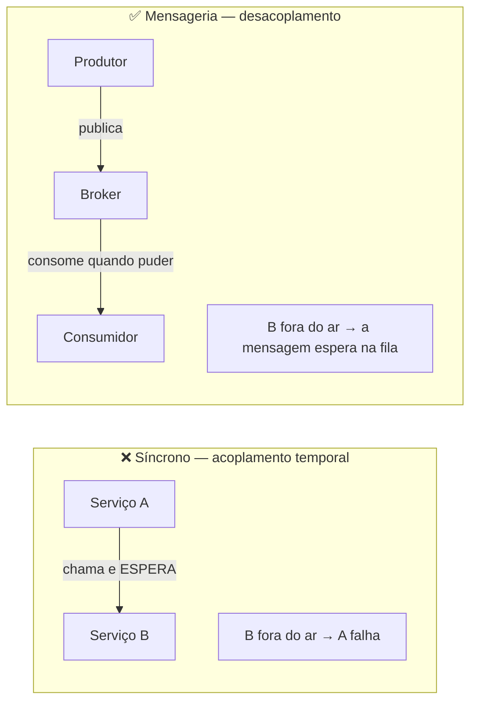
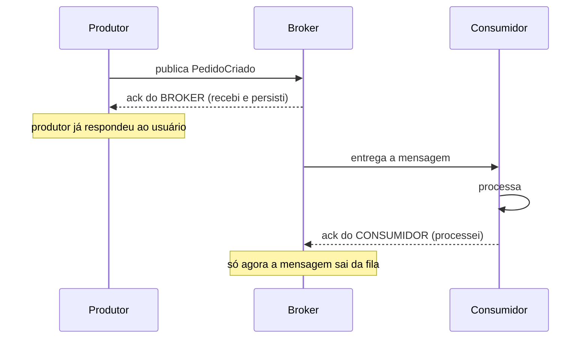
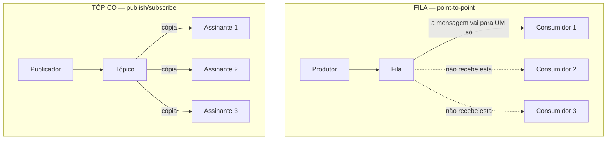

# FUNDAMENTOS DE MENSAGERIA

> **Capítulos:** [I - Tipos de mensagem](i-tipos-de-mensagem.md) · [II - Message Brokers](ii-message-brokers.md) · [III - Padrões de entrega](iii-padroes-de-entrega.md) · [IV - Padrões de uso e operação](iv-padroes-de-uso-e-operacao.md)

## Anotações da aula

**O que é mensageria?**

- O que a mensageria permite: **comunicação assíncrona**, maior **escalabilidade** e **desacoplamento** entre serviços, usando **message brokers**
- Modelos de mensageria: **fila (queue)** e **tópico (topic)**

**Tipos de mensagem:**

- **Comando:** envia uma instrução necessária, direcionada a um único destinatário, ponta a ponta, necessita ser processado apenas uma vez, pode gerar um evento após ser processado
- **Evento:** notificação de algo que ocorreu, não é direcionado a um serviço específico, pode ter múltiplos consumidores (pub/sub), pode ser armazenado para histórico ou reprocessamento
- **Consulta:** solicitação de uma informação específica, apenas leitura, não muda estado, pode ser processada por um único serviço ou por agregação de múltiplas fontes

**Message Brokers:** funções principais (baseado em fila, tópicos ou padrão de roteamento), protocolos de mensagem (AMQP, MQTT), ferramentas (RabbitMQ, Apache Kafka, AWS SQS, Azure Service Bus).

**Padrões de entrega:** at most once, at least once, exactly once.

---

## 1. O que é mensageria

**Mensageria** é comunicação entre sistemas por meio de **mensagens** trocadas através de um intermediário (o **message broker**), em vez de chamadas diretas de um serviço para outro.

A mudança fundamental: em vez de **A chamar B e esperar**, A **entrega uma mensagem ao broker** e segue seu caminho. B consome quando puder.

**Os três elementos:**

| Elemento | Papel |
|---|---|
| **Produtor** (*producer*, *publisher*) | cria e envia a mensagem. Não sabe quem vai consumir, nem quando |
| **Broker** | recebe, **armazena**, roteia e entrega. É ele que dá durabilidade e desacoplamento |
| **Consumidor** (*consumer*, *subscriber*) | lê e processa. Confirma (*ack*) quando terminou |

A **mensagem** em si tem: **payload** (o conteúdo), **headers/propriedades** (metadados: tipo, id, `traceId`, timestamp, chave de roteamento) e, quase sempre, um **id único** — que é o que viabiliza deduplicação e idempotência.

---

## 2. Como funciona a comunicação assíncrona

Na chamada **síncrona**, o chamador bloqueia esperando a resposta: existe **acoplamento temporal** — os dois precisam estar no ar **ao mesmo tempo**. Na **assíncrona**, o produtor entrega a mensagem e recebe apenas a confirmação do **broker** (não do consumidor); o processamento acontece depois.

**O duplo ack é o coração do modelo** e a origem das garantias de entrega: o broker só descarta a mensagem quando o consumidor confirma. Se o consumidor morrer no meio do processamento sem dar *ack*, a mensagem **volta para a fila** e é entregue de novo — o que explica por que duplicidade existe. → [III - Padrões de entrega](iii-padroes-de-entrega.md)

### Vantagens

| Vantagem | Por quê |
|---|---|
| **Desacoplamento temporal** | o consumidor pode estar fora do ar, em deploy ou sobrecarregado — a mensagem espera |
| **Desacoplamento de localização** | o produtor não conhece endereço, quantidade nem identidade dos consumidores |
| **Absorção de picos** (*buffering*) | a fila amortece a rajada; o consumidor processa no ritmo dele, sem cair |
| **Escalabilidade** | mais consumidores = mais vazão, sem mudar o produtor (*competing consumers*) |
| **Resiliência** | falha do consumidor não derruba o produtor; a mensagem é reprocessada |
| **Latência percebida menor** | o usuário recebe resposta imediata; o trabalho pesado acontece depois |
| **Extensibilidade** | novo consumidor assina o evento sem alterar uma linha do produtor |
| **Nivelamento de carga** (*load leveling*) | dimensiona-se para a carga **média**, não para o pico |

### Desvantagens — o preço

| Custo | Detalhe |
|---|---|
| **Consistência eventual** | o efeito não é imediato; a UX precisa refletir o estado "em processamento" |
| **Complexidade operacional** | mais um sistema crítico para operar, monitorar e escalar |
| **Depuração difícil** | o fluxo não está num stack trace; exige tracing e correlação |
| **Duplicidade e ordem** | precisa de idempotência e, às vezes, de garantia de ordem |
| **Mensagem envenenada** | uma mensagem que sempre falha pode travar o consumo (daí a DLQ) |
| **Sem resposta natural** | pedir resposta exige o padrão *request-reply*, que reintroduz acoplamento |

### Quando usar (e quando não)

**Use mensageria quando:** o trabalho pode acontecer depois (notificar, faturar, indexar, gerar relatório, processar imagem); há **pico de carga** a absorver; vários serviços precisam reagir ao mesmo fato; a operação é demorada; integrar sistemas com disponibilidade ou ritmos diferentes; ou quando você quer que o produtor **não conheça** os consumidores.

**Não use quando:** o chamador **precisa** da resposta para continuar (validar saldo antes de autorizar) — aí é chamada síncrona; a operação é simples e o acoplamento não incomoda; o time é pequeno e não tem como operar um broker; ou quando a consistência precisa ser imediata.

> **A regra prática:** *se o usuário pode receber "recebemos seu pedido, você será avisado", é assíncrono. Se ele precisa ver o resultado agora, é síncrono.* → [Arquitetura Distribuída - Estilos](../arquitetura-distribuida/i-estilos-arquiteturais.md)

---

## 3. Os dois modelos: fila × tópico

Essa é a distinção mais cobrada da matéria.

| | **Fila (queue)** | **Tópico (topic)** |
|---|---|---|
| Padrão | **point-to-point** (ponta a ponta) | **publish/subscribe** |
| Quem recebe | **um** consumidor por mensagem | **todos** os assinantes recebem uma cópia |
| Concorrência | vários consumidores **competem** pela mesma fila | cada assinante tem seu próprio fluxo |
| Efeito de adicionar consumidor | **divide** o trabalho (mais vazão) | **duplica** a entrega (mais reações) |
| Mensagem típica | **comando** ("processe este pagamento") | **evento** ("pagamento aprovado") |
| Relação | 1 : 1 | 1 : N |
| Acoplamento | o produtor sabe **o que** deve ser feito | o produtor só anuncia **o que aconteceu** |

**Fila — quando usar:** distribuir trabalho entre workers (*competing consumers*), garantir que cada tarefa seja executada **uma única vez**, controlar a taxa de processamento. Exemplos: processar pagamento, gerar PDF, enviar e-mail, redimensionar imagem, importar arquivo.

**Tópico — quando usar:** notificar vários interessados sobre um fato, permitir que novos consumidores surjam sem tocar no produtor, manter histórico para reprocessamento. Exemplos: `PedidoCriado` disparando estoque + fiscal + notificação + BI; `PagamentoAprovado` disparando liberação + comprovante + antifraude.

> **Os dois modelos convivem** e é assim que sistemas reais funcionam: o tópico `PagamentoAprovado` é publicado uma vez; cada serviço interessado consome em **seu próprio grupo**, e dentro de cada grupo a entrega se comporta como fila (um consumidor por mensagem, dividindo a carga). É exatamente o que o **consumer group** do Kafka faz. → [IV - Padrões de uso](iv-padroes-de-uso-e-operacao.md)

---

## 4. Onde a mensageria é usada de verdade

| Cenário | Como aparece |
|---|---|
| **Processamento em background** | upload de arquivo, geração de relatório, envio de e-mail/SMS, processamento de imagem |
| **Integração entre sistemas** | ERP ↔ e-commerce ↔ logística, cada um com seu ritmo e disponibilidade |
| **Absorção de pico** | Black Friday, Big Brother, lançamento de ingresso: a fila segura o que o banco não aguenta |
| **Event-driven / microsserviços** | serviços reagindo a fatos, sem se conhecerem |
| **ETL e dados** | ingestão de eventos para data lake, CDC do banco, streaming analytics |
| **IoT e telemetria** | milhões de dispositivos publicando leituras (MQTT) |
| **Saga / processos longos** | coordenar etapas entre serviços com compensação → [Consistência](../arquitetura-distribuida/iii-consistencia-e-dados.md) |
| **Log de auditoria** | o histórico de eventos como fonte da verdade (event sourcing) |
| **Fan-out de notificação** | um fato, muitos canais: push, e-mail, webhook do parceiro |

---

## Capítulos

- [I - TIPOS DE MENSAGEM](i-tipos-de-mensagem.md) — comando, evento e consulta; pub/sub em profundidade e aplicações reais
- [II - MESSAGE BROKERS](ii-message-brokers.md) — funções, roteamento, protocolos (AMQP, MQTT, Kafka) e o comparativo das ferramentas
- [III - PADRÕES DE ENTREGA](iii-padroes-de-entrega.md) — at-most-once, at-least-once e exactly-once: vantagens, desvantagens e casos de uso
- [IV - PADRÕES DE USO E OPERAÇÃO](iv-padroes-de-uso-e-operacao.md) — ordenação, particionamento, consumer groups, DLQ, retry, idempotência, Outbox, versionamento e monitoramento

---

## Perguntas para autoavaliação

1. O que muda, na prática, quando a comunicação deixa de ser chamada direta e passa a ser mensagem?
2. Explique o papel dos três elementos: produtor, broker e consumidor.
3. O que é o "duplo ack" e por que ele explica a existência de mensagens duplicadas?
4. Cite quatro vantagens e três desvantagens da comunicação assíncrona.
5. O que é acoplamento temporal e como a mensageria o elimina?
6. Qual a diferença entre fila e tópico em quem recebe a mensagem?
7. Adicionar um consumidor numa fila e num tópico produz efeitos opostos. Quais?
8. Que tipo de mensagem combina com fila e qual combina com tópico? Por quê?
9. Como os dois modelos convivem num sistema real?
10. Dê três cenários em que mensageria é a escolha certa e dois em que não é.

---

**Relacionados:** [ARQUITETURA DISTRIBUÍDA](../arquitetura-distribuida/README.md) · [TEOREMA CAP](../teorema-cap/README.md) · [gRPC e GRAPHQL](../grpc-e-graphql/README.md) · [Spring MVC - APIs RESTful](../spring-mvc-apis-restful/ii-fundamentos-rest.md)
