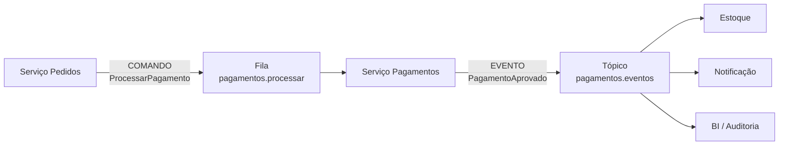
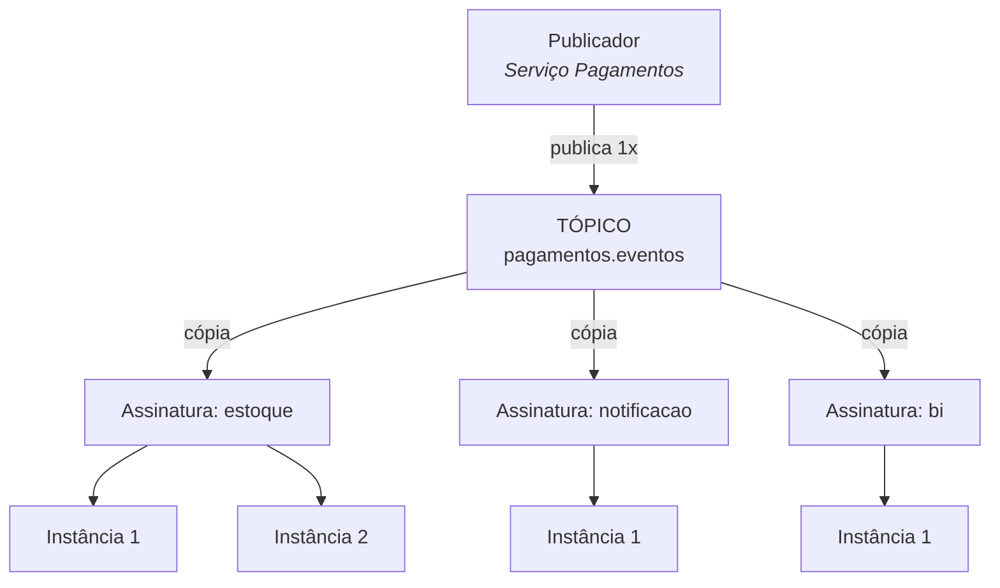
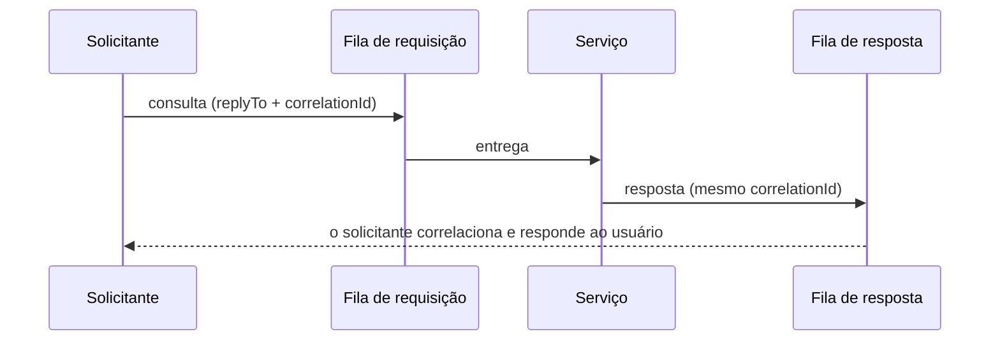
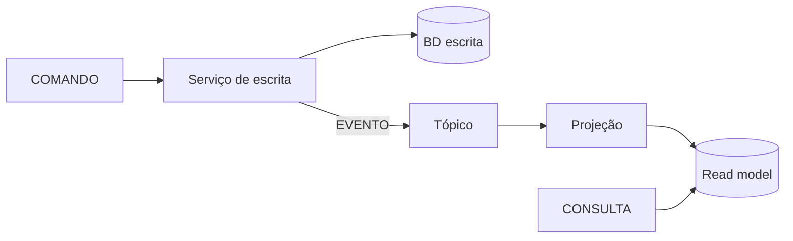

# I - TIPOS DE MENSAGEM

> [← Voltar para FUNDAMENTOS DE MENSAGERIA](README.md) · Próximo: [II - MESSAGE BROKERS](ii-message-brokers.md)

Toda mensagem carrega uma **intenção**, e é a intenção que define o modelo de entrega, o acoplamento e o tratamento de erro. São três:

| | **Comando** | **Evento** | **Consulta** |
|---|---|---|---|
| Intenção | "**faça** isto" | "isto **aconteceu**" | "**me diga** isto" |
| Tempo verbal | imperativo (`ProcessarPagamento`) | **passado** (`PagamentoAprovado`) | interrogativo (`ObterSaldo`) |
| Destinatário | **um**, conhecido | **desconhecido**, quantos quiserem | um ou vários agregados |
| Pode ser recusado? | **sim** (é um pedido) | **não** (é um fato consumado) | — |
| Muda estado? | sim | já mudou (é o registro) | **não** |
| Modelo | **fila** (point-to-point) | **tópico** (pub/sub) | request-reply |
| Acoplamento | o emissor conhece o destino | nenhum | o emissor espera a resposta |
| Quem "manda" | o **produtor** decide o que deve ser feito | o **consumidor** decide o que fazer | o consumidor responde |

---

## 1. Comando

> Envia uma **instrução necessária**, direcionada a um **único destinatário**, ponta a ponta, necessita ser **processado apenas uma vez**, e **pode gerar um evento** após ser processado.

O comando é um **pedido de ação**. Quem envia sabe exatamente o que quer que aconteça e sabe **quem** deve fazer.

```json
// fila: pagamentos.processar
{
  "messageId": "9f2c-4b31-a8e0",           // id único → deduplicação
  "type": "ProcessarPagamento",            // IMPERATIVO: uma ordem
  "correlationId": "ped-4821",
  "traceId": "4bf92f3577b34da6",
  "timestamp": "2026-09-20T14:32:10Z",
  "payload": {
    "pedidoId": "ped-4821",
    "valor": 250.00,
    "metodo": "CARTAO_CREDITO",
    "token": "tok_xyz"
  }
}
```

**Características:**

| Característica | Detalhe |
|---|---|
| **Destinatário único** | vai para **uma** fila, consumida por **um** serviço. Enviar o mesmo comando a dois serviços significa que o efeito aconteceria duas vezes |
| **Processado uma única vez** | executar duas vezes cobraria duas vezes. Como a entrega real é *at-least-once*, o consumidor **precisa ser idempotente** → [III](iii-padroes-de-entrega.md) |
| **Pode ser recusado** | o destinatário valida e pode rejeitar ("cartão inválido"). Comando é **pedido**, não fato |
| **Gera evento depois** | processado com sucesso, o serviço publica `PagamentoAprovado` — e aí o mundo fica sabendo |
| **Acoplamento moderado** | o emissor conhece o destino e o contrato do comando. Menos acoplado que chamada síncrona (não espera, não precisa que esteja no ar), mais acoplado que evento |

**O fluxo típico — comando entra, evento sai:**



Esse é **o padrão mais importante da matéria**: o comando é dirigido e privado (uma fila, um dono); o evento resultante é público e anônimo (um tópico, N interessados). O serviço de Pedidos não sabe que existe BI — e nem precisa saber.

**Nomenclatura:** verbo no **imperativo** + substantivo — `ProcessarPagamento`, `EnviarNotificacao`, `ReservarEstoque`, `CancelarPedido`. Se o nome não puder ser lido como uma ordem, provavelmente não é um comando.

**Erro:** como existe um dono claro, o erro é **dele**. O tratamento é retry com backoff e, esgotadas as tentativas, **DLQ**. → [IV](iv-padroes-de-uso-e-operacao.md)

---

## 2. Evento

> **Notificação de algo que ocorreu**, não é direcionado a um serviço específico, pode ter **múltiplos consumidores** (pub/sub), e pode ser **armazenado para histórico ou reprocessamento**.

O evento é um **fato consumado**. Ele não pede nada: **avisa**. Quem reage — e se alguém reage — não é problema de quem publicou.

```json
// tópico: pagamentos.eventos
{
  "eventId": "e7a1-9c03-4d55",
  "type": "PagamentoAprovado",             // PASSADO: já aconteceu
  "aggregateId": "pag-1190",
  "occurredAt": "2026-09-20T14:32:14Z",
  "version": 2,                            // versão do CONTRATO do evento
  "traceId": "4bf92f3577b34da6",
  "payload": {
    "pagamentoId": "pag-1190",
    "pedidoId": "ped-4821",
    "valor": 250.00,
    "metodo": "CARTAO_CREDITO",
    "aprovadoEm": "2026-09-20T14:32:14Z"
  }
}
```

**Características:**

| Característica | Detalhe |
|---|---|
| **Fato imutável do passado** | não se "cancela" um evento; publica-se outro (`PagamentoEstornado`) |
| **Não tem destinatário** | o publicador não conhece — e não deve conhecer — os assinantes |
| **Múltiplos consumidores** | cada um reage à sua maneira, no seu ritmo |
| **Não pode ser recusado** | um consumidor pode falhar ao processar, mas o fato continua tendo acontecido |
| **Armazenável** | fica retido no tópico por um período (ou para sempre), permitindo **histórico e reprocessamento** |
| **Acoplamento mínimo** | é o modelo mais desacoplado — e o mais difícil de depurar |

**Nomenclatura:** substantivo + verbo no **particípio/passado** — `PedidoCriado`, `PagamentoAprovado`, `EstoqueReservado`, `ClienteCadastrado`. Nome no futuro ou imperativo (`EnviarEmail`) denuncia um **comando disfarçado de evento**: é o erro de modelagem mais comum, e ele reintroduz o acoplamento que o evento deveria eliminar.

### Histórico e reprocessamento — o que a retenção permite

Como o broker guarda os eventos (por tempo, tamanho, ou indefinidamente), abrem-se possibilidades que a chamada síncrona nunca teve:

| Possibilidade | Como |
|---|---|
| **Replay** | um serviço com bug reprocessa os eventos do último mês depois da correção |
| **Novo consumidor com histórico** | um serviço de BI criado hoje lê os eventos **desde o início** e nasce com a base completa |
| **Reconstrução de estado** | se o banco de leitura se corromper, ele é reconstruído do zero a partir dos eventos |
| **Auditoria nativa** | a sequência de eventos **é** o histórico do que aconteceu |
| **Debug temporal** | reproduzir exatamente a sequência que causou o bug |

Isso só vale para brokers que **retêm** (Kafka, Pulsar). Um broker de fila tradicional (RabbitMQ, SQS) **apaga** a mensagem após o ack — não há replay. É a diferença mais importante entre as duas famílias. → [II - MESSAGE BROKERS](ii-message-brokers.md)

### Os três sabores de evento

| Tipo | O evento carrega | Consequência |
|---|---|---|
| **Event notification** | só o aviso + o id (`PedidoCriado{id}`) | payload mínimo; o consumidor **chama de volta** para obter os dados (acopla, mas o dado é sempre atual) |
| **Event-carried state transfer** | os dados relevantes dentro do evento | o consumidor fica **autônomo** e mantém uma réplica local; consistência eventual e payload maior |
| **Event sourcing** | o evento **é** a fonte da verdade; o estado é derivado por replay | auditoria e time travel completos; complexidade alta |

→ [Arquitetura Distribuída - Consistência](../arquitetura-distribuida/iii-consistencia-e-dados.md)

---

## 3. Pub/Sub em profundidade

**Publish/Subscribe** é o mecanismo que torna o evento possível: o publicador manda para um **tópico**, e o broker entrega **uma cópia para cada assinatura**.



Repare nos **dois níveis**, que é onde quase todo mundo se confunde:

1. **Entre assinaturas** → comportamento de **tópico**: cada assinatura (cada serviço interessado) recebe **sua própria cópia** de toda mensagem.
2. **Dentro de uma assinatura** → comportamento de **fila**: as várias instâncias do mesmo serviço **dividem** as mensagens, cada uma processando um subconjunto.

É assim que se tem, ao mesmo tempo, *fan-out* entre serviços e **escala horizontal** dentro de cada um. No Kafka isso se chama **consumer group**; no RabbitMQ se monta com um *exchange* fanout mais uma fila por serviço; no Google Pub/Sub e no Azure Service Bus, chama-se **subscription**.

### Conceitos do pub/sub

| Conceito | O que é |
|---|---|
| **Tópico** | o canal nomeado onde os eventos são publicados |
| **Assinatura** (*subscription*) | o "ponto de vista" de um consumidor sobre o tópico; guarda **até onde ele já leu** |
| **Fan-out** | a multiplicação da mensagem para todos os assinantes |
| **Offset / posição** | o marcador de leitura de cada assinatura (Kafka) |
| **Assinatura durável** | sobrevive à queda do consumidor: ao voltar, ele continua de onde parou |
| **Assinatura não durável** | só recebe enquanto está conectado; o que passou, passou |
| **Filtro de assinatura** | o assinante recebe só o que casa com um critério (`valor > 1000`, `tipo = PIX`) — reduz tráfego e processamento inútil |
| **Push × pull** | o broker **empurra** para o consumidor (SNS, webhook) ou o consumidor **puxa** no ritmo dele (Kafka, SQS) |

**Push × pull** é uma decisão com consequências: *push* tem latência menor, mas pode **afogar** o consumidor (sem backpressure); *pull* dá ao consumidor o controle do ritmo — é o que permite ao Kafka absorver picos enormes sem derrubar ninguém.

### Aplicações reais de pub/sub

| Domínio | Evento publicado | Quem assina (e para quê) |
|---|---|---|
| **E-commerce** | `PedidoCriado` | Estoque (reservar) · Fiscal (emitir NF) · Notificação (e-mail) · Antifraude (analisar) · BI (dashboard) · Logística (pré-alocar frete) |
| **Fintech / banco** | `TransacaoRealizada` | Extrato (atualizar) · Antifraude (padrões) · Limite (recalcular) · Cashback · Regulatório (reportar ao Bacen) · Push no app |
| **Streaming (Netflix, Spotify)** | `VideoAssistido` | Recomendação · Continuar assistindo · Billing de royalties · Métricas de engajamento |
| **Transporte (Uber, iFood)** | `CorridaAceita` | Rastreamento em tempo real · Precificação · Notificação ao cliente · ETA · Repasse ao parceiro |
| **IoT / indústria** | `LeituraSensor` | Alarme · Série temporal · Manutenção preditiva · Painel de operação |
| **Rede social** | `PostPublicado` | Timeline dos seguidores · Busca (indexar) · Moderação · Notificação · Tendências |
| **Logística** | `PacoteMovimentado` | Rastreio do cliente · SLA de entrega · Previsão de chegada · Faturamento |

**O padrão que se repete:** um fato é publicado **uma vez** e alimenta entre 4 e 8 consumidores independentes. Se essa integração fosse síncrona, o serviço de Pedidos precisaria chamar seis serviços, esperar seis respostas, tratar seis falhas — e seria alterado toda vez que surgisse um sétimo interessado. Com pub/sub, o novo consumidor **apenas assina**, e o produtor nem fica sabendo.

---

## 4. Consulta

> Solicitação de uma **informação específica**, apenas **leitura**, **não muda estado**, pode ser processada por um **único serviço** ou por **agregação de múltiplas fontes**.

A consulta pergunta e **espera resposta** — por isso ela é a mensagem que **menos** combina com mensageria pura: precisa de uma via de volta.

```json
{
  "queryId": "q-77c1",
  "type": "ObterSaldoConsolidado",
  "replyTo": "respostas.q-77c1",           // para ONDE mandar a resposta
  "correlationId": "q-77c1",               // para RELACIONAR pergunta e resposta
  "payload": { "clienteId": "cli-1029" }
}
```

### Request-Reply sobre mensageria

Quando a consulta trafega por broker, o padrão é **request-reply** (também chamado *request-response*):



Dois elementos tornam isso possível: **`replyTo`** (o endereço da fila de resposta, geralmente temporária e exclusiva do solicitante) e **`correlationId`** (o identificador que amarra a resposta à pergunta, já que várias podem chegar fora de ordem).

**Vale a pena?** Quase sempre **não**: você reintroduz o acoplamento temporal (o solicitante espera), acrescenta latência de dois saltos no broker e ainda precisa de timeout. Para consulta, **REST ou gRPC costumam ser melhores**. → [gRPC](../grpc-e-graphql/i-grpc.md)

**Quando request-reply se justifica:** quando o broker já é o único canal de integração disponível (rede segmentada, sistema legado), quando se quer aproveitar o balanceamento e a resiliência da fila, ou em RPC interno sobre mensageria (o que o Spring faz com `RabbitTemplate.convertSendAndReceive`).

### Agregação de múltiplas fontes

Quando a resposta depende de vários serviços, há dois caminhos:

| Estratégia | Como funciona | Quando |
|---|---|---|
| **Scatter-gather** | envia a pergunta a N serviços em paralelo, coleta as respostas e agrega (com timeout: quem não responder fica de fora) | dado precisa estar **sempre atual** |
| **Read model (CQRS)** | um serviço mantém uma **visão materializada** alimentada pelos eventos; a consulta lê só dali, numa fonte | consulta frequente, muitas fontes, filtro complexo |

O **read model** é a resposta mais elegante e mostra como os três tipos se encaixam: **comandos** mudam o estado, **eventos** propagam a mudança, e a **consulta** lê de uma projeção já pronta — sem incomodar ninguém.



→ [Arquitetura Distribuída - CQRS](../arquitetura-distribuida/iii-consistencia-e-dados.md)

---

## 5. Como escolher — e os erros clássicos

**O teste das três perguntas:**

1. Estou **mandando alguém fazer** algo? → **comando** (fila)
2. Estou **avisando que algo aconteceu**? → **evento** (tópico)
3. Estou **perguntando** algo? → **consulta** (preferencialmente síncrona)

| Erro | Por que é um problema |
|---|---|
| **Comando disfarçado de evento** (`EnviarEmailSolicitado`) | o nome finge desacoplamento, mas o produtor sabe exatamente o que deve acontecer. Se só há um consumidor possível e o produtor depende do efeito, é comando |
| **Evento disfarçado de comando** | o produtor manda cada serviço fazer sua parte, virando um orquestrador acidental e conhecendo todo mundo |
| **Evento anêmico demais** | `PedidoAtualizado{id}` sem dizer **o que** mudou obriga todos a consultar de volta, gerando N chamadas síncronas |
| **Evento gordo demais** | carregar o agregado inteiro acopla os consumidores ao seu modelo interno — mudar um campo quebra todo mundo |
| **Evento no tempo errado** | publicar **antes** de commitar no banco: o consumidor reage a algo que talvez dê rollback → use **Outbox** |
| **Consulta via fila sem timeout** | o solicitante espera para sempre uma resposta que não virá |

> **Regra de ouro do contrato:** o evento pertence a **quem publica**, mas o contrato pertence a **todos**. Adicionar campo opcional é seguro; remover, renomear ou mudar significado quebra consumidores que você talvez nem saiba que existem. Versione o evento e mantenha compatibilidade. → [IV - Versionamento](iv-padroes-de-uso-e-operacao.md)

---

## Perguntas para autoavaliação

1. Qual a intenção de cada um dos três tipos de mensagem?
2. Por que comando vai em fila e evento vai em tópico?
3. Um comando pode ser recusado. E um evento? Por quê?
4. Descreva o fluxo "comando entra, evento sai" com um exemplo.
5. Qual a convenção de nomenclatura de comandos e de eventos?
6. Por que um evento chamado `EnviarEmail` está mal modelado?
7. O que a retenção de eventos permite que a chamada síncrona nunca permitiu? Cite três usos.
8. Diferencie event notification, event-carried state transfer e event sourcing.
9. Explique os **dois níveis** do pub/sub (entre assinaturas e dentro de uma assinatura).
10. O que é uma assinatura durável e por que isso importa?
11. Push × pull: qual dá controle de ritmo ao consumidor e por quê?
12. Dê dois exemplos reais de pub/sub com pelo menos quatro consumidores cada.
13. Por que consulta é o tipo que menos combina com mensageria?
14. Para que servem `replyTo` e `correlationId`?
15. Compare scatter-gather e read model para agregar dados de várias fontes.
16. Cite três erros de modelagem de mensagem e o efeito de cada um.

---

> [← Voltar para FUNDAMENTOS DE MENSAGERIA](README.md) · Próximo: [II - MESSAGE BROKERS](ii-message-brokers.md)
