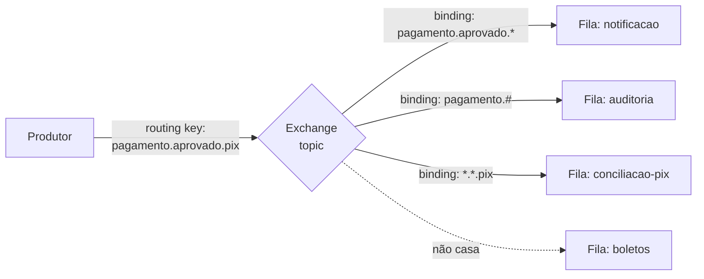
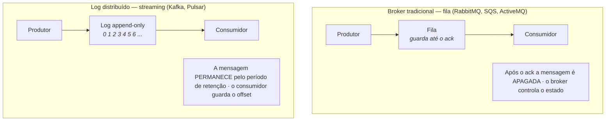
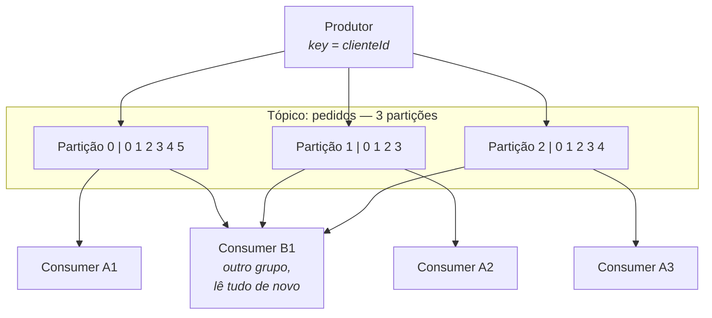
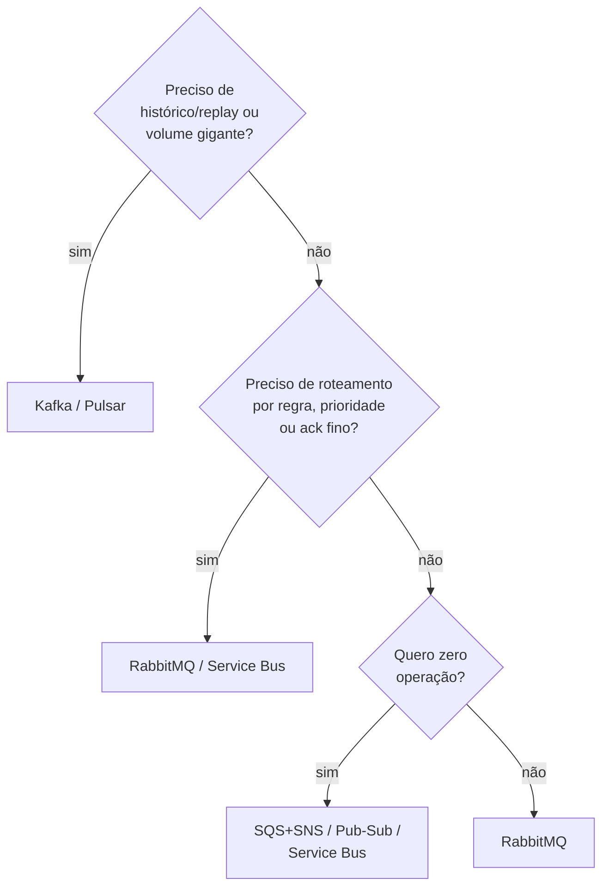

# II - MESSAGE BROKERS

> [← Voltar para FUNDAMENTOS DE MENSAGERIA](README.md) · Anterior: [I - TIPOS DE MENSAGEM](i-tipos-de-mensagem.md) · Próximo: [III - PADRÕES DE ENTREGA](iii-padroes-de-entrega.md)

## 1. O que é e por que existe

O **message broker** é o intermediário que fica entre produtores e consumidores. Sem ele, produtor e consumidor precisariam se conhecer, estar no ar ao mesmo tempo e combinar ritmo — ou seja, todo o acoplamento que a mensageria existe para eliminar.

## 2. Funções principais

| Função | O que faz |
|---|---|
| **Recebimento e confirmação** | aceita a mensagem do produtor e confirma (*publisher ack*) que a recebeu |
| **Persistência / durabilidade** | grava em disco para que a mensagem sobreviva a uma queda do broker |
| **Roteamento** | decide **para onde** cada mensagem vai (fila, tópico, regra de roteamento) |
| **Entrega e ack** | entrega ao consumidor e só descarta após a confirmação de processamento |
| **Enfileiramento e buffering** | acumula o que o consumidor ainda não processou, absorvendo picos |
| **Controle de fluxo** | limita quantas mensagens não confirmadas cada consumidor recebe (*prefetch*), evitando afogá-lo |
| **Ordenação** | preserva a ordem dentro da unidade de ordenação (fila, partição, sessão) |
| **Retenção / replay** | guarda mensagens por tempo ou tamanho, permitindo reprocessar (nos brokers de log) |
| **Redelivery e DLQ** | reentrega o que falhou e isola a mensagem "envenenada" |
| **Segurança** | autenticação, autorização por fila/tópico e criptografia em trânsito |
| **Observabilidade** | métricas de profundidade de fila, *lag*, taxa de publicação e consumo |
| **Transformação e filtro** | (em alguns) filtra por atributo ou converte formato |

> ⚠️ Cuidado com a última: colocar **regra de negócio** no broker foi exatamente o erro do **ESB** na era SOA — o barramento vira um monstro central, ponto de falha e de disputa entre times. O lema moderno é **"smart endpoints, dumb pipes"**: a inteligência fica nos serviços, o broker só transporta e roteia. → [Arquitetura Distribuída](../arquitetura-distribuida/i-estilos-arquiteturais.md)

---

## 3. Os três modelos de organização

### a) Baseado em fila (point-to-point)

Uma fila nomeada; produtores empilham, consumidores competem. Cada mensagem vai para **um** consumidor.

```
produtor → [ m5 m4 m3 m2 m1 ] → consumidor A (pega m1)
                               → consumidor B (pega m2)
```

É o modelo do **comando** e do padrão **competing consumers**: quer mais vazão? suba mais consumidores.

### b) Baseado em tópico (publish/subscribe)

Um tópico; cada assinatura recebe **uma cópia** de tudo. É o modelo do **evento**. → [I - TIPOS DE MENSAGEM](i-tipos-de-mensagem.md)

### c) Baseado em padrão de roteamento

Aqui a mensagem não vai direto para a fila: ela chega a um **exchange**, que decide o destino a partir de uma **routing key** e das **bindings** configuradas. É o modelo do RabbitMQ (AMQP), e é o mais flexível dos três.



**Os quatro tipos de exchange do AMQP:**

| Exchange | Regra de roteamento | Uso típico |
|---|---|---|
| **direct** | a routing key precisa ser **exatamente igual** ao binding | roteamento por tipo: `pagamento.erro` → fila de erros |
| **fanout** | ignora a chave e copia para **todas** as filas ligadas | pub/sub puro (broadcast) |
| **topic** | casamento por **padrão** com curingas: `*` = uma palavra, `#` = zero ou mais | o mais usado: `pedido.*.br`, `pagamento.#` |
| **headers** | roteia por **atributos** do cabeçalho, não pela chave | critérios múltiplos (`tipo=pix AND valor=alto`) |

Com isso dá para montar qualquer topologia: fila simples (direct), pub/sub (fanout), assinatura seletiva (topic) e filtros (headers) — tudo com o mesmo mecanismo.

---

## 4. As duas famílias de broker

A distinção mais importante para escolher ferramenta — e a que mais cai em prova:



| | **Broker de fila** (*smart broker, dumb consumer*) | **Log distribuído** (*dumb broker, smart consumer*) |
|---|---|---|
| Exemplos | RabbitMQ, ActiveMQ, SQS, Azure Service Bus | **Kafka**, Pulsar, Kinesis, Redis Streams |
| Após o consumo | a mensagem é **apagada** | **permanece** até a retenção expirar |
| Quem controla a posição | o **broker** (sabe o que foi entregue) | o **consumidor** (guarda seu *offset*) |
| Replay / reprocessar | ❌ não (a mensagem sumiu) | ✅ **sim** — é a grande vantagem |
| Roteamento | rico e flexível (exchanges, filtros) | simples (tópico + partição) |
| Vazão | alta (dezenas/centenas de milhares/s) | **altíssima** (milhões/s) |
| Ordenação | por fila | por **partição** |
| Entrega individual (ack por mensagem) | ✅ | ❌ trabalha por offset/lote |
| Uso natural | **tarefas e comandos**, roteamento complexo | **eventos**, streaming, histórico, analytics |

**Consequência prática:** com RabbitMQ, uma mensagem consumida e confirmada **não existe mais** — se um bug corrompeu o processamento, o dado se perdeu. Com Kafka, basta **rebobinar o offset** e processar tudo de novo. É por isso que arquitetura orientada a eventos e pipelines de dados escolhem log distribuído, enquanto filas de trabalho escolhem broker tradicional.

---

## 5. Protocolos de mensagem

| Protocolo | Criado para | Modelo | Características |
|---|---|---|---|
| **AMQP 0-9-1** | mensageria corporativa robusta | fila + exchange + binding | o mais rico em roteamento; é o que o **RabbitMQ** implementa nativamente |
| **AMQP 1.0** | interoperabilidade entre brokers | ponto a ponto, orientado a *links* | padrão ISO/OASIS; usado pelo **Azure Service Bus** |
| **MQTT** | **IoT** e redes instáveis | publish/subscribe | leve (header de 2 bytes), tolera conexão ruim, **QoS 0/1/2**, *retained message*, *last will* |
| **STOMP** | simplicidade, texto | fila e tópico | baseado em texto, fácil de implementar; usado com WebSocket |
| **JMS** | Java | fila e tópico | ⚠️ **não é protocolo, é API** (especificação Jakarta Messaging). Padroniza o código, não o fio |
| **Kafka protocol** | alta vazão | log particionado | binário sobre TCP, otimizado para lote e *zero copy* |
| **HTTP / webhook** | integração simples e pública | request/response, push | universal, mas sem garantias nativas de entrega |

### MQTT em detalhe — o protocolo da IoT

Feito para dispositivos com pouca memória, bateria limitada e rede ruim (sensor, medidor, veículo). Ideias centrais:

- **Tópicos hierárquicos:** `fabrica/linha1/maquina3/temperatura`, com curingas na assinatura (`+` = um nível, `#` = todos os níveis abaixo).
- **QoS (Quality of Service)** — mapeia **exatamente** nos padrões de entrega do próximo capítulo:

| QoS | Garantia | Custo |
|---|---|---|
| **0** — *at most once* | envia e esquece ("fire and forget") | 1 mensagem; pode perder |
| **1** — *at least once* | confirma o recebimento; reenvia se não houver ack | 2 trocas; pode duplicar |
| **2** — *exactly once* | handshake de quatro etapas | 4 trocas; o mais caro |

- **Retained message:** o broker guarda a **última** mensagem de cada tópico e entrega a quem assinar depois — o sensor manda a temperatura de hora em hora, e quem conectar agora já vê o valor atual sem esperar.
- **Last Will and Testament (LWT):** o cliente registra, **ao conectar**, uma mensagem que o broker publicará **se ele cair** sem se despedir. É como a plataforma detecta dispositivo offline.
- **Keep-alive** e sessão persistente: o dispositivo pode reconectar e receber o que perdeu.

→ [III - PADRÕES DE ENTREGA](iii-padroes-de-entrega.md)

---

## 6. As ferramentas

### RabbitMQ

Broker AMQP tradicional, escrito em Erlang. O **canivete suíço** da mensageria.

| ✅ | ❌ |
|---|---|
| roteamento riquíssimo (os 4 exchanges) | **sem replay** — consumiu, acabou |
| ack por mensagem, prioridade, TTL, DLQ nativa | vazão menor que a do Kafka |
| fácil de subir e operar; interface de administração excelente | fila muito longa degrada a performance |
| plugins (MQTT, STOMP, shovel, federation) | escala horizontal mais trabalhosa (quorum queues ajudam) |
| suporta múltiplos protocolos | não serve como armazenamento de eventos |

**Use quando:** filas de trabalho, comandos, roteamento por regra, RPC sobre mensageria, prioridade e agendamento de mensagem.

### Apache Kafka

Log distribuído, particionado e replicado. Não é "uma fila melhor" — é **outra coisa**.



**Conceitos essenciais:**

| Conceito | O que é |
|---|---|
| **Tópico** | o fluxo nomeado de eventos |
| **Partição** | a unidade de **paralelismo** e de **ordenação**. A ordem é garantida **dentro** da partição, nunca entre partições |
| **Chave da mensagem** (*key*) | determina a partição (`hash(key) % nPartições`). Mesma chave → mesma partição → **ordem preservada** para aquela entidade |
| **Offset** | a posição da mensagem na partição; o consumidor guarda até onde leu |
| **Consumer group** | conjunto de consumidores que **dividem** as partições. Cada partição é lida por **um** membro do grupo |
| **Rebalance** | redistribuição das partições quando um consumidor entra ou sai |
| **Replicação (ISR)** | cada partição tem réplicas em outros brokers; `acks=all` espera as réplicas sincronizadas |
| **Retenção** | por tempo (`retention.ms`) ou tamanho; com **compactação** (*log compaction*), guarda a última mensagem de cada chave para sempre |

> **Duas regras de ouro do Kafka:** (1) **paralelismo máximo = número de partições** — 3 partições comportam no máximo 3 consumidores úteis no mesmo grupo, o quarto fica ocioso; (2) **ordem só existe dentro da partição** — se o pedido precisa ser processado em ordem, todas as suas mensagens precisam ter a **mesma chave**.

| ✅ | ❌ |
|---|---|
| vazão altíssima e escala horizontal real | curva de aprendizado e operação pesadas |
| **retenção e replay** | roteamento pobre (sem exchange, sem filtro no broker) |
| ordenação por partição | sem ack por mensagem individual |
| base natural para event sourcing, CQRS e analytics | exagerado para uma fila de e-mails |
| ecossistema (Connect, Streams, Schema Registry) | consumo de recursos alto |

**Use quando:** streaming de eventos, alto volume, necessidade de histórico/replay, várias equipes consumindo o mesmo fluxo, pipelines de dados.

### AWS SQS (+ SNS)

Fila gerenciada, sem servidor para operar.

| Tipo | Garantias |
|---|---|
| **Standard** | vazão quase ilimitada, **at-least-once**, ordem **não garantida** |
| **FIFO** | ordem garantida por *MessageGroupId*, deduplicação por 5 minutos, vazão limitada |

Conceitos próprios: **visibility timeout** (quanto tempo a mensagem some da fila enquanto é processada — se o consumidor não apagar nesse prazo, ela reaparece), **long polling** (reduz chamadas vazias) e **redrive policy** (DLQ automática após N tentativas).

**SQS é fila; quem faz pub/sub na AWS é o SNS** (tópicos). O padrão comum é **SNS → várias SQS** (fan-out): o SNS distribui e cada serviço tem sua fila durável. Para roteamento por regra de conteúdo, entra o **EventBridge**.

### Azure Service Bus

Broker corporativo gerenciado, AMQP 1.0. Tem **filas e tópicos com subscriptions** no mesmo produto, **filtros de assinatura** (SQL-like), **sessions** (ordenação por sessão, equivalente à chave do Kafka), **transações**, **agendamento de mensagem** e **duplicate detection** nativa por janela de tempo. Para streaming de altíssimo volume, o par na Azure é o **Event Hubs** (equivalente ao Kafka).

### Outras que aparecem

| Ferramenta | Nicho |
|---|---|
| **ActiveMQ / Artemis** | JMS clássico em ambiente Java corporativo |
| **Apache Pulsar** | fila **e** streaming no mesmo produto, multi-tenant, armazenamento separado do processamento |
| **NATS / JetStream** | altíssima performance e simplicidade; ótimo para comunicação interna |
| **Redis Streams** | leve, quando o Redis já existe no stack; menos garantias |
| **Google Pub/Sub** | equivalente gerenciado do SNS+SQS na GCP |
| **Amazon Kinesis** | equivalente gerenciado do Kafka na AWS |

---

## 7. Comparativo geral

| | **RabbitMQ** | **Kafka** | **SQS (+SNS)** | **Azure Service Bus** |
|---|---|---|---|---|
| Modelo | fila + roteamento | log particionado | fila (pub/sub via SNS) | fila + tópico |
| Protocolo | AMQP 0-9-1 (+MQTT, STOMP) | binário próprio | HTTPS (API) | AMQP 1.0 |
| Replay | ❌ | ✅ | ❌ | ❌ (Event Hubs sim) |
| Ordenação | por fila | por **partição** | só FIFO, por grupo | por **session** |
| Vazão | alta | **altíssima** | alta (escala sozinha) | alta |
| Roteamento | **o melhor** | simples | regra no SNS/EventBridge | filtros SQL-like |
| Operação | você opera (ou gerenciado) | complexa | **zero** | **zero** |
| Entrega | at-least-once | at-least-once (exactly-once com transações) | at-least-once (FIFO: exactly-once no processamento) | at-least-once (dedup nativa) |
| Melhor para | tarefas, comandos, roteamento | eventos, streaming, histórico | integrações AWS sem operação | corporativo Azure |

### Como escolher



Critérios que costumam decidir: **volume**, **necessidade de replay**, **complexidade de roteamento**, **garantia de ordem**, **quem vai operar** e **onde o resto do sistema já está** (nuvem e ecossistema contam muito). Na dúvida entre os dois mais comuns: **fila de trabalho → RabbitMQ; fluxo de eventos → Kafka.**

---

## Perguntas para autoavaliação

1. Cite seis funções de um message broker.
2. Por que colocar regra de negócio no broker é considerado um erro? Qual o lema moderno?
3. Explique os três modelos: fila, tópico e roteamento por padrão.
4. Quais são os quatro tipos de exchange do AMQP e a regra de cada um?
5. Qual a diferença entre `*` e `#` numa routing key de topic exchange?
6. Diferencie broker de fila e log distribuído em quatro aspectos.
7. Quem guarda a posição de leitura em cada família de broker?
8. Por que só o log distribuído permite replay?
9. JMS é protocolo? Justifique.
10. O que os QoS 0, 1 e 2 do MQTT garantem?
11. Para que servem retained message e Last Will no MQTT?
12. O que determina a partição de uma mensagem no Kafka, e por que isso afeta a ordem?
13. Com 3 partições, quantos consumidores úteis cabem num consumer group? Por quê?
14. O que é o visibility timeout do SQS?
15. Qual a diferença entre SQS Standard e FIFO?
16. Como se faz pub/sub na AWS, já que SQS é fila?
17. Quando escolher RabbitMQ e quando escolher Kafka?

---

> [← Voltar para FUNDAMENTOS DE MENSAGERIA](README.md) · Anterior: [I - TIPOS DE MENSAGEM](i-tipos-de-mensagem.md) · Próximo: [III - PADRÕES DE ENTREGA](iii-padroes-de-entrega.md)
