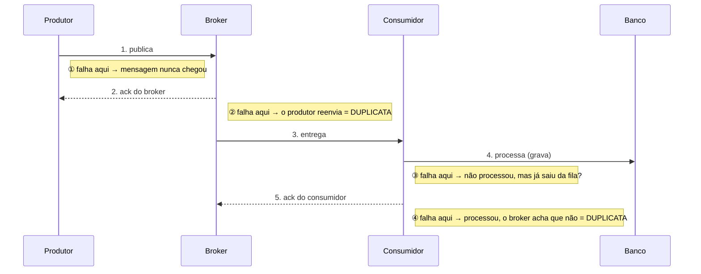
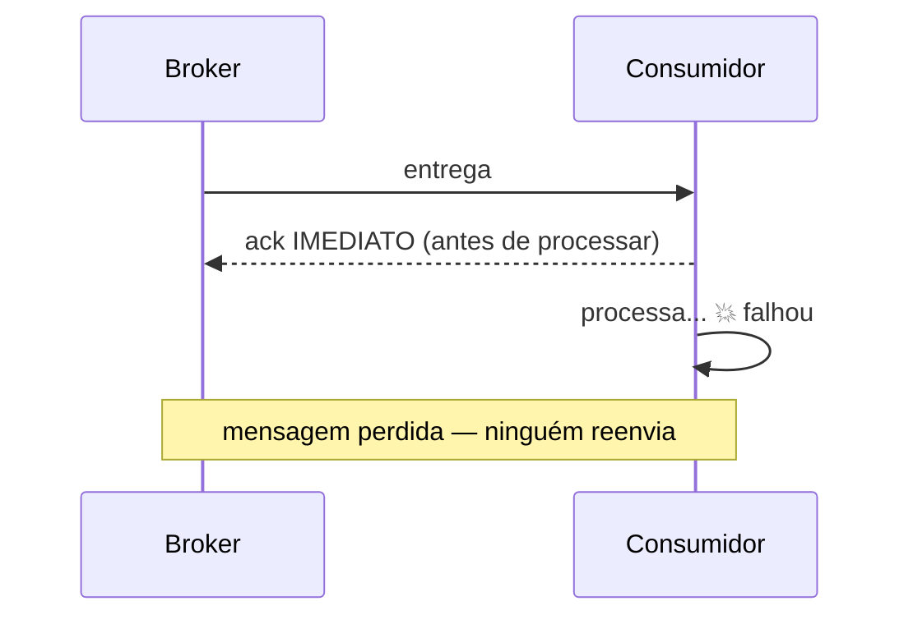
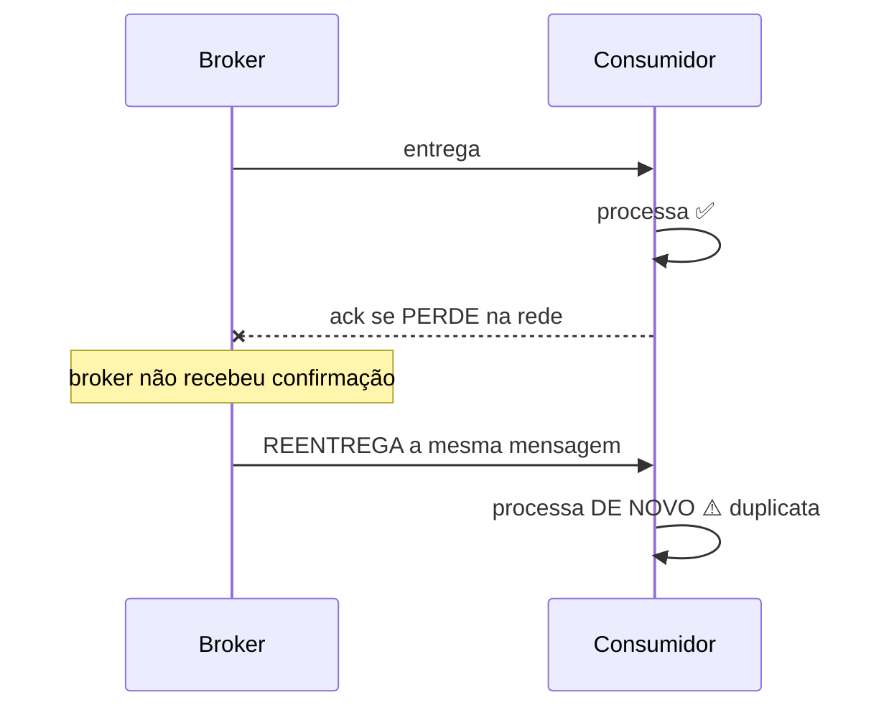
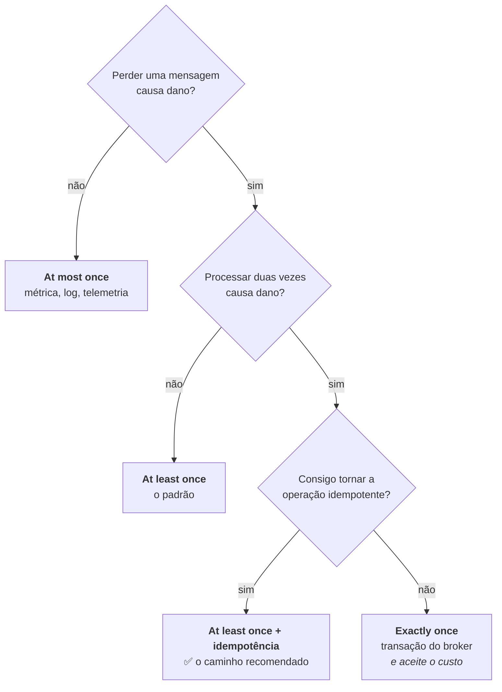

# III - PADRÕES DE ENTREGA

> [← Voltar para FUNDAMENTOS DE MENSAGERIA](README.md) · Anterior: [II - MESSAGE BROKERS](ii-message-brokers.md) · Próximo: [IV - PADRÕES DE USO E OPERAÇÃO](iv-padroes-de-uso-e-operacao.md)

## 1. Por que existem garantias diferentes

Numa rede, **confirmação pode se perder**. E quando ela se perde, quem enviou **não sabe** se o outro lado processou ou não. Essa é a *falha parcial* — o problema central de qualquer sistema distribuído. → [Arquitetura Distribuída](../arquitetura-distribuida/README.md)

Olhe onde uma mensagem pode se perder ou se duplicar:



A garantia escolhida é, no fundo, a resposta a uma única pergunta:

> **Na dúvida, o que é menos ruim: perder a mensagem ou processá-la duas vezes?**

O que define a garantia é **o momento do ack**: confirmar **antes** de processar significa que uma falha perde a mensagem; confirmar **depois** significa que uma falha a reentrega.

---

## 2. At most once — no máximo uma vez

> A mensagem é entregue **zero ou uma vez**. Nunca duplica, **pode perder**.

**Como funciona:** o consumidor confirma (*ack*) **antes** de processar — ou o produtor simplesmente envia sem esperar confirmação (*fire and forget*). Se algo falhar depois disso, ninguém reenvia: a mensagem simplesmente desaparece.



```java
// auto-ack: o broker considera entregue no momento em que envia
@RabbitListener(queues = "metricas", ackMode = "NONE")
public void consumir(Metrica m) { registrar(m); }   // se falhar aqui, a métrica se perde
```

| ✅ Vantagens | ❌ Desvantagens |
|---|---|
| **mais rápido** — sem espera de confirmação | **perda de mensagem** em qualquer falha |
| **menor overhead** de rede e de broker | impossível auditar o que se perdeu |
| **sem duplicata** — nenhuma lógica de dedup | inaceitável para dado crítico |
| implementação trivial | dificulta diagnóstico (some sem rastro) |

**Casos de uso** — sempre onde **perder uma amostra não muda nada**:

- **Telemetria e métricas de alta frequência** — um sensor manda temperatura a cada segundo; perder uma leitura entre 86.400 é irrelevante.
- **Logs não críticos** e rastreamento com amostragem.
- **Dados que expiram rápido** — cotação atualizada a cada 200 ms: a próxima já corrige.
- **Contadores estatísticos aproximados** (visualizações, cliques agregados).
- **MQTT QoS 0** em sensores de bateria limitada, onde cada confirmação custa energia.

> **Regra:** use quando o **volume é alto**, a **mensagem é substituível pela próxima** e a perda ocasional não gera dano. Nunca para dinheiro, pedido ou cadastro.

---

## 3. At least once — pelo menos uma vez

> A mensagem é entregue **uma ou mais vezes**. Nunca perde, **pode duplicar**.

**Como funciona:** o consumidor confirma **depois** de processar com sucesso. Se ele morrer no meio, ou se o ack se perder, o broker reentrega — e o processamento acontece de novo.



```java
@RabbitListener(queues = "pagamentos.processar")   // ack manual/automático APÓS o método
public void consumir(ProcessarPagamento cmd) {
    if (!processados.registrarSeNovo(cmd.messageId())) return;   // ← dedup obrigatória
    pagamentoService.processar(cmd);
}                                                   // ack só acontece se não lançou exceção
```

| ✅ Vantagens | ❌ Desvantagens |
|---|---|
| **nenhuma mensagem se perde** | **duplicatas são certas** (não "possíveis") |
| implementação simples e suportada por **todos** os brokers | exige **idempotência** em todo consumidor |
| combina com retry e DLQ naturalmente | reprocessamento custa recurso |
| permite reprocessar em caso de bug | pode gerar efeito colateral duplicado se mal implementado (e-mail duplicado, cobrança dupla) |

**Casos de uso** — praticamente **tudo que importa**:

- **Processamento de pagamento** — com chave de idempotência garantindo que a cobrança ocorra uma vez só.
- **Criação de pedido**, reserva de estoque, emissão de nota.
- **Integração entre serviços** em geral (eventos de domínio).
- **Notificações importantes** (com dedup para não enviar dois e-mails).
- **Pipelines de dados** com escrita idempotente (upsert por chave).
- **MQTT QoS 1**, SQS Standard, Kafka com `acks=all`, RabbitMQ com ack manual — todos são at-least-once.

> **É o padrão da indústria.** Praticamente todo sistema real roda at-least-once **mais idempotência** — e é isso que produz, na prática, o efeito de "exatamente uma vez". Volto a esse ponto na seção 5.

---

## 4. Exactly once — exatamente uma vez

> A mensagem é processada **uma única vez**: nem perde, nem duplica.

É o que todo mundo quer — e é o mais mal compreendido da matéria.

### A verdade incômoda

> **Entrega exactly-once é impossível** num sistema distribuído sujeito a falhas. **Processamento com efeito exactly-once é possível** — e é isso que as ferramentas entregam.

A impossibilidade vem do **problema dos dois generais**: dois participantes que se comunicam por um canal não confiável **nunca** conseguem ter certeza absoluta de que o outro recebeu a última mensagem — sempre existe o caso de o ack final se perder. Como não há como distinguir "não processou" de "processou e o ack sumiu", o remetente só tem duas opções: **reenviar** (podendo duplicar) ou **não reenviar** (podendo perder). Não há terceira.

O que se consegue, então, é **exactly-once semantics (EOS)**: a mensagem pode ser **entregue** várias vezes, mas o **efeito** acontece uma vez só. Há três caminhos:

**a) At-least-once + deduplicação (o caminho universal)**

```java
@Transactional
public void consumir(PagamentoAprovado evento) {
    // registra o id NA MESMA TRANSAÇÃO do efeito — a constraint UNIQUE arbitra a corrida
    if (!inbox.registrarSeNovo(evento.eventId())) return;    // já processei: ignora
    extrato.lancar(evento);
}
```
A tabela de deduplicação (*inbox*) e o efeito precisam estar na **mesma transação de banco**. Se estiverem separados, volta o problema de escrita dupla.

**b) Operação naturalmente idempotente**

```sql
UPDATE pedido SET status = 'PAGO' WHERE id = ? AND status = 'PENDENTE';  -- ✅ rodar 2x = mesmo estado
INSERT ... ON CONFLICT (id) DO UPDATE SET ...;                            -- ✅ upsert
UPDATE conta SET saldo = saldo - 100 WHERE id = ?;                        -- ❌ rodar 2x debita 200
```
Quando a operação **define** o estado final em vez de incrementá-lo, duplicata deixa de ser problema — nem dedup é preciso.

**c) Transações do broker (EOS nativo)**

O **Kafka** oferece isso de verdade dentro do seu próprio mundo:

```properties
# produtor idempotente: o broker deduplica reenvios pelo (producerId, sequência)
enable.idempotence=true
acks=all
transactional.id=servico-pagamentos-1

# consumidor: só enxerga mensagens de transações confirmadas
isolation.level=read_committed
```

Com `transactional.id`, o padrão **consume-process-produce** fica atômico: ler do tópico A, processar e escrever no tópico B **mais** o commit do offset acontecem numa única transação. Ou tudo vale, ou nada vale.

> **A ressalva que cai em prova:** a garantia do Kafka é **Kafka-para-Kafka**. Se o seu consumidor grava num **banco externo**, a transação do Kafka não cobre essa escrita — você voltou ao problema de dois sistemas e precisa de dedup ou de escrita idempotente no banco.

| ✅ Vantagens | ❌ Desvantagens |
|---|---|
| **nenhuma perda e nenhum efeito duplicado** | **mais lento** (coordenação, handshake, transação) |
| lógica de negócio mais simples (sem se preocupar com duplicata) | complexidade de configuração e operação |
| essencial onde duplicar é inaceitável | **escopo limitado** (não atravessa sistemas externos) |
| | exige estado de deduplicação, que cresce e precisa de janela/TTL |
| | reduz a vazão significativamente |

**Casos de uso** — onde duplicar causa **dano real e irreversível**:

- **Transações financeiras** — débito, transferência, cobrança de cartão, PIX.
- **Emissão de documento fiscal** — duas notas para a mesma venda geram problema tributário.
- **Contabilidade e conciliação** — lançamentos não podem ser contados duas vezes.
- **Controle de estoque** com margem apertada (vender duas vezes o último item).
- **Streaming de agregação** (Kafka Streams) — somas e contagens que precisam ser exatas.
- **MQTT QoS 2** — comandos críticos a dispositivos ("abrir a comporta").

---

## 5. Comparativo e a escolha prática

| | **At most once** | **At least once** | **Exactly once** |
|---|---|---|---|
| Perde? | **sim** | não | não |
| Duplica? | não | **sim** | não |
| Momento do ack | **antes** de processar | **depois** de processar | transacional / com dedup |
| Desempenho | ⚡ o mais rápido | rápido | 🐢 o mais lento |
| Complexidade | trivial | baixa (+ idempotência) | alta |
| Suporte dos brokers | universal | universal | limitado/condicionado |
| MQTT | QoS 0 | QoS 1 | QoS 2 |
| Exemplos | telemetria, log, métrica | **quase tudo** | financeiro, fiscal |



> ### A conclusão que vale levar para a prova
>
> **Não persiga exactly-once na entrega: torne o consumidor idempotente e use at-least-once.** O resultado observável é o mesmo — cada efeito acontece uma vez — com uma fração da complexidade e sem perder vazão. Exactly-once nativo se reserva para o que realmente não tolera duplicata e vive dentro de um único sistema transacional.

**Como cada ferramenta se posiciona:**

| Ferramenta | Garantia padrão | Como chegar ao efeito único |
|---|---|---|
| **RabbitMQ** | at-least-once (ack manual) | dedup na aplicação |
| **Kafka** | at-least-once (`acks=all`) | produtor idempotente + transações (Kafka→Kafka) ou dedup |
| **SQS Standard** | at-least-once | dedup na aplicação |
| **SQS FIFO** | exactly-once no processamento (janela de 5 min) | deduplicação nativa por `MessageDeduplicationId` |
| **Azure Service Bus** | at-least-once | *duplicate detection* nativa por janela de tempo |
| **MQTT** | QoS escolhido por mensagem | QoS 2 |

---

## 6. Garantias do lado do **produtor**

Metade da discussão costuma ser esquecida: a mensagem também pode se perder **antes** de chegar ao broker.

```properties
# Kafka — o que o produtor espera antes de considerar enviado
acks=0     # não espera nada → AT MOST ONCE (rápido, perde se o broker cair)
acks=1     # espera só o líder → perde se o líder cair antes de replicar
acks=all   # espera as réplicas sincronizadas → durável (+ min.insync.replicas=2)
```

No RabbitMQ, o equivalente são os **publisher confirms** (o broker confirma que persistiu) somados a **fila durável** + **mensagem persistente** — sem os três juntos, um restart do broker apaga mensagens.

E há o caso mais sutil: a aplicação grava no banco e **depois** publica. Se cair entre as duas coisas, o dado existe e o evento não. A solução é o padrão **Outbox**. → [IV - PADRÕES DE USO](iv-padroes-de-uso-e-operacao.md)

---

## Perguntas para autoavaliação

1. Por que a garantia de entrega depende do **momento do ack**?
2. Quais são os quatro pontos em que uma mensagem pode se perder ou duplicar?
3. Explique at-most-once: como funciona, vantagens, desvantagens e dois casos de uso.
4. Explique at-least-once: como funciona, vantagens, desvantagens e dois casos de uso.
5. Por que at-least-once é o padrão da indústria?
6. Por que a entrega exactly-once é impossível? Que problema clássico demonstra isso?
7. Qual a diferença entre *exactly-once delivery* e *exactly-once semantics*?
8. Quais são os três caminhos para obter efeito exactly-once?
9. Por que a tabela de dedup precisa estar na mesma transação do efeito?
10. Dê um exemplo de operação naturalmente idempotente e um de não idempotente.
11. Qual a limitação da garantia exactly-once do Kafka?
12. Relacione QoS 0, 1 e 2 do MQTT com os três padrões.
13. Em que situações vale pagar o custo do exactly-once nativo?
14. O que `acks=0`, `acks=1` e `acks=all` significam no produtor Kafka?
15. Qual a recomendação prática final sobre exactly-once?

---

> [← Voltar para FUNDAMENTOS DE MENSAGERIA](README.md) · Anterior: [II - MESSAGE BROKERS](ii-message-brokers.md) · Próximo: [IV - PADRÕES DE USO E OPERAÇÃO](iv-padroes-de-uso-e-operacao.md)
