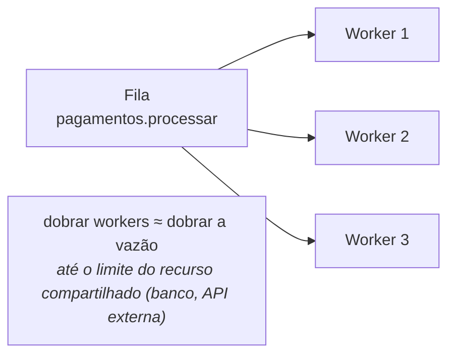
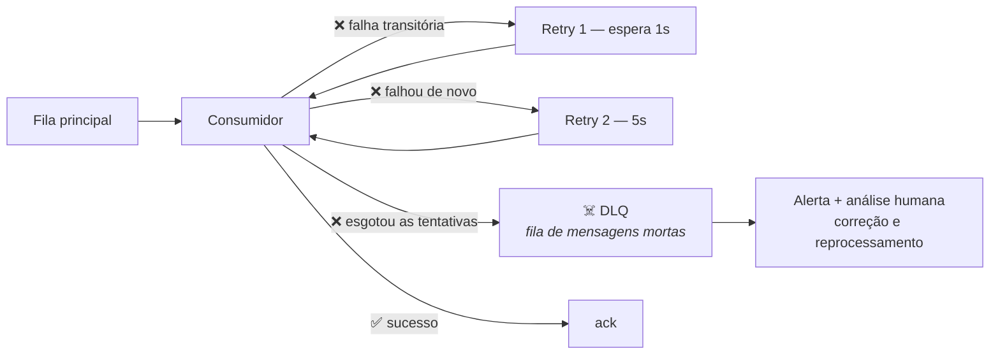
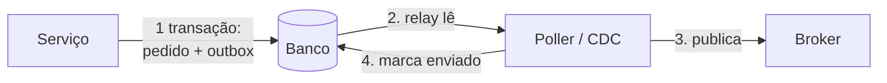

# IV - PADRÕES DE USO E OPERAÇÃO

> [← Voltar para FUNDAMENTOS DE MENSAGERIA](README.md) · Anterior: [III - PADRÕES DE ENTREGA](iii-padroes-de-entrega.md)

O que separa "publiquei uma mensagem" de um sistema de mensageria que funciona em produção.

## 1. Competing consumers — como se escala

Vários consumidores lendo a **mesma** fila: cada mensagem vai para um deles, e a vazão cresce com o número de consumidores.



O limite raramente é o broker: é o **recurso compartilhado** lá embaixo. Vinte workers batendo num banco com pool de 10 conexões só criam fila em outro lugar.

**Prefetch / concurrency** é o botão que controla isso: quantas mensagens não confirmadas cada consumidor segura por vez.

```java
@RabbitListener(queues = "pagamentos", concurrency = "3-10")   // 3 a 10 threads
@KafkaListener(topics = "pedidos", concurrency = "3")          // 3 threads = 3 partições
```

Prefetch alto aumenta a vazão e **piora o balanceamento** (um consumidor acumula mensagens enquanto outro fica ocioso) e o tempo de reentrega em caso de queda. Prefetch 1 é justo e mais lento. Para tarefas longas e desiguais, prefira valores baixos.

---

## 2. Ordenação — o trade-off mais incômodo

Mensageria **não garante ordem global**. O que existe é ordem dentro de uma **unidade de ordenação**:

| Broker | Unidade de ordenação |
|---|---|
| RabbitMQ | a **fila** (com **um** consumidor) |
| Kafka | a **partição** |
| SQS FIFO | o **MessageGroupId** |
| Azure Service Bus | a **session** |

> **A tensão central:** ordem exige **serialização**; vazão exige **paralelismo**. Os dois são opostos — e a saída é **não pedir ordem global**, e sim ordem **por entidade**.

```java
// Kafka: a chave define a partição → todas as mensagens do MESMO pedido
// caem na MESMA partição e são processadas em ordem.
// Pedidos diferentes seguem em paralelo.
kafkaTemplate.send("pedidos", pedido.getId(), evento);
//                            ^^^^^^^^^^^^^^ chave de particionamento
```

Escolher a chave é decisão de projeto: `pedidoId` dá ordem por pedido; `clienteId` dá ordem por cliente (e concentra mais mensagens por partição). **Chave mal escolhida gera partição quente** — um cliente gigante monopoliza uma partição enquanto as outras ficam ociosas.

**Quando ordem realmente importa:** máquina de estados (`Criado → Pago → Enviado`; receber fora de ordem quebra a regra), CDC de banco (`UPDATE` antes do `INSERT` é incoerente), e lançamentos contábeis sequenciais.

**Alternativa a exigir ordem:** tornar o consumidor **tolerante a desordem** — carregando um número de versão na mensagem e descartando o que for mais antigo que o estado atual. Costuma ser mais barato que serializar o processamento.

---

## 3. Retry e Dead Letter Queue



**Retry** faz sentido para falha **transitória** (banco indisponível, timeout de API, deadlock). Não faz sentido para falha **permanente** (mensagem malformada, regra de negócio violada, campo obrigatório ausente) — repetir mil vezes dará mil erros iguais.

| Estratégia | Como |
|---|---|
| **Retry imediato** | 1–2 tentativas em memória, para falha instantânea |
| **Retry com backoff** | espera crescente (1s → 5s → 30s) **com jitter** → [Resiliência](../arquitetura-distribuida/iv-resiliencia.md) |
| **Retry queue / delay queue** | a mensagem vai para uma fila de espera com TTL e volta depois (no RabbitMQ: **TTL + dead-letter exchange**; no Kafka: **tópicos de retry** por faixa de atraso) |
| **DLQ** | esgotadas as tentativas, a mensagem é isolada numa fila separada |

> ⚠️ **Retry bloqueante mata o consumo.** Numa fila, tentar a mesma mensagem indefinidamente trava todas as que vieram atrás — é a **poison message** (mensagem envenenada). Por isso o retry precisa de **limite** e a DLQ precisa existir: é ela que tira a mensagem problemática do caminho.

**A DLQ não é lixeira, é caixa de entrada de problema:**

- **Monitore** — DLQ sem alerta é cemitério silencioso; mensagem chegando lá é incidente.
- **Preserve o contexto** — grave o motivo da falha, a stack, o número de tentativas e o `traceId` nos headers.
- **Tenha um caminho de reprocessamento** — depois de corrigir o bug, precisa haver como devolver as mensagens à fila original.
- **Defina retenção** — DLQ cheia também enche disco.

---

## 4. Transactional messaging: Outbox e Inbox

```java
// ❌ DUAL WRITE: dois sistemas, nenhuma atomicidade
@Transactional
public void criar(Pedido p) {
    repository.save(p);                      // commitou no banco...
    kafka.send("pedidos", evento);           // ...e se falhar aqui? evento perdido
}                                            // (ou o inverso: evento publicado e rollback no banco)
```

**Outbox (lado do produtor):** grave o evento numa tabela do **mesmo banco, na mesma transação**; um processo separado (poller ou **CDC** com Debezium) lê a tabela e publica.



**Inbox (lado do consumidor):** registre o id da mensagem processada numa tabela, na mesma transação do efeito, e descarte duplicatas. É a deduplicação do capítulo anterior, agora com nome.

Juntos, os dois fecham o ciclo: **Outbox** garante que o evento não se perde; **Inbox** garante que ele não é aplicado duas vezes. → [Arquitetura Distribuída - Consistência](../arquitetura-distribuida/iii-consistencia-e-dados.md)

E quando o processo tem vários passos entre serviços, com necessidade de desfazer, o padrão é a **Saga** — sequência de transações locais com compensação, tipicamente coordenada por mensagens.

---

## 5. Contrato e versionamento de mensagem

Um evento publicado é um **contrato público**: você não sabe quem consome hoje, muito menos daqui a um ano. E, diferente de uma API REST, **não dá para versionar a URL**.

| Mudança | Quebra consumidor? |
|---|---|
| Adicionar campo **opcional** | não (se o consumidor for tolerante) |
| Adicionar novo tipo de evento | não |
| Remover ou renomear campo | **sim** |
| Mudar tipo (`string` → `number`) ou formato de data | **sim** |
| Tornar campo opcional em obrigatório | **sim** |
| Mudar o **significado** de um campo | **sim — e em silêncio** (a pior) |

**Princípio do *tolerant reader*:** ignore campos que você não conhece, não dependa da ordem, não quebre por causa de um campo novo. No Jackson, é `fail-on-unknown-properties: false`.

**Estratégias de versionamento:**

- **Campo `version` no envelope** e o consumidor tratando as versões que conhece.
- **Novo tópico por versão maior** (`pedidos.v2`), publicando nos dois durante a transição.
- **Upcasting**: converter a mensagem antiga para o formato novo na entrada do consumidor.

**Schema Registry** (Confluent, Apicurio) resolve isso de forma sistemática com **Avro**, **Protobuf** ou **JSON Schema**: o schema fica registrado, a mensagem carrega apenas o id dele, e o registry **valida a compatibilidade** antes de aceitar uma versão nova — `BACKWARD` (o consumidor novo lê o dado antigo), `FORWARD` (o consumidor antigo lê o dado novo) ou `FULL`. É o equivalente, para eventos, do que o `.proto` faz no gRPC. → [gRPC](../grpc-e-graphql/i-grpc.md)

Para documentar o contrato de forma legível, o padrão é o **AsyncAPI** — o "OpenAPI da mensageria".

---

## 6. Observabilidade e operação

**As métricas que importam:**

| Métrica | O que indica |
|---|---|
| **Consumer lag** (Kafka) | quantas mensagens o consumidor está atrás. **A métrica número um**: lag crescente = consumo não acompanha a produção |
| **Profundidade da fila** | o equivalente em broker tradicional |
| **Idade da mensagem mais antiga** | melhor que a profundidade: mostra **quanto tempo** algo está parado |
| **Taxa de publicação × consumo** | se a primeira é maior por muito tempo, o acúmulo é certo |
| **Taxa de erro e de redelivery** | consumidor falhando |
| **Mensagens na DLQ** | **deve alertar sempre** |
| **Tempo de processamento** (p95/p99) | saturação do consumidor |
| **Conexões e canais** | vazamento de conexão é falha clássica |

**Tracing distribuído:** propague `traceparent` (W3C Trace Context) nos **headers da mensagem** para que o trace atravesse o broker. Sem isso, o rastro se perde exatamente no ponto em que o fluxo fica assíncrono — e você perde a visão da jornada completa. → [Observabilidade](../arquitetura-distribuida/v-observabilidade.md)

**Segurança:** autenticação (SASL/mTLS), **ACL por tópico/fila** (quem pode publicar, quem pode ler), criptografia em trânsito e, quando houver dado sensível, em repouso. Duas regras específicas de mensageria: **não coloque dado pessoal desnecessário no evento** (ele pode ficar retido por meses e ser lido por N consumidores), e **defina a retenção** pensando em LGPD — apagar um dado pessoal de um log imutável é um problema real.

---

## 7. Mensageria com Spring

```java
// ---------- Kafka ----------
@KafkaListener(topics = "pagamentos.eventos", groupId = "estoque", concurrency = "3")
public void consumir(@Payload PagamentoAprovado evento,
                     @Header(KafkaHeaders.RECEIVED_KEY) String chave,
                     Acknowledgment ack) {
    if (!inbox.registrarSeNovo(evento.eventId())) { ack.acknowledge(); return; }
    estoqueService.baixar(evento);
    ack.acknowledge();                                  // ack manual: só após processar
}

@Bean
DefaultErrorHandler errorHandler(KafkaTemplate<Object, Object> template) {
    var recoverer = new DeadLetterPublishingRecoverer(template);          // manda para <topico>.DLT
    var handler = new DefaultErrorHandler(recoverer,
            new ExponentialBackOffWithMaxRetries(3));                     // 3 tentativas com backoff
    handler.addNotRetryableExceptions(ValidacaoException.class);          // erro permanente vai direto à DLT
    return handler;
}
```

```java
// ---------- RabbitMQ ----------
@RabbitListener(queues = "pagamentos.processar")
public void consumir(ProcessarPagamento cmd) { }     // ack automático após o método retornar

@Bean
Queue fila() {
    return QueueBuilder.durable("pagamentos.processar")
            .withArgument("x-dead-letter-exchange", "dlx")       // para onde vai ao falhar
            .withArgument("x-dead-letter-routing-key", "pagamentos.dlq")
            .withArgument("x-message-ttl", 86_400_000)           // TTL de 24h
            .build();
}
```

```yaml
spring.kafka:
  producer:
    acks: all
    properties.enable.idempotence: true
  consumer:
    group-id: estoque
    auto-offset-reset: earliest        # novo grupo lê o histórico desde o início
    enable-auto-commit: false          # commit manual: evita perder mensagem
```

> `auto-offset-reset` é pegadinha frequente: `earliest` faz um grupo **novo** reprocessar **todo** o histórico do tópico; `latest` faz ele começar só do que chegar a partir de agora. Escolher errado ou reprocessa milhões de eventos sem querer, ou perde o backlog.

---

## 8. Anti-padrões

| Anti-padrão | Por que dói |
|---|---|
| **Consumidor não idempotente** | at-least-once garante que a duplicata vai acontecer |
| **Dual write** (banco + broker sem Outbox) | dado sem evento, ou evento sem dado |
| **Publicar antes do commit** | o consumidor reage a algo que sofreu rollback |
| **Sem DLQ** | uma poison message trava a fila inteira |
| **DLQ sem monitoramento** | mensagens morrem em silêncio |
| **Retry infinito** | amplifica a carga e nunca resolve erro permanente |
| **Retry de erro de negócio** | gasta recurso para obter o mesmo erro |
| **Exigir ordem global** | mata o paralelismo e a escala |
| **Mensagem gigante** (arquivo no payload) | satura o broker — use *claim check*: guarde o arquivo no storage e mande o **link** |
| **Evento com o agregado inteiro** | acopla os consumidores ao seu modelo interno |
| **Broker com regra de negócio** | o erro do ESB, de novo |
| **Um tópico para tudo** | todo consumidor filtra tudo; nenhum contrato é claro |
| **Fila como banco de dados** | fila é transporte, não armazenamento consultável |
| **Sem `traceId` nos headers** | fluxo impossível de depurar |
| **Dado sensível no evento** | fica retido e exposto a todos os consumidores |

---

## Checklist de mensageria

- [ ]  Comando em fila, evento em tópico, nomes no tempo verbal correto
- [ ]  Toda mensagem com `messageId`, `timestamp` e `traceId`
- [ ]  Consumidor **idempotente** (inbox, upsert ou operação que define estado)
- [ ]  Publicação via **Outbox**, nunca dual write
- [ ]  Retry com backoff e **limite**; erro permanente não é repetido
- [ ]  **DLQ** configurada, com contexto da falha e **alerta**
- [ ]  Caminho de reprocessamento da DLQ definido e testado
- [ ]  Ordem exigida só **por entidade** (chave/partição/sessão), nunca global
- [ ]  Chave de particionamento escolhida conscientemente (sem partição quente)
- [ ]  Contrato versionado; consumidor **tolerante** a campo desconhecido
- [ ]  Payload enxuto (sem arquivo, sem dado pessoal desnecessário)
- [ ]  **Consumer lag** e idade da mensagem monitorados
- [ ]  Retenção definida (operacional e LGPD)
- [ ]  ACL por tópico/fila e tráfego criptografado

---

## Perguntas para autoavaliação

1. O que é competing consumers, e qual costuma ser o limite real da escala?
2. O que o prefetch controla, e qual o trade-off de um valor alto?
3. Qual é a unidade de ordenação em Kafka, RabbitMQ, SQS FIFO e Service Bus?
4. Por que ordem e vazão são objetivos opostos, e qual a saída prática?
5. O que é uma partição quente e o que a provoca?
6. Como um consumidor pode ser tolerante a desordem sem exigir serialização?
7. Quando retry faz sentido e quando não faz?
8. O que é poison message e como a DLQ resolve?
9. Cite quatro cuidados no uso de DLQ.
10. Explique Outbox e Inbox, e o que cada um garante.
11. Quais mudanças de contrato quebram consumidores?
12. O que é um tolerant reader?
13. O que um Schema Registry valida, e o que significam BACKWARD e FORWARD?
14. Qual a métrica número um em mensageria e o que ela indica?
15. Por que o `traceId` precisa viajar nos headers da mensagem?
16. O que `auto-offset-reset: earliest` faz num consumer group novo?
17. O que é o padrão claim check e que problema resolve?
18. Cite cinco anti-padrões de mensageria.

---

> [← Voltar para FUNDAMENTOS DE MENSAGERIA](README.md) · Anterior: [III - PADRÕES DE ENTREGA](iii-padroes-de-entrega.md)
