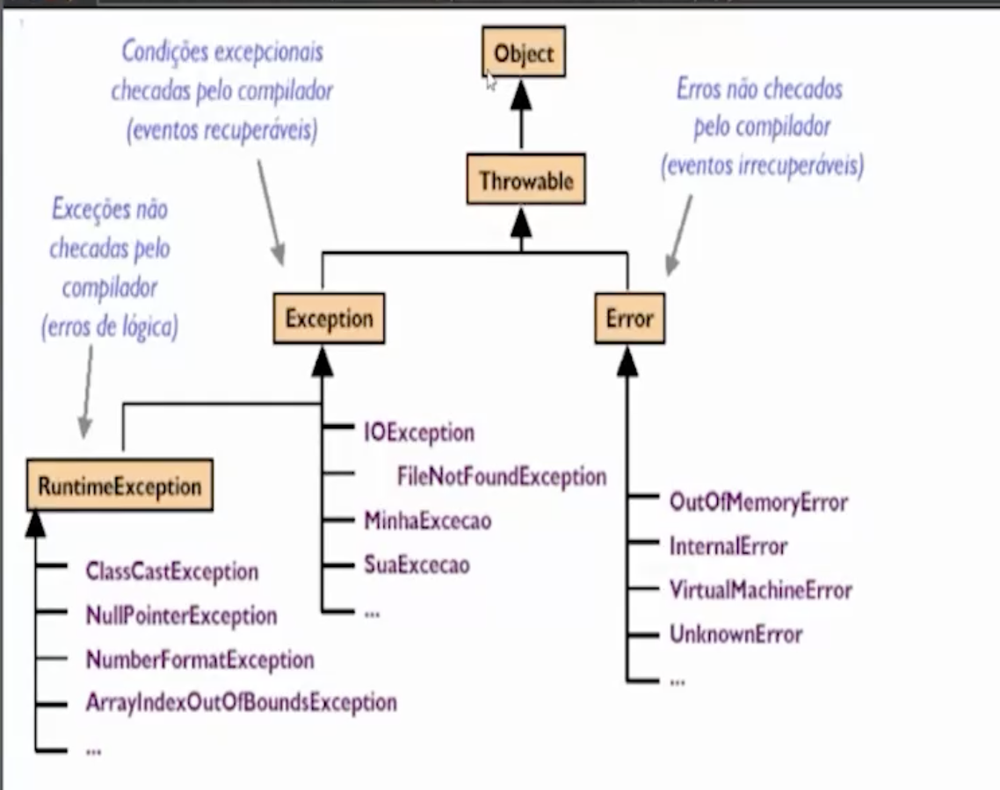

# MANIPULAÇÕES E EXCEÇÕES

O erro de compilação acontece no momento em que o **compilador** tenta transformar seu código-fonte em linguagem de máquina (binário). Ocorre me momento de build/desenvolvimento antes mesmo do programa rodar

A exceção ocorre quando o código está **sintaticamente correto**, o compilador o aceitou e o programa está **rodando**. De repente, o código tenta fazer algo que é impossível ou inválido naquele momento. Ocorre no run time da aplicação

A **Call Stack** é uma estrutura de dados do tipo **LIFO** (Last-In, First-Out — o último a entrar é o primeiro a sair) que o Java usa para gerenciar a execução dos métodos.

Imagine uma pilha de pratos:

1. Quando você chama um método, o Java coloca um "prato" (chamado de **Stack Frame**) no topo da pilha.
2. Esse frame contém tudo o que o método precisa: variáveis locais, parâmetros e o endereço de retorno.
3. Quando o método termina, o "prato" é removido e o Java volta para quem o chamou.

### Exemplo de Fluxo:

Se o método `main()` chama `processar()`, e `processar()` chama `salvar()`, a pilha fica assim:

- `salvar()` ← **Topo (Executando agora)**
- `processar()`
- `main()` ← **Base (Aguardando)**

### Como funciona o rastro da exceção:

1. **O estouro:** Uma exceção ocorre no método `salvar()`.
2. **A busca:** O Java pergunta: "O método `salvar()` tem um `try-catch`?".
3. **A subida:** Se não tiver, o Java **remove** o frame de `salvar()` da pilha e joga a exceção para o método anterior (`processar()`).
4. **O efeito cascata:** Isso continua subindo até encontrar um `catch`. Se chegar na `main()` e ninguém tratar, a JVM encerra a Thread e imprime o famoso **Stack Trace**.

Muitos desenvolvedores juniores usam exceções para **controle de fluxo** (ex: lançar exceção para sair de um laço, ou para sinalizar algo que é rotina e não erro). **Não faça isso** — fluxo esperado se resolve com `if` e retorno, não com `throw`.

Cuidado para não confundir duas coisas diferentes:

- **Exceção como controle de fluxo** → antipadrão. Usar `throw`/`catch` no lugar de um `if`, em situação que é caminho normal da aplicação.
- **Exceção de domínio (negócio)** → padrão normal e recomendado. `SaldoInsuficienteException`, `ContaBloqueadaException`: representam uma **regra de negócio violada**, interrompem a operação e são traduzidas em resposta HTTP (ex.: 422) por um `@RestControllerAdvice`. Isso é uso legítimo — o que não pode é usar exceção para o caminho feliz.

- **O Custo do `fillInStackTrace()`:** Criar uma exceção no Java é caro. O que custa caro não é o objeto da exceção em si, mas o esforço que a JVM faz para percorrer toda a Call Stack e preencher o rastro do erro.
- **StackOverflowError:** Se você fizer uma recursão infinita (um método chamando a si mesmo sem parar), a Call Stack enche até o limite da memória e o Java "explode".

o try-catch é utilizado para a trativa de excecoes
