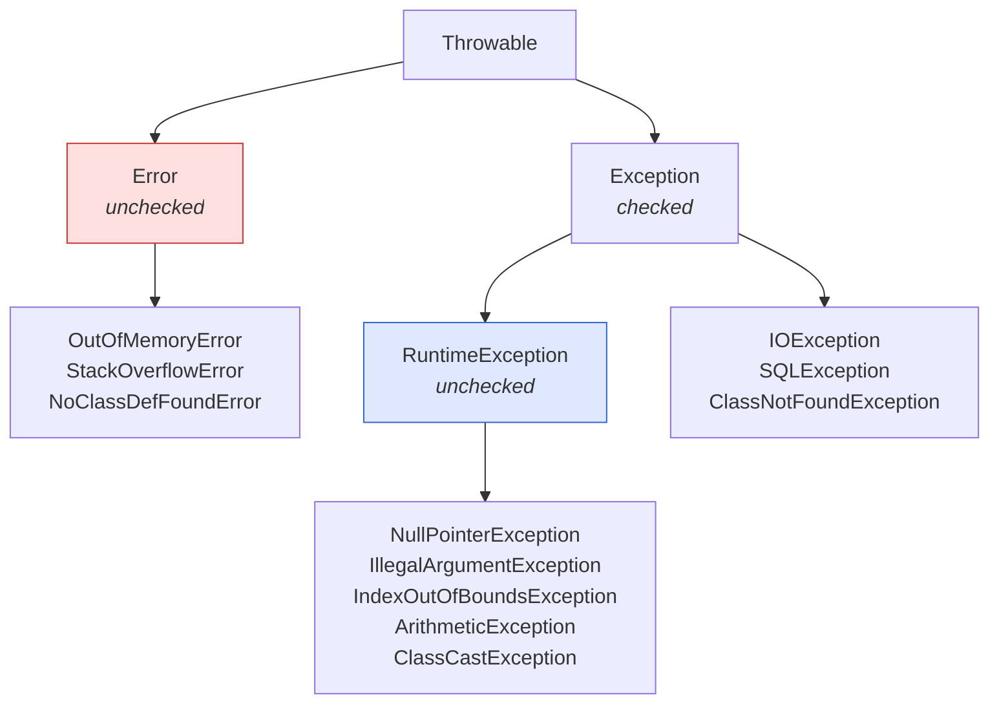

# MANIPULAÇÕES E EXCEÇÕES

> [← Voltar para POO](README.md) · Anterior: [CONCEITOS DE POO](conceitos-de-poo.md)

O erro de compilação acontece no momento em que o **compilador** tenta transformar seu código-fonte em linguagem de máquina (binário). Ocorre em momento de build/desenvolvimento antes mesmo do programa rodar.

A exceção ocorre quando o código está **sintaticamente correto**, o compilador o aceitou e o programa está **rodando**. De repente, o código tenta fazer algo que é impossível ou inválido naquele momento. Ocorre no run time da aplicação.

---

## 1. A Call Stack

A **Call Stack** é uma estrutura de dados do tipo **LIFO** (Last-In, First-Out — o último a entrar é o primeiro a sair) que o Java usa para gerenciar a execução dos métodos.

Imagine uma pilha de pratos:

1. Quando você chama um método, o Java coloca um "prato" (chamado de **Stack Frame**) no topo da pilha.
2. Esse frame contém tudo o que o método precisa: variáveis locais, parâmetros e o endereço de retorno.
3. Quando o método termina, o "prato" é removido e o Java volta para quem o chamou.

### Exemplo de Fluxo:

Se o método `main()` chama `processar()`, e `processar()` chama `salvar()`, a pilha fica assim:

- `salvar()` ← **Topo (Executando agora)**
- `processar()`
- `main()` ← **Base (Aguardando)**

### Como funciona o rastro da exceção:

1. **O estouro:** Uma exceção ocorre no método `salvar()`.
2. **A busca:** O Java pergunta: "O método `salvar()` tem um `try-catch`?".
3. **A subida:** Se não tiver, o Java **remove** o frame de `salvar()` da pilha e joga a exceção para o método anterior (`processar()`).
4. **O efeito cascata:** Isso continua subindo até encontrar um `catch`. Se chegar na `main()` e ninguém tratar, a JVM encerra a Thread e imprime o famoso **Stack Trace**.

> **Como ler um stack trace:** a **primeira** linha (`Caused by:` mais profundo, quando existe) é onde o erro realmente nasceu; as linhas abaixo são o caminho até lá. Em aplicação Spring, procure a **primeira linha do seu pacote** — o resto acima costuma ser framework. E leia o `Caused by:` de baixo para cima: a causa raiz é o **último** bloco.

---

## 2. A hierarquia de `Throwable`



| Ramo | Quem lança | Você trata? | Compilador exige tratamento? |
|---|---|---|---|
| **`Error`** | a **JVM**, em falha grave do ambiente | **não** — não há o que fazer | não |
| **`Exception`** (checked) | condição externa **recuperável** | sim, é esperado | **sim** |
| **`RuntimeException`** (unchecked) | **bug de programação** ou violação de regra | depende | não |

**Só `Throwable` e subclasses podem ser lançadas** (`throw`) e capturadas. `Error` é para o que está fora do seu alcance: se a JVM ficou sem memória, capturar não ajuda — e um `catch (Throwable t)` que engole `OutOfMemoryError` deixa a aplicação em estado zumbi.

---

## 3. Checked × Unchecked — a decisão de projeto

```java
// CHECKED — o compilador OBRIGA a tratar ou declarar
public void ler(Path caminho) throws IOException {   // ou envolve num try-catch
    Files.readAllLines(caminho);
}

// UNCHECKED — o compilador não exige nada
public void debitar(BigDecimal valor) {
    if (valor.signum() <= 0) throw new IllegalArgumentException("valor deve ser positivo");
}
```

| | **Checked** | **Unchecked** (`RuntimeException`) |
|---|---|---|
| Herda de | `Exception` (fora de `RuntimeException`) | `RuntimeException` |
| Compilador exige `try` ou `throws` | ✅ | ❌ |
| Intenção original | condição **recuperável**, externa e previsível | **erro de programação** ou violação de contrato |
| Exemplos | `IOException`, `SQLException`, `TimeoutException` | `NullPointerException`, `IllegalArgumentException`, `IllegalStateException` |
| Efeito na assinatura | polui e se propaga por toda a cadeia | invisível na assinatura |

**O critério de Joshua Bloch (*Effective Java*):** use **checked** quando quem chama pode **razoavelmente se recuperar** (tentar outro arquivo, outro servidor); use **unchecked** para erro de programação e violação de pré-condição.

**O debate — vale conhecer os dois lados:**

- *A favor de checked:* o contrato fica explícito na assinatura; o compilador impede que você esqueça uma falha previsível.
- *Contra:* Java é praticamente a **única** linguagem popular com checked exceptions. Elas violam o encapsulamento (a assinatura vaza detalhe de implementação: trocar de JDBC para outra API muda o `throws` de toda a cadeia), quebram compatibilidade ao adicionar uma nova, não combinam com lambdas/streams (uma `Function` não pode lançar checked) e, na prática, induzem ao pior anti-padrão de todos: `catch (Exception e) { }` só para calar o compilador.

**O que o mercado faz hoje:** frameworks modernos convergiram para unchecked. O Spring **encapsula toda `SQLException` numa hierarquia unchecked** (`DataAccessException`) exatamente por isso, e a JPA lança `PersistenceException` (unchecked). Em código de aplicação, a prática dominante é criar exceções de domínio **unchecked**.

> Detalhe de prova que conecta com Spring: `@Transactional` faz **rollback automático apenas em unchecked** (`RuntimeException` e `Error`). Uma **checked** lançada de dentro de um método transacional **comita** — a menos que você declare `@Transactional(rollbackFor = MinhaCheckedException.class)`. → [SPRING DATA JPA](../spring-data-jpa/README.md)

---

## 4. `try-catch-finally`

o try-catch é utilizado para a tratativa de excecoes.

```java
try {
    processar();                                  // código que pode falhar
} catch (SaldoInsuficienteException e) {          // do MAIS específico...
    log.warn("saldo insuficiente: {}", e.getMessage());
    throw e;
} catch (IOException | TimeoutException e) {      // MULTI-CATCH (Java 7): irmãos, nunca pai/filho
    log.error("falha de infraestrutura", e);
    throw new FalhaTemporariaException(e);
} catch (Exception e) {                           // ...para o MAIS genérico
    throw new ErroInesperadoException(e);
} finally {
    metricas.registrar();                         // executa SEMPRE — com ou sem exceção
}
```

**Regras que caem em prova:**

- A ordem dos `catch` vai do **mais específico para o mais genérico**. Colocar `catch (Exception e)` antes de `catch (IOException e)` é **erro de compilação** ("exception has already been caught").
- No **multi-catch**, os tipos precisam ser *irmãos*: `catch (IOException | FileNotFoundException e)` não compila, porque um é subclasse do outro.
- No multi-catch, a variável é implicitamente `final`.
- O `finally` executa **sempre**: no sucesso, na exceção e até quando há `return` dentro do `try`. As únicas exceções são `System.exit()`, uma falha da própria JVM ou o encerramento abrupto da thread.

### A pegadinha do `return` no `finally`

```java
public int exemplo() {
    try {
        return 1;              // avalia 1, guarda... e o finally roda ANTES de devolver
    } finally {
        return 2;              // ⚠️ DESCARTA o valor anterior — o método devolve 2
    }
}

public int piorAinda() {
    try {
        throw new RuntimeException("erro grave");
    } finally {
        return 0;              // ⚠️ ENGOLE a exceção silenciosamente — ela nunca sai
    }
}
```

`return` (ou `throw`, ou `break`) dentro do `finally` **descarta** o que estava acontecendo — inclusive uma exceção em andamento. É um bug tão traiçoeiro que ferramentas de análise estática marcam como erro. **Regra: nunca retorne de dentro de um `finally`.**

---

## 5. `try-with-resources` e `AutoCloseable`

```java
// ❌ ANTES do Java 7 — verboso, e o close() podia mascarar a exceção original
Connection conn = null;
try {
    conn = dataSource.getConnection();
    // ...
} catch (SQLException e) {
    throw new RuntimeException(e);
} finally {
    if (conn != null) {
        try { conn.close(); } catch (SQLException e) { /* e agora? */ }
    }
}

// ✅ try-with-resources — fecha automaticamente, na ordem INVERSA da abertura
try (Connection conn = dataSource.getConnection();
     PreparedStatement ps = conn.prepareStatement(SQL);
     ResultSet rs = ps.executeQuery()) {

    while (rs.next()) { }

}   // rs.close(), depois ps.close(), depois conn.close() — mesmo se houver exceção
```

Funciona com qualquer objeto que implemente **`AutoCloseable`** (ou `Closeable`):

```java
public class ArquivoDeLote implements AutoCloseable {
    @Override public void close() { /* libera o recurso */ }
}
```

**Suppressed exceptions:** se o bloco lança uma exceção **e** o `close()` também, a do bloco é a que sobe, e a do `close()` fica anexada como *suprimida* (`e.getSuppressed()`) — em vez de ser perdida, como acontecia com o `finally` manual. É exatamente esse detalhe que torna o `try-with-resources` superior, e cai em prova.

---

## 6. `throw` × `throws`

```java
public void transferir(BigDecimal valor) throws FalhaDeComunicacaoException {   // DECLARA
    if (valor.signum() <= 0) {
        throw new ValorInvalidoException(valor);                                // LANÇA
    }
}
```

| | `throw` | `throws` |
|---|---|---|
| O que é | **comando** que lança uma instância | **cláusula** na assinatura do método |
| Onde | dentro do corpo | no cabeçalho |
| Quantidade | uma exceção por vez | lista de tipos separados por vírgula |
| Efeito | interrompe o fluxo agora | avisa o compilador e quem chama |

---

## 7. Exceções customizadas

```java
// raiz da hierarquia do seu domínio: permite capturar tudo de negócio num ponto só
public abstract class DominioException extends RuntimeException {

    private final String codigo;

    protected DominioException(String codigo, String mensagem) {
        super(mensagem);
        this.codigo = codigo;
    }
    public String codigo() { return codigo; }
}

public class SaldoInsuficienteException extends DominioException {

    private final ContaId conta;
    private final BigDecimal saldoDisponivel, valorSolicitado;

    public SaldoInsuficienteException(ContaId conta, BigDecimal disponivel, BigDecimal solicitado) {
        super("SALDO_INSUFICIENTE",
              "Conta %s possui R$ %s e a operação exige R$ %s".formatted(conta, disponivel, solicitado));
        this.conta = conta;
        this.saldoDisponivel = disponivel;          // dados ESTRUTURADOS, não só texto
        this.valorSolicitado = solicitado;
    }

    public BigDecimal saldoDisponivel() { return saldoDisponivel; }
}
```

**Por que criar em vez de usar `RuntimeException` genérica:** o tipo permite tratamento específico (`catch` ou `@ExceptionHandler` dedicado), carrega **dados estruturados** para o cliente da API (não só uma string), documenta o domínio e evita comparar mensagem com `if (e.getMessage().contains(...))` — que quebra na primeira tradução.

**Regras práticas:** herde de `RuntimeException` em código de aplicação; use uma raiz por contexto (`DominioException`, `InfraestruturaException`); mensagem deve dizer **o que**, **onde** e **com quais valores**; nunca coloque dado sensível (senha, token, CPF completo) na mensagem — ela vai parar no log.

No Spring, essas exceções viram resposta HTTP no `@RestControllerAdvice` — regra de negócio geralmente vira **422**. → [Spring MVC](../spring-mvc-apis-restful/iii-spring-mvc-na-pratica.md)

---

## 8. Encadeamento e as regras de ouro

```java
// ✅ preserva a causa raiz — o stack trace mostra os dois níveis
catch (SQLException e) {
    throw new FalhaDePersistenciaException("erro ao salvar conta " + id, e);   // cause
}

// ❌ perde a causa: o stack trace aponta para a sua linha, e a origem some
catch (SQLException e) {
    throw new FalhaDePersistenciaException("erro ao salvar conta " + id);
}
```

O construtor `(String mensagem, Throwable causa)` é o que produz o `Caused by:` no log. Sem ele, você fica com o sintoma e sem o diagnóstico.

### Anti-padrões

| Anti-padrão | Código | Por que dói |
|---|---|---|
| **Engolir exceção** | `catch (Exception e) { }` | a falha desaparece; o bug aparece longe, em outro lugar |
| **Log e relança** | `log.error(e); throw e;` em cada camada | o mesmo erro aparece 5 vezes no log; trate **uma vez**, no limite da aplicação |
| **`e.printStackTrace()`** | — | vai para o `stderr`, fora do log estruturado; invisível no agregador |
| **Perder a causa** | `throw new X(e.getMessage())` | descarta o stack trace original |
| **`catch (Exception)` genérico no meio** | — | captura o que você nem previu, incluindo bug de programação |
| **Exceção como fluxo** | `throw` para caminho feliz | caro (stack trace) e ilegível |
| **Capturar `Throwable`/`Error`** | `catch (Throwable t)` | engole `OutOfMemoryError`, deixando a JVM zumbi |
| **Mensagem inútil** | `throw new RuntimeException("erro")` | não ajuda ninguém às 3h da manhã |

**Regra geral:** capture **onde você pode fazer algo a respeito**. Nas camadas intermediárias, deixe subir (ou traduza para o vocabulário da sua camada, preservando a causa). O tratamento final acontece na borda — `@RestControllerAdvice` em API, `@ControllerAdvice` em MVC, o handler global do job em batch.

---

## 9. Exceção de negócio × controle de fluxo

Muitos desenvolvedores juniores usam exceções para **controle de fluxo** (ex: lançar exceção para sair de um laço, ou para sinalizar algo que é rotina e não erro). **Não faça isso** — fluxo esperado se resolve com `if` e retorno, não com `throw`.

Cuidado para não confundir duas coisas diferentes:

- **Exceção como controle de fluxo** → antipadrão. Usar `throw`/`catch` no lugar de um `if`, em situação que é caminho normal da aplicação.
- **Exceção de domínio (negócio)** → padrão normal e recomendado. `SaldoInsuficienteException`, `ContaBloqueadaException`: representam uma **regra de negócio violada**, interrompem a operação e são traduzidas em resposta HTTP (ex.: 422) por um `@RestControllerAdvice`. Isso é uso legítimo — o que não pode é usar exceção para o caminho feliz.

Uma terceira via, muito usada em Java moderno para o caso "pode não existir": **`Optional`**.

```java
Optional<Conta> buscar(ContaId id);                       // ausência é NORMAL → Optional
Conta buscarObrigatoria(ContaId id);                      // ausência é ERRO   → exceção

contas.buscarPorId(id).orElseThrow(() -> new ContaNaoEncontradaException(id));
```

`Optional` para o que é **esperado não existir**; exceção para o que **não deveria acontecer** naquele fluxo.

---

## 10. Custo e limites

- **O Custo do `fillInStackTrace()`:** Criar uma exceção no Java é caro. O que custa caro não é o objeto da exceção em si, mas o esforço que a JVM faz para percorrer toda a Call Stack e preencher o rastro do erro.
- **StackOverflowError:** Se você fizer uma recursão infinita (um método chamando a si mesmo sem parar), a Call Stack enche até o limite da memória e o Java "explode".


Em caminho de altíssima frequência (validação em loop de milhões de itens), dá para criar uma exceção **sem stack trace**, usando o construtor de quatro argumentos com `writableStackTrace = false`:

```java
public class ValidacaoRapidaException extends RuntimeException {
    public ValidacaoRapidaException(String msg) {
        super(msg, null, false, false);    // sem supressão e SEM stack trace: ~100x mais barata
    }
}
```

É otimização de nicho — só faça com medição. Na esmagadora maioria dos casos, o custo da exceção é irrelevante perto de uma ida ao banco.

---

## Perguntas para autoavaliação

1. Qual a diferença entre erro de compilação e exceção?
2. Descreva o que acontece na Call Stack quando uma exceção não é tratada.
3. Desenhe a hierarquia de `Throwable` e diga o que cada ramo representa.
4. Por que não se deve capturar `Error` nem `Throwable`?
5. Qual o critério para escolher entre checked e unchecked?
6. Cite três críticas às checked exceptions e diga o que o Spring faz a respeito.
7. `@Transactional` faz rollback em checked exception? Justifique.
8. Por que `catch (Exception e)` antes de `catch (IOException e)` não compila?
9. Por que `catch (IOException | FileNotFoundException e)` não compila?
10. O que acontece com uma exceção em andamento se houver `return` no `finally`?
11. O que são suppressed exceptions e por que o `try-with-resources` é superior ao `finally` manual?
12. Diferencie `throw` de `throws`.
13. Por que criar exceções customizadas em vez de usar `RuntimeException` com mensagem?
14. Qual a diferença entre usar `Optional` e lançar exceção para "não encontrado"?

---

> [← Voltar para POO](README.md) · Anterior: [CONCEITOS DE POO](conceitos-de-poo.md)
