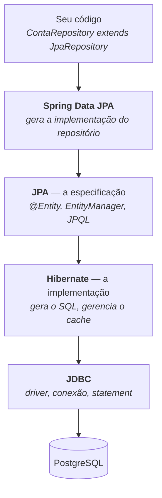

# SPRING DATA JPA

É uma especificacao para mapeamento objeto-relacional em JAVA, incluindo anotacoes, consultas JPQL, e APIs para interacoes com a base de dados, porem o JPA é uma abstracao, sendo o papel do hibernate implementar essa abstracao 

Mas o que é o Hibernate? 

O **Hibernate** é a "mão na massa". Ele é um **framework de Mapeamento Objeto-Relacional (ORM)** de código aberto. Em termos práticos, ele é o motor que lê as anotações do JPA, entende a sua intenção e executa a comunicação real com o banco de dados.

JDBC - faz toda a conexao com o banco de dados, executa as transações e queries no banco , tem drivers para diversos tipos de banco.

| Camada | O que é |
|---|---|
| **Spring Data JPA** | módulo do Spring que **gera a implementação** dos repositórios em runtime a partir da interface |
| **JPA** | a **especificação** (Jakarta Persistence): anotações, JPQL, `EntityManager`. Não executa nada sozinha |
| **Hibernate** | a **implementação** mais usada da JPA — é ele que traduz tudo em SQL |
| **JDBC** | a API de baixo nível: conexão, `PreparedStatement`, `ResultSet` |

> **JPA é uma especificação; Hibernate é o provedor.** Trocar Hibernate por EclipseLink deveria ser questão de dependência — na prática nunca é, porque todo projeto acaba usando alguma extensão específica do Hibernate.

---

## Capítulos

- [I - PERSISTENCE CONTEXT E CICLO DE VIDA](i-persistence-context-e-ciclo-de-vida.md) — estados da entidade, cache de primeiro nível, dirty checking, `persist` × `merge`, cascade, LAZY × EAGER, `LazyInitializationException` e Open Session In View
- [II - CONSULTAS E PERFORMANCE](ii-consultas-e-performance.md) — repositórios, derived queries, `@Query`, projections, paginação, **o problema N+1** e como resolver, batch e Specifications
- [III - TRANSAÇÕES E CONCORRÊNCIA](iii-transacoes-e-concorrencia.md) — `@Transactional` (propagação, isolamento, `readOnly`, rollback), a pegadinha da chamada interna, locking otimista e pessimista, auditoria e migrations

---

### 1. Estrutura e Mapeamento de Tabelas

Anotações que definem como uma classe Java se transforma em uma tabela no banco de dados relacional.

- **`@Entity`**: Especifica que a classe é uma entidade mapeada para uma tabela do banco de dados. Toda classe de persistência precisa desta anotação.
- **`@Table`**: Permite customizar os detalhes da tabela (como o nome físico no banco, schema e restrições de unicidade). Se omitida, o JPA assume o nome da classe.
- **`@Id`**: Define o atributo que representa a chave primária da tabela.
- **`@GeneratedValue`**: Configura a estratégia de geração automática para a chave primária (ex: `GenerationType.IDENTITY` para auto-incremento, `SEQUENCE`, `TABLE` ou `AUTO`).

    | Estratégia | Como funciona | Observação |
    |---|---|---|
    | `IDENTITY` | auto-incremento do banco | **desabilita o batch insert**: o Hibernate precisa do id na hora, então dá um `INSERT` por linha |
    | `SEQUENCE` | sequence do banco, com alocação em lote (`allocationSize`) | **preferida** em Postgres/Oracle — permite batch |
    | `TABLE` | uma tabela para simular sequence | portável e **lenta**; evite |
    | `AUTO` | o provedor escolhe | imprevisível entre bancos |
- **`@Column`**: Utilizada para customizar as propriedades da coluna correspondente ao atributo (nome, tamanho máximo com `length`, nulidade com `nullable`, precisão, se é editável, etc.).
- **`@Transient`**: Indica que o atributo Java **não** deve ser persistido no banco de dados (ignorando a coluna).
- **`@Enumerated`**: Define como tipos `Enum` devem ser salvos (como texto usando `EnumType.STRING` ou como índice numérico usando `EnumType.ORDINAL`).
    - ⚠️ **Use sempre `EnumType.STRING`.** Com `ORDINAL`, o banco guarda a **posição** do enum (0, 1, 2). Se alguém inserir um valor novo no meio da enumeração, **todos os registros antigos passam a significar outra coisa** — corrupção silenciosa de dados, impossível de detectar por teste.
- **`@Lob`**: Especifica que o atributo deve ser tratado como um objeto grande (Large Object), como textos longos (`CLOB`) ou arquivos binários/imagens (`BLOB`).
- **`@Temporal`**: Utilizada para mapear tipos de data antigos do Java (`java.util.Date` ou `java.util.Calendar`), definindo se deve salvar apenas a data, apenas a hora ou ambos (Timestamp). *Nota: Menos necessária se você já utiliza a API `java.time` (LocalDate, LocalDateTime).*

Mapeamento de Relacionamentos

Anotações que conectam as entidades entre si, espelhando as chaves estrangeiras (`FK`) do modelo relacional.

- **`@ManyToOne`**: Define uma associação de muitos para um (ex: muitos Funcionários pertencem a um Departamento). Por padrão, carrega os dados de forma ansiosa (`FetchType.EAGER`).
    - ⚠️ Esse EAGER padrão é uma das piores decisões da especificação: buscar 100 funcionários traz 100 departamentos que ninguém pediu. **Sempre declare `fetch = FetchType.LAZY`** em `@ManyToOne` e `@OneToOne`.
- **`@OneToMany`**: Define uma associação de um para muitos (ex: um Departamento possui muitos Funcionários). Exige o atributo `mappedBy` se for um relacionamento bidirecional. Por padrão, carrega os dados sob demanda (`FetchType.LAZY`).
- **`@OneToOne`**: Define uma associação de um para um (ex: um Usuário possui um Perfil).
- **`@ManyToMany`**: Define uma associação de muitos para muitos (ex: muitos Alunos se matriculam em muitos Cursos). Cria uma tabela intermediária automaticamente.
- **`@JoinColumn`**: Especifica a coluna física que atuará como chave estrangeira (`FK`) para unir as tabelas no relacionamento.
- **`@JoinTable`**: Utilizada principalmente no `@ManyToMany` para customizar o nome e as colunas da tabela intermediária que une as duas entidades.

Quando você usa o LAZY lado de Relacionamentos, ele vai carregar por demanda, agora o EAGER ja traz tudo de uma vez. 

### 3. Estratégias de Herança

Anotações que resolvem o dilema de como representar herança de classes Java no modelo relacional.

- **`@Inheritance`**: Define a estratégia de herança a ser usada na classe pai. As opções são:
    - `InheritanceType.SINGLE_TABLE`: Uma única tabela para toda a hierarquia (padrão).
    - `InheritanceType.JOINED`: Uma tabela para a classe pai e tabelas específicas para as classes filhas, unidas por chaves primárias.
    - `InheritanceType.TABLE_PER_CLASS`: Uma tabela independente para cada classe concreta da hierarquia.
- **`@DiscriminatorColumn`**: Define o nome da coluna que identificará qual classe filha aquela linha representa (usada na estratégia `SINGLE_TABLE`).
- **`@DiscriminatorValue`**: Colocada nas classes filhas para indicar o valor que será gravado na coluna de discriminação.
- **`@MappedSuperclass`**: Indica que a classe é uma superclasse cujos atributos devem ser herdados pelas tabelas das classes filhas, mas a classe pai em si não possui uma tabela própria no banco.

| Estratégia | Tabelas | Prós | Contras |
|---|---|---|---|
| `SINGLE_TABLE` | **uma** para tudo | mais rápida (sem join), simples | colunas das filhas precisam ser **anuláveis** — perde-se `NOT NULL`; tabela larga e esparsa |
| `JOINED` | pai + uma por filha | **normalizada**, integridade preservada | `JOIN` em toda consulta polimórfica |
| `TABLE_PER_CLASS` | uma por classe **concreta** | sem join para buscar um tipo específico | consulta polimórfica vira `UNION` de todas as tabelas; dificulta FK |
| `@MappedSuperclass` | só as das filhas (sem tabela do pai) | reúso de atributos (`id`, `criadoEm`) | **não é herança de entidade**: não dá para consultar polimorficamente nem referenciar o pai |

`@MappedSuperclass` é o que se usa para a classe-base de auditoria (`BaseEntity` com `id`, `criadoEm`, `atualizadoEm`) — e é a única dessas quatro que não cria hierarquia consultável.

### 4. Componentes Embutidos (Embedded)

Para quando você quer organizar seu código Java em classes menores, mas manter os dados na mesma tabela.

- **`@Embeddable`**: Declara uma classe cujas propriedades podem ser embutidas em uma entidade (ex: uma classe `Endereco` com rua, cidade e CEP).
- **`@Embedded`**: Colocada no atributo da entidade principal para indicar que os campos daquela classe `@Embeddable` devem ser mapeados como colunas na tabela da entidade dona.
- **`@AttributeOverride`**: Permite mudar o nome de uma coluna herdada de um objeto embutido, útil se você precisar embutir a mesma classe duas vezes na mesma entidade (ex: `enderecoResidencial` e `enderecoComercial`).

### 5. Gatilhos de Ciclo de Vida (Lifecycle Callbacks)

Anotações executadas automaticamente pelo provedor de persistência (como o Hibernate) em momentos específicos do ciclo de vida da entidade.

- **`@PrePersist`**: Executa o método imediatamente antes de a entidade ser inserida no banco (`INSERT`). Muito usada para preencher datas de criação.
- **`@PostPersist`**: Executa logo após o `INSERT` ser confirmado no banco.
- **`@PreUpdate`**: Executa imediatamente antes de uma alteração ser enviada ao banco (`UPDATE`). Útil para atualizar campos de "data de modificação".
- **`@PostUpdate`**: Executa logo após a confirmação do `UPDATE`.
- **`@PreRemove`**: Executa antes de a entidade ser deletada (`DELETE`).
- **`@PostRemove`**: Executa logo após o `DELETE`.
- **`@PostLoad`**: Executa assim que a entidade é carregada do banco de dados para a memória da aplicação.

### 6. Consultas Nomeadas (Named Queries)

Para centralizar consultas JPQL ou SQL nativas diretamente nas entidades.

- **`@NamedQuery`**: Define uma consulta estática com um nome fixo que pode ser chamada em qualquer lugar da aplicação através do `EntityManager`.
- **`@NamedQueries`**: Agrupador para quando você precisa definir múltiplas `@NamedQuery` na mesma classe.
- **`@NamedNativeQuery`**: Semelhante à `@NamedQuery`, mas permite escrever consultas usando a sintaxe de SQL nativo do banco de dados em vez de JPQL.

---

## Perguntas para autoavaliação

1. Qual a diferença entre JPA, Hibernate, Spring Data JPA e JDBC?
2. Por que `EnumType.ORDINAL` é perigoso?
3. Qual o `FetchType` padrão de `@ManyToOne` e por que ele deve ser alterado?
4. Por que `GenerationType.IDENTITY` impede o batch insert?
5. Compare `SINGLE_TABLE`, `JOINED` e `TABLE_PER_CLASS` em prós e contras.
6. O que `@MappedSuperclass` **não** permite fazer?
7. Para que serve `mappedBy` num relacionamento bidirecional?
8. Qual a diferença entre `@Embeddable` e uma entidade separada?
9. Quando um callback `@PrePersist` é executado, e para que ele é tipicamente usado?
10. Qual a diferença entre `@NamedQuery` e `@NamedNativeQuery`?

---

**Relacionados:** [FUNDAMENTOS DE MODELAGEM DE DADOS](../fundamentos-de-modelagem-de-dados/README.md) · [ÍNDICE](../fundamentos-de-modelagem-de-dados/indice.md) · [ACID](../fundamentos-de-modelagem-de-dados/acid.md) · [CLEAN ARCHITECTURE](../clean-architecture/README.md) · [TESTES EM SOFTWARE](../testes-em-software/iii-testes-no-spring.md)
