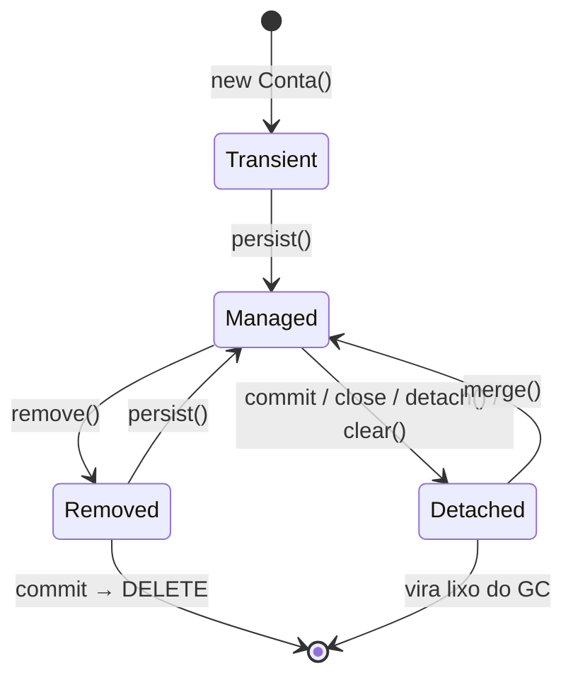

# I - PERSISTENCE CONTEXT E CICLO DE VIDA

> [← Voltar para SPRING DATA JPA](README.md) · Próximo: [II - CONSULTAS E PERFORMANCE](ii-consultas-e-performance.md)

Quase todo comportamento "mágico" (e todo bug estranho) da JPA se explica por **um** conceito: o **persistence context**. Entender isso é a diferença entre usar JPA e apanhar dela.

## 1. O que é o Persistence Context

É o **espaço de memória gerenciado pelo `EntityManager`** onde vivem as entidades que ele conhece. Funciona como:

- **Cache de primeiro nível (L1)** — buscar duas vezes a mesma linha na mesma transação faz **um** `SELECT`; a segunda vem da memória, e devolve **a mesma instância** (`==`).
- **Rastreador de mudanças** — ele guarda um *snapshot* do estado lido e compara no fim (*dirty checking*).
- **Fila de comandos SQL** — as operações são acumuladas e disparadas no *flush*, não na hora.

Em aplicação Spring típica, **o persistence context vive dentro da transação**: nasce no início do método `@Transactional` e morre no commit. É por isso que "a entidade some" fora dele.

---

## 2. Os quatro estados da entidade



| Estado | O que significa | O banco sabe? | Alterações são salvas? |
|---|---|---|---|
| **Transient** (*new*) | objeto Java recém-criado com `new`; sem id, sem vínculo | ❌ | ❌ |
| **Managed** (*persistent*) | está **dentro** do persistence context, sendo vigiado | ✅ | ✅ **automaticamente** |
| **Detached** | já foi gerenciado, mas o contexto fechou (ou foi limpo) | ✅ existe lá | ❌ até dar `merge` |
| **Removed** | marcado para exclusão; o `DELETE` sai no flush | ✅ ainda | vira `DELETE` |

**Esse diagrama cai em prova.** E ele explica o comportamento mais confuso da JPA:

```java
@Transactional
public void reajustarLimite(ContaId id) {
    Conta conta = repository.findById(id).orElseThrow();   // MANAGED
    conta.setLimite(new BigDecimal("5000"));               // só mexeu no objeto Java
}   // no commit, o Hibernate detecta a mudança e dispara o UPDATE sozinho
```

**Não existe `save()` nesse código — e o `UPDATE` acontece.** É o *dirty checking*: no flush, o Hibernate compara o estado atual com o snapshot lido e gera o SQL das diferenças. Fora de transação (entidade *detached*), o mesmo `setLimite` não faz absolutamente nada — outro clássico de "por que não salvou?".

---

## 3. As operações do `EntityManager`

| Operação | Efeito |
|---|---|
| `persist(e)` | transient → managed; agenda o `INSERT` |
| `merge(e)` | copia o estado de uma entidade **detached** para uma managed e **devolve a managed** |
| `remove(e)` | managed → removed; agenda o `DELETE` |
| `find(Class, id)` | busca (usa o cache L1 antes de ir ao banco) |
| `getReference(Class, id)` | devolve um **proxy** sem consultar; só bate no banco se você acessar um campo |
| `flush()` | força o envio do SQL acumulado **agora** (sem commitar) |
| `clear()` | esvazia o contexto: todas as entidades viram **detached** |
| `detach(e)` | desanexa uma entidade específica |
| `refresh(e)` | recarrega do banco, descartando alterações em memória |

### `persist` × `merge` — a diferença que pega todo mundo

```java
Conta detached = new Conta(idExistente, saldo);

em.persist(detached);          // ❌ tenta INSERT; erro se o id já existe
Conta gerenciada = em.merge(detached);   // ✅ copia o estado para a instância gerenciada

detached.setSaldo(novo);       // ⚠️ NÃO tem efeito — o detached continua fora do contexto
gerenciada.setSaldo(novo);     // ✅ é ESTA instância que o Hibernate vigia
```

**`merge` não anexa o objeto que você passou** — ele devolve **outra** instância, gerenciada. Continuar usando a referência antiga é o bug mais comum com entidades vindas da camada web.

E o `save()` do Spring Data? Ele decide sozinho:

```java
// SimpleJpaRepository
public <S extends T> S save(S entity) {
    if (entityInformation.isNew(entity)) { em.persist(entity); return entity; }
    else { return em.merge(entity); }        // ← devolve OUTRA instância
}
```

Por isso a regra: **sempre use o retorno do `save()`** (`conta = repository.save(conta)`), nunca a variável original.

> `save()` numa entidade **já gerenciada** é redundante — o dirty checking já cuidaria. Não é errado, é só ruído (e pode enganar quem lê achando que sem ele não salvaria).

---

## 4. Flush: quando o SQL realmente sai

O Hibernate **adia** os comandos. O *flush* acontece:

1. no **commit** da transação;
2. **antes de uma query** que possa ser afetada pelas alterações pendentes (`FlushModeType.AUTO`, o padrão);
3. quando você chama `flush()` na mão.

```java
conta.setSaldo(novo);                          // nada no banco ainda
var lista = repository.findBySaldoGreaterThan(x);   // ← flush automático antes do SELECT
```

Consequência prática em teste: sem `em.flush()` + `em.clear()`, você pode estar lendo **do cache L1**, e não do banco — e o teste passa mesmo com o mapeamento errado. → [TESTES NO SPRING](../testes-em-software/iii-testes-no-spring.md)

`FlushModeType.COMMIT` adia tudo para o commit (mais rápido, arriscado: a query pode não enxergar o que você acabou de alterar).

---

## 5. LAZY × EAGER e os proxies

```java
@Entity
public class Conta {
    @ManyToOne(fetch = FetchType.LAZY)          // sempre declare LAZY
    private Cliente cliente;

    @OneToMany(mappedBy = "conta", fetch = FetchType.LAZY)   // já é LAZY por padrão
    private List<Transacao> transacoes = new ArrayList<>();
}
```

| Associação | Padrão da spec | O que usar |
|---|---|---|
| `@ManyToOne` | **EAGER** ⚠️ | `LAZY` |
| `@OneToOne` | **EAGER** ⚠️ | `LAZY` (com ressalva*) |
| `@OneToMany` | LAZY | LAZY |
| `@ManyToMany` | LAZY | LAZY |

Quando é LAZY, o Hibernate injeta um **proxy** (subclasse gerada em runtime): o objeto parece um `Cliente`, mas só vai ao banco quando você acessa um método dele. Efeitos colaterais que caem em prova: `conta.getCliente().getClass()` devolve `Cliente$HibernateProxy$xyz`, `instanceof` pode surpreender, e **`equals`/`hashCode` precisam usar `getClass()` com cuidado** (por isso a recomendação de basear a igualdade numa chave de negócio). → [POO](../poo/conceitos-de-poo.md)

\* Em `@OneToOne` **não-dono** (lado `mappedBy`), o LAZY não funciona sem truque: o Hibernate precisa saber se existe linha do outro lado para decidir entre proxy e `null` — e acaba fazendo o `SELECT` de qualquer forma.

### `LazyInitializationException`

```java
public ContaResponse buscar(ContaId id) {          // ← sem @Transactional
    Conta conta = repository.findById(id).orElseThrow();
    return new ContaResponse(conta.getCliente().getNome());
}   // 💥 LazyInitializationException: could not initialize proxy - no Session
```

A transação fechou, o persistence context morreu, a entidade está **detached** — e o proxy não tem mais conexão para carregar o dado. As saídas, da melhor para a pior:

| Solução | Comentário |
|---|---|
| **`JOIN FETCH` / `@EntityGraph`** na consulta | ✅ traz o que precisa em **uma** query. A resposta certa na maioria dos casos |
| **Projeção para DTO** direto na query | ✅ melhor ainda para leitura: nem cria entidade |
| Manter o método `@Transactional` e converter para DTO **dentro** dele | ✅ simples e correto |
| `Hibernate.initialize(proxy)` | 🟡 funciona, mas é imperativo e fácil de esquecer |
| **Open Session In View** | ❌ esconde o problema (ver abaixo) |
| `fetch = EAGER` na entidade | ❌ resolve num lugar e piora todos os outros |

---

## 6. Open Session In View (OSIV)

O Spring Boot **liga o OSIV por padrão** (`spring.jpa.open-in-view=true`), o que mantém o persistence context aberto até o fim da renderização da resposta HTTP. Efeito: o lazy loading funciona no controller e a `LazyInitializationException` "desaparece".

**Por que desligar** (`spring.jpa.open-in-view=false`):

- **Segura a conexão do pool** durante toda a requisição, inclusive enquanto a resposta é serializada. Sob carga, o pool esgota e a aplicação trava.
- **Esconde N+1**: cada `getX()` durante a serialização do JSON dispara um `SELECT` silencioso — e você só descobre em produção. → [II - CONSULTAS E PERFORMANCE](ii-consultas-e-performance.md)
- **Queries fora da transação**: consultas disparadas depois do commit, sem controle transacional.
- Incentiva **expor entidade no controller**, que já é um problema por si só. → [Spring MVC](../spring-mvc-apis-restful/iii-spring-mvc-na-pratica.md)

O próprio Boot registra um **warning no log** quando o OSIV está ligado. Desligue e trate os lazies explicitamente — o erro passa a aparecer em desenvolvimento, que é onde ele deve aparecer.

---

## 7. Cascade e orphanRemoval

```java
@OneToMany(mappedBy = "pedido",
           cascade = CascadeType.ALL,
           orphanRemoval = true)
private List<ItemPedido> itens = new ArrayList<>();
```

| Tipo | Propaga |
|---|---|
| `PERSIST` | salvar o pai salva os filhos novos |
| `MERGE` | o merge desce para os filhos |
| `REMOVE` | apagar o pai apaga os filhos |
| `REFRESH` | recarrega os filhos junto |
| `DETACH` | desanexa os filhos junto |
| `ALL` | todos acima |

**`REMOVE` × `orphanRemoval` — distinção clássica de prova:**

- `CascadeType.REMOVE` age quando **o pai é removido**: apagou o pedido, apagou os itens.
- `orphanRemoval = true` age quando o filho é **retirado da coleção**: `pedido.getItens().remove(item)` gera o `DELETE`, mesmo com o pai vivo. É a semântica de **composição** — o filho não existe sem o pai.

**Cuidado:** `cascade = ALL` em `@ManyToOne` é quase sempre erro (remover uma conta apagaria o cliente inteiro). Cascade faz sentido do **lado dono da composição**, tipicamente `@OneToMany`.

### Relacionamento bidirecional precisa de método auxiliar

```java
// ❌ mexer só em um lado: o objeto em memória fica inconsistente com o que será gravado
pedido.getItens().add(item);          // item.pedido continua null → FK nula no INSERT

// ✅ método helper mantém os dois lados sincronizados
public void adicionarItem(ItemPedido item) {
    itens.add(item);
    item.setPedido(this);             // o lado DONO (o que tem a FK) é quem manda
}
```

Quem manda no banco é o **lado dono** — aquele que **não** tem `mappedBy`. Alterar só o lado inverso não gera SQL nenhum.

---

## 8. Callbacks e auditoria

```java
@Entity
@EntityListeners(AuditingEntityListener.class)
public class Conta {

    @CreatedDate  @Column(updatable = false)  private LocalDateTime criadoEm;
    @LastModifiedDate                          private LocalDateTime atualizadoEm;
    @CreatedBy                                 private String criadoPor;
    @LastModifiedBy                            private String atualizadoPor;
}

@Configuration
@EnableJpaAuditing                                   // ← sem isso, nada acontece
class AuditoriaConfig {
    @Bean AuditorAware<String> auditorProvider() {   // de onde vem o "quem"
        return () -> Optional.ofNullable(SecurityContextHolder.getContext().getAuthentication())
                             .map(Authentication::getName);
    }
}
```

Alternativa manual, sem Spring Data: `@PrePersist` e `@PreUpdate` preenchendo os campos na mão. Em auditoria de verdade (quem mudou o quê, com histórico completo), a ferramenta é o **Hibernate Envers**, que versiona as linhas em tabelas `_AUD`.

> Callbacks (`@PrePersist` etc.) rodam **dentro** do flush. Não faça neles chamada de rede, publicação de evento nem nada demorado — você estaria dentro da transação, segurando locks.

---

## 9. Cache de segundo nível (L2)

O L1 é por transação e sempre ativo. O **L2 é por `SessionFactory`** — compartilhado entre transações e requisições —, opcional e precisa de um provedor (Ehcache, Hazelcast, Infinispan):

```java
@Entity
@Cacheable
@org.hibernate.annotations.Cache(usage = CacheConcurrencyStrategy.READ_WRITE)
public class TipoTransacao { }         // dado de referência, muda quase nunca
```

Serve para **dados de referência** (tabelas de domínio, parâmetros, tarifas). Para dado transacional é perigoso: cache desatualizado, invalidação entre instâncias do cluster e comportamento imprevisível. Em arquitetura distribuída, muita gente prefere um cache explícito na aplicação (`@Cacheable` do Spring + Redis), onde a invalidação é sua e é visível.

---

## Perguntas para autoavaliação

1. O que é o persistence context e quais são seus três papéis?
2. Desenhe as transições entre transient, managed, detached e removed.
3. Por que um `UPDATE` acontece sem que você chame `save()`?
4. Por que alterar uma entidade *detached* não salva nada?
5. Qual a diferença entre `persist` e `merge`, e por que o retorno do `merge` importa?
6. Como o `save()` do Spring Data decide entre `persist` e `merge`?
7. Em que três momentos acontece o flush?
8. Qual o `FetchType` padrão de `@ManyToOne` e por que isso é um problema?
9. Explique a causa da `LazyInitializationException` e cite três formas corretas de resolvê-la.
10. O que é Open Session In View e por que desligá-lo?
11. Diferencie `CascadeType.REMOVE` de `orphanRemoval`.
12. Num relacionamento bidirecional, qual lado gera o SQL? O que acontece se você atualizar só o outro?
13. Qual a diferença entre cache L1 e L2, e quando o L2 é apropriado?

---

> [← Voltar para SPRING DATA JPA](README.md) · Próximo: [II - CONSULTAS E PERFORMANCE](ii-consultas-e-performance.md)
