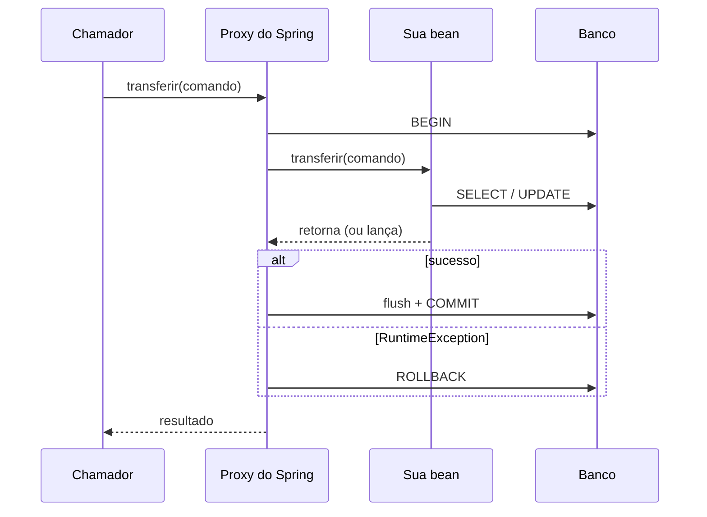

# III - TRANSAÇÕES E CONCORRÊNCIA

> [← Voltar para SPRING DATA JPA](README.md) · Anterior: [II - CONSULTAS E PERFORMANCE](ii-consultas-e-performance.md)

## 1. Como `@Transactional` funciona

Não há nada de mágico: o Spring cria um **proxy** em volta da sua bean. Quem chama o método fala com o proxy, que abre a transação, delega para o objeto real e faz commit ou rollback no fim.



É o padrão [Proxy](../design-patterns-em-oo/ii-padroes-estruturais.md) — e entender isso explica todas as pegadinhas da seção 4.

```java
@Transactional(
    propagation = Propagation.REQUIRED,      // padrão
    isolation   = Isolation.DEFAULT,         // usa o do banco
    readOnly    = false,
    timeout     = 30,                        // segundos
    rollbackFor = { FalhaDeIntegracaoException.class }
)
public Comprovante transferir(TransferenciaCommand comando) { }
```

---

## 2. Propagação

Define o que acontece quando um método transacional é chamado **de dentro de outra transação**:

| Propagação | Se já existe transação | Se não existe |
|---|---|---|
| **`REQUIRED`** (padrão) | **participa** da existente | cria uma nova |
| **`REQUIRES_NEW`** | **suspende** a atual e cria outra, independente | cria uma nova |
| `SUPPORTS` | participa | roda **sem** transação |
| `NOT_SUPPORTED` | suspende e roda sem transação | roda sem transação |
| `MANDATORY` | participa | **lança exceção** |
| `NEVER` | **lança exceção** | roda sem transação |
| `NESTED` | cria um **savepoint** dentro da atual | cria uma nova |

**`REQUIRES_NEW` é a mais cobrada em prova.** Uso típico: registrar auditoria ou log de tentativa que **precisa sobreviver** ao rollback da operação principal.

```java
@Transactional(propagation = Propagation.REQUIRES_NEW)
public void registrarTentativa(TransferenciaCommand c) { }   // commita mesmo se a principal falhar
```

Cuidado: `REQUIRES_NEW` usa **outra conexão** do pool enquanto a primeira fica suspensa (segurando a dela). Chamar isso em laço esgota o pool e pode gerar **deadlock** — a transação externa segura um lock que a interna precisa, e a interna nunca termina.

**`NESTED` × `REQUIRES_NEW`:** o `NESTED` é um *savepoint* — o rollback interno desfaz só até o savepoint, mas se a transação externa der rollback, **tudo** volta (inclusive o aninhado). O `REQUIRES_NEW` é realmente independente.

---

## 3. Rollback: a regra que pega todo mundo

> Por padrão, o Spring faz rollback **apenas** em `RuntimeException` (unchecked) e `Error`. **Checked exception commita.**

```java
@Transactional
public void processar() throws FalhaDeIntegracaoException {
    repository.save(conta);                        // ⚠️ isso COMMITA
    throw new FalhaDeIntegracaoException("parceiro fora do ar");   // checked
}

@Transactional(rollbackFor = FalhaDeIntegracaoException.class)     // ✅ corrigido
public void processar() throws FalhaDeIntegracaoException { }
```

Existe também `noRollbackFor`, para o caso inverso (uma unchecked que **não** deve desfazer nada).

É mais um argumento a favor de exceções de domínio **unchecked**. → [POO - Exceções](../poo/manipulacoes-e-excecoes.md)

> **Outra armadilha:** capturar a exceção **dentro** do método transacional e não relançar faz o Spring commitar normalmente — ele só enxerga o que **sai** do método. E se a exceção já marcou a transação como *rollback-only* (por ter passado por um método interno transacional), o commit falha com `UnexpectedRollbackException`.

---

## 4. As pegadinhas do proxy

```java
@Service
public class TransferenciaService {

    public void processarLote(List<Comando> comandos) {
        comandos.forEach(this::transferir);       // ❌ this = objeto REAL, não o proxy
    }

    @Transactional
    public void transferir(Comando c) { }         // a anotação NÃO tem efeito aqui
}
```

| Situação | Por que não funciona |
|---|---|
| **Chamada interna** (`this.metodo()`) | não passa pelo proxy — a anotação é ignorada |
| Método **`private`** | o proxy não consegue interceptar |
| Método **`final`** ou classe `final` | CGLIB gera uma **subclasse**; final não é sobrescrevível |
| Método **`static`** | não pertence à instância |
| Classe **não é bean** do Spring (`new` na mão) | não existe proxy nenhum |
| `@Transactional` num método chamado de outra thread | o contexto transacional é `ThreadLocal` — não atravessa `@Async`, executor nem consumer |

**Soluções para a chamada interna:** mover o método para **outra bean** (o correto — geralmente indica que eram duas responsabilidades), injetar a si mesmo (`@Lazy ContaService self`), ou `AopContext.currentProxy()` (gambiarra que exige `exposeProxy = true`).

É exatamente a mesma pegadinha do `@Cacheable`, `@Async` e `@PreAuthorize`. → [SPRING SECURITY](../spring-security/README.md) · [DESIGN PATTERNS](../design-patterns-em-oo/ii-padroes-estruturais.md)

---

## 5. `readOnly` e `timeout`

```java
@Transactional(readOnly = true)
public List<ResumoConta> listar() { }
```

`readOnly = true` faz três coisas: coloca o Hibernate em `FlushMode.MANUAL` (**sem dirty checking**, sem snapshot — menos memória e menos CPU), passa a dica `setReadOnly(true)` para o driver JDBC (que alguns bancos usam para otimizar) e, com replicação configurada, permite **rotear a leitura para a réplica**.

Não é uma garantia de segurança: dependendo do driver, um `UPDATE` nativo ainda passaria. É otimização, não trava.

`timeout` limita a duração da transação — importante para não deixar lock aberto indefinidamente quando algo trava.

---

## 6. Locking otimista — `@Version`

Resolve o **lost update**: dois usuários leem o mesmo saldo, alteram e gravam; a segunda escrita sobrescreve a primeira em silêncio. → [ACID](../fundamentos-de-modelagem-de-dados/acid.md)

```java
@Entity
public class ContaEntity {
    @Version
    private Long versao;          // o Hibernate cuida sozinho
}
```

```sql
-- o Hibernate acrescenta a versão ao WHERE e a incrementa
UPDATE conta SET saldo = ?, versao = 6 WHERE id = ? AND versao = 5;
-- 0 linhas afetadas → alguém alterou antes → OptimisticLockException
```

```java
@Retryable(retryFor = OptimisticLockingFailureException.class, maxAttempts = 3,
           backoff = @Backoff(delay = 50))
@Transactional
public void debitar(ContaId id, BigDecimal valor) { }
```

**Não bloqueia nada** — é a estratégia certa quando o conflito é **raro**, que é o caso comum. O preço é ter de tratar a falha e **repetir**. Em API, o equivalente HTTP é o par `ETag` + `If-Match` devolvendo **412**. → [Evolução da API](../spring-mvc-apis-restful/iv-evolucao-da-api.md)

---

## 7. Locking pessimista

```java
@Lock(LockModeType.PESSIMISTIC_WRITE)      // SELECT ... FOR UPDATE
@Query("SELECT c FROM ContaEntity c WHERE c.id = :id")
Optional<ContaEntity> buscarParaAtualizar(@Param("id") Long id);
```

| Modo | SQL | Efeito |
|---|---|---|
| `PESSIMISTIC_READ` | `FOR SHARE` | outros leem, ninguém escreve |
| `PESSIMISTIC_WRITE` | `FOR UPDATE` | ninguém lê para atualizar nem escreve |
| `PESSIMISTIC_FORCE_INCREMENT` | `FOR UPDATE` + incrementa `@Version` | combina os dois |

**Trava a linha no banco até o commit.** Use quando o conflito é frequente e a operação é curta (reserva de estoque, débito de saldo em conta muito movimentada, geração de número sequencial).

| | Otimista (`@Version`) | Pessimista (`FOR UPDATE`) |
|---|---|---|
| Bloqueia | não | sim |
| Detecta o conflito | no commit | **impede** o conflito |
| Concorrência | alta | baixa |
| Risco | retry / falha para o usuário | **deadlock** e espera |
| Use quando | conflito raro | conflito frequente |

Sempre defina **timeout de lock** (`jakarta.persistence.lock.timeout`) e mantenha a transação curta. Deadlock aparece quando duas transações travam as mesmas linhas **em ordens diferentes** — a prevenção é sempre adquirir locks na **mesma ordem** (por exemplo, ordenando por id).

---

## 8. Isolamento

```java
@Transactional(isolation = Isolation.REPEATABLE_READ)
```

`Isolation.DEFAULT` usa o padrão do banco (Read Committed no Postgres, Repeatable Read no MySQL). Subir o nível reduz anomalias e **reduz concorrência** — a tabela completa de níveis × anomalias está em [ACID](../fundamentos-de-modelagem-de-dados/acid.md).

Na prática, prefira resolver concorrência com **locking explícito** ou com **operação atômica em SQL** (`UPDATE conta SET saldo = saldo - :v WHERE id = :id AND saldo >= :v`) em vez de elevar o isolamento global — o efeito colateral do nível alto atinge o sistema inteiro.

---

## 9. Efeitos colaterais e o commit

```java
@Component
public class NotificarAposTransferencia {

    @TransactionalEventListener(phase = TransactionPhase.AFTER_COMMIT)
    public void aoTransferir(TransferenciaRealizada evento) {
        notificador.enviar(evento);          // só executa se a transação REALMENTE commitou
    }
}
```

Sem isso, um `@EventListener` comum roda **dentro** da transação: você mandaria o e-mail e, segundos depois, a transação daria rollback — e-mail enviado, transferência inexistente. → [DESIGN PATTERNS - Observer](../design-patterns-em-oo/iii-padroes-comportamentais.md)

O mesmo raciocínio vale para publicar em Kafka/RabbitMQ. Como o broker **não participa** da transação do banco, a garantia real vem do padrão **Outbox**: grave o evento numa tabela **na mesma transação** do dado e publique depois, por um job que lê a tabela. → [TEOREMA CAP](../teorema-cap/README.md)

**Regra geral:** dentro da transação, só o banco. Chamada HTTP, envio de mensagem e escrita em arquivo ficam para depois do commit — porque não são transacionais e ainda seguram a conexão enquanto esperam a rede.

---

## 10. Migrations — o esquema também é código

```yaml
spring:
  jpa:
    hibernate:
      ddl-auto: validate        # prod: validate ou none. NUNCA update/create
```

| `ddl-auto` | Efeito |
|---|---|
| `none` | não faz nada |
| `validate` | **confere** se as entidades batem com o esquema e falha na subida se não bater |
| `update` | tenta alterar o esquema — ⚠️ nunca remove coluna, não versiona, imprevisível |
| `create` / `create-drop` | **apaga e recria** — só para teste local |

`update` em produção é um dos erros mais graves: sem histórico, sem revisão, sem rollback, e comportamento diferente entre ambientes.

```sql
-- V2__adiciona_limite_diario.sql   (Flyway: versão, descrição, imutável após aplicada)
ALTER TABLE conta ADD COLUMN limite_diario NUMERIC(12,2) NOT NULL DEFAULT 1000.00;
CREATE INDEX idx_conta_status ON conta(status) WHERE status = 'ATIVA';
```

| | **Flyway** | **Liquibase** |
|---|---|---|
| Formato | SQL puro (e Java) | XML/YAML/JSON/SQL |
| Curva | baixa | maior |
| Rollback | pago (Teams) na maior parte | nativo (`<rollback>`) |
| Abstração de banco | nenhuma | independe do SGBD |

Os dois mantêm uma tabela de controle (`flyway_schema_history`) com o checksum de cada script — **alterar um script já aplicado quebra a validação**, de propósito. Migration é imutável: correção vira **script novo**.

Combinação recomendada: **Flyway aplica o esquema, `ddl-auto: validate` confere** se as entidades correspondem. E teste as migrations no CI com Testcontainers, contra a mesma versão do banco de produção. → [TESTES NO SPRING](../testes-em-software/iii-testes-no-spring.md)

---

## Checklist de PR (JPA e transações)

- [ ]  `@Transactional` na camada de **caso de uso**, não no repositório nem no controller
- [ ]  Leitura com `readOnly = true`
- [ ]  Nenhuma chamada HTTP ou de mensageria **dentro** da transação
- [ ]  Efeito externo em `@TransactionalEventListener(AFTER_COMMIT)` ou via Outbox
- [ ]  Exceção de negócio é unchecked (ou `rollbackFor` declarado)
- [ ]  Sem autoinvocação de método `@Transactional`
- [ ]  `@Version` onde há concorrência de escrita na mesma linha
- [ ]  Transação curta; nada de laço com `REQUIRES_NEW`
- [ ]  `ddl-auto: validate` e alteração de esquema via migration versionada

---

## Perguntas para autoavaliação

1. Como o Spring implementa `@Transactional`, e o que isso implica?
2. Diferencie `REQUIRED`, `REQUIRES_NEW` e `NESTED`.
3. Por que `REQUIRES_NEW` em laço pode esgotar o pool de conexões?
4. Uma checked exception causa rollback por padrão? Como mudar isso?
5. O que acontece se você capturar a exceção dentro do método transacional?
6. Cite quatro situações em que `@Transactional` é silenciosamente ignorado.
7. O que exatamente `readOnly = true` faz?
8. Explique o funcionamento do `@Version` no SQL gerado.
9. Otimista × pessimista: quando usar cada um e qual o risco de cada um?
10. Como prevenir deadlock ao usar lock pessimista?
11. Por que enviar e-mail dentro da transação é um problema, e qual a solução?
12. O que é o padrão Outbox e que problema ele resolve?
13. Por que `ddl-auto: update` não deve ir para produção?
14. Por que alterar um script de migration já aplicado quebra o build?

---

> [← Voltar para SPRING DATA JPA](README.md) · Anterior: [II - CONSULTAS E PERFORMANCE](ii-consultas-e-performance.md)
