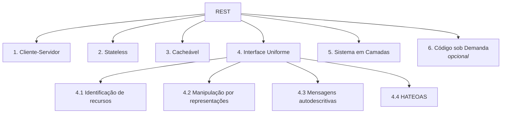

# II - FUNDAMENTOS REST

> [← Voltar para Spring MVC - APIs RESTful](README.md) · Anterior: [I - Introdução sobre o Spring MVC](i-introducao-sobre-o-spring-mvc.md) · Próximo: [III - Spring MVC na prática](iii-spring-mvc-na-pratica.md)

## 1. O que REST é (e o que não é)

**REST — REpresentational State Transfer** — foi definido por **Roy Fielding** na tese de doutorado dele, em 2000. Fielding não inventou uma tecnologia: ele *descreveu* o estilo arquitetural que já fazia a Web funcionar, e formalizou as restrições que dão a ela escalabilidade e evolutibilidade.

Três correções de vocabulário que valem ponto em dissertativa:

- **REST não é um protocolo.** É um **estilo arquitetural**. HTTP é o protocolo em que ele quase sempre é implementado.
- **REST não é JSON sobre HTTP.** A maior parte do que o mercado chama de "API REST" é, com rigor, uma API HTTP no nível 2 do modelo de Richardson.
- **"RESTful" é uma questão de grau**, não de sim/não — o quanto a API respeita as restrições.

A ideia central: o cliente manipula **recursos** através de **representações** (JSON, XML, HTML), usando uma **interface uniforme** (os métodos HTTP), e cada requisição carrega tudo o que é necessário para ser compreendida.

**Recurso × representação:** o recurso é o conceito (a conta `123`); a representação é como ele trafega naquele momento (um JSON, um XML, um HTML). O mesmo recurso pode ter várias representações — é isso que a negociação de conteúdo explora.

---

## 2. As seis restrições de Fielding



**1. Cliente-Servidor** — separação de responsabilidades: o cliente cuida da interface, o servidor cuida de dados e regras. Os dois evoluem independentemente.

**2. Stateless (sem estado)** — **a restrição mais importante e a mais violada.** Cada requisição deve conter tudo o que o servidor precisa para processá-la; o servidor **não guarda estado de sessão** entre requisições. O estado de sessão vive no cliente (ou num token que ele envia).
*Por que importa:* qualquer instância pode atender qualquer requisição → escala horizontal trivial, sem sticky session, sem replicação de sessão. É exatamente o argumento a favor de JWT em vez de `HttpSession` em arquitetura distribuída. → [SPRING SECURITY](../spring-security/README.md)
*O que não viola:* guardar estado **do recurso** no banco. O que não pode é guardar estado **da conversa** na memória do servidor.

**3. Cacheável** — toda resposta deve se declarar cacheável ou não (`Cache-Control`, `ETag`, `Expires`). Cache é o principal mecanismo de escala da Web: a requisição mais rápida é a que não sai do cliente.

**4. Interface uniforme** — o que diferencia REST de RPC. Subdivide-se em quatro:
- **4.1 Identificação de recursos** — cada recurso tem uma URI estável (`/contas/123`).
- **4.2 Manipulação via representações** — o cliente altera o recurso enviando uma representação dele, não chamando procedimentos.
- **4.3 Mensagens autodescritivas** — a mensagem carrega o necessário para ser interpretada (método, `Content-Type`, status, headers de cache).
- **4.4 HATEOAS** — a resposta traz os links das próximas transições possíveis (seção 7).

**5. Sistema em camadas** — o cliente não sabe se fala com o servidor final ou com um proxy/gateway/CDN/balanceador. Permite inserir cache, segurança e roteamento na borda sem mudar o cliente.

**6. Código sob demanda (opcional)** — o servidor pode enviar código executável para o cliente (JavaScript). Única restrição opcional, e a menos usada em APIs.

> **Pergunta clássica de prova:** *"quais restrições são obrigatórias?"* Todas, exceto **código sob demanda**. Uma API que viola stateless ou interface uniforme não é REST — é HTTP-RPC.

---

## 3. Modelo de Maturidade de Richardson

Criado por Leonard Richardson, popularizado por Martin Fowler. Mede o quanto a API usa os mecanismos do HTTP:

| Nível | Nome | Característica | Exemplo |
|---|---|---|---|
| **0** | "Pântano de POX" | Um endpoint, um verbo, tudo no corpo | `POST /api` com `{"acao":"buscarConta","id":1}` — é RPC/SOAP disfarçado |
| **1** | **Recursos** | Múltiplas URIs, ainda um verbo só | `POST /contas/1/buscar`, `POST /contas/1/transferir` |
| **2** | **Verbos HTTP** | Verbos + status codes com semântica correta | `GET /contas/1` → 200, `POST /transferencias` → 201, `DELETE /contas/1` → 204 |
| **3** | **HATEOAS** | Respostas trazem links para as próximas ações | resposta da conta traz `{"_links":{"transferir":{"href":"..."}}}` |

**A maioria esmagadora das APIs de mercado para no nível 2** — e isso é uma decisão consciente e defensável, não necessariamente um defeito. Fielding, porém, é categórico: sem HATEOAS não é REST.

Sinal de nível 1 disfarçado de nível 2: **verbo na URL**. `POST /contas/1/ativar` é RPC. A versão orientada a recurso seria `PATCH /contas/1` com `{"status":"ATIVA"}` — ou modelar a ação como recurso: `POST /contas/1/ativacoes`.

---

## 4. Métodos HTTP: seguro, idempotente, cacheável

Três propriedades ortogonais que **caem muito**:

- **Seguro (safe):** não altera o estado do recurso no servidor. Só leitura.
- **Idempotente:** executar N vezes tem o mesmo efeito de executar 1 vez. **Não** quer dizer "mesma resposta" — quer dizer mesmo *efeito colateral*.
- **Cacheável:** a resposta pode ser armazenada e reutilizada.

| Método | Seguro | Idempotente | Cacheável | Tem corpo? | Uso |
|---|:---:|:---:|:---:|:---:|---|
| `GET` | ✅ | ✅ | ✅ | não (na requisição) | ler recurso |
| `HEAD` | ✅ | ✅ | ✅ | não | só os headers do GET |
| `OPTIONS` | ✅ | ✅ | ❌ | não | capacidades / preflight CORS |
| `POST` | ❌ | ❌ | raramente | sim | criar recurso, ação não idempotente |
| `PUT` | ❌ | ✅ | ❌ | sim | substituir recurso por inteiro |
| `PATCH` | ❌ | ❌\* | ❌ | sim | atualização parcial |
| `DELETE` | ❌ | ✅ | ❌ | opcional | remover recurso |

\* `PATCH` **pode** ser idempotente dependendo do formato — `{"status":"ATIVA"}` é; `{"op":"increment","valor":10}` não é. A especificação não garante, então trate como não idempotente.

**Por que `DELETE` é idempotente se o segundo retorna 404?** Porque idempotência é sobre **efeito**, não sobre resposta. Depois do primeiro `DELETE`, o recurso não existe — e continua não existindo após o segundo. O estado final é o mesmo.

**Por que idempotência importa na prática:** ela define o que é seguro **repetir** (retry) quando a rede falha. Um cliente pode reenviar `PUT` e `DELETE` sem medo. Não pode reenviar `POST` — daí a *idempotency key* (ver [capítulo IV](iv-evolucao-da-api.md)), essencial em pagamento: sem ela, um retry vira transferência duplicada.

### `POST` × `PUT` × `PATCH`

| | `POST /contas` | `PUT /contas/1` | `PATCH /contas/1` |
|---|---|---|---|
| Intenção | criar (servidor define o id) | criar/substituir no id que o cliente definiu | alterar parte |
| Corpo | representação nova | representação **completa** | só o delta |
| Repetir 2x | cria 2 recursos | 1 recurso, mesmo estado | depende |
| Resposta típica | `201` + `Location` | `200`/`204` (ou `201` se criou) | `200`/`204` |

**Armadilha do `PUT`:** por ser substituição total, campo omitido deve ser interpretado como "apague/valor default", não como "não mexa". Quem quer semântica de "não mexa" está querendo `PATCH`.

---

## 5. Status codes

| Classe | Significado | Quem errou |
|---|---|---|
| **1xx** | Informativo | — |
| **2xx** | Sucesso | — |
| **3xx** | Redirecionamento / cache | — |
| **4xx** | Erro do **cliente** | quem chamou |
| **5xx** | Erro do **servidor** | você |

Os que realmente importam numa API:

| Code | Nome | Quando usar |
|---|---|---|
| **200** OK | sucesso com corpo | `GET`, `PUT`, `PATCH` |
| **201** Created | recurso criado — **sempre com header `Location`** | `POST` que cria |
| **202** Accepted | aceito para processamento **assíncrono**; ainda não concluído | fila, batch, aprovação |
| **204** No Content | sucesso **sem corpo** | `DELETE`, `PUT` que não devolve nada |
| **206** Partial Content | resposta parcial | download com `Range` |
| **301/308** Moved Permanently | recurso mudou de URI | versionamento, migração |
| **304** Not Modified | cache do cliente ainda é válido (com `ETag`/`If-None-Match`) | economia de banda |
| **400** Bad Request | requisição malformada — JSON inválido, tipo errado | parsing falhou |
| **401** Unauthorized | **não autenticado** (nome infeliz na spec) | sem token / token inválido |
| **403** Forbidden | autenticado, **sem permissão** | role insuficiente, recurso de outro dono |
| **404** Not Found | recurso não existe (ou é escondido de propósito) | id inexistente |
| **405** Method Not Allowed | verbo não suportado nessa URI — **deve** enviar header `Allow` | `DELETE` em coleção read-only |
| **406** Not Acceptable | não sei produzir o `Accept` pedido | cliente pediu XML e você só faz JSON |
| **409** Conflict | conflito de estado | duplicidade, lock otimista, versão desatualizada |
| **415** Unsupported Media Type | `Content-Type` enviado não é suportado | mandou XML num endpoint JSON |
| **422** Unprocessable Entity | sintaxe ok, **semântica** inválida | validação de negócio: saldo insuficiente, CPF inválido |
| **429** Too Many Requests | rate limit — envie `Retry-After` | throttling |
| **500** Internal Server Error | erro não tratado seu | bug |
| **502 / 503 / 504** | gateway ruim / indisponível / timeout upstream | dependência caiu |

**As três distinções que mais caem:**

- **400 × 422** — 400 é *"não consegui entender"* (JSON quebrado, tipo incompatível); 422 é *"entendi perfeitamente e recusei"* (regra de negócio, validação semântica). Muita API usa 400 para tudo; saber a diferença é o que se cobra na prova.
- **401 × 403** — 401 é *"não sei quem você é"* (autenticação); 403 é *"sei quem você é e você não pode"* (autorização). Se o token expirou → 401. Se o cliente tenta ver a conta de outro → 403.
- **404 × 403 em recurso de terceiro** — devolver 403 confirma que o recurso **existe** (vazamento de informação). Em dados sensíveis, muitos preferem 404 para não revelar existência.

---

## 6. Modelagem de recursos e URIs

```
✅ GET    /contas                        lista
✅ GET    /contas/123                     item
✅ GET    /contas/123/transacoes          sub-recurso (transações DAQUELA conta)
✅ POST   /transferencias                 ação modelada como recurso
✅ GET    /contas?status=ativa&limite=20  filtro em query param

❌ GET    /getContas                      verbo na URI
❌ POST   /contas/123/deletar             verbo + método errado
❌ GET    /Conta/123                      maiúscula
❌ GET    /contas/123/transacoes/2024/01  data como caminho hierárquico
❌ GET    /contas_ativas                  filtro virando recurso novo
```

Convenções consolidadas:

- **Substantivos no plural** para coleções; o verbo é o método HTTP.
- **Minúsculas com hífen** (`/limites-diarios`), nunca `camelCase` nem `snake_case` na URI. (No **corpo** JSON, `camelCase` é o padrão de mercado em Java.)
- **Hierarquia só quando há posse real.** `/contas/123/transacoes` faz sentido; `/clientes/1/contas/2/transacoes/3/estornos/4` é aninhamento demais — a partir de dois níveis, prefira recurso de primeira classe com filtro (`/estornos?transacaoId=3`).
- **Filtro, ordenação e paginação são query params**, não caminhos.
- **Sem extensão** (`.json`) — negociação de conteúdo é papel do header `Accept`.
- **Sem barra no final** — escolha um formato e mantenha (`/contas`, não `/contas/`).
- **Ações que não são CRUD**: modele como recurso (`POST /contas/123/bloqueios`) ou como sub-recurso de estado (`PUT /contas/123/status`). É a saída elegante para o "verbo na URL".

---

## 7. HATEOAS

O nível 3: a resposta traz os **links das transições possíveis**, e o cliente navega pela API como navega por um site — sem hard-code de URL.

```json
{
  "id": "123",
  "saldo": 300.00,
  "status": "ATIVA",
  "_links": {
    "self":        { "href": "/contas/123" },
    "transacoes":  { "href": "/contas/123/transacoes" },
    "transferir":  { "href": "/transferencias", "method": "POST" },
    "bloquear":    { "href": "/contas/123/bloqueios", "method": "POST" }
  }
}
```

**A promessa:** o servidor controla o fluxo. Se a conta estiver bloqueada, o link `transferir` simplesmente não aparece — o cliente não precisa duplicar a regra de negócio para saber o que pode fazer.

**Por que quase ninguém usa:** exige cliente escrito para navegar por links (a maioria faz hard-code da URL mesmo), aumenta o payload, e não há padrão único (HAL, JSON:API, Siren, HAL-FORMS). O custo aparece imediatamente e o benefício só no longo prazo.

No Spring: `spring-boot-starter-hateoas`, com `EntityModel`, `CollectionModel` e `WebMvcLinkBuilder.linkTo(methodOn(...))`, produzindo HAL por padrão.

**Resposta pronta para prova:** *"HATEOAS é a restrição que separa nível 2 de nível 3 no modelo de Richardson; é o que Fielding considera indispensável para chamar uma API de REST, mas raramente é adotada na indústria pelo custo de cliente e pela ausência de um padrão dominante."*

---

## 8. REST no meio dos outros estilos

| | **REST** | **gRPC** | **GraphQL** | **SOAP** |
|---|---|---|---|---|
| Transporte | HTTP/1.1, HTTP/2 | HTTP/2 | HTTP (1 endpoint) | HTTP, SMTP, JMS |
| Formato | JSON (texto) | Protobuf (binário) | JSON | XML |
| Contrato | OpenAPI (opcional) | `.proto` (obrigatório) | Schema/SDL (obrigatório) | WSDL (obrigatório) |
| Cache HTTP | ✅ nativo | ❌ | ❌ difícil | ❌ |
| Streaming | limitado (SSE) | ✅ bidirecional | subscriptions | ❌ |
| Over-fetching | comum | controlado | resolvido pelo cliente | comum |
| Melhor para | APIs públicas, CRUD, web | comunicação interna, baixa latência | frontends com muitas telas | legado corporativo |

Detalhe conceitual: REST e SOAP não são comparáveis no mesmo nível — SOAP é **protocolo**, REST é **estilo**. → [gRPC e GRAPHQL](../grpc-e-graphql/README.md)

---

## Perguntas para autoavaliação

1. Cite as seis restrições de Fielding. Qual é opcional?
2. Por que stateless é a restrição que viabiliza escala horizontal?
3. Guardar dados no banco viola o stateless? Justifique.
4. O que caracteriza cada nível do modelo de Richardson, e em qual nível está a maioria das APIs?
5. `DELETE` é idempotente mesmo devolvendo 404 na segunda chamada. Por quê?
6. Qual a diferença prática entre 400 e 422? E entre 401 e 403?
7. Quando usar `PUT` e quando usar `PATCH`? O que acontece com campos omitidos no `PUT`?
8. Por que `POST` não é idempotente, e como uma API de pagamento resolve o problema do retry?
9. Como modelar "ativar uma conta" sem colocar verbo na URI?
10. O que é HATEOAS, que problema resolve e por que é pouco adotado?

---

> [← Voltar para Spring MVC - APIs RESTful](README.md) · Anterior: [I - Introdução sobre o Spring MVC](i-introducao-sobre-o-spring-mvc.md) · Próximo: [III - Spring MVC na prática](iii-spring-mvc-na-pratica.md)
