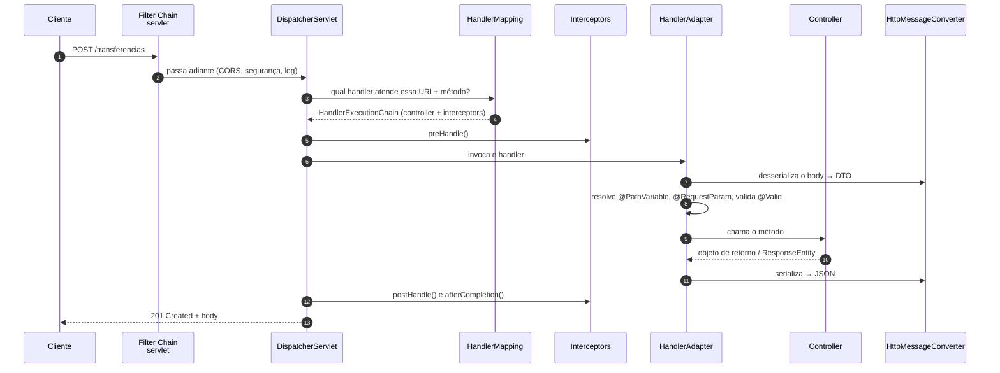

# III - SPRING MVC NA PRÁTICA

> [← Voltar para Spring MVC - APIs RESTful](README.md) · Anterior: [II - Fundamentos REST](ii-fundamentos-rest.md) · Próximo: [IV - Evolução da API](iv-evolucao-da-api.md)

## 1. O ciclo do DispatcherServlet

O Spring MVC implementa o padrão **Front Controller**: **um** servlet recebe todas as requisições e as despacha. Esse servlet é o `DispatcherServlet`.



Os componentes que o `DispatcherServlet` orquestra:

| Componente | Papel |
|---|---|
| **HandlerMapping** | descobre **qual** método atende a requisição (`RequestMappingHandlerMapping` lê os `@GetMapping` etc.) |
| **HandlerAdapter** | sabe **como** invocar aquele handler; resolve argumentos e trata o retorno |
| **HandlerMethodArgumentResolver** | preenche cada parâmetro (`@PathVariable`, `@RequestBody`, `Pageable`, `Principal`…) |
| **HttpMessageConverter** | converte corpo ↔ objeto (Jackson para JSON) — é o coração da API REST |
| **HandlerInterceptor** | ganchos antes/depois do handler, dentro do Spring |
| **ViewResolver** | resolve nome de view em template (**só MVC clássico**, não usado em `@RestController`) |
| **HandlerExceptionResolver** | transforma exceção em resposta — é por aqui que entra o `@RestControllerAdvice` |

> **A diferença entre `@Controller` e `@RestController`:** o primeiro devolve **nome de view** (passa por `ViewResolver` → Thymeleaf/JSP); o segundo é `@Controller + @ResponseBody`, e o retorno vai direto para o `HttpMessageConverter` virar JSON. Em API REST é sempre `@RestController`.

---

## 2. Mapeamento de requisições

```java
@RestController
@RequestMapping("/contas")                       // prefixo comum da classe
class ContaController {

    @GetMapping                                  // GET /contas
    List<ContaResponse> listar() { }

    @GetMapping("/{id}")                         // GET /contas/123
    ContaResponse buscar(@PathVariable String id) { }

    @PostMapping(consumes = APPLICATION_JSON_VALUE, produces = APPLICATION_JSON_VALUE)
    ResponseEntity<ContaResponse> criar(@RequestBody @Valid CriarContaRequest request) { }

    @PutMapping("/{id}")
    ContaResponse substituir(@PathVariable String id, @RequestBody @Valid ContaRequest request) { }

    @PatchMapping("/{id}")
    ContaResponse alterar(@PathVariable String id, @RequestBody Map<String, Object> campos) { }

    @DeleteMapping("/{id}")
    @ResponseStatus(HttpStatus.NO_CONTENT)       // 204 sem corpo
    void remover(@PathVariable String id) { }

    @GetMapping(params = "cpf")                  // GET /contas?cpf=... vai para cá
    ContaResponse buscarPorCpf(@RequestParam String cpf) { }

    @GetMapping(value = "/{id}", produces = "application/xml")   // negociação de conteúdo
    ContaResponse buscarXml(@PathVariable String id) { }
}
```

`@RequestMapping` é o genérico; `@GetMapping`, `@PostMapping`, `@PutMapping`, `@PatchMapping` e `@DeleteMapping` são atalhos compostos. Os atributos que filtram o mapeamento: `value`/`path`, `method`, `params`, `headers`, `consumes` (o que aceito receber → gera **415**), `produces` (o que sei devolver → gera **406**).

### Resolvendo os parâmetros

```java
@GetMapping("/{id}/transacoes")
Page<TransacaoResponse> listar(
        @PathVariable String id,                                  // /contas/{id}
        @RequestParam(defaultValue = "0") BigDecimal valorMinimo, // ?valorMinimo=
        @RequestParam(required = false) TipoTransacao tipo,       // converte String → enum
        @RequestHeader("X-Request-Id") String requestId,          // header
        @CookieValue(value = "tema", required = false) String tema,
        @AuthenticationPrincipal UsuarioAutenticado usuario,      // Spring Security
        Pageable paginacao) { }                                   // ?page=0&size=20&sort=data,desc

@PostMapping(value = "/{id}/comprovantes", consumes = MULTIPART_FORM_DATA_VALUE)
void anexar(@PathVariable String id,
            @RequestPart("arquivo") MultipartFile arquivo,
            @RequestPart("metadados") @Valid MetadadosRequest metadados) { }
```

**Diferença que cai em prova:** `@RequestParam` lê query string ou form (`application/x-www-form-urlencoded`); `@RequestBody` lê o **corpo** e passa pelo `HttpMessageConverter`; `@ModelAttribute` monta um objeto a partir dos campos de formulário (MVC clássico), sem passar por conversor de mensagem.

---

## 3. DTOs — e por que nunca expor a entidade JPA

```java
// entrada — record: imutável, conciso, sem boilerplate
public record CriarContaRequest(
        @NotBlank(message = "titular é obrigatório")
        String titular,

        @NotBlank @CPF
        String documento,

        @NotNull @PositiveOrZero @Digits(integer = 12, fraction = 2)
        BigDecimal saldoInicial) {

    public CriarContaCommand toCommand() {              // DTO → domínio
        return new CriarContaCommand(titular, new Documento(documento), saldoInicial);
    }
}

// saída
public record ContaResponse(String id, String titular, BigDecimal saldo, Status status) {

    public static ContaResponse de(Conta conta) {       // domínio → DTO
        return new ContaResponse(conta.id().valor(), conta.titular(), conta.saldo(), conta.status());
    }
}
```

Os motivos para **não** devolver `ContaEntity` no controller — vale ponto em dissertativa:

1. **Vazamento de dados** — todo campo novo na entidade (hash de senha, score interno, flag de fraude) vaza automaticamente no JSON.
2. **Acoplamento do contrato ao banco** — renomear uma coluna quebra o cliente da API.
3. **Serialização de lazy** — Jackson toca o proxy do Hibernate e dispara `LazyInitializationException` ou N+1 silencioso. → [SPRING DATA JPA](../spring-data-jpa/README.md)
4. **Ciclos infinitos** — `Conta → Transacao → Conta` estoura o serializador (o remendo `@JsonIgnore` na entidade é sintoma, não solução).
5. **Entrada perigosa** — receber a entidade direto permite *mass assignment*: o cliente manda `{"saldo": 999999}` e você persiste.
6. **Camadas** — na [Clean Architecture](../clean-architecture/README.md), DTO é adaptador de entrada/saída; entidade JPA é adaptador de persistência. São mundos diferentes.

**Records são a escolha natural para DTO** (Java 16+): imutáveis, `equals`/`hashCode`/`toString` prontos, e o Jackson os desserializa nativamente. Para entidade JPA, **não** use record — a JPA exige construtor sem argumentos e campos mutáveis.

---

## 4. Bean Validation

```java
public record TransferenciaRequest(
        @NotBlank String origem,
        @NotBlank String destino,
        @NotNull @Positive @Digits(integer = 12, fraction = 2) BigDecimal valor,
        @Size(max = 140) String descricao,
        @Future LocalDate agendadaPara,
        @Email String emailComprovante) { }
```

| Anotação | Valida |
|---|---|
| `@NotNull` | não nulo (mas `""` passa) |
| `@NotEmpty` | não nulo e não vazio (String, Collection, Map, array) |
| `@NotBlank` | não nulo e com pelo menos um caractere não-branco (**só String**) |
| `@Size(min, max)` | tamanho de String/coleção |
| `@Min` / `@Max` / `@Positive` / `@Negative` / `@PositiveOrZero` | numéricos |
| `@Digits(integer, fraction)` | precisão e escala — essencial para dinheiro |
| `@Pattern(regexp)` | expressão regular |
| `@Email` | formato de e-mail |
| `@Past` / `@Future` / `@PastOrPresent` | datas |
| `@Valid` em campo | validação **em cascata** no objeto aninhado |

**Onde o `@Valid` precisa estar:**

```java
// no @RequestBody — dispara a validação e gera MethodArgumentNotValidException (400)
void criar(@RequestBody @Valid CriarContaRequest request) { }

// em @PathVariable / @RequestParam — exige @Validated NA CLASSE, e a exceção é outra:
@Validated                                        // ← na classe do controller
class ContaController {
    @GetMapping("/{id}")
    ContaResponse buscar(@PathVariable @Size(min = 3) String id) { }   // ConstraintViolationException
}
```

Essa assimetria é pegadinha clássica: **`@Valid` no body, `@Validated` na classe para parâmetros simples** — e cada caso lança uma exceção diferente, que precisa de handler diferente.

### Grupos de validação

```java
public interface OnCreate {}
public interface OnUpdate {}

public record ContaRequest(
        @Null(groups = OnCreate.class) @NotNull(groups = OnUpdate.class) String id,
        @NotBlank(groups = {OnCreate.class, OnUpdate.class}) String titular) { }

void criar(@RequestBody @Validated(OnCreate.class) ContaRequest request) { }
```

### Validação customizada

```java
@Documented
@Constraint(validatedBy = CpfValidator.class)
@Target({ElementType.FIELD, ElementType.PARAMETER})
@Retention(RetentionPolicy.RUNTIME)
public @interface CPF {
    String message() default "CPF inválido";
    Class<?>[] groups() default {};
    Class<? extends Payload>[] payload() default {};
}

public class CpfValidator implements ConstraintValidator<CPF, String> {
    @Override
    public boolean isValid(String valor, ConstraintValidatorContext ctx) {
        if (valor == null) return true;              // nulo é problema do @NotNull, não meu
        return DigitoVerificador.cpfValido(valor);
    }
}
```

**Fronteira conceitual importante:** Bean Validation cuida do **formato** da entrada (obrigatório, tamanho, padrão). **Regra de negócio** (saldo suficiente, conta ativa, limite diário) pertence ao domínio, não a uma anotação no DTO — o validador não tem acesso ao banco nem ao contexto do caso de uso. Formato inválido → **400**; regra de negócio violada → **422**.

---

## 5. Tratamento de erros

### `ProblemDetail` — RFC 9457

O padrão para corpo de erro em HTTP é o **Problem Details** (RFC 7807, atualizada e substituída pela **RFC 9457** em 2023). O Spring 6 traz a classe `ProblemDetail` nativamente. `Content-Type: application/problem+json`:

```json
{
  "type": "https://api.banco.com/erros/saldo-insuficiente",
  "title": "Saldo insuficiente",
  "status": 422,
  "detail": "A conta 123 possui saldo de R$ 50,00 e a transferência é de R$ 80,00",
  "instance": "/transferencias",
  "contaId": "123",
  "saldoDisponivel": 50.00
}
```

Campos: `type` (URI que identifica o **tipo** de erro), `title` (resumo legível e estável), `status`, `detail` (descrição daquela ocorrência), `instance` (URI da ocorrência) — mais as extensões que você quiser.

### `@RestControllerAdvice`

```java
@RestControllerAdvice
class TratadorDeErros {

    // regra de negócio violada → 422
    @ExceptionHandler(SaldoInsuficienteException.class)
    ProblemDetail saldoInsuficiente(SaldoInsuficienteException ex) {
        var problema = ProblemDetail.forStatusAndDetail(HttpStatus.UNPROCESSABLE_ENTITY, ex.getMessage());
        problema.setTitle("Saldo insuficiente");
        problema.setType(URI.create("https://api.banco.com/erros/saldo-insuficiente"));
        problema.setProperty("contaId", ex.contaId().valor());
        problema.setProperty("saldoDisponivel", ex.saldoDisponivel());
        return problema;
    }

    @ExceptionHandler(ContaNaoEncontradaException.class)
    ProblemDetail naoEncontrada(ContaNaoEncontradaException ex) {
        return ProblemDetail.forStatusAndDetail(HttpStatus.NOT_FOUND, ex.getMessage());
    }

    // erro de validação do @Valid → 400 com o detalhe campo a campo
    @ExceptionHandler(MethodArgumentNotValidException.class)
    ProblemDetail validacao(MethodArgumentNotValidException ex) {
        var problema = ProblemDetail.forStatus(HttpStatus.BAD_REQUEST);
        problema.setTitle("Requisição inválida");
        problema.setProperty("erros", ex.getBindingResult().getFieldErrors().stream()
                .map(e -> Map.of("campo", e.getField(), "mensagem", e.getDefaultMessage()))
                .toList());
        return problema;
    }

    // rede de segurança — nunca vaze stack trace
    @ExceptionHandler(Exception.class)
    ProblemDetail inesperado(Exception ex) {
        log.error("Erro não tratado", ex);                       // detalhe vai para o log
        return ProblemDetail.forStatusAndDetail(HttpStatus.INTERNAL_SERVER_ERROR,
                "Erro interno. Contate o suporte com o id da requisição.");   // cliente vê o genérico
    }
}
```

Estender `ResponseEntityExceptionHandler` dá de brinde o tratamento das exceções padrão do Spring MVC (`HttpMessageNotReadableException`, `HttpRequestMethodNotSupportedException`, `NoResourceFoundException`…) já mapeadas para `ProblemDetail`.

Alternativa leve para exceção simples: `@ResponseStatus(HttpStatus.NOT_FOUND)` na própria classe da exceção — ou lançar `ResponseStatusException`. Serve para caso pontual; para uma API com contrato de erro consistente, use o advice.

> ### ⚠️ Exceção lançada em **filtro** não cai no `@RestControllerAdvice`
>
> O advice é um `HandlerExceptionResolver` — ele só atua **dentro** do `DispatcherServlet`. Um filtro (`OncePerRequestFilter`) roda **antes**, no nível do servlet container: se ele lança, a resposta é a página de erro padrão do container, sem o seu JSON.
>
> É exatamente por isso que erro de autenticação JWT (validado num filtro do Spring Security) não sai no formato do resto da API — o tratamento ali é feito por `AuthenticationEntryPoint` e `AccessDeniedHandler`. → [SPRING SECURITY](../spring-security/README.md)

---

## 6. `ResponseEntity` e o header `Location`

```java
@PostMapping
ResponseEntity<ContaResponse> criar(@RequestBody @Valid CriarContaRequest request) {
    Conta conta = useCase.executar(request.toCommand());

    URI uri = ServletUriComponentsBuilder.fromCurrentRequest()   // /contas
            .path("/{id}")
            .buildAndExpand(conta.id().valor())
            .toUri();                                            // /contas/123

    return ResponseEntity.created(uri)                           // 201 + Location
            .body(ContaResponse.de(conta));
}

return ResponseEntity.noContent().build();                       // 204
return ResponseEntity.status(HttpStatus.ACCEPTED)
        .header("X-Processamento-Id", id).body(status);          // 202
```

`ResponseEntity` quando você precisa controlar status e headers; retorno direto do objeto (com `@ResponseStatus` se necessário) quando não precisa. **201 sem `Location` é erro de contrato** — o cliente fica sem saber onde o recurso foi criado.

---

## 7. Serialização com Jackson

```java
public record ContaResponse(
        String id,

        @JsonFormat(shape = STRING, pattern = "dd/MM/yyyy HH:mm:ss")
        LocalDateTime criadaEm,

        @JsonProperty("saldo_disponivel")            // renomeia no JSON
        BigDecimal saldo,

        @JsonInclude(JsonInclude.Include.NON_NULL)   // some do JSON quando nulo
        String observacao) { }
```

```yaml
spring:
  jackson:
    property-naming-strategy: SNAKE_CASE     # padroniza a API inteira
    default-property-inclusion: non_null
    serialization:
      write-dates-as-timestamps: false       # ISO-8601 em vez de epoch
    deserialization:
      fail-on-unknown-properties: false      # tolerante a campo novo do cliente
```

Anotações mais usadas: `@JsonIgnore` (nunca serializa), `@JsonProperty(access = WRITE_ONLY)` (aceita na entrada, some na saída — perfeito para senha), `@JsonAlias` (aceita nomes antigos, útil em versionamento), `@JsonIgnoreProperties(ignoreUnknown = true)`.

Cuidado com `BigDecimal` em JSON: número de ponto flutuante em JavaScript perde precisão. Em domínio financeiro, muita API serializa valor monetário como **string** (`"1234.56"`) ou em centavos (inteiro).

---

## 8. Filtro × Interceptor × AOP

Três pontos de interceptação, em camadas diferentes:

| | **Filter** | **HandlerInterceptor** | **AOP (`@Aspect`)** |
|---|---|---|---|
| Camada | Servlet container | Spring MVC | Spring (qualquer bean) |
| Enxerga | `HttpServletRequest/Response` cruas | request + **qual handler** vai atender | argumentos e retorno **tipados** do método |
| Roda | antes do `DispatcherServlet` | depois do `HandlerMapping` | dentro da chamada do método |
| Pode alterar o corpo | sim (com wrapper) | limitadamente | sim |
| Exceção cai no `@RestControllerAdvice`? | **não** | sim (`preHandle`) | sim |
| Uso típico | CORS, segurança, log de acesso, `MDC`, compressão | autorização por handler, métricas por rota, popular contexto | transação, cache, auditoria, retry |

Ordem no fluxo: **Filter → DispatcherServlet → Interceptor.preHandle → AOP → Controller → AOP → Interceptor.postHandle → Interceptor.afterCompletion → Filter (volta)**.

```java
@Component
class RequestIdFilter extends OncePerRequestFilter {          // garante 1x por request
    @Override
    protected void doFilterInternal(HttpServletRequest req, HttpServletResponse res, FilterChain chain)
            throws ServletException, IOException {
        String id = Optional.ofNullable(req.getHeader("X-Request-Id")).orElse(UUID.randomUUID().toString());
        MDC.put("requestId", id);                             // aparece em todo log da thread
        res.setHeader("X-Request-Id", id);
        try { chain.doFilter(req, res); } finally { MDC.clear(); }   // SEMPRE limpar o ThreadLocal
    }
}
```

---

## 9. Spring MVC × WebFlux

| | **Spring MVC** | **Spring WebFlux** |
|---|---|---|
| Modelo | 1 thread por requisição (bloqueante) | event loop, não bloqueante |
| API | `@RestController` + tipos simples | `Mono<T>` / `Flux<T>` |
| Servidor | Tomcat (Servlet) | Netty (padrão) |
| Brilha em | CPU/JDBC, times acostumados | muita I/O concorrente, streaming, gateway |
| Custo | thread por conexão | complexidade de programação e de debug |

Com **virtual threads** (Java 21, `spring.threads.virtual.enabled=true`), boa parte do argumento de escalabilidade do WebFlux passa a valer também no MVC bloqueante — mantendo o modelo de programação simples. Hoje, escolher WebFlux se justifica principalmente por *streaming* e por back-pressure, não só por throughput.

---

## Perguntas para autoavaliação

1. Descreva o caminho de uma requisição do filtro até a resposta JSON, nomeando os componentes.
2. Qual a diferença entre `@Controller` e `@RestController`? Onde entra o `ViewResolver`?
3. `HandlerMapping` × `HandlerAdapter` × `HttpMessageConverter`: qual o papel de cada um?
4. Cite quatro motivos para não expor a entidade JPA no controller.
5. Por que `@Valid` funciona no `@RequestBody` mas exige `@Validated` na classe para `@PathVariable`?
6. Qual erro é 400 e qual é 422 — e como isso se reflete nos handlers?
7. O que é `ProblemDetail` e de qual RFC ele vem?
8. Por que uma exceção lançada num filtro do Spring Security não é formatada pelo seu `@RestControllerAdvice`?
9. Filter, Interceptor e Aspect: quando usar cada um?
10. O que muda no `PUT` quando o cliente omite um campo, e como o `PATCH` resolve isso?

---

> [← Voltar para Spring MVC - APIs RESTful](README.md) · Anterior: [II - Fundamentos REST](ii-fundamentos-rest.md) · Próximo: [IV - Evolução da API](iv-evolucao-da-api.md)
