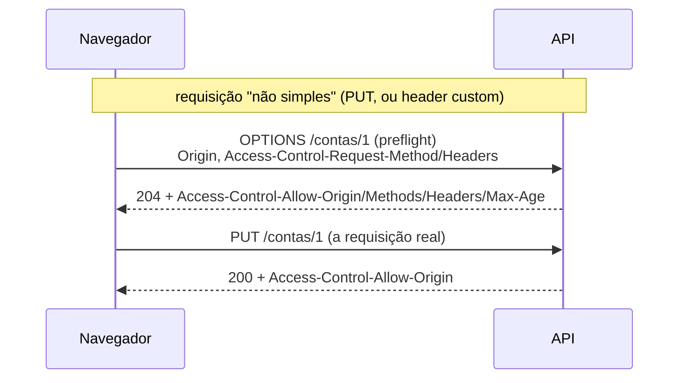

# IV - EVOLUÇÃO DA API

> [← Voltar para Spring MVC - APIs RESTful](README.md) · Anterior: [III - Spring MVC na prática](iii-spring-mvc-na-pratica.md)

Uma API não termina quando o endpoint responde 200. Ela precisa aguentar volume, mudar sem quebrar cliente, sobreviver a retry e ser documentada. É esse conjunto que separa "API que funciona" de "API de produção".

---

## 1. Paginação, filtro e ordenação

```java
@GetMapping("/contas/{id}/transacoes")
Page<TransacaoResponse> listar(
        @PathVariable String id,
        @RequestParam(required = false) TipoTransacao tipo,
        @RequestParam(required = false) @DateTimeFormat(iso = DATE) LocalDate de,
        @RequestParam(required = false) @DateTimeFormat(iso = DATE) LocalDate ate,
        @PageableDefault(size = 20, sort = "data", direction = Sort.Direction.DESC)
        Pageable paginacao) {

    return service.buscar(id, new FiltroTransacao(tipo, de, ate), paginacao)
                  .map(TransacaoResponse::de);
}
```

`GET /contas/123/transacoes?tipo=PIX&de=2026-01-01&page=0&size=20&sort=data,desc`

### `Page` × `Slice` × keyset

| | `Page<T>` | `Slice<T>` | Keyset / cursor |
|---|---|---|---|
| Sabe o total | ✅ (faz um `SELECT count(*)` **extra**) | ❌ só sabe se há próxima | ❌ |
| Custo | 2 queries | 1 query (busca `size + 1`) | 1 query |
| Serve para | "página 7 de 42" | scroll infinito | scroll infinito em base grande |
| Estabilidade com inserções concorrentes | ruim (itens deslocam) | ruim | **boa** |

**O problema do `OFFSET`:** `OFFSET 100000` obriga o banco a percorrer e descartar 100 mil linhas — degrada linearmente. E se alguém inserir uma linha entre a página 1 e a 2, itens repetem ou somem.

**Keyset pagination (seek method)** resolve os dois: em vez de "pule N", diga "me dê o que vem depois deste":

```sql
-- página seguinte a partir do último item visto (data, id) — usa o índice direto
SELECT * FROM transacao
 WHERE conta_id = :id AND (data, id) < (:ultimaData, :ultimoId)
 ORDER BY data DESC, id DESC
 LIMIT 20;
```

A API expõe isso como cursor opaco: `?cursor=eyJkYXRhIjoi...&size=20`. Regra prática: **`Page` para tela administrativa com numeração; keyset para feed, extrato e exportação.** → [ÍNDICE](../fundamentos-de-modelagem-de-dados/indice.md)

**Sempre defina um `size` máximo** — sem teto, `?size=1000000` é um DoS de graça.

---

## 2. Versionamento

Primeiro princípio: **a melhor versão é a que você não precisa criar.** Boa parte das mudanças pode ser feita de forma retrocompatível.

| Mudança | Quebra o cliente? |
|---|---|
| Adicionar campo **opcional** na resposta | não (cliente tolerante ignora) |
| Adicionar campo **opcional** na entrada | não |
| Adicionar endpoint novo | não |
| Renomear ou remover campo | **sim** |
| Tornar campo opcional em obrigatório | **sim** |
| Mudar tipo (`string` → `number`) ou formato de data | **sim** |
| Mudar significado de um valor (semântica) | **sim** — e é a pior, porque é silenciosa |
| Estreitar validação (aceitar menos que antes) | **sim** |

Para renomear sem quebrar: aceite os dois nomes por um período (`@JsonAlias`), devolva os dois, avise via `Deprecation`/`Sunset` headers e só então remova.

### As quatro estratégias

| Estratégia | Exemplo | Prós | Contras |
|---|---|---|---|
| **URI** | `/v1/contas` | explícito, fácil de rotear, testável no browser | "a URI do recurso deveria ser estável" — puristas reclamam; duplica caminhos |
| **Header customizado** | `X-API-Version: 1` | URI limpa | invisível no browser, fácil de esquecer, cache precisa de `Vary` |
| **Content negotiation** | `Accept: application/vnd.banco.conta.v2+json` | usa o mecanismo nativo do HTTP; versiona por **recurso** | verboso, pouco conhecido pelos times |
| **Query param** | `/contas?version=2` | simples | mistura versão com filtro; problemático em cache |

Na prática, **versionamento na URI domina o mercado** por ser o mais operacional (roteamento no gateway, log, métrica, documentação separada). O purismo REST prefere content negotiation. **Saiba defender os dois lados** — é pergunta clássica.

Regras de convivência: versione a API inteira (não endpoint a endpoint), mantenha no máximo duas versões vivas, anuncie a data de desligamento (`Sunset` header, RFC 8594) e monitore quem ainda usa a antiga antes de desligar.

---

## 3. Cache HTTP

A terceira restrição de Fielding, em código.

```java
@GetMapping("/contas/{id}")
ResponseEntity<ContaResponse> buscar(@PathVariable String id) {
    Conta conta = service.buscar(id);

    return ResponseEntity.ok()
            .eTag("\"" + conta.versao() + "\"")                    // validador forte
            .lastModified(conta.atualizadaEm().toInstant(UTC))
            .cacheControl(CacheControl.maxAge(60, TimeUnit.SECONDS).cachePrivate())
            .body(ContaResponse.de(conta));
}
```

**Duas famílias de mecanismo:**

- **Expiração** — `Cache-Control: max-age=60`. O cliente nem pergunta durante 60s. Requisição mais barata possível: zero.
- **Validação** — `ETag` / `Last-Modified`. O cliente pergunta com `If-None-Match: "v3"`; se nada mudou, o servidor responde **304 Not Modified** sem corpo. Economiza banda e serialização, não a ida ao servidor.

Diretivas de `Cache-Control` que importam: `no-store` (nunca armazenar — dado sensível), `no-cache` (armazenar mas **sempre revalidar**), `private` (só o navegador; nunca a CDN — obrigatório para dado por usuário), `public`, `max-age`, `s-maxage` (só para cache compartilhado), `must-revalidate`.

> `no-cache` **não** significa "não faça cache" — significa "faça cache, mas revalide antes de usar". Quem quer proibir o armazenamento usa `no-store`. Pegadinha frequente.

No Spring, `ShallowEtagHeaderFilter` gera ETag automaticamente a partir do hash do corpo — economiza banda, mas não economiza processamento (a resposta é gerada de qualquer jeito). ETag calculado do seu campo `@Version` é bem melhor.

### ETag para concorrência: `If-Match`

O mesmo ETag resolve *lost update* — dois clientes editando o mesmo recurso:

```
PUT /contas/123
If-Match: "3"

→ 200 se a versão atual for 3
→ 412 Precondition Failed se alguém já alterou (ETag mudou)
```

É **locking otimista via HTTP**, o par do `@Version` do JPA na camada de API. → [SPRING DATA JPA](../spring-data-jpa/README.md)

---

## 4. Idempotência em `POST`

`POST` não é idempotente, mas *retry* é inevitável: o cliente manda a transferência, a resposta se perde na rede, ele reenvia — e o dinheiro sai duas vezes. A solução padrão do mercado (Stripe, PagBank, bancos) é a **idempotency key**:

```
POST /transferencias
Idempotency-Key: 8f3a-4c21-9b77-e102
```

```java
@PostMapping("/transferencias")
ResponseEntity<TransferenciaResponse> transferir(
        @RequestHeader("Idempotency-Key") @NotBlank String chave,
        @RequestBody @Valid TransferenciaRequest request) {

    return idempotencia.executarUmaVez(chave, request.hash(), () -> {
        var comprovante = useCase.executar(request.toCommand());
        return ResponseEntity.created(uriDe(comprovante)).body(TransferenciaResponse.de(comprovante));
    });
}
```

Comportamento esperado:

1. Chave nova → processa e **guarda a resposta** associada à chave (com TTL de horas/dias).
2. Mesma chave, mesmo payload → devolve a resposta armazenada, **sem reprocessar**.
3. Mesma chave, payload **diferente** → `422` ou `409`: a chave está sendo reutilizada indevidamente.
4. Requisição ainda em andamento → `409` (ou espera), para evitar processamento concorrente.

A tabela de idempotência precisa de **constraint única** na chave — é o banco que garante a corrida, não o `if` da aplicação.

---

## 5. Operações assíncronas

Quando o processamento é longo (compensação, lote, análise antifraude), não segure a conexão:

```
POST /exportacoes            → 202 Accepted
                               Location: /exportacoes/9f2
                               Retry-After: 5

GET  /exportacoes/9f2        → 200 {"status":"PROCESSANDO","progresso":40}
                             → 200 {"status":"CONCLUIDO","download":"/exportacoes/9f2/arquivo"}
```

O padrão é **202 + recurso de status** (polling), com `Retry-After` sugerindo o intervalo. Para volume alto, **webhook** (você chama o cliente quando terminar) evita o polling — ao custo de exigir endpoint público, assinatura HMAC e retry com backoff do seu lado.

---

## 6. Rate limiting

```
429 Too Many Requests
Retry-After: 30
RateLimit-Limit: 1000
RateLimit-Remaining: 0
RateLimit-Reset: 30
```

Algoritmos: **token bucket** (permite rajada controlada — o mais usado), **leaky bucket** (saída constante), **fixed window** (simples, mas sofre com pico na virada da janela), **sliding window** (mais justo, mais caro).

Onde implementar: preferencialmente na **borda** (API Gateway, nginx, Cloudflare), porque protege a aplicação antes de gastar thread. Na aplicação, `Bucket4j` + Redis funciona quando o limite depende de regra de negócio (por cliente, por plano contratado).

Distinga **rate limiting** (proteger o serviço) de **quota** (limite comercial do plano) — os dois podem devolver 429, mas com contadores diferentes.

---

## 7. CORS

Restrição do **navegador** (não do servidor): uma página em `https://app.banco.com` não pode ler a resposta de `https://api.banco.com` a menos que a API autorize. Não protege sua API de `curl` — protege o **usuário** de um site malicioso agir em nome dele.



```java
@Bean
CorsConfigurationSource corsConfigurationSource() {
    var config = new CorsConfiguration();
    config.setAllowedOrigins(List.of("https://app.banco.com"));   // NUNCA "*" com credenciais
    config.setAllowedMethods(List.of("GET", "POST", "PUT", "DELETE"));
    config.setAllowedHeaders(List.of("Authorization", "Content-Type", "Idempotency-Key"));
    config.setExposedHeaders(List.of("Location", "RateLimit-Remaining"));
    config.setAllowCredentials(true);
    config.setMaxAge(3600L);                                       // cacheia o preflight

    var source = new UrlBasedCorsConfigurationSource();
    source.registerCorsConfiguration("/**", config);
    return source;
}
```

Pontos que caem: `allowCredentials(true)` é **incompatível com `allowedOrigins("*")`** (use `allowedOriginPatterns`); o navegador só enxerga headers listados em `exposedHeaders` — é por isso que o front "não vê" o `Location` do seu 201; e o preflight (`OPTIONS`) precisa passar pela cadeia de segurança sem exigir autenticação.

---

## 8. Documentação — OpenAPI

**OpenAPI** (o nome atual do Swagger) é a especificação; **springdoc-openapi** gera a doc a partir do código Spring.

```xml
<dependency>
  <groupId>org.springdoc</groupId>
  <artifactId>springdoc-openapi-starter-webmvc-ui</artifactId>
  <version>2.6.0</version>
</dependency>
```

`/v3/api-docs` (JSON) e `/swagger-ui.html` (interface).

```java
@Operation(summary = "Realiza transferência entre contas",
           description = "Debita a origem e credita o destino de forma atômica")
@ApiResponses({
    @ApiResponse(responseCode = "201", description = "Transferência realizada"),
    @ApiResponse(responseCode = "422", description = "Saldo insuficiente",
                 content = @Content(schema = @Schema(implementation = ProblemDetail.class))),
    @ApiResponse(responseCode = "429", description = "Limite de requisições excedido")
})
@PostMapping("/transferencias")
ResponseEntity<TransferenciaResponse> transferir(...) { }
```

**Code-first × API-first:**

- *Code-first* (o que o springdoc faz): a doc é gerada do código, então nunca fica defasada. É o caminho natural em time pequeno.
- *API-first*: escreve-se o contrato OpenAPI **antes**, e ele gera stubs e clientes (`openapi-generator`). Permite que front e back trabalhem em paralelo desde o dia 1 e transforma o contrato em artefato revisável. É o padrão quando a API é produto ou tem muitos consumidores.

O contrato também alimenta **teste de contrato** e a geração de SDKs. → [TESTES EM SOFTWARE](../testes-em-software/iii-testes-no-spring.md)

---

## 9. Segurança de API — os itens que aparecem no design

Recorte do **OWASP API Security Top 10** que se decide na modelagem, não no framework:

| Risco | O que é | Defesa |
|---|---|---|
| **BOLA / IDOR** (API1) | `GET /contas/999` devolve a conta de outro cliente porque você só checou a role | validar **ownership** do recurso, não só o papel |
| **Broken Authentication** (API2) | token sem expiração, sem validação de `iss`/`aud` | → [SPRING SECURITY](../spring-security/README.md) |
| **Excessive Data Exposure** (API3) | devolver a entidade inteira e "filtrar no front" | DTO de saída explícito |
| **Falta de rate limit** (API4) | força bruta, scraping, DoS | seção 6 |
| **Mass assignment** (API6) | aceitar `{"saldo":999999}` e persistir | DTO de entrada com só os campos editáveis |
| **Misconfiguration** (API7) | CORS `*`, stack trace no 500, verbo aberto | ProblemDetail genérico + config revisada |

Headers de resposta que valem configurar: `Strict-Transport-Security`, `X-Content-Type-Options: nosniff`, `Content-Security-Policy` e `Cache-Control: no-store` em respostas com dado sensível.

E o básico que muita API esquece: **nunca coloque dado sensível na query string** (`?cpf=...`) — URL vai para log de acesso, histórico do navegador, header `Referer` e APM. Dado sensível vai no corpo ou em header.

---

## 10. Checklist de design de API

- [ ]  Substantivos no plural, sem verbo na URI
- [ ]  Verbo HTTP com a semântica correta (idempotência respeitada)
- [ ]  201 sempre com `Location`; 204 sem corpo
- [ ]  400 para sintaxe, 422 para regra de negócio, 401 ≠ 403
- [ ]  Corpo de erro padronizado (`ProblemDetail`), sem stack trace
- [ ]  Paginação com `size` máximo; keyset onde a base é grande
- [ ]  Filtro e ordenação em query params
- [ ]  `Idempotency-Key` em operação financeira
- [ ]  `ETag`/`Cache-Control` nas leituras; `If-Match` onde há concorrência
- [ ]  Rate limit com 429 + `Retry-After`
- [ ]  CORS com origem explícita e headers expostos
- [ ]  OpenAPI publicada e versionada junto com o código
- [ ]  Sem dado sensível em URL; sem entidade JPA no contrato
- [ ]  Estratégia de versionamento definida e política de desligamento (`Sunset`)

---

## Perguntas para autoavaliação

1. Por que `OFFSET` grande é caro, e como o keyset resolve?
2. `Page` × `Slice`: qual o custo extra do primeiro e quando ele se justifica?
3. Cite três mudanças retrocompatíveis e três que quebram o cliente.
4. Compare versionamento por URI e por content negotiation — qual argumento cada lado usa?
5. Qual a diferença entre `no-cache` e `no-store`?
6. Como o par `ETag` + `If-Match` implementa locking otimista, e qual status ele devolve em conflito?
7. Explique o fluxo de uma idempotency key, incluindo o caso de payload diferente com a mesma chave.
8. O que o CORS protege de fato — a API ou o usuário? Por que `*` com credenciais é proibido?
9. Por que 202 + recurso de status é melhor do que segurar a conexão por 3 minutos?
10. O que é BOLA/IDOR e por que checar a role não é suficiente?

---

> [← Voltar para Spring MVC - APIs RESTful](README.md) · Anterior: [III - Spring MVC na prática](iii-spring-mvc-na-pratica.md)
