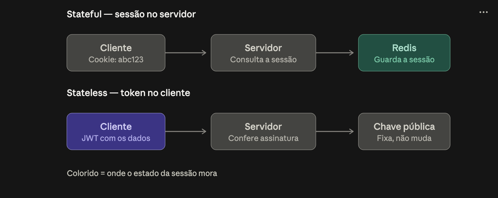
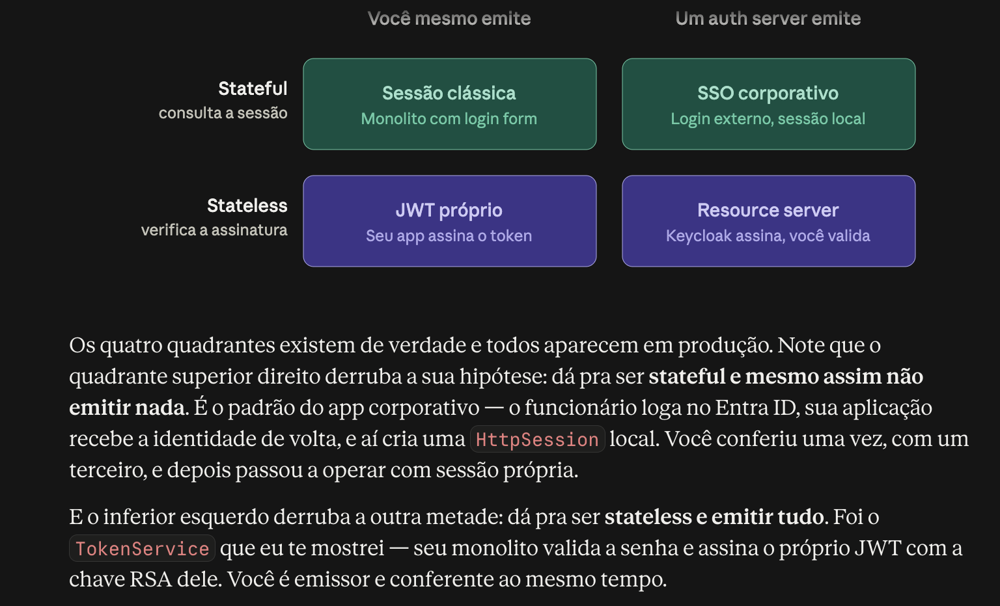

# SPRING SECURITY

# Autenticação e Autorização — Conceitos + Spring Security

---

# PARTE 1 — Fundamentos conceituais

## 1.1 AuthN vs AuthZ

|  | Autenticação (AuthN) | Autorização (AuthZ) |
| --- | --- | --- |
| Pergunta | Quem é você? | O que você pode fazer? |
| Momento | Acontece primeiro | Acontece depois (depende da AuthN) |
| Resultado | Uma identidade comprovada | Um permit/deny sobre um recurso |
| Erro HTTP | 401 Unauthorized (nome infeliz — deveria ser "Unauthenticated") | 403 Forbidden |
| Exemplo | Login com senha, certificado, token | "Esse usuário pode aprovar transferência acima de R$ 50k?" |

Ponto que cai em entrevista: **401 = não sei quem você é (ou seu token expirou/é inválido); 403 = sei quem você é, mas você não tem permissão.**

## 1.2 Vocabulário essencial

- **Identidade (Subject / Principal)**: a entidade que age no sistema. Pode ser pessoa, serviço, job, dispositivo.
- **Credencial**: a prova da identidade (senha, chave privada, token, biometria).
- **Claim**: uma afirmação sobre o subject (`sub=123`, `email=x@y.com`, `role=ADMIN`).
- **Authority / Permission**: unidade granular de poder (`transfer:approve`).
- **Role**: agrupamento de authorities (`ROLE_MANAGER` = conjunto de permissões).
- **Scope**: o que o *cliente* (aplicação) pode pedir em nome do usuário — conceito de OAuth2. Diferente de role.
- **Policy**: regra que decide permit/deny combinando atributos.
- **Principal ≠ Credential**: o principal é "quem", a credencial é "a prova".

## 1.3 Fatores de autenticação

1. **Algo que você sabe** — senha, PIN.
2. **Algo que você tem** — celular (TOTP), token físico, smartcard, passkey.
3. **Algo que você é** — biometria.

**MFA** = exigir ≥ 2 fatores de **categorias diferentes**. Senha + pergunta secreta não é MFA (ambos são "algo que você sabe").

Em domínio bancário isso aparece como **step-up authentication**: a sessão já está autenticada, mas operações sensíveis (Pix acima de X, cadastro de beneficiário) exigem um fator adicional na hora. Modelar isso implica guardar no token/sessão o **AAL/ACR** (nível de garantia) e o **auth_time**.

## 1.4 Armazenamento de senhas

Regras não negociáveis:

- **Nunca** armazenar em texto puro nem criptografia reversível.
- Usar **hash lento com salt** por usuário: `bcrypt`, `scrypt`, ou preferencialmente **Argon2id**.
- **Salt** = valor aleatório por usuário, guardado junto ao hash (evita rainbow tables e revela senhas iguais).
- **Pepper** = segredo global fora do banco (num HSM/KeyVault), opcional mas bom em fintech.
- SHA-256/MD5 são **rápidos demais** → péssimos para senha. Servem para integridade, não para credencial.
- Fator de custo deve ser calibrado (bcrypt strength 10–12 tipicamente; ajustar para ~100–300ms por hash).

## 1.5 Estado da sessão: Stateful vs Stateless





### Sessão no servidor (stateful)

```
Login → servidor cria sessão em memória/Redis → devolve cookie JSESSIONID
Requisições seguintes → cookie → servidor busca a sessão
```

- ✅ Revogação instantânea (apaga a sessão).
- ✅ Cookie é opaco, não vaza dados.
- ❌ Precisa de sessão distribuída (Redis) para escalar horizontalmente.
- ❌ Vulnerável a **CSRF** (o browser envia o cookie automaticamente) → precisa de proteção CSRF.

### Token auto-contido (stateless)

```
Login → servidor assina um JWT com as claims → cliente guarda e envia em Authorization: Bearer
Requisições seguintes → servidor só valida a assinatura, não consulta nada
```

- ✅ Escala bem, serve microsserviços (cada serviço valida sozinho).
- ❌ **Revogação é o calcanhar de Aquiles**: um JWT válido continua válido até expirar.
- ❌ Se o token cresce, cresce em toda requisição.

Mitigações de revogação: TTL curto (5–15 min) + refresh token, denylist de `jti` em Redis, `token_version` no usuário comparado com claim do token.

## 1.6 JWT em detalhe

Formato: `header.payload.signature` — três blocos Base64URL separados por ponto.

```json
// header
{ "alg": "RS256", "typ": "JWT", "kid": "chave-2026-01" }

// payload (claims)
{
  "iss": "https://auth.meubanco.com",   // quem emitiu
  "sub": "user-8829",                   // subject
  "aud": "api-pagamentos",              // destinatário esperado
  "exp": 1767225600,                    // expiração (obrigatório na prática)
  "iat": 1767224700,                    // emitido em
  "nbf": 1767224700,                    // não válido antes de
  "jti": "a1b2c3",                      // id único (denylist / idempotência)
  "scope": "payments:read payments:write",
  "roles": ["MANAGER"]
}
```

**Pontos críticos:**

- O payload é **codificado, não criptografado**. Qualquer um lê. Nunca coloque CPF, saldo, token de terceiro ou PII sensível lá dentro.
- A assinatura garante **integridade e autenticidade**, não confidencialidade. Se precisar de sigilo → **JWE**.
- **HS256 (simétrico)**: mesma chave assina e valida. Só serve quando emissor e validador são o mesmo domínio de confiança. Se 10 microsserviços têm a chave, 10 podem forjar token.
- **RS256/ES256 (assimétrico)**: auth server assina com a privada, serviços validam com a pública (via **JWKS** em `/.well-known/jwks.json`). É o padrão correto para arquitetura distribuída. O `kid` permite rotação de chaves sem downtime.
- Ataques clássicos: `alg: none`, confusão de algoritmo (RS256 → HS256 usando a chave pública como segredo HMAC), não validar `aud`/`iss`. Bibliotecas maduras já bloqueiam — **nunca implemente validação de JWT na mão**.
- Validar sempre: assinatura, `exp`, `nbf`, `iss`, `aud`.

**Access token vs Refresh token:**

|  | Access token | Refresh token |
| --- | --- | --- |
| Vida | Curta (5–15 min) | Longa (dias/semanas) |
| Uso | Toda chamada de API | Só no auth server, para obter novo access |
| Formato | JWT normalmente | Opaco, armazenado no servidor |
| Onde guardar | Memória do app / header | Cookie `HttpOnly` + `Secure` + `SameSite` |

**Rotação de refresh token**: cada uso emite um novo e invalida o anterior. Se um refresh já usado reaparecer → sinal de roubo → invalida a família inteira de tokens.

## 1.7 Onde guardar o token no cliente

| Local | XSS | CSRF | Veredito |
| --- | --- | --- | --- |
| `localStorage` | Vulnerável (JS lê) | Imune | Comum, mas arriscado |
| Cookie `HttpOnly` | Protegido | Vulnerável → precisa CSRF token / `SameSite=Strict` | Melhor opção para web app |
| Memória (variável JS) | Parcialmente | Imune | Bom, mas perde no refresh da página |

Padrão moderno recomendado para SPA: **BFF (Backend for Frontend)** — o browser fala com o BFF por cookie de sessão `HttpOnly`, e o BFF guarda os tokens OAuth server-side. Elimina token no browser.

## 1.8 Modelos de autorização

### RBAC — Role-Based Access Control

Permissão vinculada a papéis. `usuário → papéis → permissões → recursos`.

- ✅ Simples, auditável, fácil de explicar pro time de compliance.
- ❌ **Role explosion**: `GERENTE_AGENCIA_SP_PJ`, `GERENTE_AGENCIA_RJ_PF`… quando a regra depende de contexto, o RBAC puro degrada.

### ABAC — Attribute-Based Access Control

Decisão calculada a partir de atributos do sujeito, do recurso, da ação e do ambiente.

> "Analista pode aprovar transferência **se** valor < 50k **e** for horário comercial **e** a conta pertencer à sua carteira."
> 
- ✅ Expressivo, granular, poucos papéis.
- ❌ Difícil de auditar ("quem pode fazer o quê?" vira consulta complexa) e de testar.

### ReBAC — Relationship-Based Access Control

Decisão via grafo de relações (modelo Google Zanzibar; ferramentas: OpenFGA, SpiceDB).

> "Pode editar o documento porque é membro do time que é dono da pasta pai."
> 
- Ideal para hierarquias e compartilhamento. Você já mexeu com banco de grafos — o casamento é natural.

### ACL — Access Control List

Lista de permissões por objeto individual. Granularíssimo, mas escala mal.

**Na prática**: RBAC como base + ABAC nas regras de negócio sensíveis. Papéis definem a superfície grosseira; políticas de atributo refinam.

### PEP / PDP / PIP (vocabulário de arquitetura)

- **PEP** (Policy Enforcement Point): onde a decisão é aplicada — seu filtro/interceptor.
- **PDP** (Policy Decision Point): onde a decisão é tomada — engine de política (OPA, Cedar, ou seu código).
- **PIP** (Policy Information Point): de onde vêm os atributos.

Separar PEP de PDP permite mudar política sem redeploy.

## 1.9 OAuth 2.0

**Importante: OAuth2 é um protocolo de *autorização delegada*, não de autenticação.** Ele responde "esta aplicação pode acessar este recurso em nome do usuário?", não "quem é o usuário?".

### Papéis

- **Resource Owner**: o usuário dono dos dados.
- **Client**: a aplicação que quer acessar (seu SPA, app mobile, serviço).
- **Authorization Server**: emite tokens (Keycloak, Auth0, Entra ID, Spring Authorization Server).
- **Resource Server**: a API que valida o token e serve os dados.

### Fluxos (grant types)

**Authorization Code + PKCE** — padrão atual para qualquer app com usuário (web, SPA, mobile):

```
1. App gera code_verifier aleatório e code_challenge = SHA256(verifier)
2. Redireciona pro auth server com o challenge
3. Usuário autentica e consente
4. Auth server devolve um authorization code no redirect
5. App troca code + code_verifier por tokens (back-channel)
6. Auth server confere o verifier contra o challenge → emite tokens
```

O PKCE impede que um app malicioso que intercepte o code consiga trocá-lo por token.

**Client Credentials** — máquina-para-máquina, sem usuário. É o que você usa entre microsserviços.

```
POST /oauth2/token
grant_type=client_credentials&client_id=...&client_secret=...&scope=payments:read
```

**Device Code** — dispositivos sem teclado (TV, CLI).

**Depreciados**: *Implicit* (token no fragmento da URL — vaza) e *Resource Owner Password Credentials* (o app vê a senha do usuário). Não use.

### Scopes vs Roles

- **Scope** = o que o *client* está autorizado a pedir. Limita a aplicação.
- **Role/Authority** = o que o *usuário* pode fazer. Limita a pessoa.

A permissão efetiva é a **interseção**: um admin usando um app com scope `read` só lê.

## 1.10 OpenID Connect (OIDC)

Camada de **autenticação** em cima do OAuth2. É o que faltava.

- Adiciona o **ID Token** (sempre um JWT) com claims de identidade: `sub`, `name`, `email`, `auth_time`, `nonce`, `acr`.
- Endpoint `/userinfo` para dados adicionais.
- Discovery em `/.well-known/openid-configuration`.
- **ID Token é para o cliente saber quem logou. Access Token é para chamar API.** Nunca use ID Token como bearer para API.

Regra mnemônica: **OAuth2 = autorização. OIDC = autenticação. SAML = a versão XML/enterprise do OIDC.**

## 1.11 Autenticação serviço-a-serviço

Contexto de arquitetura distribuída (seu caso: Kafka, microsserviços, Azure):

- **mTLS**: ambos os lados apresentam certificado. Base do zero-trust / service mesh.
- **Client Credentials (OAuth2)**: cada serviço tem client_id/secret e pega token no auth server.
- **API Key**: simples, mas é um segredo estático de longa vida — evite em superfícies sensíveis.
- **HMAC de requisição**: assinar corpo + timestamp + nonce com segredo compartilhado. Comum em webhooks e integrações de pagamento; protege contra replay se o timestamp for validado.
- **Propagação de identidade**: quando A chama B em nome do usuário, evite repassar o token cru indefinidamente. Padrões: **Token Exchange** (RFC 8693) ou emitir um token interno com audience restrita.

## 1.12 Ameaças e defesas (checklist)

| Ameaça | O que é | Defesa |
| --- | --- | --- |
| **CSRF** | Site malicioso dispara requisição autenticada pelo cookie | Token CSRF, `SameSite=Lax/Strict`. Irrelevante se você usa só header `Authorization` |
| **XSS** | JS injetado rouba token/sessão | Escapar output, CSP, cookie `HttpOnly` |
| **Session fixation** | Atacante fixa um session id antes do login | Regenerar id no login |
| **Credential stuffing** | Senhas vazadas testadas em massa | Rate limit, MFA, checagem contra listas vazadas |
| **Brute force** | Tentativas repetidas | Backoff exponencial, lockout, CAPTCHA |
| **Replay** | Reenvio de requisição capturada | Nonce, timestamp, `jti` único, TLS |
| **Privilege escalation** | Usuário acessa recurso de outro (IDOR) | Sempre validar **ownership do recurso**, não só o papel |
| **User enumeration** | Erro diferente para "usuário não existe" vs "senha errada" | Mensagem e tempo de resposta idênticos |
| **Token leakage** | Token em URL, log ou referrer | Só em header/cookie; mascarar em logs |

**IDOR é o erro mais comum e mais caro.** `@PreAuthorize("hasRole('CLIENTE')")` em `GET /contas/{id}` não impede o cliente A de ler a conta do cliente B. A checagem de posse do recurso é obrigatória.

---

# PARTE 2 — Spring Security

## 2.1 Como o Spring Security se encaixa

Ele é, essencialmente, **uma cadeia de Servlet Filters** instalada antes dos seus controllers.

```
Request
  ↓
DelegatingFilterProxy (registrado no container servlet)
  ↓
FilterChainProxy  ← o "cérebro": escolhe qual SecurityFilterChain aplica
  ↓
SecurityFilterChain (lista ordenada de filtros)
   ├── CsrfFilter
   ├── SecurityContextHolderFilter        → restaura o contexto
   ├── UsernamePasswordAuthenticationFilter / BearerTokenAuthenticationFilter
   ├── ExceptionTranslationFilter         → converte exceção em 401/403
   └── AuthorizationFilter                → decisão final de acesso
  ↓
DispatcherServlet → seu @RestController
```

**Consequência prática:** exceções lançadas dentro dos filtros **não passam** pelo seu `@RestControllerAdvice`, porque acontecem antes do DispatcherServlet. Erros de autenticação/autorização precisam de `AuthenticationEntryPoint` e `AccessDeniedHandler` customizados.

## 2.2 Objetos centrais

```java
SecurityContextHolder           // ThreadLocal que guarda o contexto
  └── SecurityContext
        └── Authentication      // interface principal
              ├── getPrincipal()    // quem (UserDetails, Jwt, String...)
              ├── getCredentials()  // limpo após autenticar
              ├── getAuthorities()  // Collection<GrantedAuthority>
              └── isAuthenticated()
```

Acesso ao usuário logado:

```java
Authentication auth = SecurityContextHolder.getContext().getAuthentication();

// ou, melhor, por injeção no controller:
@GetMapping("/me")
public MeResponse me(@AuthenticationPrincipal Jwt jwt) {
    return new MeResponse(jwt.getSubject(), jwt.getClaimAsStringList("roles"));
}
```

⚠️ `SecurityContextHolder` usa `ThreadLocal` por padrão. Em `@Async`, `CompletableFuture` ou consumidores Kafka, **o contexto não propaga**. Soluções: `DelegatingSecurityContextExecutor`, ou `MODE_INHERITABLETHREADLOCAL`, ou passar a identidade explicitamente no header da mensagem.

## 2.3 Fluxo de autenticação

```
AuthenticationFilter
   └── AuthenticationManager (interface)
         └── ProviderManager (implementação)
               └── AuthenticationProvider (um ou vários, testados em ordem)
                     ├── DaoAuthenticationProvider
                     │     ├── UserDetailsService.loadUserByUsername()
                     │     └── PasswordEncoder.matches()
                     └── JwtAuthenticationProvider, LdapAuthenticationProvider, ...
```

O `AuthenticationProvider` recebe um `Authentication` **não autenticado** e devolve um **autenticado e populado**, ou lança `AuthenticationException`.

## 2.4 Configuração moderna (Spring Security 6.x)

`WebSecurityConfigurerAdapter` foi **removido**. Hoje é tudo bean + lambda DSL.

```java
@Configuration
@EnableWebSecurity
@EnableMethodSecurity  // habilita @PreAuthorize/@PostAuthorize
public class SecurityConfig {

    @Bean
    SecurityFilterChain filterChain(HttpSecurity http) throws Exception {
        return http
            .csrf(csrf -> csrf.disable())  // OK só para API stateless com Bearer token
            .sessionManagement(s -> s.sessionCreationPolicy(SessionCreationPolicy.STATELESS))
            .authorizeHttpRequests(auth -> auth
                .requestMatchers("/actuator/health", "/auth/**").permitAll()
                .requestMatchers(HttpMethod.GET, "/api/produtos/**").hasAuthority("SCOPE_produtos:read")
                .requestMatchers("/api/admin/**").hasRole("ADMIN")
                .requestMatchers("/api/transferencias/**").hasAnyRole("GERENTE", "ANALISTA")
                .anyRequest().authenticated()          // fallback: nunca deixe permitAll aqui
            )
            .oauth2ResourceServer(oauth -> oauth
                .jwt(jwt -> jwt.jwtAuthenticationConverter(jwtAuthConverter()))
            )
            .exceptionHandling(ex -> ex
                .authenticationEntryPoint(new BearerTokenAuthenticationEntryPoint()) // 401
                .accessDeniedHandler(new BearerTokenAccessDeniedHandler())           // 403
            )
            .build();
    }

    @Bean
    PasswordEncoder passwordEncoder() {
        // DelegatingPasswordEncoder: prefixa o hash com {bcrypt}, permite migrar de algoritmo
        return PasswordEncoderFactories.createDelegatingPasswordEncoder();
    }
}
```

**Ordem importa**: as regras de `authorizeHttpRequests` são avaliadas de cima para baixo, **primeira que casar vence**. Colocar `anyRequest()` antes de regras específicas anula tudo abaixo.

### Múltiplas cadeias de filtro

Útil quando a API e o painel web têm regras diferentes:

```java
@Bean @Order(1)
SecurityFilterChain apiChain(HttpSecurity http) throws Exception {
    return http.securityMatcher("/api/**")
        .csrf(c -> c.disable())
        .sessionManagement(s -> s.sessionCreationPolicy(STATELESS))
        .oauth2ResourceServer(o -> o.jwt(withDefaults()))
        .authorizeHttpRequests(a -> a.anyRequest().authenticated())
        .build();
}

@Bean @Order(2)
SecurityFilterChain webChain(HttpSecurity http) throws Exception {
    return http
        .formLogin(withDefaults())   // aqui CSRF fica LIGADO
        .authorizeHttpRequests(a -> a.anyRequest().authenticated())
        .build();
}
```

## 2.5 Roles vs Authorities no Spring

Isso confunde muita gente:

- `GrantedAuthority` é a unidade real. Uma "role" é só uma authority com o **prefixo `ROLE_`**.
- `hasRole("ADMIN")` → procura a authority `ROLE_ADMIN` (o prefixo é adicionado automaticamente).
- `hasAuthority("ADMIN")` → procura literalmente `ADMIN`.
- No resource server JWT, os scopes viram authorities com prefixo `SCOPE_` por padrão.

Erro clássico: gravar `"ROLE_ADMIN"` no banco e usar `hasRole("ROLE_ADMIN")` → vira `ROLE_ROLE_ADMIN` → 403 misterioso.

## 2.6 UserDetailsService (autenticação com banco próprio)

```java
@Service
@RequiredArgsConstructor
public class JpaUserDetailsService implements UserDetailsService {

    private final UsuarioRepository repository;

    @Override
    public UserDetails loadUserByUsername(String username) {
        Usuario usuario = repository.findByEmail(username)
            .orElseThrow(() -> new UsernameNotFoundException("Credenciais inválidas"));

        return User.builder()
            .username(usuario.getEmail())
            .password(usuario.getSenhaHash())        // hash, nunca a senha
            .authorities(usuario.getPerfis().stream()
                .map(p -> new SimpleGrantedAuthority("ROLE_" + p.getNome()))
                .toList())
            .accountLocked(usuario.isBloqueado())
            .disabled(!usuario.isAtivo())
            .build();
    }
}
```

Mensagem genérica de propósito: evita **user enumeration**.

## 2.7 Resource Server com JWT

`application.yml` — validação por JWKS, sem chave hardcoded:

```yaml
spring:
  security:
    oauth2:
      resourceserver:
        jwt:
          issuer-uri: https://auth.meubanco.com/realms/core
          # audiences: [api-pagamentos]   # valide o aud!
```

O Spring baixa o JWKS automaticamente, cacheia e trata rotação de chave via `kid`.

Mapeando claims customizadas para authorities:

```java
@Bean
JwtAuthenticationConverter jwtAuthConverter() {
    JwtGrantedAuthoritiesConverter scopes = new JwtGrantedAuthoritiesConverter();
    scopes.setAuthorityPrefix("SCOPE_");

    JwtAuthenticationConverter converter = new JwtAuthenticationConverter();
    converter.setJwtGrantedAuthoritiesConverter(jwt -> {
        Collection<GrantedAuthority> authorities = new ArrayList<>(scopes.convert(jwt));
        List<String> roles = jwt.getClaimAsStringList("roles");
        if (roles != null) {
            roles.forEach(r -> authorities.add(new SimpleGrantedAuthority("ROLE_" + r)));
        }
        return authorities;
    });
    return converter;
}
```

Validador extra de audience:

```java
@Bean
JwtDecoder jwtDecoder(OAuth2ResourceServerProperties props) {
    NimbusJwtDecoder decoder = JwtDecoders.fromIssuerLocation(props.getJwt().getIssuerUri());
    decoder.setJwtValidator(new DelegatingOAuth2TokenValidator<>(
        JwtValidators.createDefaultWithIssuer(props.getJwt().getIssuerUri()),
        new JwtClaimValidator<List<String>>("aud", aud -> aud != null && aud.contains("api-pagamentos"))
    ));
    return decoder;
}
```

## 2.8 Emitindo JWT próprio (sem auth server externo)

Para monolito ou projeto acadêmico. Use `spring-boot-starter-oauth2-resource-server` + par de chaves RSA — não implemente parsing na mão.

```java
@Service
public class TokenService {

    private final JwtEncoder encoder;   // configurado com a chave RSA privada

    public String gerar(Authentication auth) {
        Instant agora = Instant.now();
        String scopes = auth.getAuthorities().stream()
            .map(GrantedAuthority::getAuthority)
            .collect(Collectors.joining(" "));

        JwtClaimsSet claims = JwtClaimsSet.builder()
            .issuer("meu-app")
            .issuedAt(agora)
            .expiresAt(agora.plus(15, ChronoUnit.MINUTES))
            .subject(auth.getName())
            .id(UUID.randomUUID().toString())
            .claim("scope", scopes)
            .build();

        return encoder.encode(JwtEncoderParameters.from(claims)).getTokenValue();
    }
}
```

Endpoint de login:

```java
@PostMapping("/auth/login")
public TokenResponse login(@RequestBody @Valid LoginRequest req) {
    Authentication auth = authenticationManager.authenticate(
        new UsernamePasswordAuthenticationToken(req.email(), req.senha())
    );
    return new TokenResponse(tokenService.gerar(auth), 900);
}
```

> Só escreva um `OncePerRequestFilter` de JWT manual se tiver um motivo real. O `BearerTokenAuthenticationFilter` que vem pronto já faz isso melhor e mais seguro.
> 

## 2.9 Method Security

Autorização na camada de serviço, mais perto da regra de negócio.

```java
@Service
public class TransferenciaService {

    @PreAuthorize("hasRole('GERENTE')")
    public void aprovar(UUID id) { }

    // SpEL com argumentos do método
    @PreAuthorize("hasRole('GERENTE') and #valor <= 50000")
    public void aprovarComLimite(UUID id, BigDecimal valor) { }

    // ownership: o clássico contra IDOR
    @PreAuthorize("#clienteId == authentication.name or hasRole('ADMIN')")
    public Extrato consultar(String clienteId) { }

    // delegando para um bean de política — mais testável que SpEL gigante
    @PreAuthorize("@contaPolicy.podeAcessar(authentication, #contaId)")
    public Conta buscar(UUID contaId) { }

    // filtra a coleção retornada
    @PostFilter("filterObject.agencia == authentication.principal.agencia")
    public List<Conta> listarTodas() { }

    // avalia o objeto retornado — cuidado: o método já executou
    @PostAuthorize("returnObject.donoId == authentication.name")
    public Conta detalhar(UUID id) { }
}
```

Detalhes que pegam:

- Method security funciona via **proxy AOP** → **chamada interna (`this.metodo()`) não é interceptada**.
- `@PostAuthorize` roda **depois** da execução. Se o método já persistiu algo, o dano está feito. Prefira `@PreAuthorize`.
- `@PostFilter` carrega tudo para depois filtrar — péssimo para listas grandes. Filtre no `WHERE` do repositório.
- Precisa de `@EnableMethodSecurity` (o antigo `@EnableGlobalMethodSecurity` está depreciado).

### Bean de política (mais limpo que SpEL longo)

```java
@Component("contaPolicy")
@RequiredArgsConstructor
public class ContaPolicy {

    private final ContaRepository repository;

    public boolean podeAcessar(Authentication auth, UUID contaId) {
        if (temPapel(auth, "ROLE_ADMIN")) return true;
        return repository.findById(contaId)
            .map(c -> c.getDonoId().equals(auth.getName()))
            .orElse(false);
    }
}
```

Esse é o **PDP** da Parte 1 materializado, e ele é unitariamente testável.

## 2.10 CSRF — quando ligar e quando desligar

| Cenário | CSRF |
| --- | --- |
| API stateless com `Authorization: Bearer` | **Desligar** — o browser não envia o header automaticamente |
| App web com sessão por cookie (Thymeleaf, form login) | **Manter ligado** |
| SPA + cookie de sessão / BFF | **Ligado**, com `CookieCsrfTokenRepository` |

Desligar CSRF "porque estava dando 403" em app baseado em cookie é um furo de segurança real.

## 2.11 CORS

CORS não é segurança do servidor — é uma restrição do browser. Configure explicitamente e nunca use `allowedOrigins("*")` junto com `allowCredentials(true)`.

```java
@Bean
CorsConfigurationSource corsSource() {
    CorsConfiguration config = new CorsConfiguration();
    config.setAllowedOrigins(List.of("https://app.meubanco.com"));
    config.setAllowedMethods(List.of("GET", "POST", "PUT", "DELETE"));
    config.setAllowedHeaders(List.of("Authorization", "Content-Type"));
    config.setAllowCredentials(true);

    UrlBasedCorsConfigurationSource source = new UrlBasedCorsConfigurationSource();
    source.registerCorsConfiguration("/**", config);
    return source;
}
// e no HttpSecurity: .cors(cors -> cors.configurationSource(corsSource()))
```

## 2.12 Testes

```java
@WebMvcTest(ContaController.class)
class ContaControllerTest {

    @Autowired MockMvc mvc;

    @Test
    @WithMockUser(username = "gabriel", roles = {"ADMIN"})
    void adminAcessa() throws Exception {
        mvc.perform(get("/api/admin/contas")).andExpect(status().isOk());
    }

    @Test
    @WithMockUser(roles = {"CLIENTE"})
    void clienteRecebe403() throws Exception {
        mvc.perform(get("/api/admin/contas")).andExpect(status().isForbidden());
    }

    @Test
    void semAutenticacaoRecebe401() throws Exception {
        mvc.perform(get("/api/admin/contas")).andExpect(status().isUnauthorized());
    }

    @Test
    void comJwtFalso() throws Exception {
        mvc.perform(get("/api/contas")
                .with(jwt().jwt(j -> j.claim("sub", "user-1"))
                          .authorities(new SimpleGrantedAuthority("SCOPE_contas:read"))))
           .andExpect(status().isOk());
    }
}
```

Dependência: `spring-security-test`. Anotações úteis: `@WithMockUser`, `@WithAnonymousUser`, `@WithUserDetails`, e os post-processors `jwt()`, `opaqueToken()`, `csrf()`.

**Teste o caminho negativo.** Teste que passa com admin não prova nada; o valor está em provar que o não-autorizado é bloqueado.

## 2.13 Ecossistema Spring relacionado

- **Spring Authorization Server**: implementa um auth server OAuth2/OIDC completo dentro do seu projeto Spring. Substituto oficial do antigo Spring Security OAuth (EOL).
- **Spring Security OAuth2 Client**: quando sua app *consome* uma API protegida (login social, chamada com client credentials).
- **Spring Cloud Gateway**: valida o token na borda e propaga a identidade para os serviços internos.
- **Spring Vault / Azure Key Vault**: para guardar chaves e segredos fora do código.

---

## Checklist de revisão de PR (segurança)

- [ ]  `anyRequest().authenticated()` como fallback, nunca `permitAll()`
- [ ]  Senhas com bcrypt/Argon2, nunca hash rápido
- [ ]  Sem PII sensível dentro do JWT
- [ ]  `exp`, `iss` e `aud` validados
- [ ]  Access token curto + refresh com rotação
- [ ]  Checagem de **ownership do recurso**, não só de role (anti-IDOR)
- [ ]  CSRF ligado sempre que houver cookie de sessão
- [ ]  CORS com origem explícita
- [ ]  Tokens e senhas mascarados nos logs
- [ ]  Mensagens de erro genéricas no login (anti-enumeration)
- [ ]  Rate limiting nos endpoints de autenticação
- [ ]  Testes cobrindo 401 e 403, não só o happy path

---

## Perguntas para autoavaliação

1. Qual a diferença prática entre 401 e 403, e qual componente do Spring emite cada um?
2. Por que HS256 é problemático em arquitetura de microsserviços?
3. O que o PKCE resolve que o Authorization Code puro não resolve?
4. `hasRole("ADMIN")` e `hasAuthority("ADMIN")` são equivalentes? Por quê?
5. Por que uma exceção lançada dentro de um filtro de segurança não cai no seu `@RestControllerAdvice`?
6. Quando desabilitar CSRF é correto e quando é uma vulnerabilidade?
7. `@PreAuthorize("hasRole('CLIENTE')")` em `GET /contas/{id}` é suficiente? O que falta?
8. Como revogar um JWT antes de ele expirar?
9. Qual a diferença entre scope e role, e como eles se combinam?
10. Por que o SecurityContext não aparece dentro de um `@Async` ou de um consumer Kafka?

[CRIPTOGRAFIA](criptografia.md)
