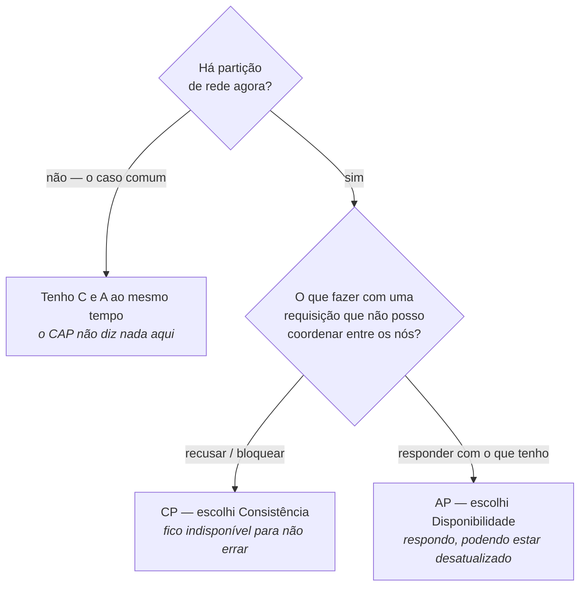
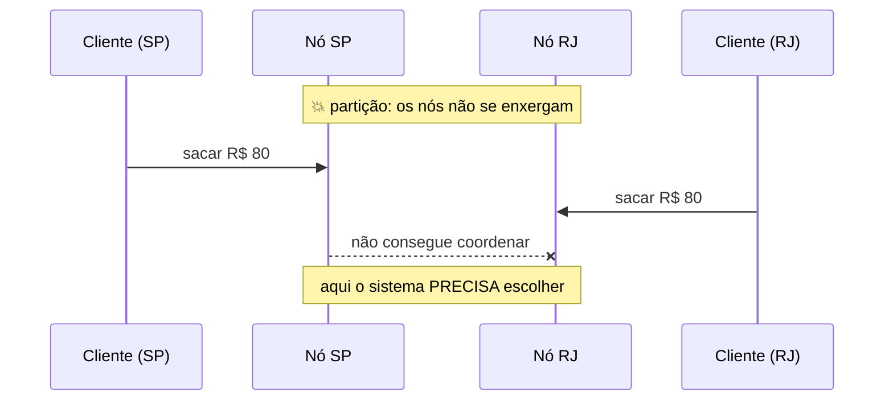
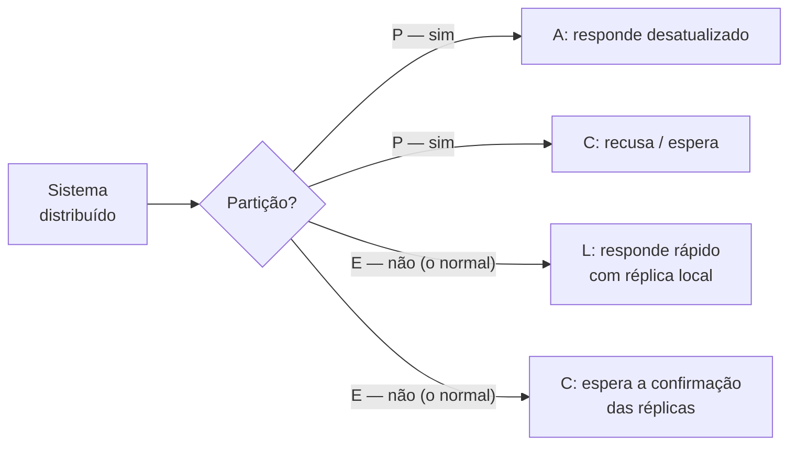

# TEOREMA CAP

Foi proposto pelo informático **Eric Brewer**, que mencionou a ideia durante uma conferência no PODC em 2000. Se trata das limitacoes caracteristicas que um sistema tem ou possa vir a ter. Afirma que é impossivel um sistema distribuido garantir as 3 caracteristicas simultaneamente:

- Consistência
- Disponibilidade
- Tolerância a partição

**Consistência:** Todos os nós do sistema distribuem os mesmos dados.

**Disponibilidade:** Sistema estar sempre disponivel para resposta mesmo em caso de falha.

**Tolerância a partição:** O sistema continua funcionando mesmo que haja falha entre a comunicação dos nós.

> Em 2000 isso era uma **conjectura**; virou **teorema** em 2002, quando Seth Gilbert e Nancy Lynch (MIT) publicaram a prova formal. Detalhe que rende ponto: o CAP é um resultado matemático sobre um modelo específico, não uma regra de bolso — e as definições que ele usa são mais estreitas do que o vocabulário do dia a dia (seção 2).

---

## 1. As definições rigorosas

O enunciado só faz sentido com as definições exatas de Gilbert & Lynch:

| Letra | Definição formal | O que **não** significa |
|---|---|---|
| **C — Consistency** | **Linearizabilidade**: toda leitura enxerga a escrita mais recente confirmada, como se existisse uma única cópia dos dados | não é o "C" de ACID (que é integridade de restrições, coisa completamente diferente) |
| **A — Availability** | **Todo** nó que não falhou responde a **toda** requisição em tempo finito — sem erro e sem timeout | não é "99,99% de uptime"; é uma garantia absoluta, para todo nó não falho |
| **P — Partition tolerance** | O sistema continua operando mesmo que a rede **descarte ou atrase arbitrariamente** mensagens entre nós | não é "servidor caiu"; é a **rede** que se parte, com os dois lados vivos |

O ponto sutil: **C e A do CAP são mais fortes do que o uso corrente das palavras**. É por isso que a resposta "escolha 2 de 3" leva as pessoas a conclusões erradas.

---

## 2. A leitura correta: não é "escolha 2 de 3"

Esta é **a** nuance que separa nota 7 de nota 10 na prova.

**Partition tolerance não é opcional em um sistema distribuído real.** A rede *vai* falhar: cabo rompido, switch reiniciando, GC de 30 segundos, zona de disponibilidade isolada, timeout entre datacenters. Você não escolhe se haverá partição — você escolhe **o que fazer quando ela acontecer**.

Logo, o teorema se lê assim:

> **Quando ocorre uma partição, você precisa escolher entre Consistência e Disponibilidade. Nos demais momentos (a maior parte do tempo), você tem as duas.**

Dito de outro modo: **CA não é uma opção de projeto em sistema distribuído** — é o que você tem enquanto a rede está saudável, em qualquer sistema. Um banco relacional em nó único é chamado de "CA" porque, não sendo distribuído, simplesmente não existe partição para tolerar. Se ele cair, você perde tudo — o que mostra que "CA" ali significa "não distribuído", não "o melhor dos dois mundos".

---

## 3. Os três quadrantes na prática

| | O que sacrifica | Comportamento durante a partição | Exemplos |
|---|---|---|---|
| **CP** (Consistência + Partição) | **Disponibilidade** | recusa a operação, devolve erro ou espera até ter certeza | MongoDB (com writes majoritários), HBase, Zookeeper, etcd, Consul, Redis Sentinel, bancos SQL com replicação síncrona |
| **AP** (Disponibilidade + Partição) | **Consistência imediata** | aceita ler e escrever nos dois lados; reconcilia depois (consistência eventual) | Cassandra, DynamoDB, Riak, CouchDB, DNS |
| **"CA"** | **Tolerância a partição** (ou seja, não é distribuído) | não se aplica: se a rede parte, o sistema para | PostgreSQL/MySQL em nó único, ou cluster que exige rede perfeita |

> ⚠️ Essa classificação é didática, não absoluta. Quase todo banco moderno é **sintonizável**: no Cassandra (AP por natureza) você pede `QUORUM` e ganha consistência forte ao custo de disponibilidade; no MongoDB (CP por padrão) você lê de secundário e vira AP. **A escolha é por operação, não por produto** — ver a crítica na seção 8.

---

## 4. Cenário narrado: um saldo durante a partição

Conta com **R$ 100**, replicada em dois datacenters. A rede entre eles cai, e o cliente tenta sacar R$ 80 de cada lado ao mesmo tempo.

**Sob CP — escolho consistência:**
Nenhum dos nós consegue formar quórum (maioria), então ambos **recusam** o saque: *"serviço temporariamente indisponível"*. O cliente fica bravo, mas o saldo nunca fica negativo. Quando a rede volta, o estado é único e correto.

**Sob AP — escolho disponibilidade:**
Os dois nós **aprovam** o saque com a informação local (R$ 100 disponíveis). O cliente saca R$ 160 de uma conta de R$ 100. Quando a rede volta, os dois lados divergem e alguém precisa resolver — *last-write-wins* (perde-se um saque no registro, mas o dinheiro saiu), merge por CRDT, ou intervenção manual/compensação.

**A escolha depende do caso de uso, não do gosto:**

| Caso de uso | Escolha natural | Por quê |
|---|---|---|
| Saque, transferência, reserva de estoque, cadastro de chave PIX | **CP** | dinheiro duplicado ou vaga vendida duas vezes é dano real; recusar é aceitável |
| Carrinho de compras, curtida, contador de visualizações, catálogo | **AP** | perder disponibilidade custa venda; divergência temporária é aceitável |
| Timeline, feed, cache de sessão | **AP** | ninguém morre por ver um post 2 segundos depois |
| Eleição de líder, lock distribuído, configuração de cluster | **CP** | dois líderes ("split brain") é catastrófico |

**Observação de arquitetura:** o mesmo sistema costuma ter os dois. O extrato pode ser AP (ler réplica levemente atrasada) enquanto a autorização de saque é CP. A Amazon é o exemplo canônico: carrinho AP (nunca recusa um "adicionar"), cobrança CP.

---

## 5. PACELC — a extensão que corrige a lacuna

O CAP só descreve o que acontece **durante a partição** — e partição é raro. O que fazer nos outros 99,9% do tempo? Daniel Abadi propôs, em 2010, o **PACELC**:

> **Se há Partição (P), escolha entre Availability (A) e Consistency (C);
> Else (E), escolha entre Latency (L) e Consistency (C).**

A ideia central: **consistência custa latência mesmo sem partição**, porque coordenar réplicas exige idas e voltas na rede. Cada round-trip entre São Paulo e a Virgínia custa ~110 ms — e nenhuma otimização de código muda a velocidade da luz.

Classificação PACELC dos sistemas conhecidos:

| Sistema | Classificação | Leitura |
|---|---|---|
| Cassandra, DynamoDB, Riak | **PA/EL** | disponível na partição, rápido fora dela |
| MongoDB, HBase | **PC/EC** | consistente sempre, pagando latência |
| PostgreSQL com replicação síncrona | **PC/EC** | consistência acima de tudo |
| MySQL com replicação assíncrona | **PA/EL** | réplica pode atrasar |
| Google Spanner | **PC/EC** | consistência global via relógios atômicos (TrueTime) |

O Spanner é a resposta ao "CAP proíbe": ele **não** viola o teorema — durante uma partição real ele fica indisponível (é CP). O que ele faz é tornar a partição tão rara (rede privada da Google) e a coordenação tão barata (TrueTime) que, na prática, entrega consistência forte global com disponibilidade altíssima.

---

## 6. Níveis de consistência

"Consistente" e "eventual" são os extremos de um espectro:

| Nível | Garantia | Custo |
|---|---|---|
| **Linearizável (forte)** | toda leitura vê a última escrita confirmada; parece um único nó | máximo: coordenação em toda operação |
| **Sequencial** | todos veem as operações na **mesma ordem**, não necessariamente em tempo real | alto |
| **Causal** | operações **causalmente relacionadas** aparecem na ordem certa para todos (a resposta nunca aparece antes da pergunta); as concorrentes podem divergir | médio — o melhor custo-benefício em muitos sistemas |
| **Read-your-writes** | você sempre enxerga as **suas próprias** escritas | baixo (basta rotear o usuário para a réplica que recebeu a escrita) |
| **Monotonic reads** | você nunca "volta no tempo": lida uma versão, não verá outra mais antiga | baixo |
| **Eventual** | se as escritas pararem, todas as réplicas **convergem** em algum momento | mínimo |

**Consistência eventual não diz *quando*** — só que converge. E ela é a origem de bugs contraintuitivos: o usuário comenta, dá F5 e o comentário sumiu (violação de *read-your-writes*); ou o feed mostra a resposta antes da pergunta (violação de *causal*). Muitas vezes a correção certa não é ir para consistência forte, e sim garantir a **garantia de sessão** adequada.

**Quóruns** — o mecanismo que sintoniza isso em bancos AP: com **N** réplicas, **W** confirmações para escrever e **R** para ler, se **R + W > N** há sobreposição garantida entre quem escreveu e quem lê, o que dá consistência forte. Com N=3: `W=1, R=1` é rápido e fraco; `W=2, R=2` (ou `W=3, R=1`) é consistente e mais lento. É esse ajuste que o Cassandra expõe como `ONE`, `QUORUM`, `ALL`.

---

## 7. CAP, ACID e BASE são o mesmo assunto por ângulos diferentes

| | **ACID** | **BASE** |
|---|---|---|
| Origem | bancos relacionais, transações locais | sistemas distribuídos web-scale |
| Prioriza | correção | disponibilidade |
| Posição no CAP | tende a **CP** | assume **AP** |
| Consistência | forte, imediata | eventual |
| Falha | aborta e faz rollback | aceita e reconcilia depois |
| Exemplo | débito e crédito na mesma transação | contador de curtidas |

Cuidado com o falso amigo: o **C de ACID** (a transação leva o banco de um estado válido a outro, respeitando constraints) **não é o C de CAP** (linearizabilidade entre réplicas). Confundir os dois é erro clássico de prova.

→ [ACID e BASE](../fundamentos-de-modelagem-de-dados/acid.md) · [MODELAGEM NÃO RELACIONAL](../fundamentos-de-modelagem-de-dados/modelagem-nao-relacional.md)

**No mundo distribuído**, a transação ACID entre serviços dá lugar a padrões de consistência eventual: **Saga** (sequência de transações locais com compensação — estornar em vez de rollback), **Outbox** (publicar o evento na mesma transação do dado, garantindo atomicidade entre banco e mensageria) e **idempotência** (porque o retry é inevitável quando a resposta se perde). → [Spring MVC - Evolução da API](../spring-mvc-apis-restful/iv-evolucao-da-api.md)

---

## 8. A crítica moderna ao CAP

Vale conhecer para não repetir simplificações:

- **"Pare de chamar bancos de CP ou AP"** (Martin Kleppmann) — a classificação é do *modelo*, não do produto: quase todo banco é sintonizável por operação, e muitos não se encaixam em nenhuma categoria porque não oferecem linearizabilidade nem disponibilidade total.
- **As definições são estreitas demais.** "Disponibilidade" no CAP exige que **todo** nó não falho responda — um sistema com 99,99% de uptime é, tecnicamente, "não disponível" pelo teorema. Isso torna o CAP pouco útil como métrica de engenharia.
- **O próprio Brewer revisitou** o tema em 2012 ("CAP Twelve Years Later"): a escolha não é binária nem permanente; é uma decisão **por operação e por momento**, e o interessante é projetar a **detecção da partição**, o **modo degradado** e a **recuperação**.
- **Latência não aparece no CAP**, e é o custo que você paga todo dia — foi exatamente essa lacuna que o PACELC preencheu.

**Resumo do que dizer em prova:** *"O CAP mostra que, sob partição de rede, um sistema distribuído precisa escolher entre consistência e disponibilidade — partition tolerance não é opcional, porque a rede falha. Fora da partição, o trade-off real é entre latência e consistência, o que o PACELC formaliza. E a escolha se faz por operação, não por produto."*

---

## Perguntas para autoavaliação

1. Por que dizer "escolha 2 de 3" é uma leitura incorreta do CAP?
2. Qual é a definição formal de *Availability* no teorema, e por que ela é mais forte que "uptime alto"?
3. Por que "CA" não é uma escolha de projeto em um sistema distribuído?
4. O C de CAP e o C de ACID são a mesma coisa? Explique a diferença.
5. Descreva o que acontece com um saque de R$ 80 numa conta de R$ 100 durante uma partição, sob CP e sob AP.
6. Dê dois casos de uso que exigem CP e dois que toleram AP, justificando.
7. O que o PACELC acrescenta ao CAP, e por que essa lacuna importa?
8. Ordene do mais forte ao mais fraco: causal, eventual, linearizável, read-your-writes.
9. Com N=3 réplicas, quais combinações de R e W garantem consistência forte? Por quê?
10. Por que o Google Spanner não viola o teorema CAP?
11. Qual a relação entre consistência eventual, Saga e idempotência?
12. Por que Kleppmann diz que não se deve classificar um banco como CP ou AP?

---

**Relacionados:** [ACID](../fundamentos-de-modelagem-de-dados/acid.md) · [MODELAGEM NÃO RELACIONAL](../fundamentos-de-modelagem-de-dados/modelagem-nao-relacional.md) · [gRPC e GRAPHQL](../grpc-e-graphql/README.md) · [SPRING DATA JPA](../spring-data-jpa/README.md)
