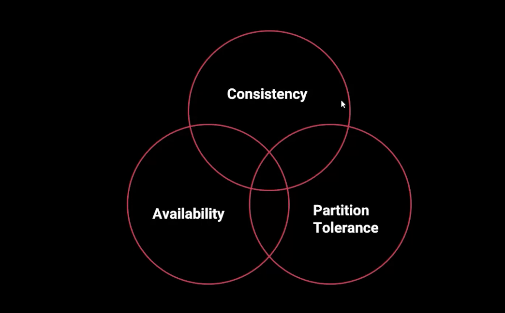

# TEOREMA CAP

Foi proposto pelo informático, Eric Brewer, que mencionou a ideia durante uma conferência no PODC em 2000. Se trata das limitacoes caracteristicas que um sistema tem ou possa vir a ter. Afirma que é impossivel um sistema distribuido ter as 3 caracteristicas simultaneamente: 

- Consistência
- Disponibilidade
- Tolerância a partição

Consistência: Todos os nós do sistema distribuem os mesmos dados. 

Disponibilidade: Sistema estar sempre disponivel para resposta mesmo em caso de falha

Tolerância a partição: O sistema continua funcionando mesmo que haja falha entre a comunicação dos nós
