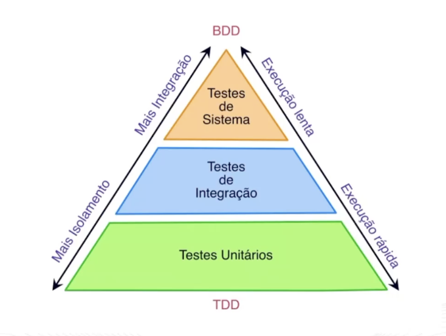
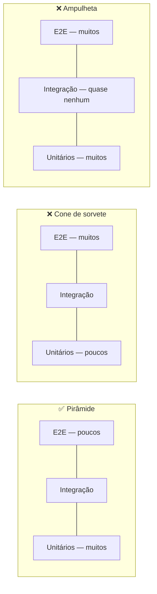
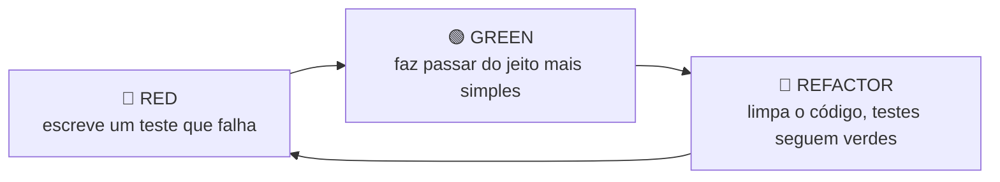

# TESTES EM SOFTWARE

> **Capítulos:** [I - JUnit 5 e AssertJ](i-junit-5-e-assertj.md) · [II - Test Doubles e Mockito](ii-test-doubles-e-mockito.md) · [III - Testes no Spring](iii-testes-no-spring.md)

Teste automatizado não existe para "provar que o código funciona" — existe para **permitir mudança**. Um sistema sem testes é um sistema onde ninguém tem coragem de refatorar, e código que ninguém refatora apodrece. Os três ganhos, em ordem de importância:

1. **Confiança para mudar** — a suíte é a rede de proteção que transforma refatoração em operação rotineira em vez de aposta.
2. **Feedback de design** — código difícil de testar é código mal projetado. Se para testar uma regra você precisa de 7 mocks, o problema não é o teste: é o acoplamento.
3. **Documentação executável** — o teste descreve o comportamento esperado e, diferente do comentário e do Confluence, **quebra quando mente**.

Dijkstra, a frase que sempre aparece em prova: *"testes provam a presença de defeitos, nunca a sua ausência"*. Teste não demonstra corretude — reduz risco.

---

## 1. A pirâmide de testes



Proposta por Mike Cohn, a pirâmide diz que a **quantidade** de testes deve ser inversamente proporcional ao **escopo** de cada um. Subindo os eixos do diagrama:

| Eixo | Base (unitário) | Topo (sistema) |
|---|---|---|
| Isolamento | máximo — só a unidade | nenhum — sistema inteiro |
| Velocidade | milissegundos | segundos a minutos |
| Custo de escrita e manutenção | baixo | alto |
| Precisão do diagnóstico | aponta a linha | "algo quebrou em algum lugar" |
| Confiança que dá | que a peça funciona | que o sistema **entrega valor** |
| Fragilidade | baixa | alta (rede, timing, dados, ambiente) |

Proporção clássica de referência: **~70% unitários, ~20% integração, ~10% sistema/E2E**. Não é dogma — é um lembrete de que teste lento e frágil deve ser exceção, não regra.

**Por que a forma importa:** um bug pego no unitário custa segundos; o mesmo bug pego em E2E custa minutos de execução mais o tempo de investigar qual das 40 camadas falhou; em produção, custa incidente.

### Os anti-padrões da forma



- **Cone de sorvete (ice cream cone):** tudo testado por E2E e por QA manual. Suíte lenta, flaky, cara. É o estado natural de quem começou a testar tarde.
- **Ampulheta:** muitos unitários e muitos E2E, mas nada no meio. Os erros de *integração* — contrato do JSON, mapeamento JPA, transação — só aparecem no E2E, onde o diagnóstico é péssimo.

### A crítica moderna: Testing Trophy

Kent C. Dodds argumenta que, com ferramentas modernas (Testcontainers, MockMvc, slices do Spring), teste de integração ficou barato — e ele dá muito mais confiança por unidade de esforço. O **troféu** engorda a camada de integração no lugar da unitária.

Regra prática que concilia as duas visões: **teste unitário para lógica de decisão (regra de negócio, cálculo, validação); teste de integração para colaboração com infraestrutura (SQL, serialização, transação, segurança).** Testar unitariamente um repositório com mock não prova nada — mock não valida SQL.

---

## 2. Os tipos de teste

| Tipo | Escopo | O que **prova** | O que **não** prova |
|---|---|---|---|
| **Unitário** | uma classe/método, dependências substituídas | que a regra/algoritmo está correto | que as peças conversam |
| **Integração** | duas ou mais peças reais (app + banco, app + broker) | mapeamento, SQL, serialização, transação | fluxo completo de negócio |
| **Componente** | um serviço inteiro, com fronteiras externas mockadas | que o serviço cumpre seu contrato | comportamento do ecossistema |
| **Contrato** | contrato entre consumidor e provedor | que a mudança na API não quebra o cliente | comportamento interno |
| **Sistema / E2E** | ambiente completo, do clique ao banco | que o fluxo de ponta a ponta funciona | casos de borda (caro demais) |
| **Aceitação** | critério de negócio (BDD) | que o software faz o que o cliente pediu | qualidade interna |
| **Regressão** | qualquer nível | que o que funcionava continua funcionando | — |
| **Smoke** | superficial, pós-deploy | que a aplicação subiu e responde | corretude |
| **Carga / estresse** | não funcional | comportamento sob volume, ponto de ruptura | corretude funcional |
| **Mutação** | a própria suíte | que os testes **detectam** defeitos | — |

**Distinção que cai em prova — teste de sistema × teste de aceitação:** o de sistema é técnico (o sistema todo funciona?), o de aceitação é de negócio (o sistema faz o que o usuário precisa?). Podem usar as mesmas ferramentas e ter objetivos diferentes.

**Caixa-preta × caixa-branca:** caixa-preta testa pela interface, sem conhecer a implementação (o teste sobrevive à refatoração). Caixa-branca conhece a estrutura interna e mira caminhos de execução — é o que sustenta métricas de cobertura. Bom teste unitário é caixa-preta *sobre a unidade*: testa comportamento público, não o interior.

**Teste manual ainda tem lugar:** teste **exploratório** — investigação humana, sem roteiro, procurando o que ninguém pensou em automatizar. O que não deve existir é *roteiro manual repetido a cada release*: isso é trabalho de máquina.

---

## 3. Vocabulário

- **SUT (System Under Test)** — a unidade sendo testada. Tudo o mais é colaborador.
- **Fixture** — o estado montado antes do teste (dados, objetos, banco). "Fixture limpa" = cada teste monta e desmonta o seu.
- **Test double** — qualquer substituto de um colaborador real (ver [capítulo II](ii-test-doubles-e-mockito.md)).
- **Flaky test** — passa e falha sem mudança de código. É pior que teste ausente: destrói a confiança na suíte inteira, e o time passa a "mandar rodar de novo" — inclusive quando a falha era real.
- **Teste determinístico** — mesmo input, mesmo resultado, sempre. Inimigos clássicos: `LocalDateTime.now()`, `Random`, `UUID.randomUUID()`, ordem de execução, paralelismo, timezone, rede.
- **Regressão** — comportamento que funcionava e parou de funcionar.
- **Cobertura** — percentual do código executado pela suíte (seção 7).

### FIRST — as propriedades de um bom teste

| Letra | Propriedade | Significado |
|---|---|---|
| **F** | Fast | milissegundos; suíte lenta não é executada |
| **I** | Independent | não depende de outro teste nem da ordem de execução |
| **R** | Repeatable | roda igual na sua máquina, na do colega e no CI |
| **S** | Self-validating | passa ou falha sozinho, sem inspeção humana da saída |
| **T** | Timely | escrito junto com o código (idealmente antes) |

---

## 4. Estrutura e nomenclatura

### AAA — Arrange, Act, Assert

```java
@Test
void deveDebitarSaldoQuandoValorMenorQueSaldo() {
    // Arrange — monta o cenário
    Conta conta = new Conta(new ContaId("123"), new BigDecimal("100.00"));

    // Act — executa UMA ação, a que está sob teste
    conta.debitar(new BigDecimal("30.00"));

    // Assert — verifica o resultado observável
    assertThat(conta.saldo()).isEqualByComparingTo("70.00");
}
```

Em BDD o mesmo padrão se chama **Given-When-Then** — é a mesma estrutura com vocabulário de negócio.

**Um comportamento por teste.** Não significa "um `assert` por teste": significa **uma razão para falhar**. Verificar saldo e extrato do mesmo débito são dois asserts do mesmo comportamento — tudo bem. Verificar débito e envio de notificação são dois comportamentos — dois testes.

### Nome do teste

O nome é lido no relatório do CI, quando você não está olhando o código. Ele precisa dizer **o que quebrou** sem abrir o arquivo. Convenções comuns:

```java
// deve<Resultado>Quando<Condição>
void deveLancarExcecaoQuandoSaldoInsuficiente()

// metodo_condicao_resultadoEsperado
void debitar_saldoInsuficiente_lancaExcecao()

// ou prosa livre com @DisplayName (melhor para relatório)
@Test
@DisplayName("não deve permitir débito que deixe a conta negativa")
```

O que **não** serve: `testDebitar()`, `test1()`, `deveFuncionar()`.

---

## 5. TDD — Test Driven Development

TDD **não é técnica de teste, é técnica de design**. Os testes são um efeito colateral (excelente) de projetar a partir do uso.

### O ciclo Red-Green-Refactor



1. **Red** — escreva um teste para um comportamento que ainda não existe. Ele **precisa** falhar: teste que passa de primeira não está testando nada (ou o comportamento já existia).
2. **Green** — o mínimo de código para passar. Vale hard-code, vale feio. O objetivo aqui é a barra verde, não a elegância.
3. **Refactor** — agora sim melhore o desenho, com a rede de proteção verde. **Sem adicionar comportamento novo.**

### As três leis (Uncle Bob)

1. Não escreva código de produção sem antes ter um teste falhando.
2. Não escreva mais teste do que o suficiente para falhar (não compilar já é falhar).
3. Não escreva mais código de produção do que o suficiente para passar no teste atual.

### Exemplo passo a passo

**Requisito:** transferência não pode deixar a conta origem negativa.

```java
// 1) RED — a classe Conta ainda nem tem debitar()
@Test
void naoDevePermitirDebitoMaiorQueSaldo() {
    Conta conta = new Conta(new ContaId("1"), new BigDecimal("50.00"));

    assertThatThrownBy(() -> conta.debitar(new BigDecimal("80.00")))
        .isInstanceOf(SaldoInsuficienteException.class);
}
// não compila -> é uma falha legítima. Vermelho.
```

```java
// 2) GREEN — o mínimo
public void debitar(BigDecimal valor) {
    if (saldo.compareTo(valor) < 0) {
        throw new SaldoInsuficienteException(id, saldo, valor);
    }
    this.saldo = this.saldo.subtract(valor);
}
```

```java
// 3) REFACTOR — nada a limpar ainda. Próximo ciclo: e valor negativo?
@Test
void naoDevePermitirDebitoDeValorNegativo() {
    Conta conta = new Conta(new ContaId("1"), new BigDecimal("50.00"));

    assertThatThrownBy(() -> conta.debitar(new BigDecimal("-10.00")))
        .isInstanceOf(ValorInvalidoException.class);
}
// vermelho de novo -> implementa a guarda -> verde -> refatora
```

Repare no efeito de design: como o teste é escrito primeiro, a API nasce **do ponto de vista de quem usa**. É por isso que código feito com TDD costuma ter menos parâmetros, menos estado escondido e menos dependência desnecessária.

### Variações e limites

- **Inside-out (Detroit/Chicago):** começa pelo domínio e vai para fora. Usa poucos mocks, foca em estado.
- **Outside-in (London):** começa pelo caso de uso e desce, usando mocks para as camadas ainda inexistentes. Foca em interação.
- **Baby steps:** ciclos de minutos. Quanto mais incerto o terreno, menores os passos.
- **Onde TDD não ajuda muito:** spike/protótipo exploratório, código de UI muito visual, integração com API externa desconhecida (ali o valor está em *aprender* o comportamento real primeiro).

**Crítica honesta:** TDD custa disciplina e o ganho aparece no médio prazo. O que **não** é argumento válido contra: "não tenho tempo de testar" — o tempo é gasto de qualquer forma, depurando depois.

---

## 6. BDD — Behavior Driven Development

BDD é TDD levado para a linguagem do negócio, criado por Dan North para resolver um problema de *comunicação*, não de ferramenta: fazer analista, QA e dev descreverem o mesmo comportamento com as mesmas palavras.

### Gherkin — Given / When / Then

```gherkin
# transferencia.feature
Funcionalidade: Transferência entre contas

  Contexto:
    Dado que a conta "123" tem saldo de R$ 500,00
    E a conta "456" tem saldo de R$ 100,00

  Cenário: transferência com saldo suficiente
    Quando o cliente transfere R$ 200,00 da conta "123" para a conta "456"
    Então o saldo da conta "123" deve ser R$ 300,00
    E o saldo da conta "456" deve ser R$ 300,00
    E um comprovante deve ser gerado

  Cenário: transferência sem saldo
    Quando o cliente transfere R$ 900,00 da conta "123" para a conta "456"
    Então a transferência deve ser recusada com a mensagem "Saldo insuficiente"
    E o saldo da conta "123" deve permanecer R$ 500,00

  Esquema do Cenário: valores inválidos
    Quando o cliente transfere <valor> da conta "123" para a conta "456"
    Então a transferência deve ser recusada
    Exemplos:
      | valor    |
      | R$ 0,00  |
      | R$ -5,00 |
```

Palavras-chave: `Funcionalidade` (Feature), `Cenário` (Scenario), `Contexto` (Background — pré-condição comum), `Esquema do Cenário` (Scenario Outline — cenário parametrizado), `Exemplos` (Examples), e `Dado`/`Quando`/`Então`/`E`/`Mas`.

### Step definitions (Cucumber + Java)

```java
public class TransferenciaSteps {

    private final ContaRepository contas;
    private final RealizarTransferenciaUseCase useCase;
    private Exception erro;

    @Dado("que a conta {string} tem saldo de R$ {bigdecimal}")
    public void contaComSaldo(String id, BigDecimal saldo) {
        contas.salvar(new Conta(new ContaId(id), saldo));
    }

    @Quando("o cliente transfere R$ {bigdecimal} da conta {string} para a conta {string}")
    public void transfere(BigDecimal valor, String origem, String destino) {
        try {
            useCase.executar(new TransferenciaCommand(new ContaId(origem), new ContaId(destino), valor));
        } catch (Exception e) {
            this.erro = e;                       // guarda para o Então
        }
    }

    @Entao("o saldo da conta {string} deve ser R$ {bigdecimal}")
    public void saldoDeveSer(String id, BigDecimal esperado) {
        assertThat(contas.buscarPorId(new ContaId(id)).orElseThrow().saldo())
            .isEqualByComparingTo(esperado);
    }
}
```

**Relação com os outros conceitos:**

| | TDD | BDD | ATDD |
|---|---|---|---|
| Pergunta | O código faz o que eu projetei? | O sistema se comporta como o negócio espera? | O critério de aceite foi cumprido? |
| Linguagem | técnica, do dev | ubíqua, de negócio | de negócio |
| Nível típico | unitário | aceitação/sistema | aceitação |
| Artefato | teste JUnit | `.feature` em Gherkin | critérios de aceite |

Na pirâmide da imagem: **TDD sustenta a base, BDD sustenta o topo** — os dois convivem no mesmo projeto.

**Armadilha comum:** usar Cucumber para *tudo*, inclusive teste unitário. O custo do Gherkin (parsing, step definitions, indireção) só se paga quando alguém de negócio realmente lê ou escreve o cenário. Se só devs leem, escreva JUnit com bons nomes.

---

## 7. Cobertura de código

**JaCoCo** é o padrão em Java. Instrumenta o bytecode e reporta o que a suíte executou.

```xml
<plugin>
  <groupId>org.jacoco</groupId>
  <artifactId>jacoco-maven-plugin</artifactId>
  <version>0.8.12</version>
  <executions>
    <execution><goals><goal>prepare-agent</goal></goals></execution>
    <execution>
      <id>report</id><phase>verify</phase><goals><goal>report</goal></goals>
    </execution>
    <execution>
      <id>check</id><phase>verify</phase><goals><goal>check</goal></goals>
      <configuration>
        <rules><rule>
          <element>BUNDLE</element>
          <limits><limit>
            <counter>BRANCH</counter><value>COVEREDRATIO</value><minimum>0.70</minimum>
          </limit></limits>
        </rule></rules>
      </configuration>
    </execution>
  </executions>
</plugin>
```

### Os tipos de cobertura

| Métrica | Mede | Exemplo em `if (a && b)` |
|---|---|---|
| **Line / Statement** | linhas executadas | 1 teste já cobre a linha |
| **Branch / Decision** | cada desvio tomado nos dois sentidos | precisa de caso verdadeiro **e** falso |
| **Condition** | cada condição isolada em ambos os valores | `a` e `b` avaliados V e F |
| **Path** | todas as combinações de caminhos | explode combinatoriamente; inviável na prática |

Cobrar **branch** faz mais sentido que **line** — é o mínimo para dizer que os desvios foram exercitados.

### Por que 100% de cobertura não significa qualidade

```java
@Test
void cobreTudoENaoTestaNada() {
    conta.debitar(new BigDecimal("30.00"));   // executou a linha... e nenhum assert
}
```

Cobertura mede **execução**, não **verificação**. Um teste sem `assert` cobre 100% e não detecta defeito nenhum. Daí as duas conclusões que precisam andar juntas:

- Cobertura **baixa** é um sinal confiável de problema (aquele código não foi exercitado por ninguém).
- Cobertura **alta** não é sinal de qualidade — só de execução.

E há a distorção clássica: quando a meta de cobertura vira métrica de gestão, o time escreve teste de getter/setter e de DTO para inflar o número (Lei de Goodhart: "quando uma medida vira meta, deixa de ser boa medida").

### Teste de mutação — a métrica que mede o teste

**PIT (pitest)** altera seu código de produção de propósito (troca `>` por `>=`, `+` por `-`, remove chamada, inverte condicional) e roda a suíte. Cada alteração é um **mutante**:

- Algum teste falhou → mutante **morto** ✅ (sua suíte detecta esse defeito)
- Todos passaram → mutante **sobreviveu** ❌ (existe um defeito que sua suíte não pega)

**Mutation score = mutantes mortos / total.** É uma medida muito mais honesta de qualidade da suíte do que cobertura — o teste sem `assert` do exemplo acima tem 100% de cobertura e 0% de mutation score. Custo: execução lenta (roda a suíte muitas vezes), então costuma ir em job noturno, não a cada commit.

---

## 8. Dados de teste

O maior gerador de teste ilegível é a montagem do cenário. Padrões que resolvem:

```java
// ❌ Object Mother inchada / construção repetida em 40 testes
Conta conta = new Conta(new ContaId("1"), new BigDecimal("100"), Status.ATIVA,
                        LocalDate.of(2024,1,1), new Titular("Ana", "12345678900"), ...);

// ✅ Test Data Builder — só o que importa para ESTE teste fica explícito
Conta conta = ContaBuilder.umaConta()
                          .comSaldo("100.00")
                          .bloqueada()
                          .build();
```

- **Test Data Builder** — builder com defaults válidos; o teste sobrescreve só o atributo relevante. O leitor vê imediatamente o que é essencial no cenário.
- **Object Mother** — fábrica de cenários nomeados (`ContaMother.contaBloqueada()`). Boa para poucos arquétipos; degenera se virar depósito de 50 métodos.
- **Fixture por teste, nunca compartilhada e mutável** — estado compartilhado entre testes é a origem número um de flakiness e de dependência de ordem.

**Controle do tempo:** nunca chame `LocalDateTime.now()` direto no domínio. Injete um `Clock`:

```java
public class Conta {
    public void bloquear(Clock clock) {
        this.bloqueadaEm = LocalDateTime.now(clock);
    }
}

// no teste, o tempo para:
Clock fixo = Clock.fixed(Instant.parse("2026-01-15T10:00:00Z"), ZoneOffset.UTC);
```

O mesmo vale para `Random` (injete a semente) e `UUID` (injete um gerador). Não-determinismo em teste é sempre uma dependência escondida.

---

## 9. Anti-padrões

| Anti-padrão | O que é | Por que dói |
|---|---|---|
| **Teste frágil** | quebra a cada refatoração sem mudança de comportamento | acopla no *como* (interno) em vez do *o quê* (público) |
| **Teste que testa o mock** | só verifica `verify(...)` de chamadas que o próprio teste configurou | testa o teste, não o código — passa mesmo com a regra errada |
| **Teste sem assert** | executa e não verifica | 100% de cobertura, 0 de valor |
| **Assert roulette** | 15 asserts sem mensagem; falha e ninguém sabe qual | diagnóstico caro |
| **Lógica no teste** | `if`/`for`/cálculo dentro do teste | quem testa o teste? |
| **Teste dependente de ordem** | usa estado deixado pelo anterior | quebra ao paralelizar ou ao rodar sozinho |
| **Slow test / Testcontainers por teste** | sobe infra pesada em cada método | ninguém roda a suíte antes do push |
| **Mystery guest** | depende de arquivo/registro externo não visível no teste | ilegível e frágil |
| **Erratic/flaky** | falha aleatória por tempo, rede, timezone | destrói a confiança na suíte |
| **Teste comentado / `@Disabled` eterno** | desligado "temporariamente" há 8 meses | falsa sensação de cobertura |

**Sintoma de acoplamento**, não de teste ruim: precisar de muitos mocks; precisar tornar método privado em `public` para testar (extraia uma classe em vez disso); precisar de `@SpringBootTest` para testar uma regra de negócio.

---

## 10. Estratégia por camada (Clean Architecture)

Cruzando com [CLEAN ARCHITECTURE](../clean-architecture/README.md) — cada anel pede um tipo de teste:

| Camada | Teste | Ferramenta | Custo |
|---|---|---|---|
| **Entities** (regra de negócio) | unitário puro | JUnit + AssertJ | ms |
| **Use Cases** | unitário com ports mockados | JUnit + Mockito | ms |
| **Adapter in (web)** | slice de controller | `@WebMvcTest` + MockMvc | ~1s |
| **Adapter out (persistência)** | integração com banco real | `@DataJpaTest` + Testcontainers | ~segundos |
| **Aplicação inteira** | E2E / fluxo crítico | `@SpringBootTest` + RestAssured | mais lento |

É exatamente esse desenho que a Regra da Dependência viabiliza: como o use case depende de *ports* e não de JPA, ele é testável sem banco e sem Spring. **Arquitetura ruim e teste caro são o mesmo problema visto de dois ângulos.**

---

## 11. Testes no pipeline

| Momento | O que roda | Orçamento de tempo |
|---|---|---|
| Salvar/local | unitários da classe | segundos |
| Pré-commit / push | suíte unitária completa | < 2 min |
| CI no PR | unitários + integração + análise estática | < 10 min |
| Pós-merge / noturno | E2E, carga, mutação, segurança | sem limite rígido |
| Pós-deploy | smoke em produção | segundos |

Separação prática no Maven: **Surefire** roda `*Test` (unitários) na fase `test`; **Failsafe** roda `*IT` (integração) na fase `verify`. Assim `mvn test` continua rápido e o pipeline decide quando pagar pelo caro.

---

## Checklist de revisão de PR (testes)

- [ ]  O teste falha se eu quebrar a regra de propósito? (teste sem valor passa sempre)
- [ ]  O nome diz o comportamento e a condição
- [ ]  Um comportamento por teste — uma razão para falhar
- [ ]  Sem `if`/`for`/cálculo dentro do teste
- [ ]  Sem `Thread.sleep` — use await/callback determinístico
- [ ]  Sem dependência de ordem, de data real ou de rede externa
- [ ]  Caminho de erro coberto, não só o happy path
- [ ]  Regra de negócio testada com JUnit puro, sem subir Spring
- [ ]  Mock só de fronteira (port), nunca de objeto de valor do domínio
- [ ]  Nada de `@Disabled` sem link para a issue

---

## Perguntas para autoavaliação

1. Por que a pirâmide tem essa forma, e o que é um "cone de sorvete"?
2. Qual a diferença entre teste de integração e teste de sistema?
3. Um projeto com 95% de cobertura pode ter uma suíte inútil? Explique como.
4. O que o teste de mutação mede que a cobertura não mede?
5. Qual é a ordem correta do ciclo TDD e por que o teste **precisa** falhar primeiro?
6. TDD é técnica de teste ou de design? Justifique.
7. Quando usar Cucumber/Gherkin compensa, e quando é só cerimônia?
8. O que torna um teste flaky, e por que ele é pior do que não ter teste?
9. Como testar uma regra que depende de `LocalDateTime.now()` de forma determinística?
10. Por que testar um repositório com mock não prova que o SQL está correto?

---

**Capítulos:** [I - JUnit 5 e AssertJ](i-junit-5-e-assertj.md) · [II - Test Doubles e Mockito](ii-test-doubles-e-mockito.md) · [III - Testes no Spring](iii-testes-no-spring.md)

**Relacionados:** [CLEAN ARCHITECTURE](../clean-architecture/README.md) · [SOLID](../solid/README.md) · [SPRING DATA JPA](../spring-data-jpa/README.md)
