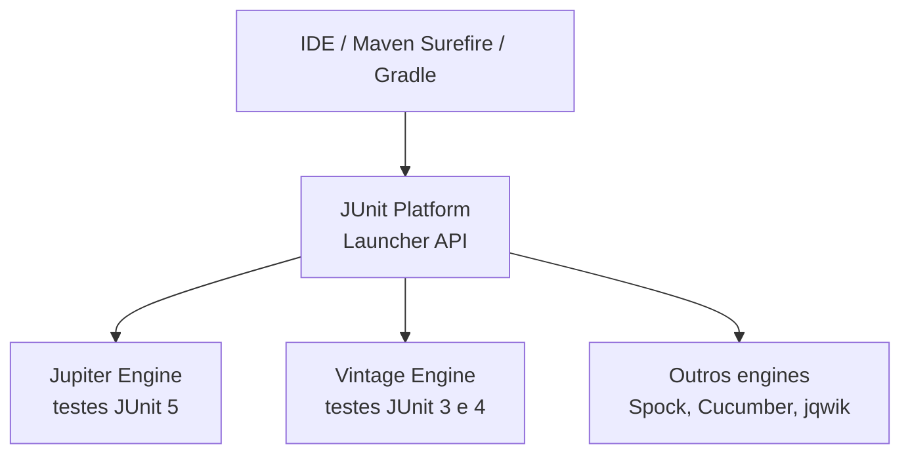

# I - JUNIT 5 E ASSERTJ

> [← Voltar para TESTES EM SOFTWARE](README.md) · Próximo: [II - Test Doubles e Mockito](ii-test-doubles-e-mockito.md)

## 1. A arquitetura do JUnit 5

JUnit 5 não é "JUnit 4 com anotações novas" — é uma reescrita em **três módulos**, e essa separação cai em prova:



| Módulo | Papel |
|---|---|
| **JUnit Platform** | fundação: descobre e executa testes. É contra ela que IDE e build tool falam |
| **JUnit Jupiter** | o modelo de programação novo — as anotações `org.junit.jupiter.api.*` |
| **JUnit Vintage** | engine de compatibilidade para rodar testes JUnit 3/4 legados no mesmo build |

Dependência única no Maven (o starter do Spring Boot já a traz):

```xml
<dependency>
  <groupId>org.junit.jupiter</groupId>
  <artifactId>junit-jupiter</artifactId>
  <scope>test</scope>
</dependency>
```

### JUnit 4 → JUnit 5: o de-para

| JUnit 4 | JUnit 5 | Observação |
|---|---|---|
| `@Before` / `@After` | `@BeforeEach` / `@AfterEach` | nomes agora dizem a frequência |
| `@BeforeClass` / `@AfterClass` | `@BeforeAll` / `@AfterAll` | precisam ser `static` (salvo `@TestInstance(PER_CLASS)`) |
| `@Ignore` | `@Disabled` | |
| `@Category` | `@Tag` | |
| `@RunWith(...)` | `@ExtendWith(...)` | um runner por classe → **vários** extensions |
| `@Rule` / `@ClassRule` | `@ExtendWith` / `@RegisterExtension` | runners e rules foram unificados no modelo de extensão |
| `@Test(expected = X.class)` | `assertThrows(X.class, ...)` | agora dá para inspecionar a exceção |
| `@Test(timeout = 100)` | `assertTimeout(...)` / `@Timeout` | |
| público obrigatório | **package-private basta** | classes e métodos de teste não precisam ser `public` |

**Detalhe importante:** o JUnit cria **uma instância nova da classe de teste para cada método** (`@TestInstance(Lifecycle.PER_METHOD)`, o padrão). É isso que garante isolamento entre testes — campos de instância não vazam de um método para outro.

---

## 2. Ciclo de vida

```java
class ContaTest {

    @BeforeAll                       // 1x antes de tudo — static por padrão
    static void carregarConfiguracao() { }

    @BeforeEach                      // antes de CADA @Test
    void montarCenario() { }

    @Test
    void deveDebitar() { }

    @AfterEach                       // depois de CADA @Test — limpeza
    void limpar() { }

    @AfterAll                        // 1x no fim
    static void desligar() { }
}
```

Ordem de execução para dois testes: `@BeforeAll` → (`@BeforeEach` → `teste1` → `@AfterEach`) → (`@BeforeEach` → `teste2` → `@AfterEach`) → `@AfterAll`.

Com `@TestInstance(TestInstance.Lifecycle.PER_CLASS)` a classe é instanciada uma vez só — aí `@BeforeAll` pode ser método de instância, mas você perde o isolamento automático e passa a ser responsável por limpar o estado.

---

## 3. Assertions do Jupiter

```java
import static org.junit.jupiter.api.Assertions.*;

assertEquals(esperado, real);                 // atenção: (esperado, real) — nessa ordem
assertEquals(esperado, real, "mensagem que aparece na falha");
assertNotEquals(a, b);
assertTrue(conta.estaAtiva());
assertNull(x);  assertNotNull(x);
assertSame(a, b);                             // mesma referência (==), não equals
assertArrayEquals(new int[]{1,2}, resultado);
assertIterableEquals(List.of("a"), lista);
fail("não deveria chegar aqui");
```

### `assertAll` — agrupando verificações do mesmo comportamento

```java
@Test
void deveCriarContaComDadosCorretos() {
    Conta conta = ContaBuilder.umaConta().comSaldo("100.00").build();

    assertAll("dados da conta",
        () -> assertEquals(new BigDecimal("100.00"), conta.saldo()),
        () -> assertEquals(Status.ATIVA, conta.status()),
        () -> assertNotNull(conta.criadaEm())
    );
}
```

Diferença crucial: sem `assertAll`, o primeiro assert que falha aborta o método e você **não vê** os outros. Com `assertAll`, todos são avaliados e o relatório mostra as falhas juntas — menos ciclos de "corrige, roda, quebra no próximo".

### Exceções

```java
@Test
void deveLancarExcecaoComDadosDoErro() {
    Conta conta = ContaBuilder.umaConta().comSaldo("50.00").build();

    SaldoInsuficienteException ex = assertThrows(
        SaldoInsuficienteException.class,
        () -> conta.debitar(new BigDecimal("80.00"))
    );

    assertEquals(new BigDecimal("50.00"), ex.saldoDisponivel());   // dá para inspecionar
    assertTrue(ex.getMessage().contains("insuficiente"));
}

assertDoesNotThrow(() -> conta.debitar(new BigDecimal("10.00")));
```

`assertThrows` aceita a **subclasse**: se o método lança `SaldoInsuficienteException` e você espera `RuntimeException`, passa. Para exigir o tipo exato, verifique `ex.getClass()`.

### Timeout

```java
@Test
@Timeout(value = 500, unit = TimeUnit.MILLISECONDS)   // falha se passar de 500ms
void deveResponderRapido() { }

assertTimeout(Duration.ofMillis(500), () -> servico.processar());        // espera terminar
assertTimeoutPreemptively(Duration.ofMillis(500), () -> servico.processar()); // aborta na hora
```

`assertTimeoutPreemptively` roda em outra thread — cuidado com código que depende de `ThreadLocal` (transação do Spring, `SecurityContext`).

---

## 4. Organização e legibilidade

```java
@DisplayName("Conta bancária")
class ContaTest {

    @Nested
    @DisplayName("quando o saldo é suficiente")
    class SaldoSuficiente {

        @Test
        @DisplayName("deve debitar o valor")
        void debita() { }
    }

    @Nested
    @DisplayName("quando o saldo é insuficiente")
    class SaldoInsuficiente {

        @Test
        @DisplayName("deve recusar e manter o saldo intacto")
        void recusa() { }
    }
}
```

`@Nested` agrupa cenários e permite `@BeforeEach` específico por grupo — o relatório sai hierárquico ("Conta bancária › quando o saldo é insuficiente › deve recusar..."). É a forma mais próxima do BDD sem sair do JUnit.

```java
@Tag("integracao")     // filtra no build: -Dgroups=integracao / excludedGroups
@Disabled("bloqueado pela issue #431 — sandbox do PIX fora do ar")
@RepeatedTest(10)      // roda 10x (útil para caçar flakiness)
@TestMethodOrder(MethodOrderer.OrderAnnotation.class)   // + @Order(1) — use com muita parcimônia
```

> Teste que **precisa** de ordem é teste dependente — anti-padrão. `@TestMethodOrder` só se justifica em cenário de documentação ou em suíte de integração deliberadamente sequencial.

### Assumptions — pular em vez de falhar

```java
@Test
void soRodaNoLinux() {
    assumeTrue(System.getProperty("os.name").toLowerCase().contains("linux"));
    // se a premissa é falsa, o teste é ABORTADO (não falha)
}

assumingThat("CI".equals(System.getenv("ENV")), () -> {
    // parte extra que só roda no CI
});
```

Falha = o código está errado. Aborto por assumption = o teste não se aplica neste ambiente. Não confunda os dois no relatório.

---

## 5. Testes parametrizados

O maior ganho de produtividade do JUnit 5. Requer `junit-jupiter-params` (já vem no agregador).

```java
@ParameterizedTest(name = "valor inválido: {0}")
@ValueSource(strings = {"0.00", "-1.00", "-999.99"})
void deveRecusarValoresNaoPositivos(String valor) {
    Conta conta = ContaBuilder.umaConta().comSaldo("100.00").build();
    assertThrows(ValorInvalidoException.class, () -> conta.debitar(new BigDecimal(valor)));
}

@ParameterizedTest
@NullAndEmptySource                       // + null e ""
@ValueSource(strings = {" ", "\t"})
void deveRecusarDocumentoEmBranco(String documento) { }

@ParameterizedTest
@CsvSource({
    "100.00, 30.00,  70.00",
    "100.00, 100.00,  0.00",
    " 50.50,  0.50, 50.00"
})
void deveCalcularSaldoAposDebito(BigDecimal saldo, BigDecimal debito, BigDecimal esperado) {
    Conta conta = ContaBuilder.umaConta().comSaldo(saldo).build();
    conta.debitar(debito);
    assertThat(conta.saldo()).isEqualByComparingTo(esperado);
}

@ParameterizedTest
@CsvFileSource(resources = "/cenarios-transferencia.csv", numLinesToSkip = 1)
void deveProcessarCenariosDoArquivo(String origem, String destino, BigDecimal valor) { }

@ParameterizedTest
@EnumSource(value = Status.class, names = {"BLOQUEADA", "ENCERRADA"})
void naoDevePermitirDebitoEmContaInativa(Status status) { }

@ParameterizedTest
@MethodSource("cenariosInvalidos")         // para argumentos complexos
void deveRecusarTransferencias(TransferenciaCommand comando, Class<? extends Exception> erro) {
    assertThrows(erro, () -> useCase.executar(comando));
}

static Stream<Arguments> cenariosInvalidos() {
    return Stream.of(
        Arguments.of(comandoCom(new BigDecimal("-1")), ValorInvalidoException.class),
        Arguments.of(comandoParaContaInexistente(),    ContaNaoEncontradaException.class)
    );
}
```

**Quando parametrizar:** mesmo comportamento, dados diferentes. **Quando NÃO:** comportamentos diferentes disfarçados de dados — se o `then` muda conforme a linha, são testes distintos, e juntá-los só produz `if` dentro do teste.

---

## 6. Injeção de parâmetros e extensões

```java
@Test
void exemplo(TestInfo info, TestReporter reporter) {
    reporter.publishEntry("executando", info.getDisplayName());
}
```

O Jupiter resolve parâmetros do método de teste via `ParameterResolver`. É esse mecanismo que faz o Mockito injetar `@Mock` e o Spring injetar beans — ambos são **extensions**:

```java
@ExtendWith(MockitoExtension.class)        // habilita @Mock/@InjectMocks
@ExtendWith(SpringExtension.class)         // habilita o contexto Spring (já embutido em @SpringBootTest)

@RegisterExtension                          // extensão programática, com estado
static ClockExtension clock = new ClockExtension(Instant.parse("2026-01-15T10:00:00Z"));
```

Diferente do JUnit 4, você pode **empilhar quantas extensions quiser** — a limitação de "um runner por classe" acabou.

### Execução paralela

```properties
# src/test/resources/junit-platform.properties
junit.jupiter.execution.parallel.enabled = true
junit.jupiter.execution.parallel.mode.default = concurrent
```

Só funciona se a suíte respeitar o **I** de FIRST (independência). Estado estático compartilhado, singleton mutável ou banco compartilhado transformam paralelismo em flakiness. Use `@ResourceLock` para proteger recurso compartilhado inevitável.

---

## 7. AssertJ

Biblioteca de asserts fluentes — é o padrão de fato em projetos Spring (vem no `spring-boot-starter-test`). Vantagens sobre `Assertions` do Jupiter: **autocomplete guiado pelo tipo**, mensagens de falha muito melhores e asserts de coleção que não exigem laço.

```java
import static org.assertj.core.api.Assertions.*;

assertThat(conta.saldo()).isEqualByComparingTo("70.00");   // BigDecimal: compara VALOR, ignora escala
assertThat(conta.titular()).isEqualTo("Ana");
assertThat(conta.estaAtiva()).isTrue();
assertThat(comprovante.id()).isNotNull();
```

> **Pegadinha de `BigDecimal`:** `assertEquals(new BigDecimal("70.00"), new BigDecimal("70.0"))` **falha** — `equals` compara valor **e escala**. Use `isEqualByComparingTo` (AssertJ) ou `compareTo() == 0`. Em domínio financeiro isso derruba teste o tempo todo.

### Strings, números e datas

```java
assertThat(mensagem).isNotBlank()
                    .startsWith("Saldo")
                    .containsIgnoringCase("insuficiente")
                    .doesNotContain("null");

assertThat(taxa).isBetween(new BigDecimal("0.00"), new BigDecimal("1.00"))
                .isPositive();

assertThat(conta.criadaEm()).isBefore(LocalDateTime.now())
                            .isCloseTo(esperado, within(1, ChronoUnit.SECONDS));
```

### Coleções — onde o AssertJ brilha

```java
assertThat(extrato).hasSize(3)
                   .isNotEmpty()
                   .doesNotHaveDuplicates();

assertThat(extrato).extracting(Lancamento::valor)       // extrai um campo de cada item
                   .containsExactly(v("100"), v("-30"), v("-20"));   // ordem importa

assertThat(contas).extracting("titular", "status")      // vários campos -> tuplas
                  .containsExactlyInAnyOrder(
                      tuple("Ana", ATIVA),
                      tuple("Bruno", BLOQUEADA));

assertThat(extrato).filteredOn(l -> l.valor().signum() < 0)
                   .hasSize(2)
                   .allMatch(Lancamento::isDebito);

assertThat(extrato).anySatisfy(l -> {
    assertThat(l.descricao()).contains("PIX");
    assertThat(l.valor()).isNegative();
});
```

`containsExactly` (ordem exata) × `containsExactlyInAnyOrder` (mesmo conjunto) × `contains` (contém, pode ter mais) — a escolha errada aqui gera teste frágil ou teste frouxo.

### Exceções

```java
assertThatThrownBy(() -> conta.debitar(new BigDecimal("80.00")))
    .isInstanceOf(SaldoInsuficienteException.class)
    .hasMessageContaining("insuficiente")
    .hasFieldOrPropertyWithValue("saldoDisponivel", new BigDecimal("50.00"))
    .hasNoCause();

assertThatExceptionOfType(ValorInvalidoException.class)
    .isThrownBy(() -> conta.debitar(BigDecimal.ZERO))
    .withMessage("Valor deve ser positivo");

assertThatNoException().isThrownBy(() -> conta.debitar(new BigDecimal("10.00")));
```

### Comparação de objetos inteiros

```java
// compara campo a campo, sem precisar de equals/hashCode implementados
assertThat(contaSalva).usingRecursiveComparison()
                      .ignoringFields("id", "atualizadoEm")
                      .isEqualTo(contaEsperada);
```

Ótimo para comparar DTO ↔ domínio em teste de mapper, sem poluir a classe de produção com `equals` só para testar.

### Soft assertions

```java
SoftAssertions.assertSoftly(softly -> {
    softly.assertThat(conta.saldo()).isEqualByComparingTo("70.00");
    softly.assertThat(conta.status()).isEqualTo(ATIVA);
    softly.assertThat(conta.extrato()).hasSize(2);
});   // avalia TODAS e reporta juntas — equivalente ao assertAll
```

### Asserts customizados de domínio

```java
public class ContaAssert extends AbstractAssert<ContaAssert, Conta> {

    public static ContaAssert assertThat(Conta atual) { return new ContaAssert(atual); }

    public ContaAssert temSaldo(String esperado) {
        isNotNull();
        if (actual.saldo().compareTo(new BigDecimal(esperado)) != 0) {
            failWithMessage("Esperava saldo <%s> mas era <%s>", esperado, actual.saldo());
        }
        return this;
    }
}

// no teste, lê como a linguagem do negócio:
assertThat(conta).temSaldo("70.00").estaAtiva();
```

### Qual usar?

| Biblioteca | Estado | Nota |
|---|---|---|
| **AssertJ** | recomendado | fluente, mensagens ricas, no starter do Spring |
| **JUnit Jupiter Assertions** | ok | suficiente para asserts simples; `assertAll` é útil |
| **Hamcrest** (`assertThat(x, is(...))`) | legado | ainda aparece em código antigo e no MockMvc (`ResultMatcher`) |

Misturar os três no mesmo projeto é ruído: escolha AssertJ como padrão e use os outros onde a API exigir.

---

## Perguntas para autoavaliação

1. Quais são os três módulos do JUnit 5 e qual o papel de cada um?
2. Por que `@BeforeAll` precisa ser `static` no ciclo de vida padrão?
3. Qual a diferença entre um teste que **falha** e um teste **abortado** por assumption?
4. `assertEquals(new BigDecimal("70.00"), new BigDecimal("70.0"))` passa? Por quê?
5. Quando `@ParameterizedTest` é a ferramenta certa — e quando ela esconde testes distintos?
6. Qual a vantagem de `assertAll` sobre asserts em sequência?
7. `@RunWith` do JUnit 4 virou o quê no JUnit 5, e qual limitação isso removeu?
8. `containsExactly` × `containsExactlyInAnyOrder` × `contains`: qual escolher e por quê?
9. O que é preciso garantir na suíte antes de ligar execução paralela?
10. Para que serve `usingRecursiveComparison` e que problema de design ele evita?

---

> [← Voltar para TESTES EM SOFTWARE](README.md) · Próximo: [II - Test Doubles e Mockito](ii-test-doubles-e-mockito.md)
