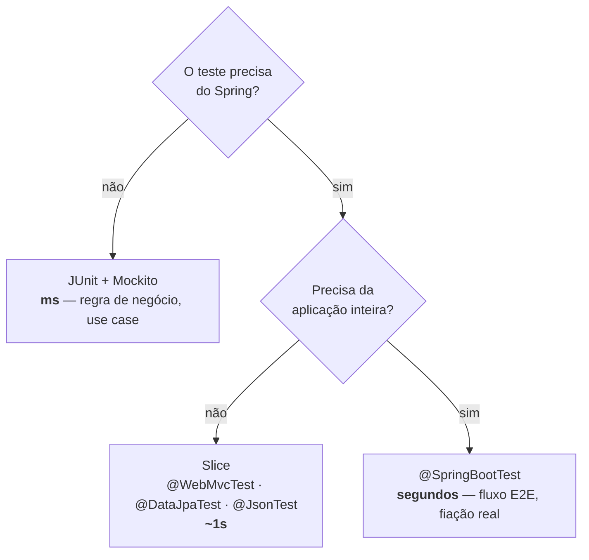

# III - TESTES NO SPRING

> [← Voltar para TESTES EM SOFTWARE](README.md) · Anterior: [II - Test Doubles e Mockito](ii-test-doubles-e-mockito.md)

## 1. O que vem no `spring-boot-starter-test`

```xml
<dependency>
  <groupId>org.springframework.boot</groupId>
  <artifactId>spring-boot-starter-test</artifactId>
  <scope>test</scope>
</dependency>
```

Uma única dependência traz: **JUnit 5**, **Mockito**, **AssertJ**, **Hamcrest**, **JSONassert** (comparação semântica de JSON), **JsonPath** (consulta em JSON) e o **Spring Test** (contexto, MockMvc, `@SpringBootTest`). Não adicione essas bibliotecas separadamente — versão duplicada é fonte de conflito.

---

## 2. A decisão central: quanto de Spring subir



A pergunta certa não é "qual anotação usar", é **o que eu quero provar**. Regra de negócio não precisa de Spring; mapeamento JPA precisa de banco; contrato JSON precisa da serialização real.

### Cache de contexto — o que faz a suíte ser rápida ou lenta

O Spring Test **cacheia o `ApplicationContext`** e reaproveita entre classes de teste. A chave do cache é a *configuração*: classes, perfis ativos, propriedades, mocks declarados. Consequências práticas:

- Vinte classes com a **mesma** configuração → **um** contexto, subido uma vez.
- Cada variação (`@ActiveProfiles` diferente, `@TestPropertySource` diferente, um `@MockitoBean` a mais) → **novo contexto**, do zero.

É por isso que uma suíte com 40 combinações de propriedades leva 8 minutos e outra com 400 testes leva 40 segundos. **Padronize a configuração de teste** e evite propriedades ad-hoc por classe. `@DirtiesContext` destrói o contexto e força recriação — use só quando o teste realmente suja estado global.

---

## 3. `@SpringBootTest`

```java
@SpringBootTest(webEnvironment = SpringBootTest.WebEnvironment.RANDOM_PORT)
@ActiveProfiles("test")
class TransferenciaE2ETest {

    @LocalServerPort int porta;
    @Autowired TestRestTemplate rest;      // ou WebTestClient / RestAssured

    @Test
    void deveRealizarTransferenciaViaApi() {
        var resposta = rest.postForEntity("/transferencias",
                new TransferenciaRequest("1", "2", new BigDecimal("200.00")),
                TransferenciaResponse.class);

        assertThat(resposta.getStatusCode()).isEqualTo(HttpStatus.CREATED);
        assertThat(resposta.getBody().valor()).isEqualByComparingTo("200.00");
    }
}
```

| `webEnvironment` | O que faz |
|---|---|
| `MOCK` (padrão) | contexto web mockado, sem servidor real — combine com MockMvc |
| `RANDOM_PORT` | sobe Tomcat de verdade em porta livre (ideal para E2E paralelo) |
| `DEFINED_PORT` | sobe na porta configurada — evite, dá conflito no CI |
| `NONE` | sem ambiente web |

Use `@SpringBootTest` para **poucos fluxos críticos**. É o teste mais caro e o de pior diagnóstico.

---

## 4. Slices

Slice = fatia do contexto. O Spring instancia só as beans daquela camada, com autoconfiguração parcial.

| Anotação | Carrega | Não carrega |
|---|---|---|
| `@WebMvcTest` | controllers, `@ControllerAdvice`, filtros, converters, validação | `@Service`, `@Repository`, JPA |
| `@DataJpaTest` | entidades, repositórios, `DataSource`, `EntityManager` | controllers, services |
| `@JsonTest` | Jackson/Gson e seus customizadores | resto |
| `@RestClientTest` | `RestTemplate`/`RestClient` + `MockRestServiceServer` | resto |
| `@WebFluxTest` | equivalente reativo do `@WebMvcTest` | resto |
| `@DataMongoTest`, `@DataRedisTest` | o driver correspondente | resto |

### `@WebMvcTest` — a camada web isolada

```java
@WebMvcTest(TransferenciaController.class)
class TransferenciaControllerTest {

    @Autowired MockMvc mockMvc;
    @MockitoBean RealizarTransferenciaUseCase useCase;   // colaborador substituído no contexto

    @Test
    void deveRetornar201ComComprovante() throws Exception {
        given(useCase.executar(any())).willReturn(umComprovante());

        mockMvc.perform(post("/transferencias")
                    .contentType(MediaType.APPLICATION_JSON)
                    .content("""
                        {"origem":"1","destino":"2","valor":200.00}
                        """))
               .andExpect(status().isCreated())
               .andExpect(header().exists("Location"))
               .andExpect(jsonPath("$.valor").value(200.00))
               .andExpect(jsonPath("$.comprovanteId").isNotEmpty());
    }

    @Test
    void deveRetornar422QuandoSaldoInsuficiente() throws Exception {
        given(useCase.executar(any())).willThrow(new SaldoInsuficienteException(...));

        mockMvc.perform(post("/transferencias").contentType(APPLICATION_JSON).content(jsonValido()))
               .andExpect(status().isUnprocessableEntity())
               .andExpect(jsonPath("$.title").value("Saldo insuficiente"));   // Problem Details
    }

    @Test
    void deveRetornar400QuandoValorAusente() throws Exception {
        mockMvc.perform(post("/transferencias").contentType(APPLICATION_JSON)
                    .content("{\"origem\":\"1\",\"destino\":\"2\"}"))
               .andExpect(status().isBadRequest());          // @Valid rejeitou
    }
}
```

O que o `@WebMvcTest` **realmente prova**: desserialização do JSON, validação (`@Valid`), mapeamento de rota, status code, headers, serialização da resposta e o `@RestControllerAdvice`. Ou seja, **o contrato da API** — exatamente o que teste unitário de controller com `new Controller(...)` não pega.

`.andDo(print())` imprime request e response completos — o primeiro recurso quando um teste de controller falha sem explicação.

> **Novidade do Spring Framework 6.2:** `MockMvcTester`, uma API AssertJ sobre o MockMvc: `assertThat(mvc.post().uri("/transferencias")...).hasStatus(CREATED).bodyJson().extractingPath("$.valor")...`. Mais legível, mesma engine.

### `@MockBean` está deprecado

A partir do **Spring Boot 3.4 / Framework 6.2**, `@MockBean` e `@SpyBean` foram substituídos por **`@MockitoBean`** e **`@MockitoSpyBean`** (agora no core do Spring Framework). Código novo já deve usar os novos.

Não confunda com o `@Mock` do Mockito:

| | `@Mock` | `@MockitoBean` |
|---|---|---|
| Quem cria | Mockito puro | Spring |
| Onde vive | campo do teste | **substitui a bean no contexto** |
| Precisa de Spring? | não | sim |
| Efeito no cache | nenhum | **cria um contexto novo** para aquela combinação |

Cada `@MockitoBean` diferente multiplica contextos. Em suíte grande isso é a principal causa de lentidão.

### `@DataJpaTest` — a camada de persistência

```java
@DataJpaTest
@AutoConfigureTestDatabase(replace = AutoConfigureTestDatabase.Replace.NONE)  // usa o banco real, não H2
@Testcontainers
class ContaRepositoryTest {

    @Container @ServiceConnection
    static PostgreSQLContainer<?> postgres = new PostgreSQLContainer<>("postgres:16-alpine");

    @Autowired ContaJpaRepository repository;
    @Autowired TestEntityManager em;

    @Test
    void deveBuscarContasAtivasDoTitular() {
        em.persist(new ContaEntity("1", "12345678900", ATIVA));
        em.persist(new ContaEntity("2", "12345678900", ENCERRADA));
        em.flush();
        em.clear();                       // esvazia o persistence context: força ir ao banco

        List<ContaEntity> contas = repository.findByDocumentoAndStatus("12345678900", ATIVA);

        assertThat(contas).hasSize(1).extracting(ContaEntity::getId).containsExactly("1");
    }
}
```

Pontos que caem em prova:

- `@DataJpaTest` é **`@Transactional` com rollback automático** ao fim de cada teste: o banco volta ao estado anterior sem `@Sql` de limpeza.
- Esse mesmo rollback é uma armadilha: como a transação do teste segue aberta, **`LazyInitializationException` não acontece** ali — e explode em produção. Para testar lazy de verdade, `@Transactional(propagation = NOT_SUPPORTED)` ou teste sem transação.
- `em.flush()` + `em.clear()` é obrigatório antes de assertar leitura: sem isso você pode estar lendo do **cache de primeiro nível**, e não do banco. → [SPRING DATA JPA](../spring-data-jpa/README.md)
- Por padrão o slice **troca o datasource por um banco em memória** (H2). H2 não é Postgres: dialeto, tipos, `ILIKE`, JSONB, sequences e constraints se comportam diferente. Para valer, use Testcontainers com `replace = NONE`.

---

## 5. Testcontainers

Sobe containers Docker reais durante o teste — banco, Kafka, Redis, LocalStack — e derruba no fim.

```xml
<dependency>
  <groupId>org.springframework.boot</groupId>
  <artifactId>spring-boot-testcontainers</artifactId>
  <scope>test</scope>
</dependency>
```

`@ServiceConnection` (Spring Boot 3.1+) dispensa configurar URL/usuário/senha: o Boot lê do container e injeta as propriedades sozinho. Antes disso era preciso `@DynamicPropertySource`:

```java
@DynamicPropertySource
static void props(DynamicPropertyRegistry registry) {
    registry.add("spring.datasource.url", postgres::getJdbcUrl);
    registry.add("spring.datasource.username", postgres::getUsername);
    registry.add("spring.datasource.password", postgres::getPassword);
}
```

**Padrão singleton** — subir um container por classe de teste é caro. Um container `static` compartilhado por toda a suíte (iniciado uma vez, sem `@Container` gerenciando o ciclo) reduz drasticamente o tempo. Some `testcontainers.reuse.enable=true` no `~/.testcontainers.properties` para reaproveitar entre execuções locais.

**Trade-off:** exige Docker na máquina e no CI, e cada container custa segundos. Vale para persistência e mensageria — não para testar regra de negócio.

---

## 6. Dados, propriedades e configuração de teste

```java
@Sql("/dados/contas.sql")                                   // roda antes do teste
@Sql(scripts = "/dados/limpeza.sql", executionPhase = AFTER_TEST_METHOD)
@ActiveProfiles("test")                                     // src/test/resources/application-test.yml
@TestPropertySource(properties = "banking.limite-diario=1000.00")
class ConfiguracaoTest { }
```

```java
@TestConfiguration                    // NÃO é varrida pelo component scan; só quem importa usa
class ClockTestConfig {
    @Bean Clock clock() { return Clock.fixed(Instant.parse("2026-01-15T10:00:00Z"), UTC); }
}

@SpringBootTest
@Import(ClockTestConfig.class)
class ComTempoCongeladoTest { }
```

### A pegadinha do `@Transactional` no teste

```java
@SpringBootTest
@Transactional        // ⚠️ rollback no fim: cômodo, mas muda o comportamento
class TransferenciaServiceTest { }
```

O teste roda inteiro dentro de **uma** transação e faz rollback. Isso esconde três classes de bug: (1) `LazyInitializationException`, (2) erro que só aparece no **commit** (constraint deferida, flush tardio), e (3) comportamento de propagação (`REQUIRES_NEW`, `@Async`, evento `AFTER_COMMIT` que nunca dispara porque o commit não acontece). Para fluxo crítico, teste sem `@Transactional` e limpe os dados explicitamente.

---

## 7. Testando segurança

```xml
<dependency>
  <groupId>org.springframework.security</groupId>
  <artifactId>spring-security-test</artifactId>
  <scope>test</scope>
</dependency>
```

```java
@Test
@WithMockUser(username = "ana", roles = "CLIENTE")
void clienteDeveAcessarPropriaConta() throws Exception {
    mockMvc.perform(get("/contas/1")).andExpect(status().isOk());
}

@Test
@WithAnonymousUser
void anonimoDeveReceber401() throws Exception {
    mockMvc.perform(get("/contas/1")).andExpect(status().isUnauthorized());
}

@Test
void clienteNaoDeveAcessarContaDeOutro() throws Exception {
    mockMvc.perform(get("/contas/999").with(user("ana").roles("CLIENTE")))
           .andExpect(status().isForbidden());        // teste anti-IDOR
}

@Test
void deveExigirCsrfNoPost() throws Exception {
    mockMvc.perform(post("/transferencias").with(csrf()).with(jwt().jwt(j -> j.claim("scope", "transfer"))))
           .andExpect(status().isCreated());
}
```

Detalhe: `@WithMockUser(roles = "CLIENTE")` cria a authority `ROLE_CLIENTE` (o prefixo é adicionado); `authorities = "CLIENTE"` cria `CLIENTE` puro. Confundir os dois faz o teste passar e a produção negar. → [SPRING SECURITY](../spring-security/README.md)

**Sempre teste os caminhos 401 e 403**, não só o happy path — falha de autorização é bug que passa despercebido em teste funcional.

---

## 8. Dependências HTTP externas

```java
// WireMock: servidor HTTP fake, valida a requisição de verdade (URL, headers, body)
@Test
void deveConsultarParceiro() {
    stubFor(get(urlEqualTo("/pix/chaves/ana@banco.com"))
        .willReturn(okJson("{\"tipo\":\"EMAIL\",\"banco\":\"001\"}")));

    var chave = gateway.consultar("ana@banco.com");

    assertThat(chave.banco()).isEqualTo("001");
    verify(getRequestedFor(urlEqualTo("/pix/chaves/ana@banco.com"))
        .withHeader("Authorization", matching("Bearer .+")));
}
```

Alternativa nativa do Spring para clientes: `@RestClientTest` + `MockRestServiceServer`. WireMock ganha quando você precisa simular latência, falha intermitente ou cenários de retry.

**Teste de contrato** (Spring Cloud Contract, Pact) resolve o problema que nem WireMock nem mock resolvem: garantir que o *stub que você escreveu* corresponde ao que o provedor **realmente** entrega. O provedor gera/verifica o contrato no pipeline dele; o consumidor testa contra o stub gerado. Sem isso, seu mock pode estar mentindo desde a última mudança do parceiro.

---

## 9. ArchUnit — testando a arquitetura

Teste automatizado que verifica a **Regra da Dependência** da [Clean Architecture](../clean-architecture/README.md):

```java
@AnalyzeClasses(packages = "com.fiap.banking")
class ArquiteturaTest {

    @ArchTest
    static final ArchRule dominio_nao_depende_de_framework =
        noClasses().that().resideInAPackage("..domain..")
                   .should().dependOnClassesThat()
                   .resideInAnyPackage("org.springframework..", "jakarta.persistence..");

    @ArchTest
    static final ArchRule camadas_respeitadas =
        layeredArchitecture().consideringOnlyDependenciesInLayers()
            .layer("Domain").definedBy("..domain..")
            .layer("Application").definedBy("..application..")
            .layer("Adapter").definedBy("..adapter..")
            .whereLayer("Adapter").mayNotBeAccessedByAnyLayer()
            .whereLayer("Application").mayOnlyBeAccessedByLayers("Adapter");
}
```

Transforma acordo de cavalheiros em build vermelho. Barato e de altíssimo retorno em projeto com muita gente.

---

## 10. Estratégia de suíte

| Camada | Anotação | Quantidade | Tempo alvo |
|---|---|---|---|
| Domínio / use case | nenhuma (JUnit puro) | centenas | < 5s no total |
| Controller | `@WebMvcTest` | um por controller | ~1s cada |
| Repositório | `@DataJpaTest` + Testcontainers | um por repositório com query custom | segundos |
| Fluxo crítico | `@SpringBootTest` | punhado | dezenas de segundos |
| Arquitetura | ArchUnit | um | ms |

Separação no build: **Surefire** roda `*Test` em `mvn test`; **Failsafe** roda `*IT` em `mvn verify`. Assim o feedback rápido continua rápido.

---

## Checklist de PR (testes no Spring)

- [ ]  Regra de negócio testada sem subir contexto
- [ ]  Controller coberto por `@WebMvcTest` com 2xx, 4xx e o corpo do erro
- [ ]  Query custom coberta por `@DataJpaTest` contra o banco real (não H2)
- [ ]  `@MockitoBean` só quando necessário — cada um custa um contexto
- [ ]  Sem `@Transactional` em teste de fluxo que precisa provar o commit
- [ ]  401 e 403 testados nos endpoints protegidos
- [ ]  Sem `Thread.sleep` para esperar assíncrono (use `Awaitility` ou `verify(timeout(...))`)
- [ ]  Contexto de teste padronizado (mesmos perfis/propriedades)

---

## Perguntas para autoavaliação

1. Por que `@WebMvcTest` pega bugs que um teste unitário do controller não pega?
2. O que exatamente faz o Spring criar um novo `ApplicationContext` entre classes de teste?
3. Qual a diferença entre `@Mock` e `@MockitoBean`, e por que a segunda é mais cara?
4. Por que `@DataJpaTest` esconde `LazyInitializationException`?
5. Por que testar com H2 pode dar falso positivo, e qual a alternativa?
6. Para que servem `em.flush()` e `em.clear()` num teste de repositório?
7. `@WithMockUser(roles = "ADMIN")` e `authorities = "ADMIN"` são equivalentes? Qual o efeito prático?
8. O que um teste de contrato garante que WireMock sozinho não garante?
9. Que problema o ArchUnit resolve que revisão de código não resolve de forma confiável?
10. Quando `@SpringBootTest` é a escolha certa — e quando é preguiça?

---

> [← Voltar para TESTES EM SOFTWARE](README.md) · Anterior: [II - Test Doubles e Mockito](ii-test-doubles-e-mockito.md)
